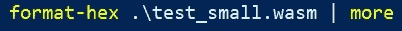
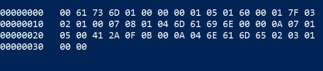
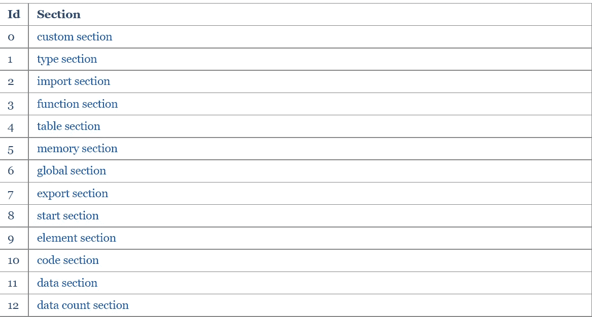
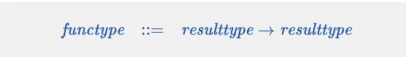
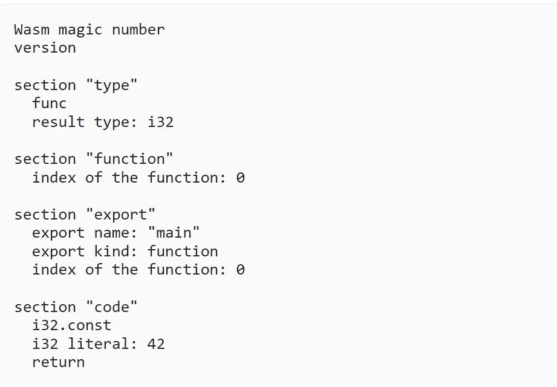

# 第一部分:如何阅读 WASM

> 原文：<https://blog.devgenius.io/part-1-how-to-read-wasm-b29de01d39e7?source=collection_archive---------3----------------------->

## 也许还能写出来。

在本系列的第一篇帖子中，我们回顾了创建 WebAssembly 背后的动机，并偷偷看了一眼一个简单的 Hello，world 程序在 WASM 会是什么样子。

*注:如果你想亲自尝试一下，请前往*[*web assembly . studio*](https://webassembly.studio/)*。在 c 中创建和构建一个 Hello World 项目。当您构建该项目时，将会生成一个. wat 文件——其中的一个片段在上一篇文章中有所分享。*

说实话，生成的**。由于熟悉汇编语言，wat 文件**(web assembly 文本的缩写)对我来说并不可怕。然而，在涉足高级语言之后，我非常清楚地认识到，一门去除了所有舒适抽象的语言可能会令人望而生畏。因此，本系列接下来的两篇文章旨在让读者熟悉 WASM 的基本表示——二进制&文本格式。


# 为什么有两种格式？

让我们后退一步，理解拥有两种不同格式背后的动机。如上所述，生成的 WASM 码具有二进制和文本格式。它们并不是现存的对人类最友好的语言(当然，除非你熟悉汇编语言)。因此，

> 为了使 WebAssembly 能够被人阅读和编辑，有一个 wasm 二进制格式的文本表示。这是一种中间形式，设计用于在文本编辑器、浏览器开发工具等中公开。

这篇文章旨在介绍。wasm 文件简单介绍给感兴趣的人。

# **模块**

听说过[抽象语法树](https://en.wikipedia.org/wiki/Abstract_syntax_tree)(缩写为 AST)？S 表达式可以非常宽泛地比喻为 AST，因为它们对编程语言语法一无所知，但却是表示相同树形结构数据的一种方式。

但是这有什么关系呢？二进制和文本格式的基本代码单元是模块，它是一个大的 s 表达式。让我们以一个非常简单的代码为例。比 Hello World 简单，因为 WebAssembly 没有返回字符串的[类型](https://webassembly.github.io/spec/core/syntax/types.html)、**和**。我们在第一篇文章中是如何做到这一点的，这是一个高级的话题，我希望在接下来的两篇文章中讨论。但这意味着目前我们只有[数字类型](https://webassembly.github.io/spec/core/syntax/values.html)来编写简单的程序。因此，我们将编写一个简单的程序来返回一个数字，而不是标准的 Hello World。

***全面披露后再进行。我这里用过的例子来自网站:***[***https://blog . TTU lka . com/learning-web assembly-2-wasm-binary-format***](https://blog.ttulka.com/learning-webassembly-2-wasm-binary-format)***。***

将下面的代码片段复制并粘贴到[该 web 实用程序](https://webassembly.github.io/wabt/demo/wat2wasm/) &上，点击下载。

```
(module
  (func (export "main") 
        (result i32)
    i32.const 42
    return))
```

您将在您的机器上得到一个. wasm 文件，它不是人类可读的，并且充满了 Unicode 字符。你需要用十六进制浏览器来查看它。因此，我将。wasm 文件使用 Windows powershell 上的 [format-hex 实用程序。](https://docs.microsoft.com/en-us/powershell/module/microsoft.powershell.utility/format-hex?view=powershell-7.2)



format-hex 命令



输出

现在我知道上面的输出看起来有点奇怪，但是请继续关注我。

如果你注意到第一行，前四个字节是 **0061 736D。**这对应于 WASM 二进制幻数。它翻译成 ***\0asm*** ，并将二进制文件标识为 WASM 二进制文件。接下来的四个字节代表 WASM 版本，即 **0100 0000** 。是的，我们还在第 1 版！

但是，除了二进制格式的模块和那些尾随数字到底是什么以外，还有其他东西吗？

# **第一节**

每个模块都被组织成[二进制格式](https://webassembly.github.io/spec/core/binary/index.html)的不同部分。每个部分由以下内容组成:

*   一个字节的节 ID
*   截面尺寸
*   实际内容

根据区段的种类，使用以下区段 id，



credit:[https://web assembly . github . io/spec/core/binary/modules . html # sections](https://webassembly.github.io/spec/core/binary/modules.html#sections)

为了更好地理解上述内容，让我们回到我们的例子。

在第一行，我们看到除了幻数和版本之外的许多字节。亲爱的读者，这是一节的*开头*。第一个字节给出了 ID， **01** ，并将其标识为类型部分。下一个字节给出了前面提到的大小。在我们的例子中，大小是 **05** 对应于另外五个字节，在此之后，该部分结束。现在剩下的五个字节定义了函数中定义了多少类型的变量，我们的代码有多少个函数，它以什么作为参数，以及它返回什么。标准编程的东西，但在二进制格式。顺序详述如下。

```
**Number of types of variables**
Byte 0A: 01**Function Type**
Byte 0B: 60**Number of input parameters**
Byte 0C: 00**Number of output parameters**
Byte 0D: 01**Result type(i32)** Byte 0E: 7F
```

我们的类型部分解码成一个[函数类型的向量](https://webassembly.github.io/spec/core/binary/types.html)，它本质上将参数向量映射到结果向量。形象就是它的本质。



如果我们看接下来的几个字节，它表示 ID 为 **3** 的新段的开始。根据上表，这是“函数”部分，其大小为两个字节。

```
**Beginning of "function" section (section ID: 3)**
0F: 03

**Section size**
10: 02

**Number of functions**
11: 01 

**Index of the function**
12: 00
```

更多部分的细节已经在这个博客中简洁地描述过了，我想我不能再补充了。然而，我想给你留下一张博客上发布的伪代码的图片，看看我们简单的代码能翻译成什么。



学分:[https://blog . ttulka . com/learning-web assembly-2-wasm-binary-format](https://blog.ttulka.com/learning-webassembly-2-wasm-binary-format)

这就是这篇文章的全部内容。希望这能让你对 WebAssembly 的二进制格式有一个简单的了解，而不会吓得你不知所措。在本系列的下一期，我们将研究 WebAssembly 的文本格式。

要了解我最新的科技恶作剧，请关注我的推特[](https://twitter.com/Divya_Mohan02)***和*[***LinkedIn***](https://www.linkedin.com/in/divya-mohan0209/)*。我还写每周简讯，**[***周五四***](https://www.getrevue.co/profile/divyamohan) *，在那里我把科技世界里发生的所有有趣的事情都作为一个亮点滔滔不绝地报道出来。如果你觉得这是你的拿手好戏，请考虑订阅****