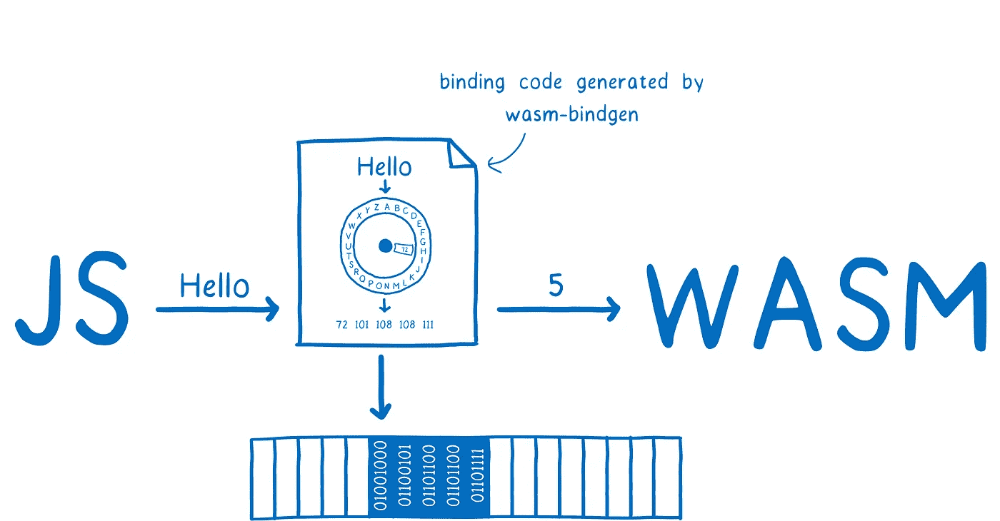

# 第 1 部分:WASM 的内存管理

> 原文：<https://blog.devgenius.io/part-1-memory-management-in-wasm-52195f9b707f?source=collection_archive---------8----------------------->

这是我关于 WebAssembly 系列的第四篇文章，也可以独立阅读。这篇文章旨在成为 WASM 内存管理的理论入门。但是，如果您想查看本系列以前的文章，我已经将它们放在了下面的参考资料部分。

## 探索记忆管理背后的动机

当您现有的参考框架包括具有[内存管理特性](https://www.memorymanagement.org/mmref/lang.html)的编程语言时，WebAssembly 中的内存是一个具有挑战性的话题。通过直接访问原始字节和手动内存管理，对于那些一直使用上述语言的人来说，使用起来感觉很陌生。

## 在开始之前，我需要知道些什么？

没什么。即使你对 WebAssembly(和内存管理)完全陌生，这篇文章也将以对比的方式解释基础知识，这样一个对生态系统完全陌生的人可以理解硬币的两面。

## 什么是内存管理？

简而言之，它是控制和协调应用程序(即以任何编程语言编写的代码)访问 CPU 内存的过程。现在你可能会问，为什么我的应用程序需要内存？当您的代码在任何操作系统上运行时，它需要访问 **RAM** ，原因如下:

*   加载它自己的[字节码](https://en.wikipedia.org/wiki/Bytecode)，然后将被执行
*   存储将在执行过程中使用的结构和数据
*   加载程序执行所需的任何运行时系统

除了加载字节码所需的空间之外，软件程序还利用了两个称为堆的特殊区域&堆栈内存。你可以参考[这个链接](https://deepu.tech/memory-management-in-programming/)来深入了解栈 v/s 堆。

> **TL；DR 如果你没看上面的链接** : Stack v/s 堆内存分类是在内存分配的基础上完成的。在访问这些区域的方式、访问速度、每个区域中可以存储的内容、它们可以增长到的大小以及如果这些区域管理不当会遇到的错误方面也有所不同。

根据 v1 [规范](https://webassembly.org/docs/security/)，WASM 模块在沙盒环境中执行，该环境将它们与主机/操作系统运行时相分离。这实际上意味着，除非明确允许，否则他们不能从主机或其他 WebAssembly 来宾访问数据。鉴于上述情况，WebAssembly 内存到底是什么样子的呢？

## 内存和 web 程序集

WebAssembly 模块[被设计](https://github.com/WebAssembly/design/issues/306)为不控制整个进程地址空间，不像 C/C++这样的语言。它们确实通过导入/导出与其他实例共享内存，但每个模块只能分配到一小部分连续的[虚拟内存，并带有一个偏移量](https://github.com/sunfishcode/wasm-reference-manual/blob/master/WebAssembly.md#linear-memories)，也称为其[线性内存](https://en.wikipedia.org/wiki/Flat_memory_model#:~:text=Flat%20memory%20model%20or%20linear,memory%20segmentation%20or%20paging%20schemes.)。简单地说，这就是线性内存分配的样子，

线性内存:虚拟内存的一个小的连续部分

该内存以初始大小创建，并以[页](https://webassembly.github.io/spec/core/exec/runtime.html#page-size)进行测量。根据 WebAssembly v1 规范，这可以使用 [**grow_memory**](https://dl.acm.org/doi/epdf/10.1145/3062341.3062363) 指令动态增长到最大 65536 页，总共 2^32 字节(4 [gibibytes](https://en.wikipedia.org/wiki/Gibibyte) )。

## 这些有什么关系呢？

该规范通过考虑以下因素来确保内存安全，

*   潜在的恶意模块无法访问线性内存之外的数据
*   由于内存大小总是已知的，运行时总是能够检查模块是否在指定的边界内访问内存
*   除非给出显式访问，否则模块不能访问任何其他存储器。

但是 WASM 模块可以用不同的编程语言编写和编译，它们有自己的内存管理模型。这个规范如何在这些语言中保持一致？简单。通过理解当试图从主机运行时写入/读取时如何实现分配和解除分配，以及通过考虑和如何简化不同复杂数据类型之间的交换。

鉴于上述情况，在 WASM 有两种管理内存的方法，

*   您的模块拥有数据并负责管理其生命周期
*   将数据从主机复制到模块

虽然您可以通过编写自己的代码来手动完成这些工作，但对于第二个选项，您可以让像 [wasm-bindgen](https://github.com/rustwasm/wasm-bindgen) 或 [AssemblyScript loader](https://github.com/AssemblyScript/assemblyscript/tree/caa58015062dbccba7de9133c3d09138eec93e85/lib/loader) 这样的工具来代替。

wasm-bindgen 所做的是将 WebAssembly 模块包装在一个 JavaScript 包装器中，这样 JavaScript 和 wasm 就可以以双方都能理解的方式从同一个线性内存中读取数据或向其中写入数据。有点像这样。

鸣谢:[https://hacks . Mozilla . org/2018/06/babys-first-rustwebassembly-module-say-hi-to-jsconf-eu/](https://hacks.mozilla.org/2018/06/babys-first-rustwebassembly-module-say-hi-to-jsconf-eu/)

类似地，加载 Wasm 模块并通过 WebAssembly API 公开它们，AssemblyScript 加载器还提供了分配和读取字符串、数组和类的实用程序。通过提供粘合代码，它完成了大部分繁重的工作，并允许您使用线性内存。

上述实用程序的作用范围是各自的语言。因此，这一领域无疑有着更大的发展空间。在写这篇文章的时候，有一些提议正在进行中，即[接口类型](https://github.com/WebAssembly/interface-types/blob/main/proposals/interface-types/Explainer.md#integers)、[多值 Wasm](https://github.com/WebAssembly/multi-value) 、[垃圾收集](https://github.com/WebAssembly/gc/blob/master/proposals/gc/Overview.md)，它们可能会简化 WebAssembly 中复杂数据类型的内存管理和交换。

所以，这个帖子到此为止！在下一篇文章中，我们将研究一个简单的程序，以及如何利用 WASM 的内存管理功能来开发一个用 TypeScript 编写的简单 Web 应用程序。

**资源:**

[网络组装入门](/a-primer-on-webassembly-834150fdd7ae)，

[如何阅读《WASM》第一部](/part-1-how-to-read-wasm-b29de01d39e7)

[如何阅读 WASM 第二部](/part-2-how-to-read-wasm-1f7e34e70f59)

林·克拉克的博客被 Mozilla 黑客攻击

这个 GitHub 回购真棒 [WASM 资源](https://github.com/mbasso/awesome-wasm)。

*要了解我最新的科技恶作剧，请关注我的* [*推特*](https://twitter.com/Divya_Mohan02) *和*[*LinkedIn*](https://www.linkedin.com/in/divya-mohan0209/)*。*