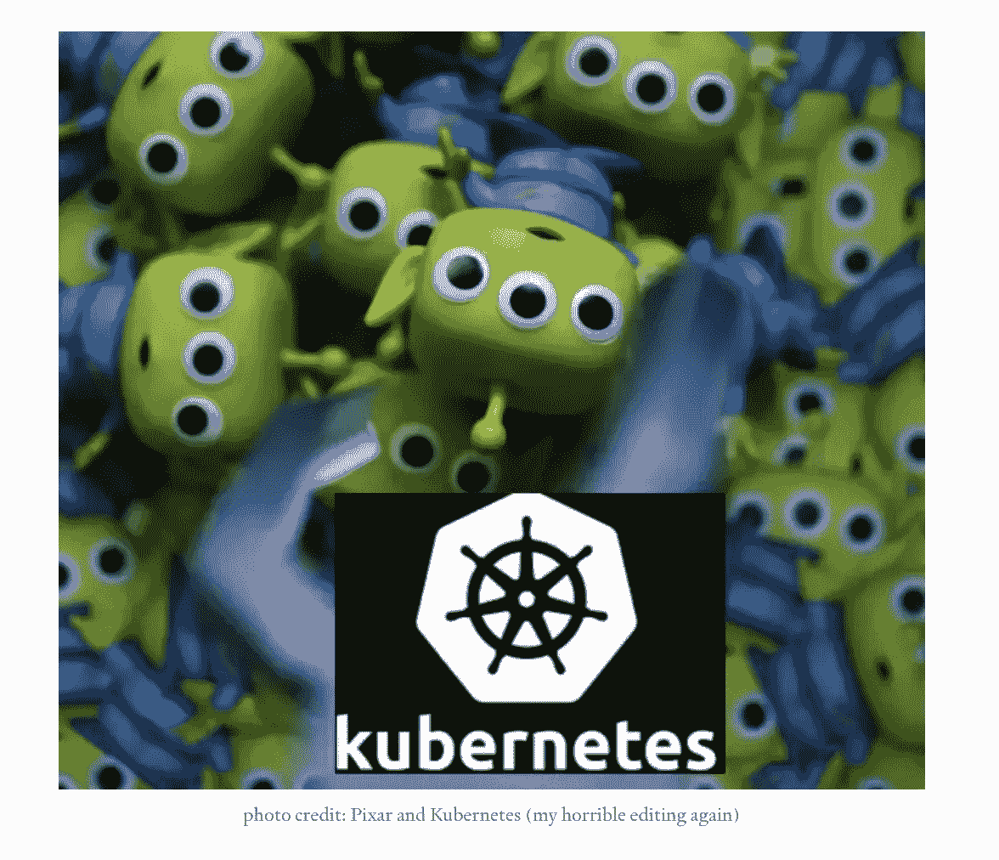
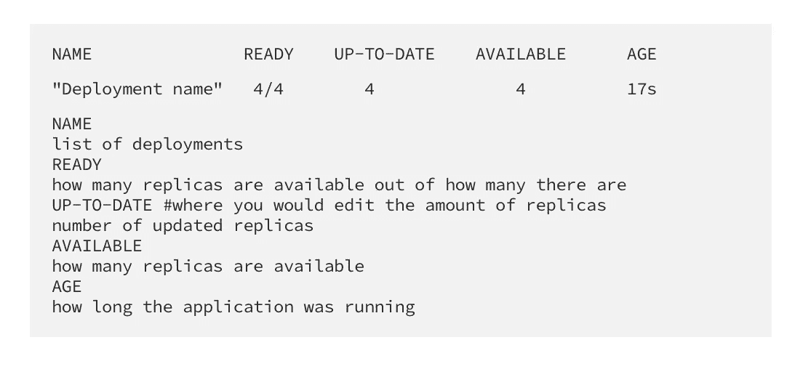

# (第 2 部分)如何使用命令行创建运行 NGINX 映像的部署的忙碌指南。利用 KUBE！！！

> 原文：<https://blog.devgenius.io/part-2-a-busy-persons-guide-for-how-to-use-the-command-line-to-create-a-deployment-that-runs-an-d6d61e69ce08?source=collection_archive---------10----------------------->



这是关于如何使用命令行创建运行 NGINX 映像的部署的忙碌指南的第 2 部分。利用 KUBE！！！ [***第一部分可以在这里找到！***](https://medium.com/@janita.gw13/a-busy-persons-guide-for-how-to-use-the-command-line-to-create-a-deployment-that-runs-an-nginx-e8569da3104b)

因为日光节约，我们多活了一个小时…所以，让我们疯狂一点，做高级部分(还有…谢谢你星巴克带回的冰糖饼干和牛奶拿铁，因为这是我脑中的派对，哈哈)😂

# 该项目的高级部分

*   使用 yaml 文件创建相同的部署
*   通过命令行显示此部署的详细信息
*   更新 yaml 文件，将部署扩展到 4 个 nginx 容器
*   通过命令行验证更改

# 1.创建新目录

```
vim <enter file name.yaml>
```

# 2.使用. yaml 文件创建相同的部署

```
kubectl apply -f <enter file name.yaml>
```

# 3.显示详细信息

```
kubectl describe deployment <enter the pod name here>
```

# 4.更新 yaml 文件，将部署扩展到 4 个 nginx 容器

*   进入文件>编辑副本数量为 4(使用下面的命令)

```
kubectl edit deployment/<enter deployment name>
```

>保存>然后重新部署(使用下面的命令)

```
kubectl apply -f <enter file name.yaml>
```

# 5.通过命令行验证更改

```
#to display to update changes
kubectl get deployments
```

*   你将会看到什么以及这一切意味着什么



*   您也可以运行以下命令来获取下面的信息！

```
#to view the ReplicaSet
kubectl get rs
#displays all 4 pods descriptions/status
kubectl get pods --show-labels
```

感谢您阅读第 2 部分！我希望这是一个快速简单的指南！如果你看到任何我忘记了或者可以用来简化甚至改进我的项目的东西，请留下你的评论！我喜欢人们把他们自己的文章或者有帮助的相关文章放到评论框里！

# 我们连线吧！


我的 Linkedin 个人资料:[https://www.linkedin.com/in/janita-williamson-186a1a85](https://www.linkedin.com/in/janita-williamson-186a1a85)


我的 GitHub 用户名:MrsTorres[https://github.com/MrsTorres/python-.git](https://github.com/MrsTorres/python-.git)


一个视觉日记，记录了我从医疗保健到科技世界的咖啡之旅！@caffeinatedtechie