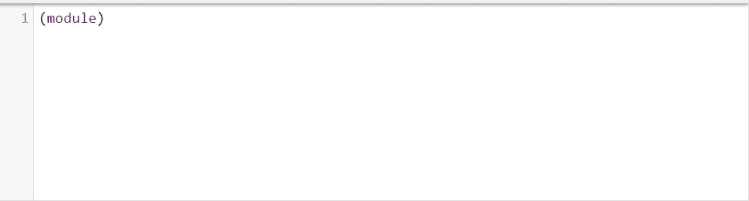
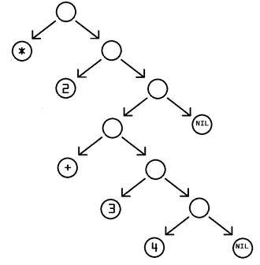

# 第二部分:如何阅读 WASM

> 原文：<https://blog.devgenius.io/part-2-how-to-read-wasm-1f7e34e70f59?source=collection_archive---------10----------------------->

## 也许还能写出来。

在我本系列的[上一篇文章](/part-1-how-to-read-wasm-b29de01d39e7)中，我们简要地查看了 [WebAssembly 的二进制格式](https://webassembly.github.io/spec/core/binary/index.html)的逐字节分解。有了这些知识，让我们看看 WebAssembly 的文本格式。这将被捕获到一个扩展名为. wat 的可读文件中。


# **模块**

与二进制格式一样，文本格式的基本(也是最简单的)单元也是一个模块。一个空的(并且非常有效)。wat 文件如下所示。



然而，这并没有做很多事情…除了声明一个模块。

但是……从上一篇文章中我们已经知道，WebAssembly 模块是一个很大的 S 表达式。概括地说，S 表达式基本上是一种将数据表示为嵌套树的方法。事实上，上面的模块声明只是一个独立的根。随着程序复杂性的增加，会添加各种带有属性的子节点，有效地将所有函数(和数据)分组到根节点下。

下面提供了我刚才提到的内容的图片描述。



信用:[https://en.wikipedia.org/wiki/S-expression](https://en.wikipedia.org/wiki/S-expression)

这给我们带来了一个问题，

> WebAssembly 中的函数是什么样的？

答案是，

`**( func <signature> <locals> <body> )**`

既然是写成 S 表达式，我敢肯定第一眼看上去很异类。然而，在分解上面的伪代码结构时，我们[看到](https://developer.mozilla.org/en-US/docs/WebAssembly/Understanding_the_text_format)

1.  签名对应于函数作为输入和作为值返回的内容
2.  局部变量类似于 JavaScript 变量，但是声明了显式的类型
3.  主体由低级指令列表组成

但是在我们写第一个函数体之前。瓦特，我们需要谈谈一件小事:堆垛机。

# 堆垛机

如果你访问[webassembly.org](https://webassembly.org/)(或者甚至是[维基百科关于 WebAssembly](https://en.wikipedia.org/wiki/WebAssembly) 的页面)，你注意到的第一件事就是提到了基于堆栈的虚拟机。在基于堆栈的虚拟机中，值从&弹出，结果被推入堆栈。它的对应物是一个基于寄存器的机器，其中指定了特定的区域来存储值。

为什么这对我们的讨论很重要？WASM 执行是以堆栈机器的形式定义的。这意味着当一个 WASM 函数被调用时，你从一个空栈开始，这个空栈逐渐被填满&随着主体部分中指令的执行而变空。

还有呢？ [WebAssembly 验证规则](https://webassembly.github.io/spec/core/valid/index.html)确保了如果我们定义了一个特定类型的返回值，比如 i32，那么堆栈最后必须与该类型完全匹配。如果没有返回类型，堆栈必须为空。

那么，让我们继续编写我们的第一个 WASM 程序吧！

# 我们的第一个 WASM 项目

在前一篇文章中，我们看了一个返回数字 42 的程序(同时也是我们的 Hello，World)。接下来是一个稍微复杂(但仍然非常基本)的程序，我们将两个数相加并返回一个结果。

```
**(module
  (func (export "add_basic")(param $num1 i32) (param $num2 i32) (res i32)
    local.get $num1
    local.get $num2
    i32.add))**
```

关于有效指令代码的完整列表，您可以查看 WebAssembly 的[语义词汇表。](https://webassembly.github.io/spec/core/exec/index.html)

# 下一步是什么？

既然我们已经学会了如何编写一个基本的？wat 程序，在下一部分中，我们将看看 WebAssembly 中的内存管理。对于精通使用像[垃圾收集](https://en.wikipedia.org/wiki/Garbage_collection_%28computer_science%29)这样的内存管理技术的语言的开发人员来说，这是一个经常令人困惑的方面，我们将探索各种场景&尝试理解其内部机制。

要了解我最新的科技恶作剧，请关注我的推特[](https://twitter.com/Divya_Mohan02)***和*[***LinkedIn***](https://www.linkedin.com/in/divya-mohan0209/)*。我还写每周简讯，**[***周五四***](https://www.getrevue.co/profile/divyamohan) *，在那里我把科技世界里发生的所有有趣的事情都作为一个亮点滔滔不绝地报道出来。如果你觉得这是你的拿手好戏，请考虑订阅****