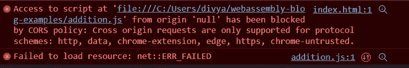

# 第 2 部分:WASM 的内存管理

> 原文：<https://blog.devgenius.io/part-2-memory-management-in-wasm-b4e8fc151c73?source=collection_archive---------11----------------------->

这是我关于 WebAssembly 系列的第五篇文章。虽然我打算独立阅读本系列的每篇文章，但这篇文章借鉴了我们在内存管理文章 *的第一部分* [*中的讨论。您可以查看参考资料部分链接的以前的帖子。*](/part-1-memory-management-in-wasm-52195f9b707f)

## 在开始之前

这篇文章将**很大程度上**依赖于对 [TypeScript](https://www.typescriptlang.org/) 的熟悉，TypeScript 是 JavaScript 的强类型版本。语言的选择背后有两个主要原因。首先，TypeScript 与 JavaScript 非常相似。由于 JavaScript 无处不在，对于具有中等 JavaScript 知识水平的人来说，上面提到的例子很容易理解。下一个原因是 [AssemblyScript 编译器](https://www.assemblyscript.org/compiler.html)，它可以用来将 TypeScript 编译成 WASM。然后可以在我们的 JS + HTML 文件中调用它，以便在浏览器上查看。

也就是说，对于那些不熟悉的人来说，当我们远离传统的 JS 或链接到文档时，我将尝试解释使用特定代码片段背后的基本原理。

但首先，在我们开始之前，我们需要概述一下我们将如何进行这个练习。

**步骤#1:** 用 TypeScript 写代码。由于语法与 JavaScript 略有相似，这将大大降低入门门槛。

**步骤#2:** 使用[汇编脚本编译器](https://www.assemblyscript.org/compiler.html)编译到 WASM。

**步骤#3:** 加载&在一个. js 文件中实例化 WASM 模块

**步骤#4:** 导入。js 文件转换成 HTML(这样我们就可以在浏览器上查看它)

步骤 5: 在浏览器上实际查看我们的代码

通过这五个步骤，我们将创建两个简单的 web 应用程序&演示

*   JavaScript 和 WASM 模块之间的值传递
*   我们如何通过分配和释放来手动管理内存。


流动

下面的所有代码片段都可以在 [this](https://github.com/divya-mohan0209/webassembly-blog-examples) GitHub 仓库中找到。我们将通过重复上面提到的过程来看两个例子。在第一个例子中，我们将看看如何在 JavaScript 和用 TypeScript 编写的 WASM 模块之间传递数字。在这个例子结束的时候，我们将会对这是如何实现的有一个清晰的概念，在我们的下一篇文章中，我们将会讨论一个更复杂的关于数组如何传递的例子。

# 示例 1:在 JavaScript 和用 TypeScript 编写的 WASM 模块之间传递数字

## 步骤 1:用 TypeScript 编写代码

首先创建 addition.ts 文件，如下所示。

```
**//Sample code for addition****//Takes in two i32 values****//Returns their sum****export function add(a: i32, b: i32): i32 {****return a + b;****}**
```

## 第二步:使用 AssemblyScript 编译器将它编译成 WASM

为此，我们首先需要[和 npm](https://nodejs.org/en/download/) 一起设置一个节点环境。完成后，执行以下命令来安装 AssemblyScript 编译器。

```
**npm install -g assemblyscript**
```

一旦上面的命令执行完毕，我们将把。ts 文件转换成 WASM 文件

```
**asc addition.ts -b addition.wasm -t addition.wat**
```

上面的命令产生二进制和文本格式的文件。


由此产生。wat 文件


在 Windows 上使用[格式-十六进制实用程序的二进制表示](https://docs.microsoft.com/en-us/powershell/module/microsoft.powershell.utility/format-hex?view=powershell-7.2)

## **步骤#3:加载&实例化. js 文件中的 WASM 模块**

我们通过调用[web assembly API](https://developer.mozilla.org/en-US/docs/WebAssembly)将 WASM 模块加载到我们的 JS 文件中。下面是整个 addition.js 文件的一个片段。

```
**export const wasmBrowserInstantiate = async (wasmModuleUrl, importObject) => {****let response = undefined;****if (!importObject) {****importObject = {****env: {****abort: () => console.log("Abort!")****}****};****}****const instantiateModule = async() => {****const response = await fetch ("./addition.wasm");****const buffer = await response.arrayBuffer();****const obj = await WebAssembly.instantiate (buffer, importObject);****return obj;****};****response = await instantiateModule();****return response;****};**
```

在上面，我们没有使用/检查[流实例化](https://developer.mozilla.org/en-US/docs/Web/JavaScript/Reference/Global_Objects/WebAssembly/instantiateStreaming)。这是可以做到的，在这篇博文中有更好的解释。这里，我们使用 [fetch](https://www.geeksforgeeks.org/javascript-fetch-method/) 方法来下载整个 WASM 模块。Post 它，我们实例化它并返回它。

此后，我们还将调用在**步骤#1** 中描述的导出的 add()函数。

```
**const runWasmAdd = async () => {****// Instantiate WASM module****const wasmModule = await wasmBrowserInstantiate("./addition.wasm");****// Call the exported add function from wasm and save the result****const addResult = wasmModule.instance.exports.add(42, 42);****// Set the result****document.body.textContent = `The result of the addition: ${addResult}`;****};****runWasmAdd();**
```

## **第 4 步:导入。js 文件转换成 HTML**

我们现在将使用下面的代码片段将我们的 addition.js 作为 ES6 模块加载到 HTML 文件中:

```
**<!DOCTYPE html>****<html>****<head>****<meta charset="UTF-8" />****<title>Add me!</title>****<script type="module" src="./addition.js"></script>****</head>****<body></body>****</html>**
```

## 步骤 5:在浏览器上实际查看我们的代码

您不能直接在浏览器上查看 index.html，即使您看到了，它也可能会弹出一个空白页面。

通过开发工具进一步挖掘，您会发现这是一个错误



这意味着我们将不得不在网络服务器的帮助下提供我们的包裹。有多种方法可以做到这一点，但是，最简单的方法是通过 npm 执行下面的命令来安装 http-server 包。

```
**npm i -g http-server**
```

一旦安装了 http-server，您将能够通过执行以下命令在您想要的任何端口上启动它

```
**http-server -p <port_number>**
```

一旦它启动并运行，您将能够查看如下页面。


景色

概括地说，我们已经在上面看到了如何传递两个 i32 数字并在浏览器上返回它们的和。尽管用 TypeScript 编写的代码只有 3 行，但通过 WASM Web API 调用，用 JavaScript 调用 WASM 编译的版本变得更加容易。这实质上意味着，我们最终做的是这个(当然，在 WASM Web API 的帮助下)，


在 JavaScript 和 WASM 模块之间传递值(用 TypeScript 编写)

如果你还记得我们之前的帖子，这正是我们已经达成的各种工具的用例，比如[wasm-bindgen](https://github.com/rustwasm/wasm-bindgen)/[assembly script loader](https://github.com/AssemblyScript/assemblyscript/tree/caa58015062dbccba7de9133c3d09138eec93e85/lib/loader)。作为参考，下面是图片描述。


所以这个帖子到此为止！希望我能够简化如何在 JavaScript 和用 TypeScript 编写的 WASM 模块之间传递数值。这种理解将是下一篇博文的关键，我们将尝试将这种知识扩展到在两者之间传递整个数组。

**资源:**

[网络组件上的底漆](/a-primer-on-webassembly-834150fdd7ae)，

[如何阅读《WASM》——第一部分](/part-1-how-to-read-wasm-b29de01d39e7)

[如何阅读 WASM 第二部](/part-2-how-to-read-wasm-1f7e34e70f59)

[第 1 部分:WASM 的内存管理](/part-1-memory-management-in-wasm-52195f9b707f)

[Mozilla 在 WebAssembly 上黑掉了林·克拉克的博客](https://hacks.mozilla.org/tag/webassembly/)

*附注:要了解我最新的科技恶作剧，请关注我的* [***推特***](https://twitter.com/Divya_Mohan02)**和*[***LinkedIn***](https://www.linkedin.com/in/divya-mohan0209/)*。**

*P.P.S .公司。我的内容创作之旅始于一个个人责任工具，是一项热爱的工作。除了这个博客，我还出版了一个名为 [***的每周时事通讯，在那里我报道了科技世界里所有有趣的事情，作为一个亮点卷轴..随着时事通讯和博客社区的不断发展，你可以通过选择***](https://www.getrevue.co/profile/divyamohan) **[*给我买杯咖啡(一次性投资)或加入每月会员计划*](https://ko-fi.com/divyamohan?utm_campaign=friday%20four&utm_medium=email&utm_source=Revue%20newsletter) *来继续支持我的工作。请注意，这不会影响你当前的时事通讯/博客订阅，因为我的目标是让它们都免费。****