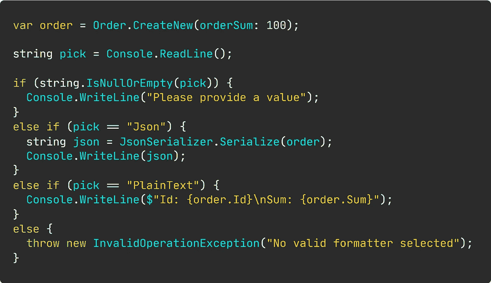
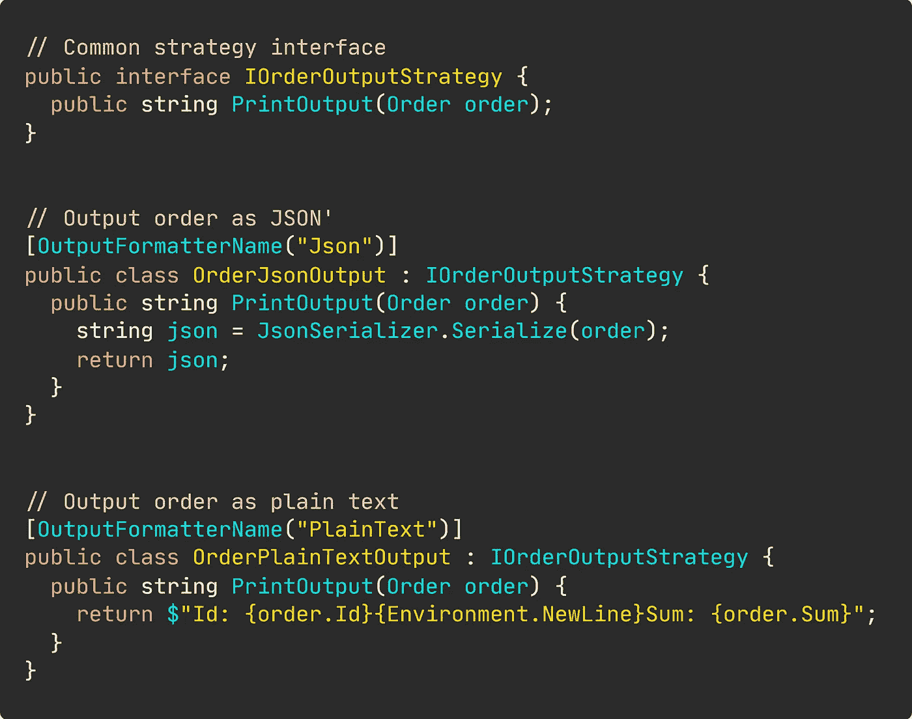
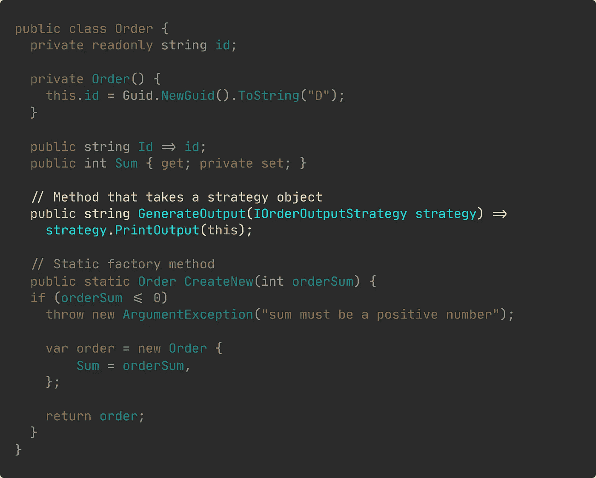
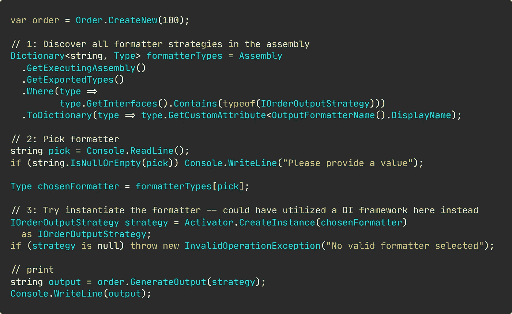
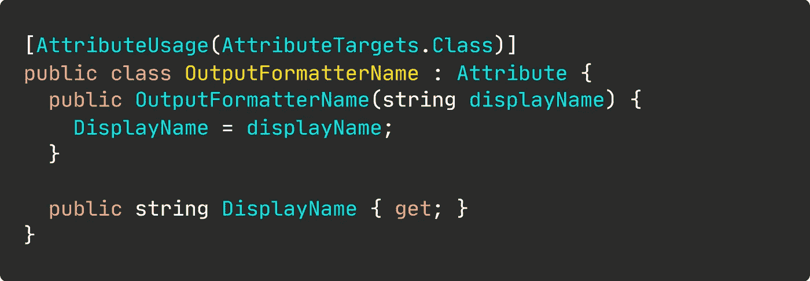

# 第 2 部分:停止使用 If-Else 语句

> 原文：<https://blog.devgenius.io/part-2-stop-using-if-else-statements-ae4b0bec5bad?source=collection_archive---------5----------------------->

## 应用设计模式:策略

## 让我们再来看看如何替换 if-else 语句。

好吧，我们都同意到处使用 If-Else 语句是一种糟糕的做法。

毫无疑问，从周日开始，你已经遇到了六种让你头疼的假设语句。**龌龊的**分支和**不明确的**职责。我们还不如在那里拍一些照片，只是为了开心和欢笑。

教官和老师都爱 If-Else。这是他们的锤子，一切都是钉子。必须决定执行哪个逻辑？使用 If-Else。想创建工厂？使用 If-Else。你已经明白了…

我们将把下面这个说明性的热点问题重构为可扩展的产品。



看起来很可怕。是的，它也可以用 switch 来实现。这种代码仍然很普遍。

你知道这不好。但它是可以修复的。稍微重构一下，我们就回到了高度可扩展和可维护的代码，它会让你睡得像个婴儿。

## "那么，我们如何替换这些令人痛苦的 If-Else 语句呢？"

使用策略对象和类型发现。

您可能已经听说过策略模式，但可能仍会暗自好奇模糊到底是怎么回事。下面是对一种模式的简单介绍，这种模式将改变你将来编写分支的方式。

> 我们经常需要根据某些条件来决定执行哪个逻辑。
> 
> 通过创建一组具有公共接口的类，结合类型发现，我们可以很容易地交换执行哪个逻辑，而不需要 If-Else。

不错吧。我们只是调用一个专用对象的方法，而不是用无尽的 If-Else 分支语句来扩展我们的应用程序。

我们将重构上面的代码，确保我们坚持坚实的原则。尤其是考虑到打开/关闭原则。

# 演示时间

首先，我们从可怕的 If-Else 语句中提取逻辑，并把它放在不同的策略类中。同时，我们创建一个公共界面。



每个策略类都实现了公共接口。此外，我在类上应用了一个属性，这为我们提供了一个友好的策略名称。属性类将在本文后面定义。

然后，我们在 Order 类中创建一个方法，该方法将策略接口作为一个参数。下面是整个 Order 类的一个片段。



这允许我们将逻辑委托给专门的类，而不是编写可怕的、不容易扩展的 if-else 语句。

现在，我们实际上从一开始的示例中删除了 If-Else 地狱。

这为我们应用程序提供了一些真正的可扩展性。



让我们简要地浏览一下类型发现过程。

我们正在构建一个包含实现公共接口的所有类型的字典，并使用属性中的名称作为键。

然后，我们让用户在控制台中输入一些匹配输出格式化程序名称的文本。

基于输入，我们首先在字典中找到相应的类型，并创建该类型的实例。

该实例被传递给订单的 GenerateOutput 方法。

毫无疑问，更多的是代码。但是它将允许我们动态地发现新的格式器策略，因为它们被添加到解决方案中。一些如果-否则不会提供给你的东西，无论指导者如何努力去推动它。

## 还有一件事…

如果您想知道策略类上面的`[OutputFormatterName("")]`，实现如下所示。



一个非常简单的属性类，为我们提供了一个友好的显示名称。

## “如果我需要一种新的方法来格式化输出，该怎么办？

您创建了一个实现了`IOrderOutputStrategy`的新类。说实话就这么简单。类型发现过程将负责向应用程序“注册”新的格式化程序。

通过在订单上定义`GenerateOuput`方法，我们不需要使用 If-Else 来分支我们的代码。我们只是把责任委托给专门的类。

## "同样，你创建了许多类来做一些简单的事情！"

当然，有很多额外的课程。但是它们非常简单。

它们有着源自功能需求的有意义的名字。其他开发者会从一开始就意识到他们的目的。

我也可以和业务人员一起浏览逻辑，他们完全理解我所说的内容，只需要一点点帮助——毕竟这是代码。

我们真的应该限制我们的表达能力，只是为了适应那些被 If-Else 卡住的人吗？

## "但是不会有 If-Else 没问题的情况吗？"

当然可以。有时候……如果你喜欢竞争性编程，写一些需要高度优化的东西，如果你知道某些东西绝对不会改变(直到它改变)——或者做一个大学作业。教练们喜欢这样。

```
**Resources for the curious** --------------------------
[Examples by Refactoring Guru](https://refactoring.guru/design-patterns/strategy)[Examples by SourceMaking](https://sourcemaking.com/design_patterns/strategy)[How to make your code more Object-Oriented by Zoran Horvat](https://app.pluralsight.com/library/courses/c-sharp-code-more-object-oriented/table-of-contents)[C# Design Patterns: Strategy by Filip Ekberg](https://app.pluralsight.com/library/courses/c-sharp-design-patterns-strategy/table-of-contents)
```

[](https://medium.com/swlh/stop-using-if-else-statements-f4d2323e6e4) [## 停止使用 If-Else 语句

### 编写干净、可维护的代码，不使用 if-else。

medium.com](https://medium.com/swlh/stop-using-if-else-statements-f4d2323e6e4) [](https://medium.com/swlh/dont-use-database-generated-ids-d703d35e9cc4) [## 不要使用数据库生成的 id

### 不要让数据库来管理你的应用程序

medium.com](https://medium.com/swlh/dont-use-database-generated-ids-d703d35e9cc4) [](https://medium.com/swlh/stop-checking-for-nulls-5f9f857ddf72) [## 停止检查空值

### 空对象模式、工厂方法——让我们看看一些生产就绪代码！

medium.com](https://medium.com/swlh/stop-checking-for-nulls-5f9f857ddf72) [](https://medium.com/swlh/dynamic-command-dispatching-in-c-d3abe21b3d1b) [## C#中的动态命令调度

### 让我们保持这一个简短和甜蜜

medium.com](https://medium.com/swlh/dynamic-command-dispatching-in-c-d3abe21b3d1b) [](https://medium.com/swlh/lets-add-some-functionality-e7b1f4701ba9) [## 扩展你的类而不修改它们

### 简单明了的扩展超过了修改

medium.com](https://medium.com/swlh/lets-add-some-functionality-e7b1f4701ba9) 

**Nicklas Millard** 是一名软件开发工程师，供职于一家发展最快的银行，负责构建任务关键型金融服务基础设施。

此前，他是 Big4 的高级技术顾问，为商业客户和政府机构开发软件。

> [新的 YouTube 频道(@Nicklas Millard)](https://www.youtube.com/channel/UCaUy83EAkVdXsZjF3xGSvMw)
> 
> *接通*[LinkedIn](https://www.linkedin.com/in/nicklasmillard/)