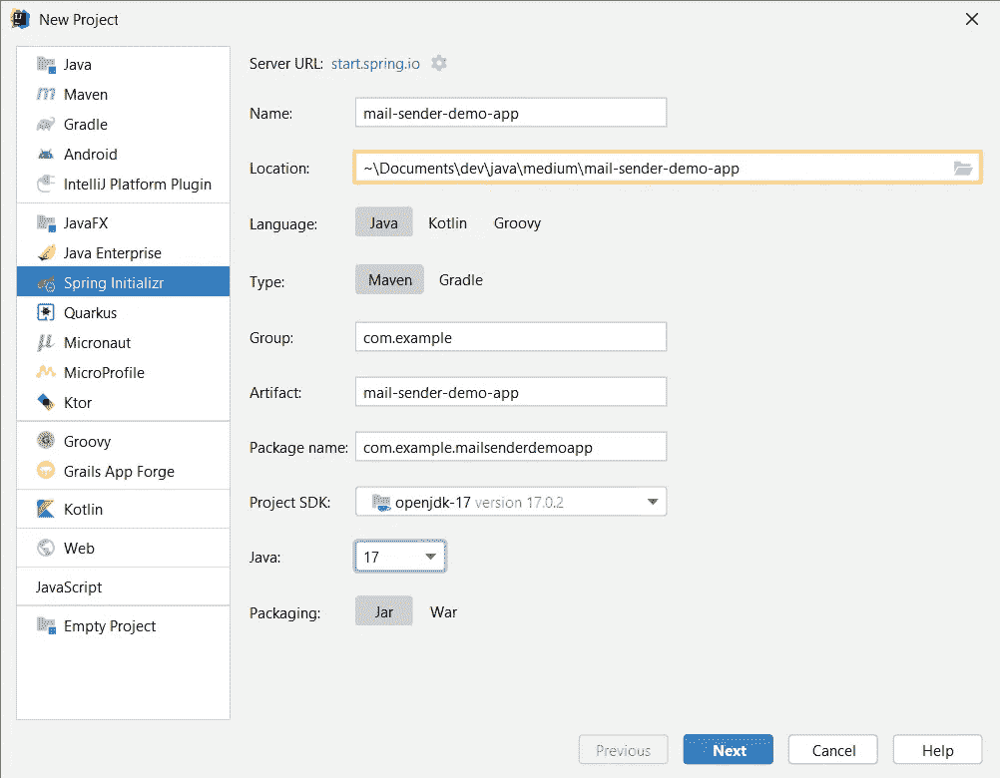
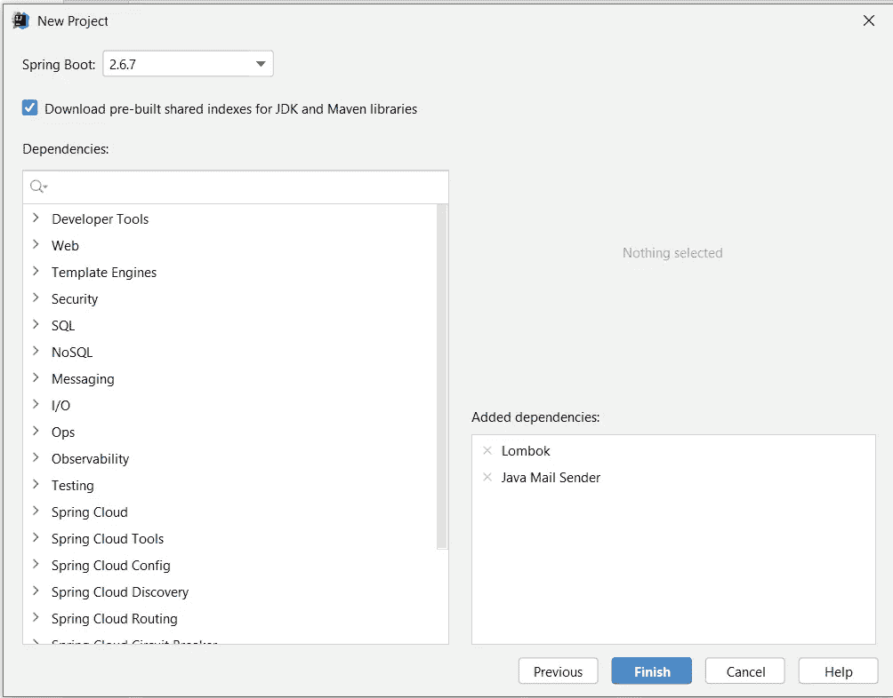
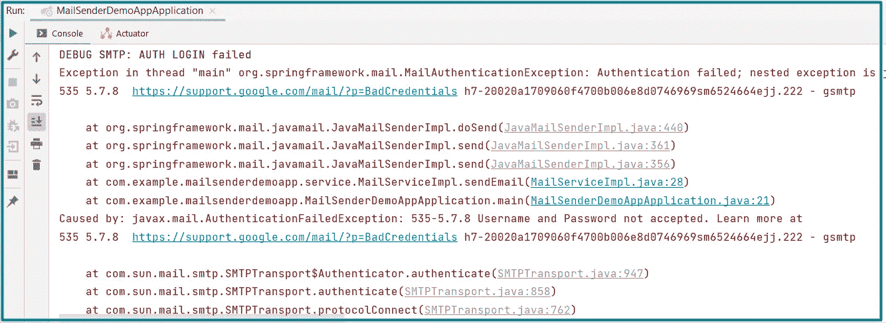
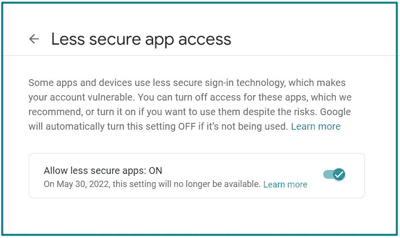
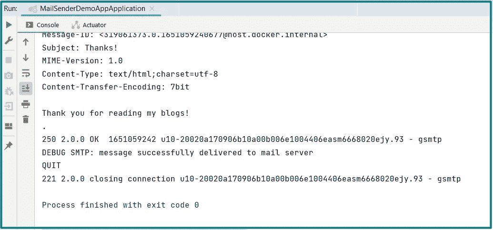

# 第 3 部分—如何:从 Spring Boot 应用程序发送电子邮件

> 原文：<https://blog.devgenius.io/part-3-how-to-send-emails-from-a-spring-boot-application-cf0486b2806f?source=collection_archive---------3----------------------->

难道现在不是揭开从 Spring Boot 应用程序发送电子邮件这一相当简单的过程的神秘面纱的时候吗？这是一个强大的电子邮件营销或邮件通知或任何其他目的你可能会想到的工具。让我们不要浪费时间，直奔主题。

到 ***源代码库*** 的链接将在本教程的末尾添加。

## 建立新的 Spring Boot 项目

用***Spring Initializr***创建一个新项目。我将使用 ***Java 17*** 和 ***Maven*** ，但是你可以选择任何适合你的设置配置。



用 Spring Initializr 创建一个新的 Spring Boot Maven 项目

将***Java Mail Sender***和 ***Lombok*** 依赖项添加到项目中。这些对于演示来说已经足够了，因为我们不打算构建任何真正复杂的东西。



将 Java 邮件发送器和 Lombok 依赖项添加到项目中

## 配置邮件属性

我不会在此赘述，因为我已经在之前的 [***博客***](https://medium.com/dev-genius/part-2-how-to-configure-properties-in-spring-boot-783c54a39304) 中提供了在 Spring Boot 配置属性的分步指南。如果您已经阅读了那篇文章，您可以跳过这一部分的大部分内容。

首先，让我们在`***/src/main/resources.***`中创建一个名为`***mail.properties***`的单独属性文件，将以下配置添加到该文件中( ***不要忘记*** ***在需要的地方插入有效信息*** ):

```
mail.transport.protocol=smtp
mail.properties.mail.smtp.auth=true
mail.properties.smtp-starttls-enable=true
mail.properties.mail.smtp.ssl.trust=smtp.gmail.com

*#* ***insert valid information instead of these values***mail.host=mail.host.domain
mail.port=port
mail.username=username@domain
mail.password=password
```

接下来，在应用程序中注册这个属性文件。在`***/src/main/property***`或其任何子文件夹中创建一个新的 Java 类`***MailProperties***`，并将以下代码放入其中:

```
@Data
@Lazy
@Configuration
@PropertySource("classpath:mail.properties")
@ConfigurationProperties(prefix = "mail")
public class MailProperties {

    @Value("${mail.host}")
    private String host;

    @Value("${mail.port}")
    private Integer port;

    @Value("${mail.username}")
    private String username;

    @Value("${mail.password}")
    private String password;

    @Value("${mail.transport.protocol}")
    private String transportProtocol;

    @Value("${mail.properties.mail.smtp.auth}")
    private String smtpAuth;

    @Value("${mail.properties.smtp-starttls-enable}")
    private String enableSmtpStartTls;

    @Value("${mail.properties.mail.smtp.ssl.trust}")
    private String smtpSslTrust;

}
```

最后，在`***/src/main/config***`中创建一个`***MailSenderConfiguration***`类，它将使用上面定义的所有属性来设置 Gmail SMTP 配置，如主机、端口号、用户名和密码:

```
@Configuration
@AllArgsConstructor
public class MailSenderConfiguration {
    private final MailProperties mailProperties;

    @Bean
    public JavaMailSender emailSender() {
        JavaMailSenderImpl mailSender = new JavaMailSenderImpl();

        mailSender.setHost(mailProperties.getHost());
        mailSender.setPort(mailProperties.getPort());
        mailSender.setUsername(mailProperties.getUsername());
        mailSender.setPassword(mailProperties.getPassword());

        Properties javaMailProperties = mailSender.getJavaMailProperties();
        javaMailProperties.put("mail.smtp.auth", mailProperties.getSmtpAuth());
        javaMailProperties.put("mail.transport.protocol", mailProperties.getTransportProtocol());
        javaMailProperties.put("mail.smtp.starttls.enable", mailProperties.getEnableSmtpStartTls());
        javaMailProperties.put("mail.smtp.ssl.trust", mailProperties.getSmtpSslTrust());
        javaMailProperties.put("mail.debug", "true");

        return mailSender;
    }

}
```

上面的`***mail.debug = true***`属性将确保我们在本教程结束时尝试发送消息时将在控制台中看到输出。

## 创建邮件对象

在我们继续创建邮件服务之前，让我们首先定义一个带有简单字段的`***Mail***`对象，以帮助我们根据需要配置外发消息:

```
@Data
public class Mail {
    private String mailFrom;
    private String mailTo;
    private String mailCc;
    private String mailBcc;
    private String mailSubject;
    private String mailContent;
    private String contenType;
    private List<Object> attachments;
}
```

## 创建邮件服务

完成邮件属性的配置后，我们创建一个新的包`***service***`，在里面用`***sendEmail()***`方法创建一个名为`***MailService***`的接口:

```
public interface MailService {

    void sendEmail(Mail mail);

}
```

接下来，继续创建一个`***MailServiceImpl***`类并用`***@Service***`对其进行注释。用`***@Async***`注释该方法，因为我们希望我们的电子邮件在一个单独的线程中发送，并且不妨碍应用程序的运行过程。

```
@Service
@AllArgsConstructor
public class MailServiceImpl implements MailService {
    private final JavaMailSender mailSender;

    @Async
    @Override
    public void sendEmail(Mail mail) {
        try {
            MimeMessage mimeMessage = mailSender.createMimeMessage();
            MimeMessageHelper helper = new MimeMessageHelper(mimeMessage, "utf-8");
            helper.setSubject(mail.getMailSubject());
            helper.setFrom(mail.getMailFrom());
            helper.setTo(mail.getMailTo());
            helper.setText(mail.getMailContent(), true);
            mailSender.send(mimeMessage);
        } catch (MessagingException e) {
            throw new RuntimeException(e.getMessage());
        }
    }
}
```

在方法结束时，填充的 Spring***mime message***对象将与附件一起返回，并通过***javamail sender . send()***方法发送。

## 测试应用程序

最后，是时候测试我们的应用程序并发送电子邮件了。修改**的内容*应用程序的*主方法**如下:

```
@SpringBootApplication
public class MailSenderDemoAppApplication {

    public static void main(String[] args) {
        Mail mail = new Mail();
        mail.setMailFrom("hello@anita.com");
        mail.setMailTo("medium.readers@gmail.com");
        mail.setMailSubject("Thanks!");
        mail.setMailContent("Thank you for reading my blogs!");

        ApplicationContext ctx = SpringApplication.*run*(MailSenderDemoAppApplication.class, args);
        MailService mailService = (MailService) ctx.getBean("mailServiceImpl");
        mailService.sendEmail(mail);
    }

}
```

启动应用程序后，一切都应该运行顺利。但是，如果您在发送邮件时遇到类似 ***【认证失败】*** 的错误:



MailAuthenticationException

您可能需要检查您的 Gmail 帐户安全设置，并打开 ***不太安全的应用程序访问*** 。这不允许用于一般用途，当然，我们这样做只是为了演示:



支持不太安全的应用程序访问的 Gmail 帐户设置

修改该设置后，您可以从控制台输出中看到邮件已成功发送:



成功发送邮件后的控制台输出

就是这样！希望真的简单易行！

我们已经成功地创建了一个发送电子邮件的 Spring Boot 项目。如果你错过了什么，所有代码都可以在我的 [***GitHub 资源库***](https://github.com/anitalakhadze/mail-sender-demo-app) 找到。

请让我知道你对这个系列中即将到来的博客有什么问题、评论或建议。

***敬请关注，不要错过以下教程！***