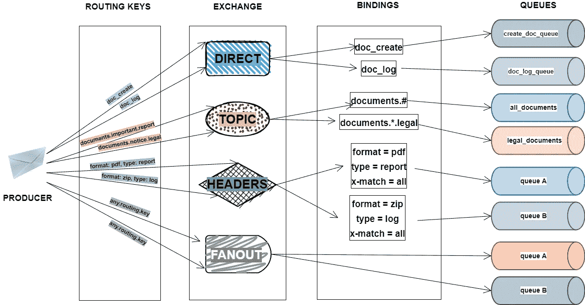
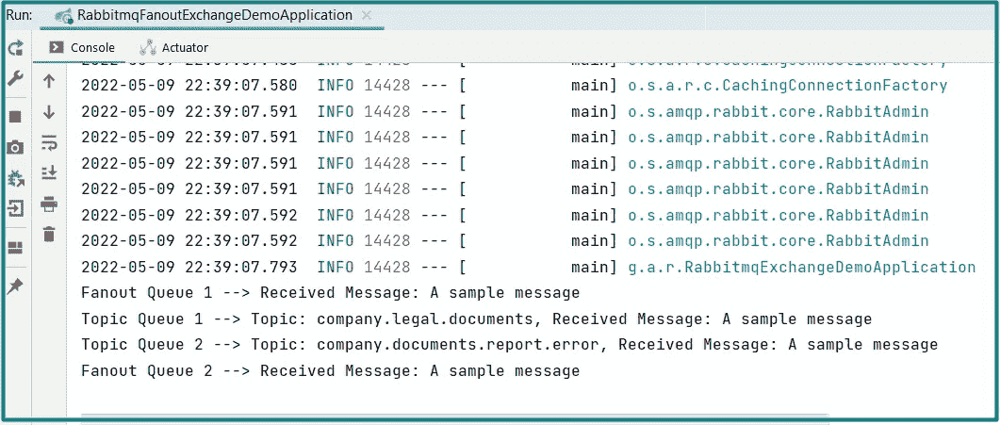

# 第 4 部分—如何:在 Spring Boot 应用程序中使用 RabbitMQ 配置消息传递

> 原文：<https://blog.devgenius.io/part-4-how-to-configure-messaging-with-rabbitmq-in-a-spring-boot-application-a73e2453da95?source=collection_archive---------2----------------------->

如果你对微服务感兴趣，还没有遇到过基于消息的通信*，相信我，我会告诉你的。*

*在 ***HOW TO*** 系列教程中，我将给你一个在***【Spring Boot】***应用程序中使用 ***RabbitMQ*** 消息传递配置的实际例子。我们将构建一个应用程序，使用 Spring AMQP 的***rabbit template****发布消息，使用***rabbit listener***订阅消息。**

**您可能和我一样，一开始会有些困惑，在深入细节之前，让我们先了解一些消息传递的关键概念。**

**到 ***源代码库*** 的链接将在本教程的末尾添加。**

## **什么是基于消息的通信**

**消息传递是一种在应用程序之间传输数据的方法。我们通常使用同步请求-响应架构来开发我们的应用程序。然而，在微服务的情况下，这种方法变得不充分和不可靠，因为它不能在我们的分布式系统的多个数据源之间保持一致。相反，我们必须依靠异步交换消息。**

**例如，RabbitMQ 正是这种解决方案的提供者之一。它位于消息生产者和消费者之间，充当 ***中间消息传递层*** ，并提供有用的功能，如*持久消息存储*、*消息过滤*和*消息转换*。**

**您可能会有点惊讶，但是 Java 有自己的消息服务(JMS) API，用于应用程序之间的消息传递。然而，由于供应商和平台的互操作性，我们无法使用 JMS 客户机和代理。这就是 AMQP 拯救世界的地方。**

## **什么是 AMQP**

**根据 [***定义***](https://www.cloudamqp.com/blog/what-is-amqp-and-why-is-it-used-in-rabbitmq.html)***:*****

> **高级消息队列协议(AMQP)是作为一种开放的标准协议而创建的，它允许系统之间的消息传递互操作性，而不考虑消息代理供应商或使用的平台；有了 AMQP，你可以使用任何你想要的符合 AMQP 标准的客户端库，以及任何你想要的符合 AMQP 标准的代理。使用 AMQP 的消息客户端是完全不可知的。**

**这意味着 AMQP 只是一个*，提供了一套应该如何通过 AMQP 消息 ***代理*** 控制整个消息传递过程的标准，就像 RabbitMQ 一样。***

**正如[***rabbit MQ***](https://www.rabbitmq.com/)的官方网页所解释的:**

> **RabbitMQ 是一个消息代理:它接受和转发消息。你可以把它想象成一个邮局:当你把想要邮寄的邮件放入邮箱时，你可以确定邮递员最终会把邮件送到你的收件人手中。在这个类比中，RabbitMQ 是一个邮箱，一个邮局，一个信件载体。**

**更准确地说，过程如下:一个名为 ***生产者*** 的客户向一个 ***交易所*** 发送一条消息。根据交换类型定义的规则和消息中提供的路由关键字，交换然后将消息副本分发到 ***队列***——本质上是大型消息缓冲区。该消息最终由一个 ***用户*** 消费。**

**如果你对更多的理论解释和一些实际例子感兴趣，可以看看 [***官方网页***](https://www.rabbitmq.com/tutorials/tutorial-one-spring-amqp.html) 上的教程。**

**在我们进入下一个话题之前，我认为回顾一下 AMQP 的一些组成部分是非常有益的。**

## **什么是 AMQP 实体**

**一条 ***消息*** 是从发布者传到队列中，然后被消费者订阅的一条信息。每条消息都有一组定义其参数的头。**

**一个 ***队列*** 是一个缓冲区，可以存储以后要消费的消息。它的属性可以在创建过程中更改。路由关键字用于将队列链接到交换机。**

*****绑定*** 是队列和交换之间的关系，由交换用来将消息路由到队列的一组规则组成。**

**基于 ***交换类型*** 和交换与队列之间的绑定，消息被路由到队列。若要接收消息，队列必须至少绑定到一个交换。路由关键字用于向交换机发送消息。之后，交换机会将邮件副本分发到队列中。**

*****AMQP 经纪商实行四种基本的交易类型*** :**

*   *****直接***–通过匹配完整的路由关键字将消息路由到队列。**
*   *****扇出***–将消息路由到与其绑定的所有队列。**
*   *****主题***–通过将路由关键字与模式匹配，将消息路由到多个队列。**
*   *****标题***–根据消息标题路由消息。**

**为了便于理解，我尝试用下面的图表来表示这些交换类型:**

****

**AMQP 经纪人实施的四种基本交易类型**

**如果你想更深入地了解这些交换类型、绑定、路由键以及应该如何或何时使用它们，可以看看这个好看的博客 [***这里***](https://hevodata.com/learn/rabbitmq-exchange-type/) 。**

## **设置 RabbitMQ 代理**

**让我们首先设置一个 ***RabbitMQ 服务器*** 来处理消息的接收和发送。有几种方法可以做到这一点，但是在我们的教程中，我们将使用***Docker Compose***来快速午餐一个 RabbitMQ 服务器(您必须有一个 ***Docker*** 在本地运行，这个解决方案才能工作)。**

**首先，用***Spring Initializr***创建一个新项目，添加 ***Spring AMQP*** 作为依赖项:**

```
**<dependency>
    <groupId>org.springframework.boot</groupId>
    <artifactId>spring-boot-starter-amqp</artifactId>
</dependency>**
```

**Spring AMQP 是为 *AMQP 实体*、*连接管理、消息发布、*和*消息消费*提供抽象的实现。**

**然后，在项目的根目录下创建一个`***docker-compose.yml***`文件，并将下面的代码粘贴到那里:**

```
**rabbitmq:
  image: rabbitmq:management
  ports:
    - "5672:5672"
    - "15672:15672"**
```

**这里，我们公开端口`**5672**` ，这样我们的应用程序就可以连接到 RabbitMQ。并且，我们公开了端口`**15672**`，以便我们可以通过管理 UI:[*HTTP://localhost:15672*](http://localhost:15672/)或 HTTP API:[*HTTP://localhost:15672/API/index . html*](http://localhost:15672/api/index.html)来查看我们的 RabbitMQ 代理正在做什么。**

**目前，把这个文件留在这里。我们将在几分钟内需要它。**

## **设置 Exchange 配置**

**我们将为两种交换类型设置配置:*扇出*和*主题*。**

**如果您还记得， ***扇出交换*** 向所有绑定队列广播相同的消息，而 ***主题交换*** 使用路由关键字将消息传递到特定的一个或多个绑定队列。**

**让我们创建一个包含以下配置的`***ExchangeConfig***`类:**

```
**@Configuration
public class ExchangeConfig {
    public static final String *FANOUT_EXCHANGE_NAME* = "fanout.exchange";
    public static final String *TOPIC_EXCHANGE_NAME* = "topic.exchange";

    public static final String *FANOUT_QUEUE_1_NAME* = "fanout.queue1";
    public static final String *FANOUT_QUEUE_2_NAME* = "fanout.queue2";

    public static final String *TOPIC_QUEUE_1_NAME* = "topic.queue1";
    public static final String *TOPIC_QUEUE_2_NAME* = "topic.queue2";

    @Bean
    public Declarables fanoutBindings() {
        Queue fanoutQueue1 = new Queue(*FANOUT_QUEUE_1_NAME*, false);
        Queue fanoutQueue2 = new Queue(*FANOUT_QUEUE_2_NAME*, false);

        FanoutExchange fanoutExchange = new FanoutExchange(*FANOUT_EXCHANGE_NAME*, false, false);

        return new Declarables(
                fanoutQueue1,
                fanoutQueue2,
                fanoutExchange,
                BindingBuilder
                        .*bind*(fanoutQueue1)
                        .to(fanoutExchange),
                BindingBuilder
                        .*bind*(fanoutQueue2)
                        .to(fanoutExchange)
        );
    }

    @Bean
    public Declarables topicBindings() {
        Queue topicQueue1 = new Queue(*TOPIC_QUEUE_1_NAME*, false);
        Queue topicQueue2 = new Queue(*TOPIC_QUEUE_2_NAME*, false);

        TopicExchange topicExchange = new TopicExchange(*TOPIC_EXCHANGE_NAME*, false, false);

        return new Declarables(
            topicQueue1,
            topicQueue2,
            topicExchange,
            BindingBuilder
                    .*bind*(topicQueue1)
                    .to(topicExchange)
                    .with("*.legal.*"),
            BindingBuilder
                    .*bind*(topicQueue2)
                    .to(topicExchange)
                    .with("#.error")
        );
    }

}**
```

**object 是 Spring AMQP 提供的一个非常方便的工具，它允许我们聚合所有队列、交换和绑定的声明。**

**在上面的代码中，我们建立了一个扇出交换，有两个队列与之相关联。当我们向此交换发送消息时，我们希望两个队列都能收到它。您可能已经注意到，在这种类型的交换中，邮件中包含的任何路由关键字都会被忽略。**

**还声明了一个主题交换，有两个具有不同绑定模式的队列。当路由关键字与模式匹配时，消息将被放入队列中。**

**“`*****`用于匹配装订模式中某个位置的单词，而“`**#**`用于匹配零个或多个单词。这意味着`***topicQueue1***`将接收具有三个字的路由关键字的消息，“合法”作为中间字，而`***topicQueue2***`将获得路由关键字以单词 error 结尾的消息。**

## **建立一个生产者**

**接下来，让我们创建一个新类`***Producer***`并粘贴以下代码片段:**

```
**@Component
public class Producer {
    public static final String *BINDING_PATTERN_LEGAL* = "company.legal.documents";
    public static final String *BINDING_PATTERN_ERROR* = "company.documents.report.error";

    @Bean
    public ApplicationRunner runner(RabbitTemplate rabbitTemplate) {
        String message = "A sample message";
        return args -> {
            rabbitTemplate.convertAndSend(
                    ExchangeConfig.*FANOUT_EXCHANGE_NAME*,
                    "",
                    message
            );
            rabbitTemplate.convertAndSend(
                    ExchangeConfig.*TOPIC_EXCHANGE_NAME*,
                    *BINDING_PATTERN_LEGAL*,
                    message
            );
            rabbitTemplate.convertAndSend(
                    ExchangeConfig.*TOPIC_EXCHANGE_NAME*,
                    *BINDING_PATTERN_ERROR*,
                    message
            );
        };
    }
}**
```

**为了发送我们的示例消息，我们将使用`***RabbitTemplate***`的`***convertAndSend()***`方法，一旦应用程序启动，它将被立即注入。**

**当向扇出交换机发送消息时，路由关键字只是一个空字符串，因为它被忽略，并且消息被转发到所有绑定的队列。**

**当向主题交换提交消息时，我们包括路由键，它决定消息将被传递到哪个队列。**

## **配置消费者**

**创建一个新的类`***Consumer***` 并设置四个消费者来获取生成的消息——每个队列一个:**

```
**@Component
public class Consumer {

    @RabbitListener(queues = ExchangeConfig.*FANOUT_QUEUE_1_NAME*)
    public void consumeMessageFromFanoutQueue1(String message) {
        System.*out*.println(
                "Received fanout queue 1 message: " + message
        );
    }

    @RabbitListener(queues = ExchangeConfig.*FANOUT_QUEUE_2_NAME*)
    public void consumeMessageFromFanoutQueue2(String message) {
        System.*out*.println(
                "Received fanout queue 2 message: " + message
        );
    }

    @RabbitListener(queues = ExchangeConfig.*TOPIC_QUEUE_1_NAME*)
    public void consumeMessageFromTopicQueue1(String message) {
        System.*out*.println(
                "Received topic: " + 
                        Producer.*BINDING_PATTERN_LEGAL* +
                        " queue 1 message: " + message
        );
    }

    @RabbitListener(queues = ExchangeConfig.*TOPIC_QUEUE_2_NAME*)
    public void consumeMessageFromTopicQueue2(String message) {
        System.*out*.println(
                "Received topic: " +
                        Producer.*BINDING_PATTERN_ERROR* +
                        " queue 2 message: " + message
        );
    }

}**
```

**`***@RabbitListener***`注释用于配置消费者。队列的名称作为参数提供给它。消费者完全不知道交换或路由密钥。**

## **测试应用程序**

**我们的 Spring Boot 应用程序将通过与 RabbitMQ 的连接自动初始化应用程序，并设置所有队列、交换和绑定。**

**启动 Docker，然后在`***docker-compose.yml***`文件所在的项目根目录下运行`***docker-compose up***`命令。成功提取图像后，启动应用程序。**

**输出将如下所示:**

****

**运行我们的应用程序后成功输出**

**当然，不能保证消息的顺序。**

**在这个简短的教程中，我们讨论了扇出和与*和 ***RabbitMQ*** 的主题交流。***

**如果你错过了什么，所有代码都可以在我的 [***GitHub 资源库***](https://github.com/anitalakhadze/rabbitmq-exchange-demo) 上找到。**

**请让我知道你对这个系列中即将到来的博客有什么问题、评论或建议。**

*****敬请关注，不要错过以下教程！*****