# 第 4 部分:如何用框架管理应用程序中的依赖关系

> 原文：<https://blog.devgenius.io/part-4-how-to-manage-dependencies-in-an-app-with-frameworks-a59119e7d34f?source=collection_archive---------5----------------------->

卡里姆·曼吉拉在 [Unsplash](https://unsplash.com/?utm_source=unsplash&utm_medium=referral&utm_content=creditCopyText) 上的照片

## [从一个 app 到超级 App](https://medium.com/@Juantri/from-an-app-to-a-super-app-89ae5084e8eb)

## 团结一致

正如我在这个故事的第一个帖子中告诉你的，在 Jeff，我们经历了很多变化，其中之一是创建一个设计系统团队来管理新的颜色、组件等。如果想了解更多，可以看看这篇[文章](https://medium.com/jeff-tech/building-a-design-system-for-a-multi-vertical-ecosystem-afc323411cc9)。

在这篇关于 [*如何创建一个应用而不死于尝试*](https://medium.com/@Juantri/from-an-app-to-a-super-app-89ae5084e8eb) *，*的新帖中，我们将通过一个例子来解释我们如何在 Jeff iOS 团队中管理新的设计功能。为了解释这个过程，我们将创建另一个框架，为我们现有的项目提供*学校应用*样式的通用功能，因此我们将设置通用颜色、按钮样式等。:我们要创建一个风格框架。

# 在框架间工作

# 样式框架

第一步是创建新的框架:*风格框架*。我们到 Xcode->File->New->Project，命名为 *Style Framework。*在项目的文件夹中创建，与*学校项目*和*学生框架同级。*

现在，我们创建一个名为 *StyleFiles* 的文件夹，在这里我们放置样式的配置文件: *StyleConstants* 和 *StyleButton。另外，我们将创建另一个名为 *Extensions* 的文件夹，在那里我们放置颜色和按钮的扩展。框架文件夹结构如下:*

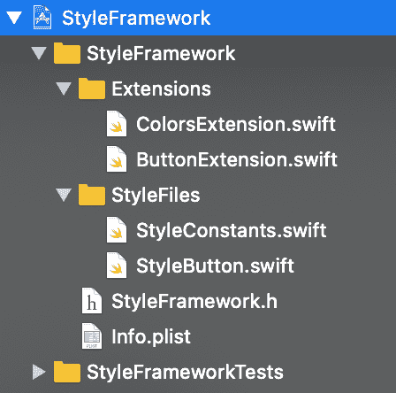

首先，我们要创建颜色:

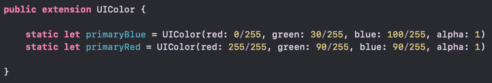

这些颜色在一个扩展上，可以很容易地访问它们，而且它是公共的，因为我们必须从其他框架中访问它们。

因为我们要为项目的按钮创建一个设计，我们必须认为他们将有一个共同的设计:相同的边框半径，边框宽度等。但是我们可以用不同的方式，不同的风格来配置它们。所以，第二步是在*样式常量*文件中创建我们的按钮的常量值。例如:

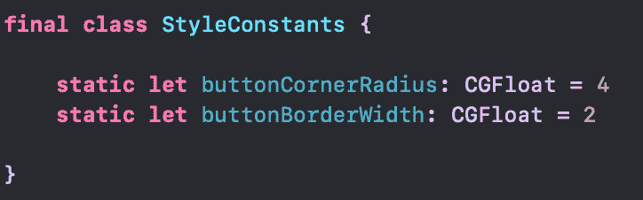

一旦我们有了常量，我们就用它们和我们想要的样式来配置按钮，所以我们用按钮具有的不同样式和根据样式返回属性的方法来创建一个公共枚举:

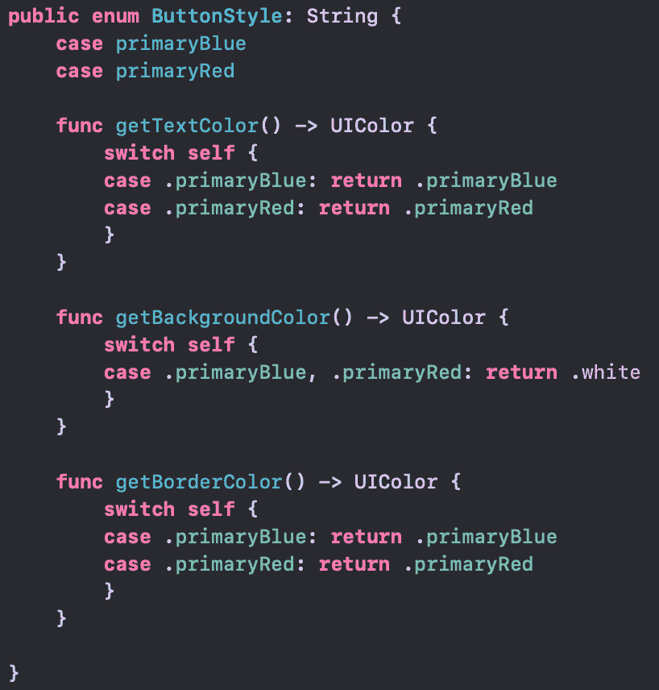

最后，我们使用 enum 创建一个方法来配置我们的按钮，因此我们为按钮创建一个公共扩展来允许在这个框架之外设置它们。我们添加了一个“ *setup* ”方法，在这里我们传递我们想要自动配置按钮的样式。该方法设置按钮的样式属性和其他公共属性，例如:边框、角、按钮是否启用等。

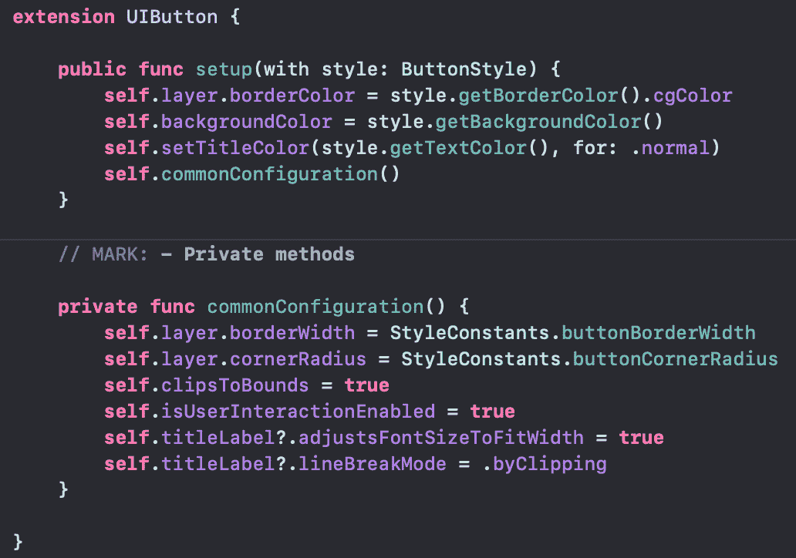

**我们已经准备好使用我们的框架。**

让我们在框架内部创建一个应用程序来使用它，并检查一切是否正确。进入*风格框架*项目，添加一个 App target，命名为*风格 App* 。将*风格框架*添加到 app 中。如有疑问，步骤同 [*在*](https://medium.com/@Juantri/part-2-setting-the-app-in-frameworks-353d07c86f45) 岗位框架中设置 App。打开 *Main.storyboard* 创建两个按钮，设置它们的宽度为 150，高度为 50，嵌入到一个堆栈视图中，并在视图中间居中。视图应该是这样的:

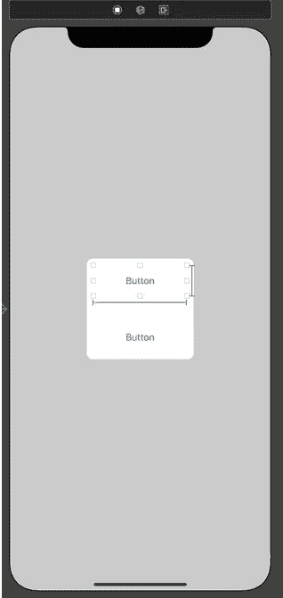

现在在视图控制器中创建按钮的出口。下一步是用我们的样式配置按钮，所以打开 *ViewController.swift* 并导入*样式框架。*在 *viewDidLoad* 方法中，调用我们的 button 方法来配置按钮:

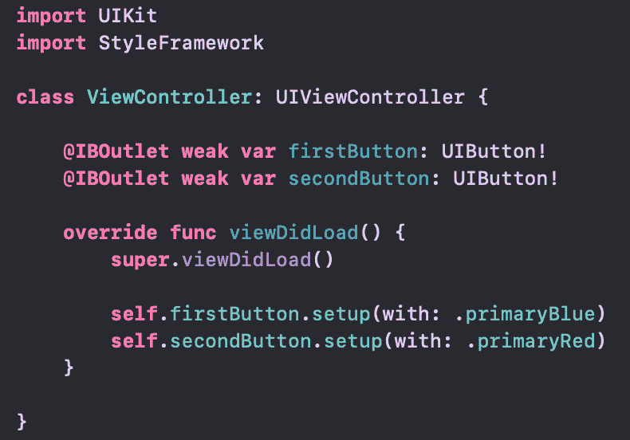

启动应用程序并查看结果:

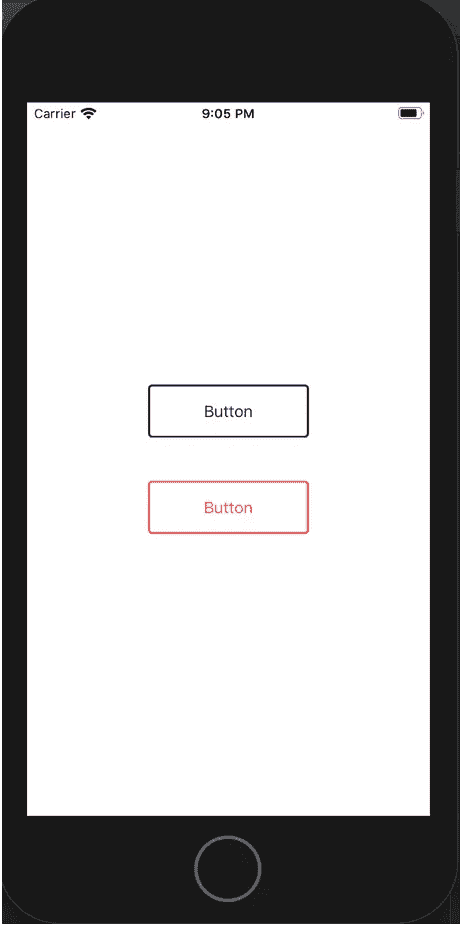

# 有格调的学生

我们已经准备好要使用的框架，所以让我们为*风格框架*创建 podspec 文件，并在*学生框架*中使用它。要创建 podspec，你可以遵循与上一篇文章相同的说明: [*在框架中设置应用*](https://medium.com/@Juantri/part-2-setting-the-app-in-frameworks-353d07c86f45) 。

现在我们有了 podspec 文件，让我们将它作为 pod 添加到*学生框架*中。为此，我们必须在终端的框架文件夹中为运行“ *pod init* ”的框架创建 podfile。现在将 pod 添加到 pod 文件并运行“ *pod 安装*”。安装之后，我们有了工作空间，所以打开它并编译框架方案。现在我们已经准备好使用新的*风格框架*的项目了！

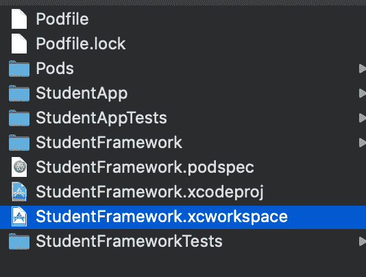

打开*StudentHomeViewController*文件并导入框架，创建细节按钮出口并配置。

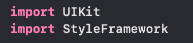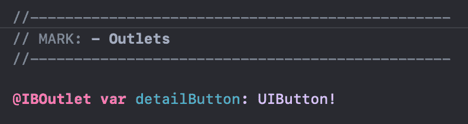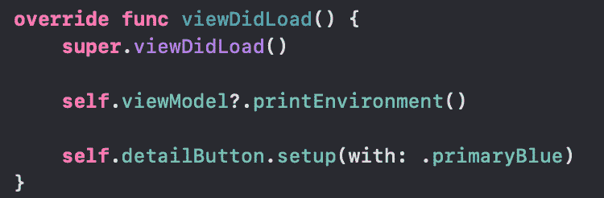

启动*学生应用*并检查按钮样式。

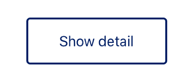

现在是细节:*学生框架*依赖于另一个框架，所以我们必须把它放在 podspec 文件中:

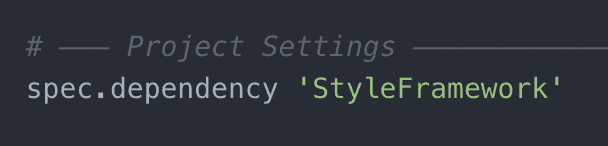

# 有格调的学校

现在，让我们在*学校项目*中做同样的事情。在学校 podfile 中添加样式 pod，并在终端中运行“ *pod install* ”。打开项目并编译它。最后一步是在*学生框架*中做和之前一样的事情:打开 *SchoolHomeViewController* 文件并导入框架，创建学生按钮的出口并配置。运行*学校 App* 。

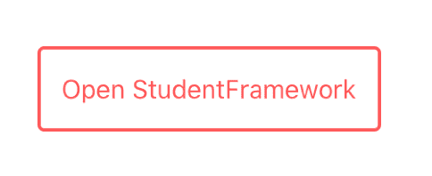

**很好看！**

# 使用外部从属关系

使用一个以上的 pod 是正常的，例如 [*Alamofire*](https://github.com/Alamofire/Alamofire) 用于 API 调用， [*Lottie*](https://github.com/airbnb/lottie-ios) 用于动画等等。我们的应用程序如何成为一个“超级应用程序”，也许我们会有不止一个依赖关系，所以我们将解释我们在外部依赖关系的开发过程中遇到的一些问题。

我们将把 *Alamofire* 和 *Google Maps* 添加到我们的项目(学生和学校项目)中，第一个添加到这两个项目中，而 *Google Maps* 仅用于*学生框架*。

让我们打开*学生框架*并在 podfile 中添加 *Alamofire* pod。运行“ *pod install* ”并编译项目。现在我们可以导入 *Alamofire* 并在*学生框架*中使用。让我们为它创建一个示例:

我们使用了一个公共的 [API](https://alexwohlbruck.github.io/cat-facts/) 来做测试。我们在 *StudentHomeViewModel* 中导入 Alamofire 并添加这个例子，现在我们从 *didLoadView* 系统方法中的*StudentHomeViewController*调用它，所以如果我们启动*学生应用*我们可以看到结果:

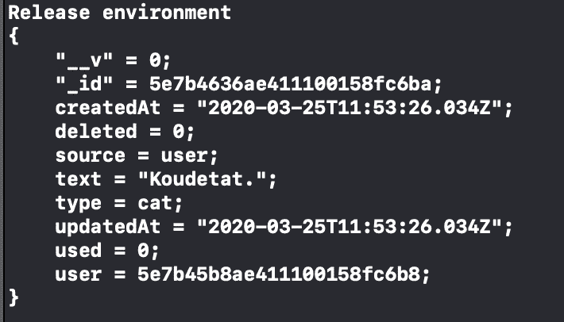

记得在学生 podspec 中添加 *Alamofire* 依赖项。去学校项目做同样的事情，在*学校项目*的 pod 文件中添加 *Alamofire* 依赖项，运行 *pod install* 。编译项目并在*学校 App* 中添加相同的 *Alamofire* 函数示例，以检查我们是否可以使用项目内的 pod 并启动 App。

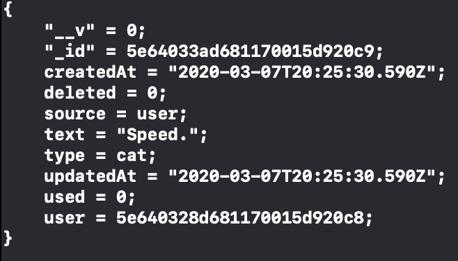

干得好！

**外部框架的一些问题**

现在我们要谈论一个产生一些问题的 pod:谷歌地图。我们在学生框架 Podfile 中添加 Google Maps pod，并运行学生应用程序。如果我们看到 Xcode 终端，我们会看到很多消息，告诉我们在框架和应用程序中都实现了类，Xcode 告诉你其中一个将被使用，但它是未定义的。

> objc[2423]:gmsindoortilecordsgenerator 类在…/student framework . framework/student framework(0x 10 ff 708 b 8)和…/student app . app/student app(0x 10e 521990)中都实现。将使用两者之一。哪一个未定义。

这个问题会导致你的应用崩溃。例如，对于 Google Maps 框架，应用程序崩溃是因为当在 AppDelegate 文件中初始化框架时，您正在初始化两个类中的一个，所以当您加载地图时，可能您正在加载已初始化的一个或另一个，如果它正在加载未初始化的，应用程序崩溃。

> 这是一个关于椰子的问题，有一些问题:
> 
> [https://github.com/CocoaPods/CocoaPods/issues/7155](https://github.com/CocoaPods/CocoaPods/issues/7155)
> 
> https://github.com/CocoaPods/CocoaPods/issues/7126

所以要解决这个问题我们可以使用下面的变通方法:[https://github . com/cocoa pods/cocoa pods/issues/7126 # issue comment-399395611](https://github.com/CocoaPods/CocoaPods/issues/7126#issuecomment-399395611)

我们必须将" *Pods-SampleApp* "改为"*Pods-studen app*",将" *Pods-SampleLib* "改为"*Pods-studen framework*",并在终端上运行" *pod install* "。这将删除应用程序的重复文件，如果我们运行应用程序，我们就不会再有这个问题了。

记得在*学生框架*的 podspec 文件中添加 *Google Maps* pod 依赖，并用以下代码表明框架是静态的:

spec.static _ 框架=真

否则，您将看到以下错误:“‘Pods-school project’目标具有包含静态链接的二进制文件的可传递依赖项”

> 椰子问题:
> 
> [https://github.com/CocoaPods/CocoaPods/issues/7234](https://github.com/CocoaPods/CocoaPods/issues/7234)

# 下一步是什么？

你可以在 [GitHub](https://github.com/Juantri94/SchoolProjectPart3) 上找到例子的源代码。

我们已经为我们的项目创建了一个新的框架来设置颜色按钮。你可以设置任何你想要的东西，比如文本字段，标签等等。此外，我们为不同的项目重用了相同的框架，这对于重用代码非常有用。

在下一篇文章中，我们将创建一个可重用的视图，我们将在不同的框架中使用它，根据应用程序使用它的时间来看看它是如何工作的。