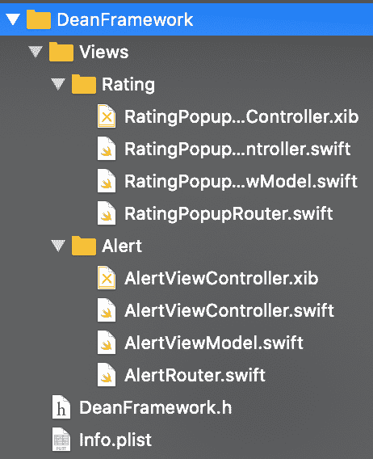

# 第 5 部分:如何减少和重用视图

> 原文：<https://blog.devgenius.io/part-5-how-to-reduce-and-reuse-views-f9d9f3b676e7?source=collection_archive---------11----------------------->

照片由[марьянблан| @ marjanblan](https://unsplash.com/@marjan_blan?utm_source=unsplash&utm_medium=referral&utm_content=creditCopyText)在 [Unsplash](https://unsplash.com/?utm_source=unsplash&utm_medium=referral&utm_content=creditCopyText)

## [从一个 App 到一个超级 App](https://medium.com/@Juantri/from-an-app-to-a-super-app-89ae5084e8eb)

## 减少、回收和再利用

当你开发一个大项目时，你有时会重复代码和视图，因为你没有足够的时间，你更喜欢复制和粘贴。正如我在上一篇文章 [*设置框架中的应用*](https://medium.com/jeff-tech/part-2-setting-the-app-in-frameworks-353d07c86f45) 中告诉你的，我们在 [Jeff](https://wearejeff.com/) 决定将业务模型转移到框架中，将所有业务逻辑集中到一个公共位置。因此，我们注意到我们有许多重复的视图和逻辑，所以我们决定创建一个通用框架。

在这一集的 [*中，我们将讨论如何减少项目的视图数量，以及如何通过不同的方式创建可配置的公共视图，以便在整个项目中重复使用。*](https://medium.com/@Juantri/from-an-app-to-a-super-app-89ae5084e8eb)

我们将继续开发我们的 [*学校项目*](https://github.com/Juantri94/SchoolProjectPart3) ，我们将解释我们如何在 Jeff iOS 团队中管理共同的观点和方法。为了解释这一过程，我们将创建一个新的框架，在其中设置所有通用视图和方法，我们将创建一个通用视图，并在现有的不同框架中管理它。

# 学院院长

第一步，添加我们学校的院长。这将是我们项目的公共场所，在这里我们将有共同的类和视图，所以我们将创建 dean 框架: *DeanFramework* 。为了做到这一点，我们按照我之前的文章 [*的步骤在框架*](https://medium.com/jeff-tech/part-2-setting-the-app-in-frameworks-353d07c86f45) 中设置应用程序，所以让我们开始吧！

根据帖子创建框架，并将其命名为 *DeanFramework* 。不要创建主视图和局部视图，只创建框架。之后，你要创建 DeanApp(也按照帖子的步骤)。当你完成时，你会得到这样的东西:

我们将开发两种常见的视图:警报和评级弹出窗口。在 *DeanFramework* 内部创建一个文件夹并将其命名为`Views`，在其中为警报和评级弹出窗口创建另外两个文件夹并将其命名为`Alert`和`Rating`。在每个文件夹中，我们必须创建我们的视图，所以创建视图控制器，视图模型，路由器和视图，就像我在上一篇文章中解释的那样。你会得到这样的东西:

# 创建通用视图:警报

我们从警报开始。第一件事是思考警报做什么，以及如何传达它。我们创建一个协议来允许警报和实现它的视图之间的通信:

> 请记住，协议和视图必须是公共的，以便在框架之外访问它们

由于警报是可配置的，标签和按钮的文本将作为参数传递给构造函数来配置视图。我们的警报视图的代码如下:

 [## Juan tri 94/学校项目第 4 部分

### 帖子第四部分:从一个 App 到超级 App https://medium . com/@ Juan tri/From-an-App-to-a-super-App-89ae 5084 e8eb…

github.com](https://github.com/Juantri94/SchoolProjectPart4/tree/master/DeanFramework/DeanFramework/Views/Alert) 

现在是时候检查警报是否正常工作了，所以打开 DeanApp，在`Main.storyboard`上添加一个按钮来打开它。我创建了两个按钮:一个用一个按钮打开警报，另一个用一个长体两个按钮打开警报。

当我们单击警报的任何按钮时，动作由代理(主视图的视图控制器)完成。如果我们添加一个打印函数，我们会得到以下结果:

警报正在工作，所以是时候在我们的学校项目中使用它了！

## 使用警报

现在我们必须创建 podspec，正如我在上一篇文章 [*中告诉你的那样，在框架*](https://medium.com/jeff-tech/part-2-setting-the-app-in-frameworks-353d07c86f45) 中设置应用程序。按照步骤将框架作为 pod 添加到 SchoolProject 中。打开`School Home`并添加一个按钮来打开警报。

# 创建可重复使用的视图:评级弹出窗口

让我们创建一些更复杂的东西。假设你想对学校和学生进行评级，这是一个常见的操作，但可能每个评级都有不同的逻辑，例如，当你对学校进行评级时，你必须发送一些关于学校的具体数据，但当你对学生进行评级时，你必须只发送学生分数。我们将开发一个可重用的视图，可以根据情况做不同的动作。

回到我们的 *DeanFramework* 并打开评级视图。我们将创建一个带有标题、描述、选项列表和两个按钮(发送和关闭)的评级视图。和以前一样，我们必须为视图创建协议。该协议必须具有视图的两个主要操作:rate 和 close(两个按钮操作)，因此实现它的类将具有与评级过程相关联的逻辑。

我们评级弹出窗口的代码:

 [## Juan tri 94/学校项目第 4 部分

### 帖子第四部分:从一个 App 到超级 App https://medium . com/@ Juan tri/From-an-App-to-a-super-App-89ae 5084 e8eb…

github.com](https://github.com/Juantri94/SchoolProjectPart4/tree/master/DeanFramework/DeanFramework/Views/Rating) 

一旦我们有了视图，我们需要一个实现评级弹出协议的类，所以转到 *DeanApp* 创建一个名为`RatingExample` *的新文件。* Make 类实现了协议并添加了评级的逻辑，例如:

打开`main.storyboard`并添加一个打开弹出窗口的按钮:

启动示例应用程序，选择一个选项，写下评论并发送评级:

太好了！你拿到了！

## 给学校和学生评级

是时候深入了解并在主项目中使用我们的评级弹出窗口了。先说学生框架。打开学生项目并在 podfile 中添加 Dean 依赖项(记住也要在 podspec 中添加)。我们需要一个类来实现分级弹出窗口的协议，所以我们将创建一个名为`StudentRating`的类，并使它成为协议的代表。你可以在框架的根文件夹中创建一个名为`Domain`的文件夹。在该类中添加以下代码:

现在打开学生详细信息视图，并添加一个按钮来打开评级弹出窗口。在视图模型中，您必须为评级弹出窗口创建代理，并将其作为参数传递给路由器，以便初始化视图。像以前一样，启动示例应用程序，选择一个选项，写下评论并发送评级:

**更进一步！让我们给学校评级吧！**

我们必须做与*学生项目相同的事情。*我们必须执行与之前相同的步骤:在 podfile 中添加 pod，并创建一个实现分级协议的类。我在一个名为`Domain`的新文件夹中创建了一个名为`SchoolRating`的类。让我们实现 *StudentFramework* 中的协议:

如前所述，我们必须在学校主页视图中创建一个按钮，初始化代理，并将其作为参数传递给路由器，以便初始化视图。启动 app，给学校打分！

# 更多选项

有很多方法可以正视重用和减少视图的问题:

*   始终具有相同逻辑的通用视图:预警示例。
*   具有不同逻辑的共同视图:评级弹出示例。
*   公共视图元素，例如地图:您可以使用地图的逻辑创建视图。另一个例子是横幅:由图标、标题和正文组成的视图，您可以创建一个视图并在 init 方法中传递数据。
*   不同视图中的公共逻辑:一种选择是创建一个包含所有逻辑的基础视图模型，视图的视图模型继承它。

# 结论

你可以在  [GitHub](https://github.com/Juantri94/SchoolProjectPart4) 上找到例子的源代码。

在这篇教程中，我试图解释我在开发过程中发现的最困难的复用视图选项。主要想法是创建一个核心或共同点，我们可以将所有这些视图或逻辑放在一起并重用它们。例如，我们可以添加一些我们将在整个项目中使用的公共文件，比如验证器、扩展等。

作为一个细节，我们可以把风格框架，在之前的[帖子](https://medium.com/@Juantri/part-4-how-to-manage-dependencies-in-an-app-with-frameworks-a59119e7d34f)中解释过，放在 *DeanFramework* 中，在普通视图中有风格。同样，我们可以根据 *StudentFramework* 或 *SchoolProject 对它们进行不同的配置。*

下一篇文章将是从应用程序到超级应用程序的传奇[的最后一篇，我将分享一个模板来简化新视图的创建。](https://medium.com/@Juantri/from-an-app-to-a-super-app-89ae5084e8eb)