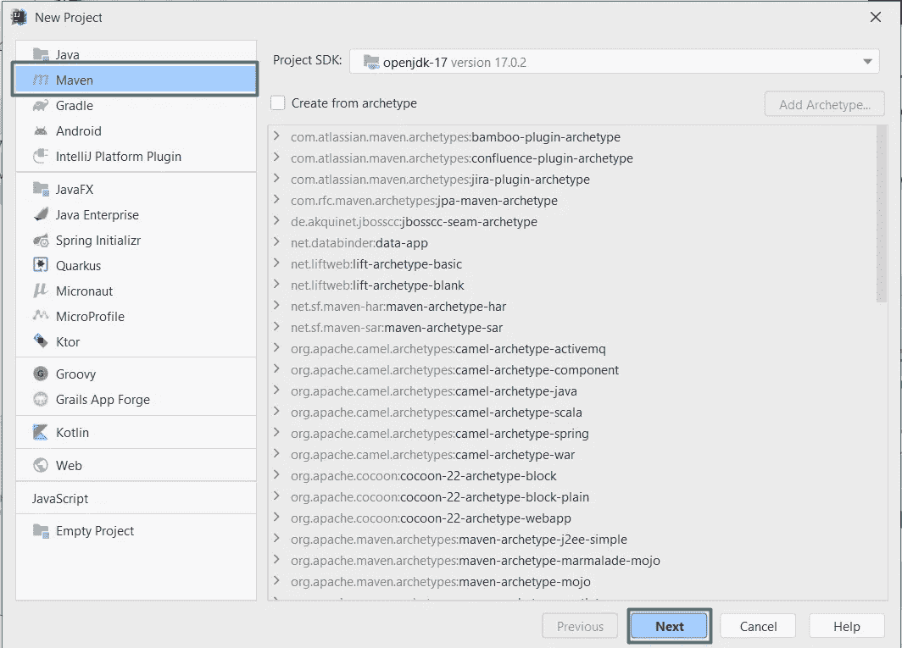
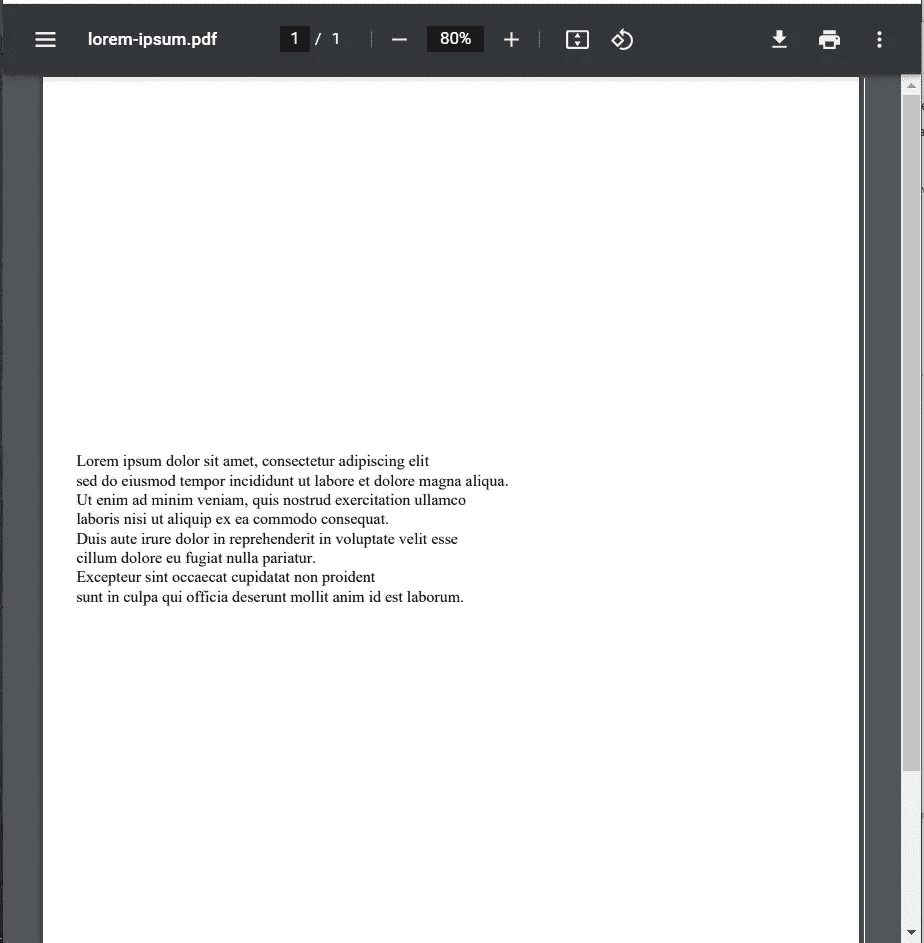
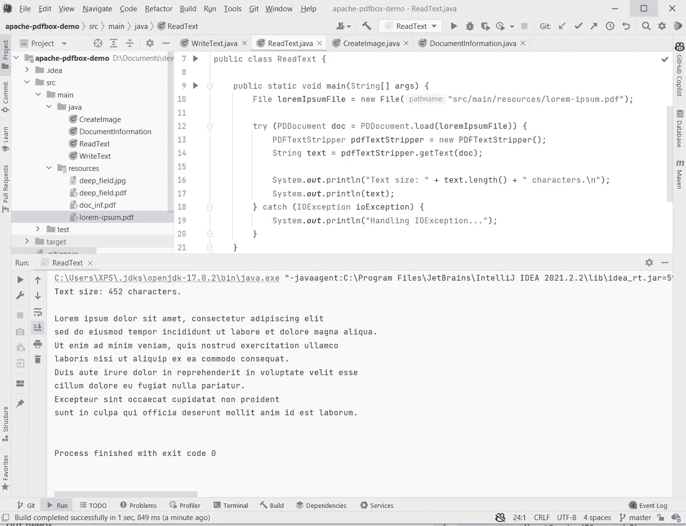
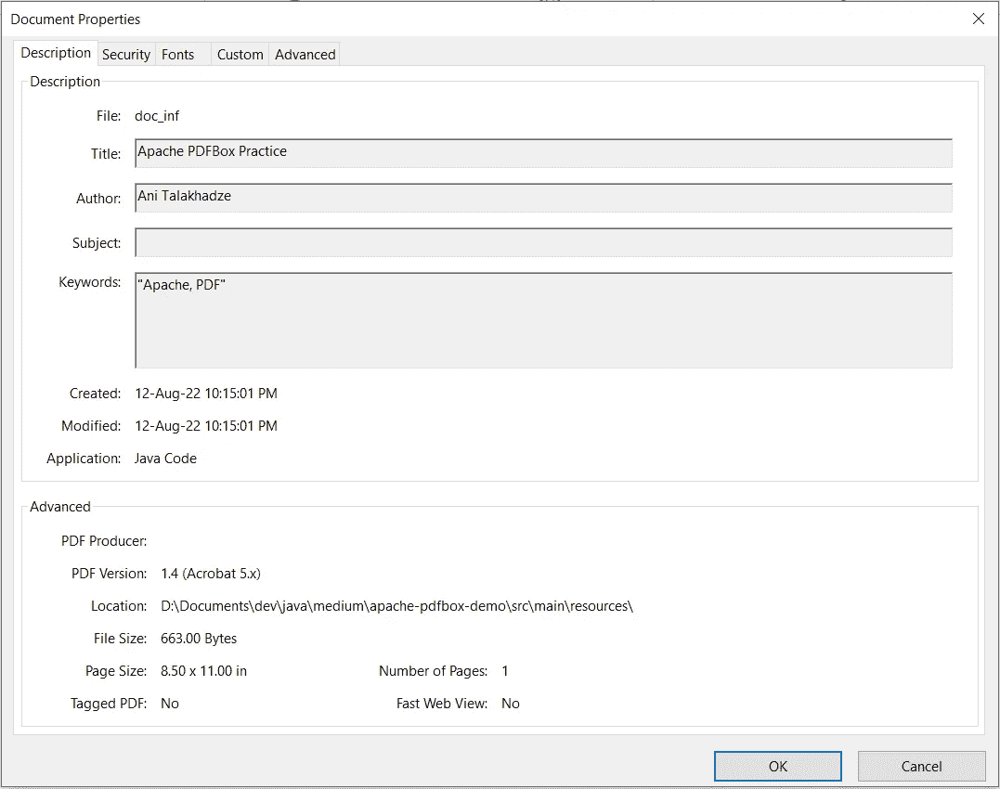

# 第 5 部分—如何:使用 Apache PDFBox 处理 PDF 文件

> 原文：<https://blog.devgenius.io/part-5-how-to-work-with-pdf-files-with-apache-pdfbox-19bab285f5b6?source=collection_archive---------6----------------------->

谁不喜欢应用经过深思熟虑的解决方案呢？我们中的任何一个人都想写出令自己骄傲的漂亮代码。然而，企业的基本和常见任务并不总是有完美的答案。任何处理过 PDF 文件的人肯定都会同意我的观点。

幸运的是，Apache PDFBox，一个不错的 Apache 库，在这种情况下可以对我们有所帮助。在今天的教程中，我将演示如何使用这个库在 Java 中创建和读取 PDF 文件，这样您就可以决定这种兴奋是否公平。

到 ***源代码库*** 的链接将在本教程的末尾添加。

## 设置项目

在您喜欢的 IDE 中创建一个基本的 Java 项目来开始。对于本教程，我将管理我与 Maven 的依赖关系，但 Gradle 也是一个选项。



设置 Maven 项目

并将`**Apache PDFBox**`依赖项添加到`**pom.xml**`文件中:

```
<?xml version="1.0" encoding="UTF-8"?>
<project 
         xmlns:xsi="http://www.w3.org/2001/XMLSchema-instance"
         xsi:schemaLocation="http://maven.apache.org/POM/4.0.0 http://maven.apache.org/xsd/maven-4.0.0.xsd">
    <modelVersion>4.0.0</modelVersion>

    <groupId>org.example</groupId>
    <artifactId>apache-pdfbox-demo</artifactId>
    <version>1.0-SNAPSHOT</version>

    <properties>
        <maven.compiler.source>17</maven.compiler.source>
        <maven.compiler.target>17</maven.compiler.target>
    </properties>

    <dependencies>
 **<dependency>
            <groupId>org.apache.pdfbox</groupId>
            <artifactId>pdfbox</artifactId>
            <version>2.0.26</version>
        </dependency>**
    </dependencies>

</project>
```

## 文本到 PDF 的写作示例

我将首先演示如何制作一个 PDF 文件，并向其中添加一些文本。从这一点开始，import 语句是隐含的，但不包含在代码片段中。

应该先创建一个新的`**PDDocument**`，然后在文档中添加一个新页面。`**PDPageContentStream**`可以将文本写入 PDF 页面。在`**beginText()**`和`**endText()**`方法之间，每一行文本都将被写入页面。

```
public class WriteText {

    public static void main(String[] args) {
        try (PDDocument doc = new PDDocument()) {
            PDPage pdPage = new PDPage();
            doc.addPage(pdPage);

            try (PDPageContentStream contentStream = new PDPageContentStream(doc, pdPage)) {
                contentStream.beginText();

                contentStream.setFont(PDType1Font.***TIMES_ROMAN***, 12);
                contentStream.setLeading(14.5f);
                contentStream.newLineAtOffset(25, 500);

                for (String line : getPdfContentLines()) {
                    contentStream.showText(line);
                    contentStream.newLine();
                }

                contentStream.endText();
            }

            doc.save("src/main/resources/lorem-ipsum.pdf");
        } catch (IOException ioException) {
            System.***out***.println("Handling IOException...");
        }
    }

    static List<String> getPdfContentLines() {
        return Arrays.asList(
                "Lorem ipsum dolor sit amet, consectetur adipiscing elit",
                "sed do eiusmod tempor incididunt ut labore et dolore magna aliqua.",
                "Ut enim ad minim veniam, quis nostrud exercitation ullamco",
                "laboris nisi ut aliquip ex ea commodo consequat.",
                "Duis aute irure dolor in reprehenderit in voluptate velit esse",
                "cillum dolore eu fugiat nulla pariatur.",
                "Excepteur sint occaecat cupidatat non proident",
                "sunt in culpa qui officia deserunt mollit anim id est laborum."
        );
    }

}
```

当您运行这个简单的程序时，它创建的 PDF 将立即出现在 resources 文件夹中:



编写程序执行结果文本

## PDF 转文本阅读示例

除了创建 PDF 文件，我们还可以根据自己的需要进行读取和处理。

```
public class ReadText {

    public static void main(String[] args) {
        File loremIpsumFile = new File("src/main/resources/lorem-ipsum.pdf");

        try (PDDocument doc = PDDocument.load(loremIpsumFile)) {
            PDFTextStripper pdfTextStripper = new PDFTextStripper();
            String text = pdfTextStripper.getText(doc);

            System.***out***.println("Text size: " + text.length() + " characters.\n");
            System.***out***.println(text);
        } catch (IOException ioException) {
            System.***out***.println("Handling IOException...");
        }
    }

}
```

这里，我们加载了在第一部分创建的 PDF 文档，记录了文本的大小，并通过`**PDFTextStripper**`提取了它的内容。

程序执行后显示以下结果:



ReadText 程序执行结果

## 图像转 PDF 示例

现在，我们将尝试在 PDF 文档中创建一个图像:

```
public class CreateImage {

    public static void main(String[] args) {
        try (PDDocument doc = new PDDocument()) {
            PDPage pdPage = new PDPage();
            doc.addPage(pdPage);

            String imgFileName = "src/main/resources/deep_field.jpg";
            PDImageXObject pdImage = PDImageXObject.createFromFile(imgFileName, doc);

            int iw = pdImage.getWidth();
            int ih = pdImage.getHeight();
            float offset = 20f;

            try (PDPageContentStream contentStream = new PDPageContentStream(doc, pdPage)){
                contentStream.drawImage(pdImage, offset, offset, iw, ih);
            }

            doc.save("src/main/resources/deep_field.pdf");
        } catch (IOException ioException) {
            System.***out***.println("Handling IOException...");
        }
    }

}
```

在本例中，我们从一个目录中加载了一个图像，创建了一个新的 PDF 文档，并将该图像添加到页面中。然后我们得到图像的宽度和高度，用`**PDPageContentStream**`的`**drawImage()**`绘制到页面中。

成功执行该程序将会得到类似的结果:


创建图像程序执行结果

## 检索文档信息

文档的作者和创建日期只是 PDF 文档可能提供的信息的两个例子。使用`**PDDocumentInformation**`对象，可以设置和检索数据:

```
public class DocumentInformation {

    public static void main(String[] args) {
        try (PDDocument doc = new PDDocument()) {
            PDPage pdPage = new PDPage();
            doc.addPage(pdPage);

            PDDocumentInformation pdi = doc.getDocumentInformation();

            pdi.setAuthor("Ani Talakhadze");
            pdi.setTitle("Apache PDFBox Practice");
            pdi.setCreator("Java Code");

            Calendar date = Calendar.getInstance();
            pdi.setCreationDate(date);
            pdi.setModificationDate(date);

            pdi.setKeywords("Apache, PDF");

            doc.save("src/main/resources/doc_inf.pdf");
        } catch (IOException ioException) {
            System.***out***.println("Handling IOException...");
        }
    }

}
```

该示例创建了一些文档信息元数据。可以在 PDF 查看器的 PDF 文档属性中看到这些信息。



文档属性

在这个简短的教程中，我们演示了 Apache PDFBox 库使用的简单案例。如果有兴趣，你可以访问 [***官方文档***](https://pdfbox.apache.org/) 并探索其功能。

如果你错过了什么，所有代码都可以在我的 [***GitHub 资源库***](https://github.com/anitalakhadze/apache-pdfbox-demo) 上找到。

如果您对本系列即将推出的博客有任何问题、评论或建议，请告诉我。

**敬请关注，不要错过以下教程！**