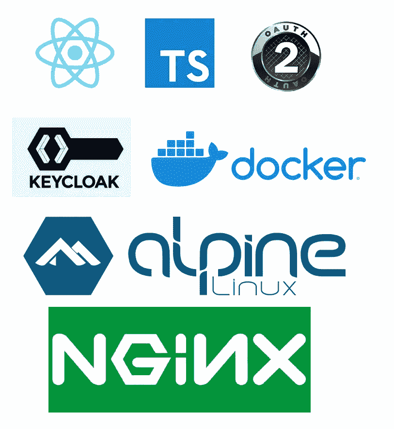
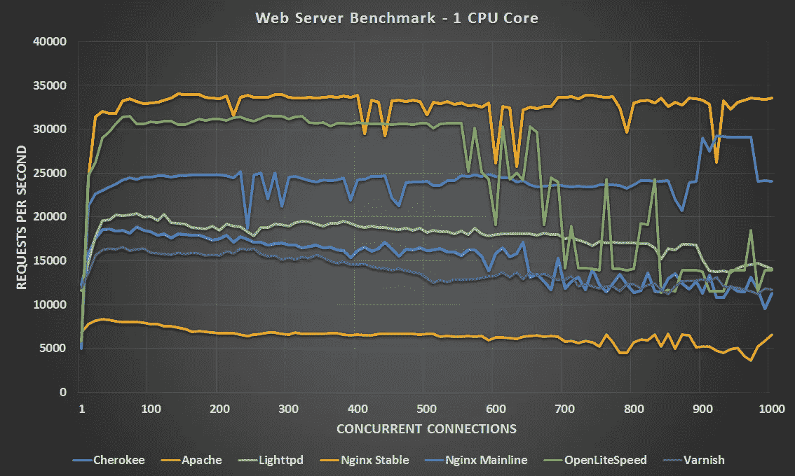
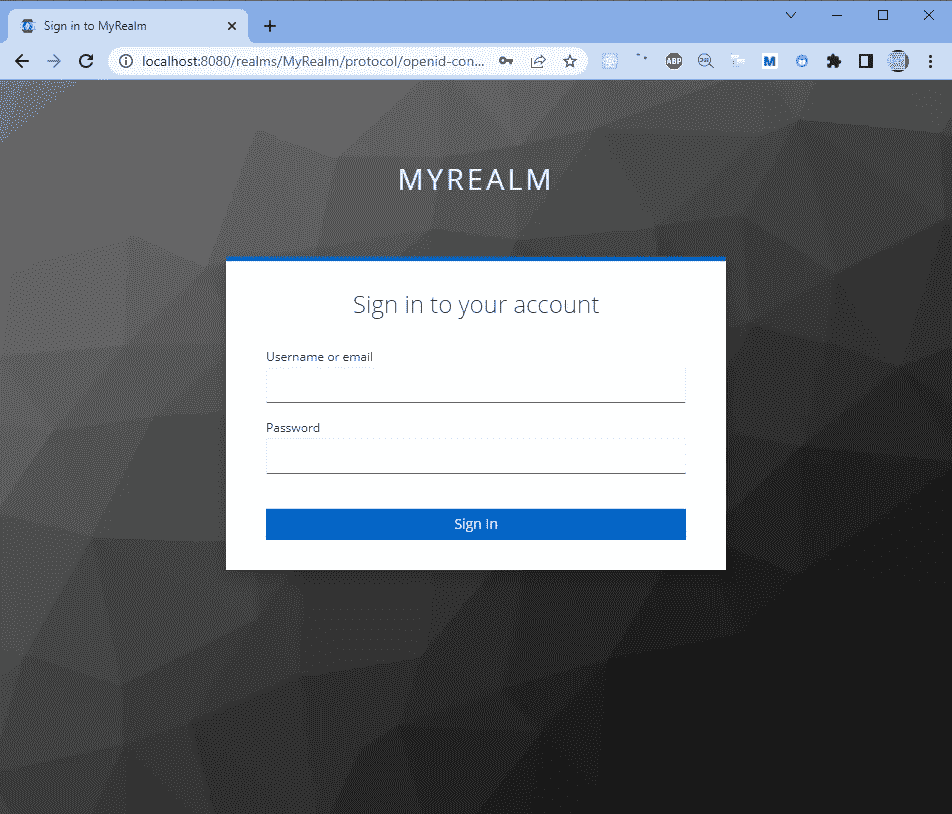
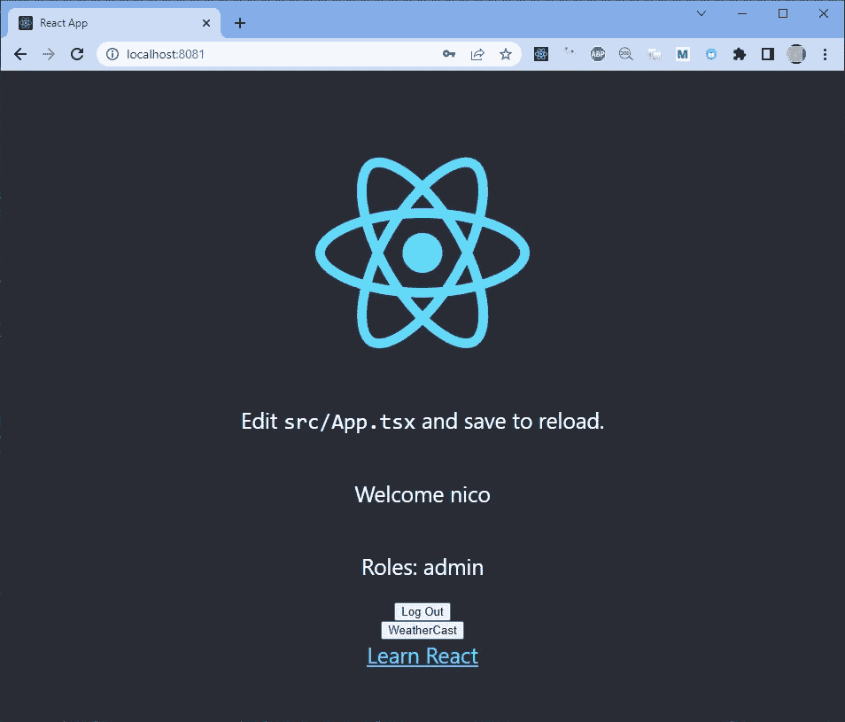

# 第二部分:Dockerizing for production 在 Windows 10 上使用 WSL2 Alpine Linux，使用 NGINX 开发一个 TypeScript React 应用程序

> 原文：<https://blog.devgenius.io/part-two-dockerizing-for-production-a-typescript-react-app-with-nginx-with-wsl2-alpine-linux-on-85660be3956?source=collection_archive---------2----------------------->

1.0 版本
日期 2022/11/27
作者 Nicolas Barlatier



大家好，我希望你们一切都好。在我们现在生活的艰难时期，你是安全的。

# 介绍

今天，我将向您展示如何为生产构建**React 应用程序容器。**

再读最后一句，是关于**造一个生产就绪的容器**。
它不是关于构建一个生产就绪的 react 应用程序，其中我们使用了前端 web 应用程序的最佳实践和安全性。

我将在以后写一篇文章，介绍使用 React 制作生产就绪的前端 web 应用程序的最佳实践。

在上一篇文章中，我展示了如何在开发机器上构建和运行与本地 React 应用程序代码库同步的容器。

如果你想看，就在下面:

[第一部分在 Windows 10 上用 NodeJS 与 NGINX 对接 TypeScript React 应用程序与 wsl 2 Alpine Linux](https://medium.com/@barlatiernicolas/dockerizing-the-typescript-react-app-with-nodejs-vs-nginx-with-wsl2-alpine-linux-on-windows-10-8dddd447f43a)

React 应用程序由 JWT 和 Keycloak 保护。

你可以分四部分阅读这篇文章:

[第一部分:用 Docker 和 Administration 安装 key cloak](https://medium.com/p/1d076777a979)

[第二部分:保护前端 React 应用](https://medium.com/@barlatiernicolas/security-in-react-and-webapi-in-asp-net-core-c-with-authentification-and-authorization-by-keycloak-89ba14be7e5a)

[第三部分:保护 ASP.NET 核心 C# REST Web](https://medium.com/@barlatiernicolas/security-in-react-and-webapi-in-asp-net-core-c-with-authentification-and-authorization-by-keycloak-f890d340d093)

[第四部分:使用访问 JWT 令牌载体授权从 React SPA 调用受保护的 Web API](https://medium.com/@barlatiernicolas/part-four-security-in-react-and-webapi-in-asp-net-b6dffd3b7624)

我们的项目可以在 GitHub 的子目录[reactwebapikeycoap](https://github.com/nicoclau/reactwebapiaspnetcorekeycloak/tree/main/reactwebapikeycloak)中找到

[](https://github.com/nicoclau/reactwebapiaspnetcorekeycloak) [## GitHub-nicoclau/reactwebapiaspnetcorekeycloak:React 和 REST 受 keycloak 保护的 Web API 与…

### React 和 REST Web API 受 Keycloak 保护，带授权码流和 JWT 令牌- GitHub …

github.com](https://github.com/nicoclau/reactwebapiaspnetcorekeycloak) 

# 为什么我们在 Docker 容器中使用 NGINX 来托管生产中的 React 应用程序？

在行动之前，我们需要了解我们的选择。为什么我们要使用 **NGINX** 来托管我们为生产而构建的 React 应用程序？为什么呢？

React 是一个开源的前端 JavaScript 库，它最终构建了静态资产。所以我们需要一个服务器来服务他们。

我们将看到为什么 NGINX 发音的 Engine-X 如此受欢迎，并且几乎总是在生产中部署一个 React 应用程序时使用。

当我仔细思考这个问题时，我认为可用的主要解决方案有:

*   NGINX
*   表达
*   [发球](https://github.com/vercel/serve)由维尔塞尔发球

此外， [**Create React App**](https://create-react-app.dev/) 的官方网站上关于如何在生产上部署我们的 React 应用程序的链接建议使用像 Serve 或 use Express 这样的静态服务器。

[](https://create-react-app.dev/docs/deployment/) [## 部署|创建 React 应用

### npm 运行构建创建一个包含应用程序生产版本的构建目录。设置您最喜欢的 HTTP 服务器，以便…

创建-反应-应用程序.开发](https://create-react-app.dev/docs/deployment/) 

但老实说，当它要在产品上使用我们的 React 应用程序时，我们需要的不仅仅是交付静态内容的更多功能，如认证、授权、负载平衡，

此外，它是最快的，低于基准测试，表明对于一台资源较少的服务器，Nginx 每秒处理的请求要多得多:



它使用更少的内存:


同样，让我们比较 NGINX 的使用和其他技术

 [## 瓦帕里斯

### 编辑描述

www.wappalyzer.com](https://www.wappalyzer.com/compare/nginx-vs-express)  [## 瓦帕里斯

### 编辑描述

www.wappalyzer.com](https://www.wappalyzer.com/compare/nginx-vs-varnish/)  [## 瓦帕里斯

### 编辑描述

www.wappalyzer.com](https://www.wappalyzer.com/compare/nginx-vs-lightspeed-ecom/) 

我们马上就能看到 NGINX 比其他的使用得更频繁。

所以现在我们确信并理解了为什么要用 NGINX 来部署 React。

我们将使用 Docker 做两件事:

*   构建我们的生产反应应用程序
*   在 Nginx 容器中托管我们的 production react 应用程序

**生产反应应用的 Docker 文件:**

它将分为两个部分:

*   建筑物
*   主办；主持

我们将调用 docker 文件:dockerfileprod，并将内容:

```
# building

FROM node:19-alpine3.15 AS builder
ENV NODE_ENV production
# Add a work directory
WORKDIR /app
# Cache and Install dependencies
COPY package.json .
COPY package-lock.json .
RUN npm install --production
# Copy app files
COPY . .
# Build the app
RUN npm run build

# hosting

# Bundle static assets with nginx
FROM nginx:1.23-alpine as production
ENV NODE_ENV production
# Copy built assets from builder
COPY --from=builder /app/build /usr/share/nginx/html
# Add your nginx.conf
COPY nginx.conf /etc/nginx/conf.d/default.conf
# Expose port
EXPOSE 80
# Start nginx
CMD ["nginx", "-g", "daemon off;"]
```

注意:我使用 npm，但是你可以更新 docker 文件来使用 yarn。

我们使用 alpine 发行版的 node sdk 来构建我们的 production react 应用程序。

然后我们在 alpine 发行版中使用 nginx，尽可能做到最轻。
我们将 production react 应用程序复制到 nginx 使用的目录中。
我们将现在要创建的配置文件 nginx.conf 复制到 nginx 使用的目录中。

最后，我们给出了用 docker 运行应用程序映像时 docker 容器使用的命令。

让我们添加 nginx.conf 文件:

```
server {
  listen 80;

  location / {
    root /usr/share/nginx/html/;
    include /etc/nginx/mime.types;
    try_files $uri $uri/ /index.html;
  }
}
```

非常简单，只有最后一行是 interresting，它说当 url 与任何资源都不匹配时，我们转到 root /index.html。它将由 react 路由器处理:)

让我们看看我们的项目目录结构。

```
λ tree /f
Folder PATH listing for volume OS
Volume serial number is C0000100 8021:2C9C
C:.
│   .dockerignore
│   .gitignore
│   Dockerfile
│   dockerfileprod
│   nginx.conf
│   package-lock.json
│   package.json
│   README.md
│   tsconfig.json
│
├───public
│       favicon.ico
│       index.html
│       keycloak.json
│       logo192.png
│       logo512.png
│       manifest.json
│       robots.txt
│
└───src
    │   App.css
    │   App.test.tsx
    │   App.tsx
    │   index.css
    │   index.tsx
    │   logo.svg
    │   react-app-env.d.ts
    │   reportWebVitals.ts
    │   setupTests.ts
    │
    ├───security
    │       KeyCloakService.tsx
    │
    └───services
            HttpServices.ts
```

现在让我们构建我们的容器映像，安装所有的依赖项需要一些时间。

```
C:\Tutorial\keycloak\reactwebapikeycloak\reactonlywithkeycloak\myapp (main -> origin)
λ docker build -f dockerfileprod -t myreactnginx:1 .
[+] Building 115.4s (16/16) FINISHED
 => [internal] load build definition from dockerfileprod                                                                                                                                                                                 0.1s  => => transferring dockerfile: 36B                                                                                                                                                                                                      0.0s  => [internal] load .dockerignore                                                                                                                                                                                                        0.1s  => => transferring context: 35B                                                                                                                                                                                                         0.0s  => [internal] load metadata for docker.io/library/nginx:1.23-alpine                                                                                                                                                                     0.7s  => [internal] load metadata for docker.io/library/node:19-alpine3.15                                                                                                                                                                    0.9s  => [builder 1/7] FROM docker.io/library/node:19-alpine3.15@sha256:8d87f28bd6f8a6c717e0be1defc297b22672b79820c83a7087a80548fa13d2b4                                                                                                      0.0s  => [internal] load build context                                                                                                                                                                                                        0.1s  => => transferring context: 965B                                                                                                                                                                                                        0.0s  => CACHED [production 1/3] FROM docker.io/library/nginx:1.23-alpine@sha256:455c39afebd4d98ef26dd70284aa86e6810b0485af5f4f222b19b89758cabf1e                                                                                             0.0s  => CACHED [builder 2/7] WORKDIR /app                                                                                                                                                                                                    0.0s  => [builder 3/7] COPY package.json .                                                                                                                                                                                                    0.2s  => [builder 4/7] COPY package-lock.json .                                                                                                                                                                                               0.3s  => [builder 5/7] RUN npm install --production                                                                                                                                                                                          92.8s  => [builder 6/7] COPY . .                                                                                                                                                                                                               0.1s  => [builder 7/7] RUN npm run build                                                                                                                                                                                                     19.9s  => [production 2/3] COPY --from=builder /app/build /usr/share/nginx/html                                                                                                                                                                0.1s  => [production 3/3] COPY nginx.conf /etc/nginx/conf.d/default.conf                                                                                                                                                                      0.1s  => exporting to image                                                                                                                                                                                                                   0.2s  => => exporting layers                                                                                                                                                                                                                  0.2s  => => writing image sha256:6e6ceb15aa23c2d92a540a1493494ed2129c56ad0701c6fa889c09a7881d660b                                                                                                                                             0.0s  => => naming to docker.io/library/myreactnginx:1                                                                                                                                                                                        0.0s
.....
Use 'docker scan' to run Snyk tests against images to find vulnerabilities and learn how to fix them
```

第一次花了 2 分钟，但下一次我们在缓存层的帮助下只需要 20 秒。

让我们检查一下我们的容器图像:

```
λ docker images
REPOSITORY    TAG               IMAGE ID       CREATED          SIZE
myreactnginx  1                 6e6ceb15aa23   6 minutes ago    24.4MB
```

只有 24 Mb:)

现在，我们已经准备好运行托管在 Nginx 容器中的 production react 应用程序。

要阅读关于如何运行 nginx 容器的文档，请访问:

[](https://docs.nginx.com/nginx/admin-guide/installing-nginx/installing-nginx-docker/) [## 在 Docker 上部署 NGINX 和 NGINX Plus

### 将 NGINX 和 NGINX Plus 部署为 Docker 容器。NGINX Plus，高性能应用交付平台…

docs.nginx.com](https://docs.nginx.com/nginx/admin-guide/installing-nginx/installing-nginx-docker/) 

主要命令是:

```
docker run --name mynginx1 -p 80:80 -d nginx
```

在我们的例子中，我们不使用端口 80，我们将使用端口 8081，我们的容器映像名是:myreactnginx:1

所以我们做到了:

```
docker run --name myreactnginx -p 8081:80 -d myreactnginx:1
```

我们得到:

```
 C:\Tutorial\keycloak\reactwebapikeycloak\reactonlywithkeycloak\myapp (main -> origin)
λ docker run --name myreactnginx -p 8081:80 -d myreactnginx:1
9339c4b1b50498861c4401b27b7c78cd97879e8ebc0874b950b920e7fddefb8b
```

让我们检查一下我们的运行容器:

```
C:\Tutorial\keycloak\reactwebapikeycloak\reactonlywithkeycloak\myapp (main -> origin)
λ docker ps
CONTAINER ID   IMAGE            COMMAND                  CREATED          STATUS          PORTS                  NAMES
9339c4b1b504   myreactnginx:1   "/docker-entrypoint.…"   33 seconds ago   Up 32 seconds   0.0.0.0:8081->80/tcp   myreactnginx
```

我们看到可以在端口 8081 上调用我们的应用程序，我们得到:



请确保 keycloak 在端口 8080 上与 docker 一起运行:

```
C:\Tutorial\keycloak\reactwebapikeycloak\reactonlywithkeycloak\myapp (main -> origin)
λ docker ps
CONTAINER ID   IMAGE                              COMMAND                  CREATED          STATUS          PORTS                              NAMES
e6cf7557d52e   quay.io/keycloak/keycloak:18.0.0   "/opt/keycloak/bin/k…"   8 minutes ago    Up 8 minutes    0.0.0.0:8080->8080/tcp, 8443/tcp   trusting_burnell
9339c4b1b504   myreactnginx:1                     "/docker-entrypoint.…"   11 minutes ago   Up 11 minutes   0.0.0.0:8081->80/tcp               myreactnginx
```

如果您需要关于 keycloak 和 react 的帮助，可以通过阅读我的文章的前两部分来找到:

[](https://systemweakness.com/security-in-react-and-webapi-in-asp-net-core-c-with-authentification-and-authorization-by-keycloak-1d076777a979) [## 第一部分:React 中的 Keycloak 和 ASP 中的 Web Api 的安全性。网

### 第一部分:用 Docker 和 Administration 安装 Keycloak

systemweakness.com](https://systemweakness.com/security-in-react-and-webapi-in-asp-net-core-c-with-authentification-and-authorization-by-keycloak-1d076777a979) [](/security-in-react-and-webapi-in-asp-net-core-c-with-authentification-and-authorization-by-keycloak-89ba14be7e5a) [## ASP.NET 核心 C#中 React 和 WebApi 的安全性，通过 KeyCloak 进行身份验证和授权

### 第二部分:确保前端 React 应用程序 1.0 版本的安全

blog.devgenius.io](/security-in-react-and-webapi-in-asp-net-core-c-with-authentification-and-authorization-by-keycloak-89ba14be7e5a) 

登录后，我们会看到:



# 结论

恭喜您，现在您已经知道如何通过在您的定制容器映像中托管非常强大的 nginx 来构建 react 应用程序以用于生产了！

如果你需要帮助，或者有任何问题，请问我。如果你喜欢我的文章，你可以关注我并给我一些掌声:)