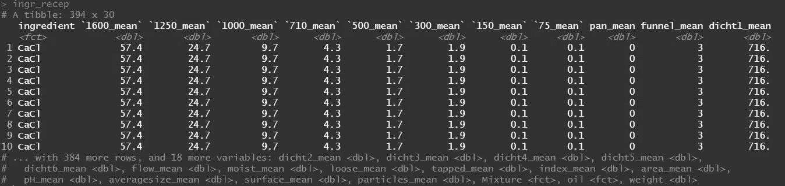

# R 中的偏最小二乘法——通过 Plumber 和 Docker 向托管 API 扩展

> 原文：<https://blog.devgenius.io/partial-least-squares-in-r-extending-towards-a-hosted-api-via-plumber-and-docker-7c445b9fa382?source=collection_archive---------4----------------------->

下一个项目相当棘手，在我们说话的时候还没有完成——原因是当前的数据集不足以让模型对它需要预测的所有 27 个变量做出明智的预测。是的，这是正确的，我试图同时预测 27 个变量。

目的是预测进料混合物的物理特性。这种物理特性决定了混合物在不同时间和情况下的稳定性。产品越稳定，储存时间越长，对顾客来说就越可靠。如果你想知道我们用了多少个变量来估计稳定性——你的幸运猜测是 27 个——那么你是正确的。因此,“大量”的结果。

我需要创建的用于预测混合物物理分布的数据集将由三个来源组成:

1.  **配料** —每种混合物都是由一份配料配方制成的。对于每种成分，我将对它们的物理特征进行多次评估，其中也包含 27 个变量。
2.  **配方** —配方决定混合物，可以读作:A 的 XX %+ B 的 XX %+ C 的 XX %=混合物
3.  **混合物**——我们想要预测物理轮廓的最终结果

所有因素中的一个重要分组因素是**油**的存在。

因此，如果我们知道配料和食谱的物理轮廓，我们能预测它的结果的物理轮廓吗？实际上，这实际上相当于一份烹饪食谱，在这份食谱中，你试图辨别一套配料与其食谱相结合是否会带来一顿像样的饭。

为了给这个项目增加一个额外的优势，并使它适合使用，我还将向您展示一个 **API** 的创建，在这个 API 中，客户可以仅根据配方来获得混合物的预测，因为我们有一个关于成分物理特征的背景文件。

我们开始吧！

这个项目需要相当多的数据争论，所以我非常依赖 **tidyr** 、 **reshape2** 和 **data.table** 。算法的主要驱动程序是**脱字符**和 **pls** 。

为模型提供三个必要的数据集。


成分数据集包含每种被分析成分的物理特征。从每种成分中提取额外的样品。


配方数据集包含添加成分的百分比。


混合物的物理特性，是配料和配方结合的最终结果。

这个项目是相当沉重的数据争论。首先，我用**配料**数据集创建了一个数据集，其中包含每个变量和每种配料的中值。因此，不再有复制。


配料意味着文件。

然后我看了看**食谱**。我不得不转置食谱，这样我将得到一个数据集，其中有一个混合物、成分和重量列。这样，我就能够检查每种混合物是否有 100%的配方。

接下来是添加中间成分数据集和转置配方数据集。这将产生包含每种混合物成分的数据集


我们为这项研究分析了比我们任何食谱中实际使用的更多的成分。


recipe_long 数据集的绘图。这个图的目的是检查我是否有每种混合物的 100%配方。似乎我知道。



ingr_recep 数据集包含每种混合物的成分、配方和成分的物理特征。该配方将用作折叠数据集的权重，因此我们最终只得到其成分的物理特征和加权物理特征。


ingr_recep 数据集的图。数据集是将成分的物理分布值与混合物的物理分布值相匹配的先驱。这样，每个混合物将有两列—来自配料的中值(预测值)和来自混合物的值(结果)。

接下来是最终合并，这将产生一个数据集，该数据集包含每种混合物的物理分布图，该物理分布图与其配方的称重物理分布图相关联(该物理分布图基于配料的物理分布图以及混合物中每种配料的分布)。从本质上讲，数据集反映了混合物的物理特征与混合物中所含物质的物理特征之间的联系，这种联系是基于所含每种成分的物理特征及其基于配方的分布。

> 物理配置文件混合物=配料的物理配置文件*配方

我相信读者可能会提出更合适的方式来讨论数据集，但至少，我知道我需要的结构来运行我认为并且仍然认为最适合在如此高互相关环境中运行多元回归的算法——T2 偏最小二乘回归。


最终数据集，显示每种混合物的物理轮廓及其输入的物理轮廓(基于每种成分的物理轮廓并通过配方分布进行加权)。


寻找有油和无油混合物之间的差异。


寻找相同混合物中的分布差异，但由于油的存在与否而有所不同。正如你所看到的，对一些人来说，它并没有真正改变，但对另一些人来说，它可以极大地改变分布。然而，重要的一点是，样本量实际上并不大。我们有 120 个混合物的数据，但是有 27 个结果，28 个预测，这是不够的自由度。

下面的情节突出了一个单独的故事。请记住，我们在前面已经指出，变量不在同一个范围内。事实上，一些变量如颗粒大小，在尺度上与其他变量有很大不同。在回归中，这将带来收敛和估计的问题。现在，处理它的最简单的方法是标准化和规范化，以牺牲更稳定的估计为代价来放松解释。

现在，这个项目还没有完成，一些稳定化的需求肯定会出现，但是我想强调的是使用 Box-Cox 变换的困难。

首先，让我们看一下预测器(输入)和预测器(输出)的每个物理配置文件资产的分布。你可以看到，对许多人来说，这些分布是相互模仿的，但对其他人来说，比如漏斗图、T2 指数、T4 pH 值和 T5，情况并非如此。使用这种图，你已经可以看出哪些结果更容易预测，哪些不会。


预测值(输入)和结果(输出)之间的分布差异。

下面的代码尝试转换，使用 [Winsorization](https://en.wikipedia.org/wiki/Winsorizing#:~:text=Winsorizing%20or%20winsorization%20is%20the,effect%20of%20possibly%20spurious%20outliers.&text=The%20distribution%20of%20many%20statistics%20can%20be%20heavily%20influenced%20by%20outliers.) (一种修整形式)或 [Box-Cox 转换](https://en.wikipedia.org/wiki/Power_transform)。我在另一篇[文章](https://medium.com/@marc.jacobs012/analysis-of-bodyweight-in-grower-finisher-pigs-using-mixed-models-splines-and-bootstrapping-in-r-4a997a04f77d)中也展示了这些转换。

当我第一次使用 Box-Cox 时，它完全符合我的要求，但它大大打乱了我的预测。有一段时间我不明白这是为什么，直到我查看了每个 BC 转换，包括每个变量，并比较了转换前后输入和输出之间的联系。

关于是否应该只转换预测值、结果或两者都转换，有相当多的文献，但这里发生的是 BC 转换在分别归一化每个变量的分布方面做得非常好。从而破坏了它们之间的联系。我们甚至可以说，转换本身成为了一个在进行预测时要考虑的变量。在我弄清楚发生了什么之前，我做了大量的反向转换。

> Box-Cox 变换破坏了预测因素和结果之间的联系，它们是同一个奖章的两面，但分别标准化，从而破坏了预测。


Box-Cox 使所有结果的分布变得更好。


但这也破坏了关系。

所以，最后，我决定让这种转变就此结束，我也很清楚数据收集还没有完成。许多场景需要首先合并，包括创建更极端的混合物，从而填充两端的分布。

对完整案例训练集进行 70/30 分割-通过中位数估算获得的完整案例。

```
> dim(training)
[1] 84 54
> dim(testing)
[1] 36 54
```

PLS 的代码非常简单——您决定 X 和 Y 矩阵，在内部对输入进行居中和缩放，然后决定想要包含的元件数量。这个数字不能大于变量的数量。训练数据集中的交叉验证是通过留一法完成的。

几个代码来看看 PLS 已经做了什么和将要做什么。从这些图中，您将能够看到组件在多大程度上抓住了数据集中的方差，从这些组件中进行预测，以及最终模型实际需要多少组件。一如既往，这里的关键是要有一个不陷入过度拟合陷阱的模型。


显示了组件数量与预测均方根误差之间的关系。对于一些变量，更多的成分肯定不会导致更好的预测，这意味着数据和/或解释因素的严重损失。


组件的相关性和负载图。清楚的是有几个主要组成部分，尤其是前四个。最终，我们将需要更多的组件来实现这一目标。


CV 调整数据的均方误差图


校准图。


测试数据预测的均方根误差。


r 基于测试数据。

我们保存模型。

尽管模型并不完美，但你已经可以考虑如何将其投入生产。所以，我用了[水管工](https://www.rplumber.io/)包和[码头工](https://colinfay.me/docker-r-reproducibility/)来做这件事。

相当多的代码最终得到我想要的东西，这是一个 API，它根据配方和存储的成分物理特征预测混合物的物理特征。

运行水管工文件。


获取 API 中的/predict 函数的 GET 命令。


添加预测


获得结果。看最后一个，粒子，重负。这不是我想要的，所以模型肯定需要调整。

构建 docker 映像的代码。

从 Azure 托管的 Docker 中的 API 获取混合物的物理配置文件的 HTTP 请求。该网站目前被封锁。

你看到的是一个仍在进行中的项目。数据收集将需要相当长的时间，但肯定会导致非常有趣的结果。同时，构建一个 API 和托管 is 并没有错。你需要对你的服务有一种感觉。你需要开始考虑服务。

没人关心你的 R 代码。