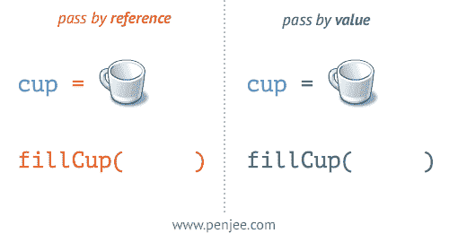

# 按引用传递与按值传递

> 原文：<https://blog.devgenius.io/pass-by-reference-vs-pass-by-value-bd37436a6b00?source=collection_archive---------6----------------------->

# 概观

在代码中使用变量时，数据有两种不同的使用方式。当你把一个变量传递给一个函数时，要么是通过引用传递，要么是通过值传递。



[https://blog . pen JEE . com/passing-by-value-vs-by-reference-Java-graphical/#:~:text = The % 20 terms % 20% E2 % 80% 9c pass % 20 by % 20 value，其中%20value%20is%20stored](https://blog.penjee.com/passing-by-value-vs-by-reference-java-graphical/#:~:text=The%20terms%20%E2%80%9Cpass%20by%20value,where%20the%20value%20is%20stored) 。

# 通过引用传递

引用传递是指将内存地址传递给函数。这意味着无论该变量发生什么变化，都会影响指向该内存地址的所有其他变量。下面的代码是用 C++写的。

```
#include <iostream>
using namespace std;void increment(int &x) {
  x++;
}int main() {
  int num = 10;
  cout << num << endl; increment(num);
  cout << firstNum; return 0;
}>> 10
>> 11
```

正如你所看到的，当你改变一个函数的值时，外部的变量也会改变。在 C++中，你通过在变量名前添加“&”来告诉函数它是通过引用传递的。

# 按值传送

像 Java 这样的语言默认情况下是按值传递的。按值传递意味着当你改变一个函数中的变量时，它不会影响外部的变量。以下代码是用 Java 编写的。

```
public class Increment{ public static void main(String []args){
    int x = 10;
    System.out.println("Before: " + x);
    increment(x);
    System.out.println("After: " + x);
  }

  static void increment(int x) {
    x++;
    System.out.println("Function: " + x);
  }
}>> Before: 10
>> Function: 11
>> After: 10
```

如你所见，即使变量在函数内部被修改，变量本身在函数外部并没有改变。默认情况下，大多数语言都是按值传递的。当使用传递包含原始数据类型的变量时，它是按值传递的。但是当变量是一个对象时，对该对象的任何更改都会应用到引用它的所有变量。

# 结论

在编程时，您应该注意通过引用传递。当传递列表、数组或对象时，函数中的任何变化都会产生意想不到的影响。C++有指向内存地址的指针变量，默认情况下是通过引用传递的。通常你可以通过查看函数应该返回什么来决定是否使用引用传递。如果它返回一个值，它应该通过值传递。如果它返回两个或更多不同的值，那么它应该通过引用传递。