# 在 Swift 中使用 NSNotification 传递数据

> 原文：<https://blog.devgenius.io/pass-data-using-nsnotification-in-swift-1ddc3bbd0d6d?source=collection_archive---------0----------------------->

描述如何使用 Swift 编程语言中的通知模式在视图控制器之间传递数据。

由[艾德亚多·桑奇兹](https://unsplash.com/@eduardoequis)通过 [Unsplash](https://unsplash.com/) 拍摄

# 概观

在 iOS 开发中，不同视图之间共享数据是非常常见的。我们可以用不同的方式传递数据。在本教程中，我们将学习如何使用 NSNotification 将数据从一个视图控制器发送到另一个视图控制器。

> *本教程使用* ***Swift 5，Xcode 11.4，iOS 13 &故事板接口编写。***

# 什么是通知？

通知是将数据从一个视图发送到另一个视图时的一种通知方式。你可以把它和用邮箱寄信相比。寄件人将信件投到一个或多个收件人的邮箱里。收件人所在地区的邮政局长正在观察信件的到来。当邮政局长收到信时，他/她会做一些特定的工作(将它们分发给实际的收件人)。

使用通知发送数据与此过程非常相似。从一个视图控制器发布通知。一个或多个视图控制器正在观察该通知。当他们通知时，他们做一些具体的工作。让我们看看所有这些东西是如何协同工作的

# 从简单的项目开始

在本教程中，我将使用一个简单的单视图应用程序。这个应用程序将只有两个视图控制器，“FirstVC”和“SecondVC”。这是项目的故事板界面。

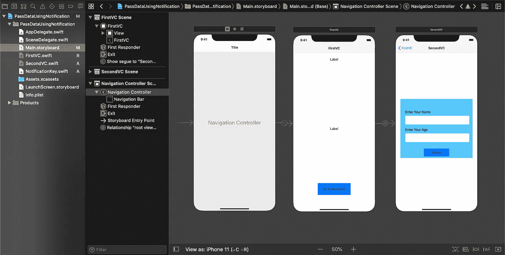

下面是“FirstVC”和“SecondVC”的视图控制器类。我们的目的是将通知从“SecondVC”发送到“FirstVC ”,这就是为什么我们在视图加载时在“FirstVC”中设置如下标签。

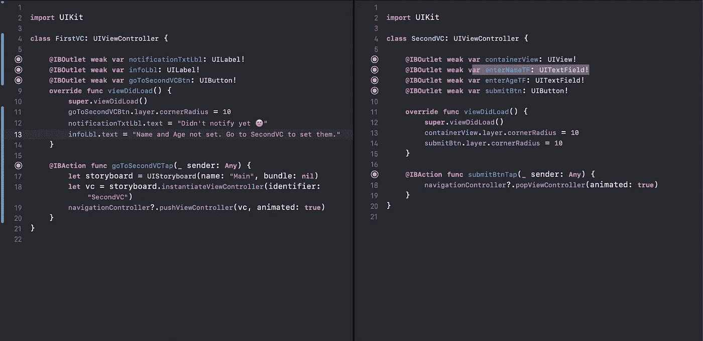

我们只是为我们的项目设置视图和编写一些初始代码。在这个阶段，我们的 app 看起来是这样的。

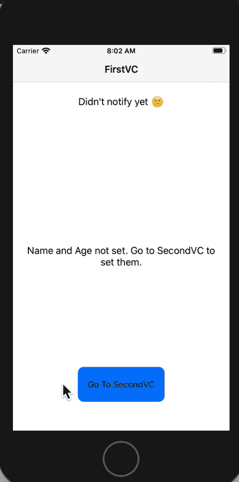

这就是我们的项目设置，现在可以配置了，酷😎

# 使用通知

现在我们将处理通知。首先，我们将声明一个唯一的键。一个视图控制器将使用该键发送通知，另一个视图控制器将观察与该键相关联的通知，并在收到通知时做一些事情。让我们看看一切是如何一起工作的。

## **1。设置通知键:**

为了唯一地标识每个通知，我们需要一个唯一的通知密钥。Key 可以在模块中的任何地方声明为变量，但是要确保它们在单独的类中或者在其他类的范围之外。

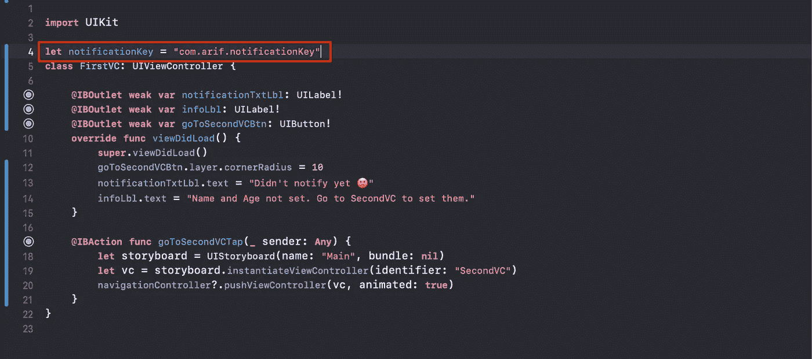

这里我在“FirstVC”中声明了一个变量“notificationKey”。Swift”文件和“FirstVC”类之外。使用此密钥，我们将发布和观察通知。

## 2.设置观察者:

我们编写了一个函数来观察通知。这里的 **self** 指的是谁在观察通知。在我们的例子中，FirstVC。**#选择器**是通知后将执行的动作。在我们的例子中，如果“FirstVC”成功观察到通知，它将执行“doWhenNotify”函数并设置“notificationTxtLbl”文本。最后，**名称**是“第一 VC”正在观察的通知的唯一键。

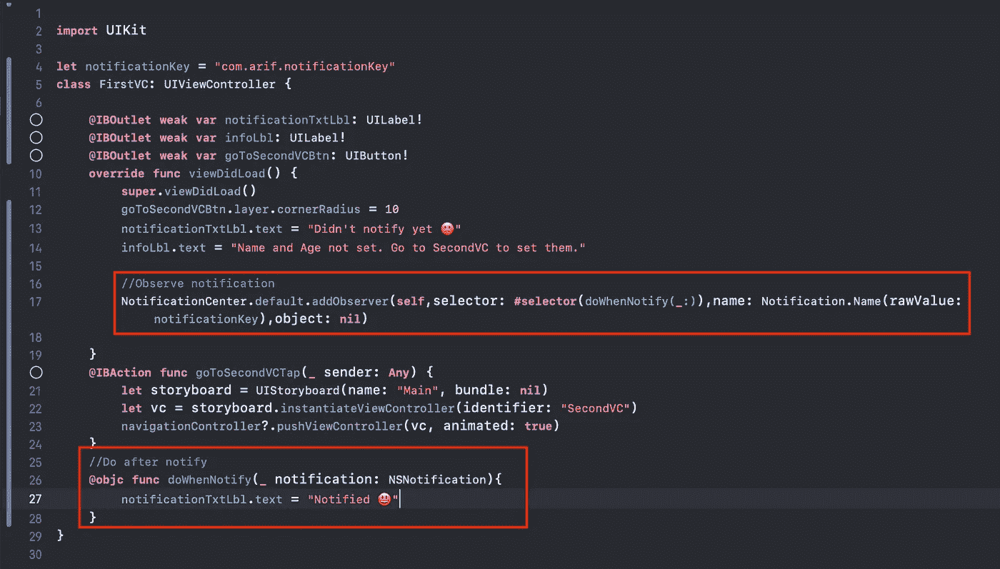

## 3.发布通知:

我们将在点击“SecondVC”中的“submitBtnTap”按钮时发布通知，如下所示。发布此通知时，我们将“SecondVC”引用作为对象传递。

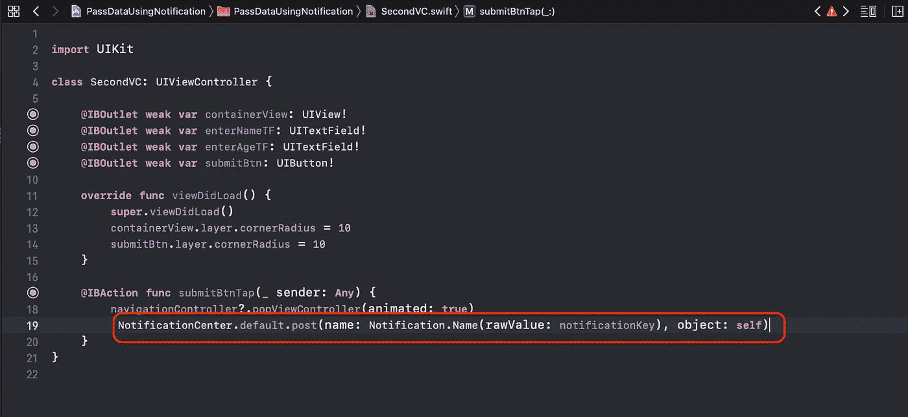

如果你按照一切运行项目，你应该看到类似这样的东西。请注意,“FirstVC”文本中的“notificationTxtLbl”按照我们的预期进行了更改。这意味着我们使用通知成功地进行了沟通，太好了😃

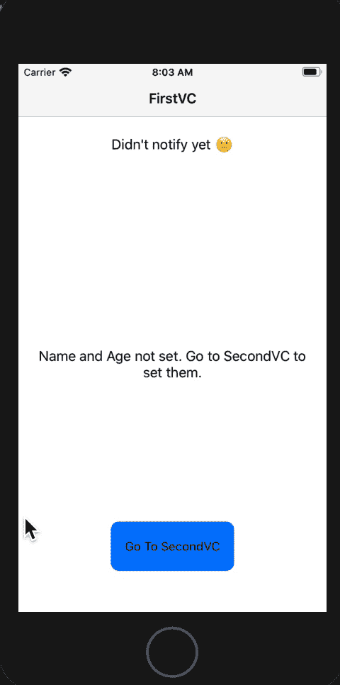

这就是两个或更多的视图控制器如何使用通知相互对话的方式。但是你也必须使用通知来发送一些信息。现在我们来看看如何做到这一点。

通常，我们使用字典通过通知来发送数据。我们将信息作为键值对放入字典中，并在发布通知时将字典作为参数添加。

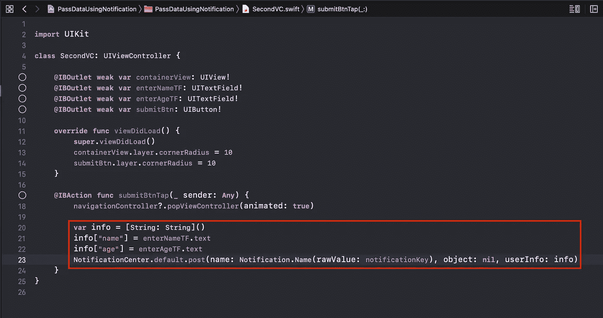

在我们的例子中，我们使用一个名为“info”的字典，并将文本字段输入作为键值对放入其中。将该字典作为名为“userInfo”的参数添加到 post 方法中。

现在我们将使用在发布通知时发送的“FirstVC”中的“userInfo”参数。

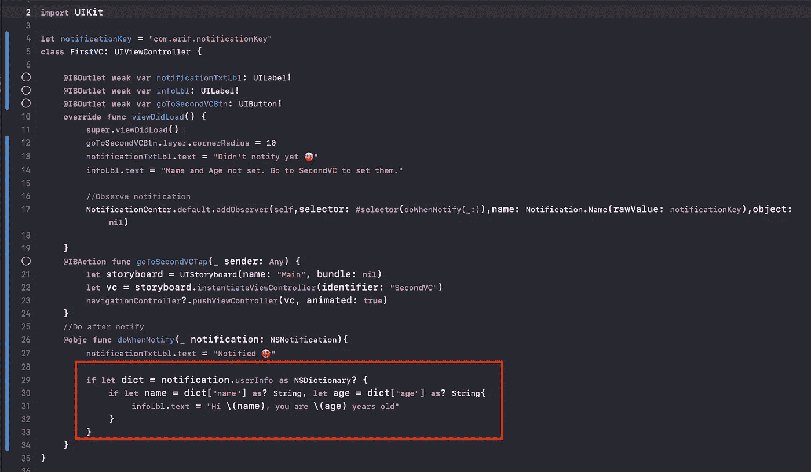

“userInfo”字典有两个关键字，“姓名”和“年龄”。我们安全地打开这些键值，并将它们设置到“infoLbl”中。这就是我们如何使用通知传递数据。现在，您可以设置您的用户名、年龄，并使用通知将它们从“SecondVC”传递到“FirstVC”。

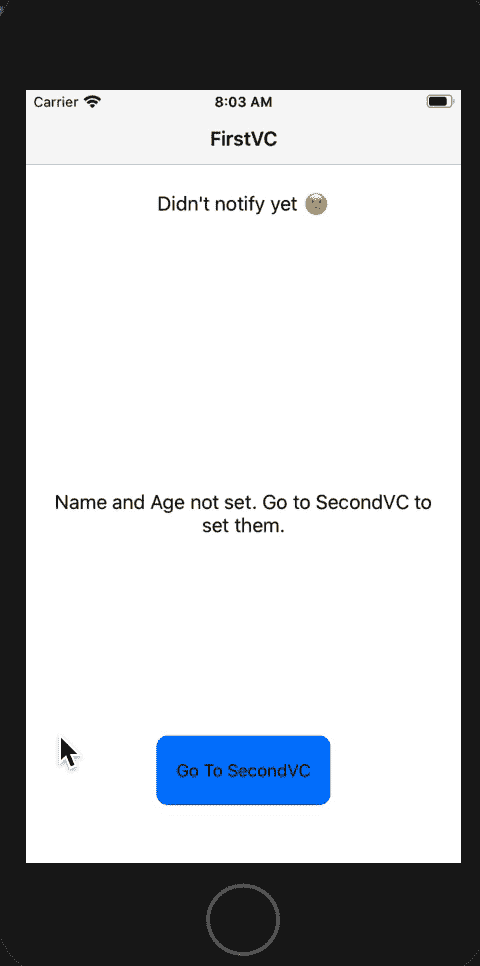

# 取消初始化通知

您可以通过多种方式取消通知的初始化。这可以通过 **deinit** 或视图控制器生命周期函数(**viewdiddisament**或**viewdilldissapear**)函数来完成。

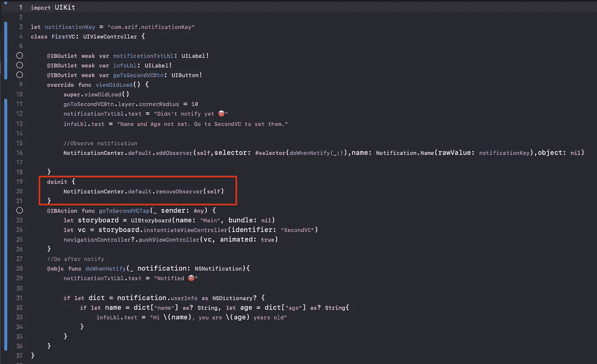

祝贺🎉 🎉 🎉我想现在您知道如何在 swift 中使用 NSNotification 了。你会在这里找到项目。查看[苹果文档](https://developer.apple.com/documentation/foundation/nsnotification)了解更多详情。

**如果你觉得这篇文章有用，请分享并鼓掌**👏👏👏
在[媒体](https://medium.com/@arifulislam14)上查看我的其他文章，在 [LinkedIn](https://www.linkedin.com/in/arifparvez14/) 上帮我联系。

感谢您阅读&快乐编码🙂