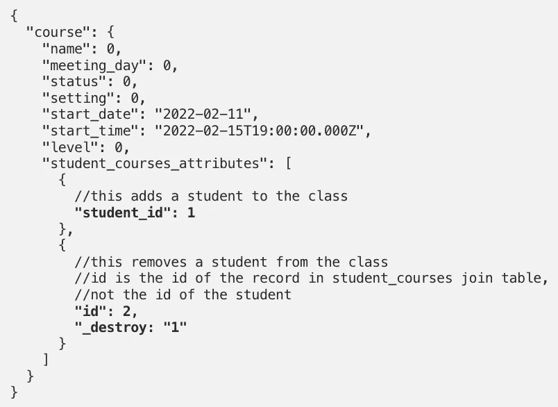
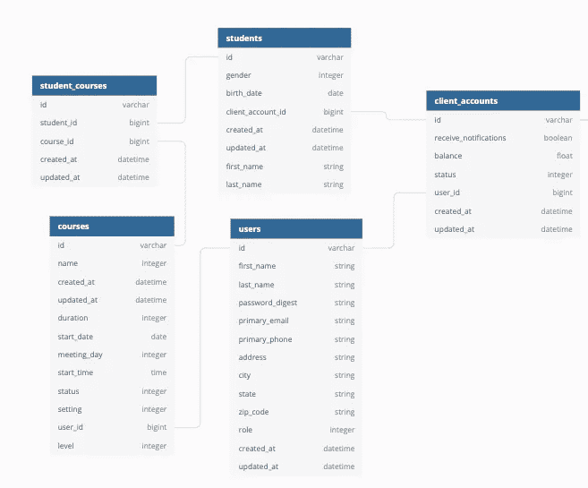

# 将嵌套的对象数组传递给控制器，以更新 Rails 中的相关记录

> 原文：<https://blog.devgenius.io/passing-a-nested-array-of-objects-to-a-controller-to-update-associated-records-in-rails-38913ae01f6c?source=collection_archive---------2----------------------->



# 介绍

在熨斗学校的最后一个项目中，我为一所音乐学校写了一份申请。像任何学校一样，有班级，每个班级有一个老师和许多学生。我希望教师和管理员能够创建一个班级，并为其分配学生。我还希望他们能够编辑已经创建的类，包括添加和删除学生。

我将描述如何使用`accepts_nested_attributes_for`从我的`classForm`组件中接受一个嵌套的学生数组，并更新该班级的相关记录。

这里有一个进入`courses_controller.rb`的 JSON 数据的例子:

```
{
  "course": {
    "name": 0,
    "meeting_day": 0,
    "status": 0,
    "setting": 0,
    "start_date": "2022-02-11",
    "start_time": "2022-02-15T19:00:00.000Z",
    "level": 0,
    "student_courses_attributes": [
      {
        //this adds a student to the class
        **"student_id": 1**
      },
      {
        //this removes a student from the class
        //id is the id of the record in student_courses join table,  
        //not the id of the student
        **"id": 2,
        "_destroy: "1"**
      }
    ]
  }
}
```

## 表关系

我的关系是:



每一只`course`都属于一只`user`，它是`course`的指导者。每个`course`有很多`student_courses`，它有很多`students`到`student_courses`。每个`student`属于一个`client_account`，每个`role`等于客户端的`user`都有一个`client_account`。

## 接受 _ 嵌套 _ 属性 _for

类方法`[accepts_nested_attributes_for](https://edgeapi.rubyonrails.org/classes/ActiveRecord/NestedAttributes/ClassMethods.html)`允许您通过父类保存相关记录的属性，这在 Rails 中是默认关闭的。它允许您将嵌套属性传递到控制器操作中，这些操作可以创建、更新和删除相关记录。在我的项目中，它允许我在我的 POST 和 PATCH 请求中包含一系列学生，以便为课程添加、更新和删除学生。

[文档](https://edgeapi.rubyonrails.org/classes/ActiveRecord/NestedAttributes/ClassMethods.html)很好地解释了如何在一对一和一对多关系中使用它，但是我需要在连接表中使用它。以下是我如何做到这一点。我强烈建议在开始之前阅读文档，它很短，会帮助你理解本教程。

# 配置模型

首先，我将模型配置为接受嵌套属性。我只包含了与本教程相关的每个模型中的信息，并省略了定义枚举和验证之类的内容。

## 课程模型

```
class Course < ApplicationRecord belongs_to :user
  has_many :student_courses
  has_many :students, through: :student_courses
  **accepts_nested_attributes_for :student_courses, allow_destroy: true, reject_if: :reject_student_courses** **def reject_student_courses(attributes)
    attributes['student_id'].blank?
  end**end
```

在这个模型中:

*   `accepts_nested_attributes_for :student_courses`允许我嵌套`student_courses`的属性
*   `allow_destroy: true`允许我摧毁`student_courses`的实例
*   `reject_if: :reject_student_courses`允许我设置拒绝数据的标准，在这种情况下，如果它没有`student_id`，我将拒绝它

## 学生课程模式

```
class StudentCourse < ApplicationRecord

  belongs_to :student
  belongs_to :course
  accepts_nested_attributes_for :studentend
```

在这个模型中:

*   `accepts_nested_attributes_for :student`允许我嵌套`:student`的属性，我这样做是为了确保在创建时将关联提供给学生。

## 学生模型

```
class Student < ApplicationRecord
  belongs_to :client_account
  has_many :student_courses
  has_many :courses, through: :student_courses
  has_many :instructors, through: :student_courses, source: :user
end
```

在这里，我设置了`has_many`和`has_many, through:`关联来创建一个`student`和一个`course`之间的关系。

# 在`courses_controller`中设置创建和更新操作

我设置我的`courses_controller.rb`文件来接受`student_courses_attributes`。在我的控制器中，我也根据用户的角色以不同的方式处理动作，但是在这个例子中我将简化它。

```
class CoursesController < ApplicationController before_action :set_course, only: [:show, :update, :destroy] def create
    course = **current_user**.courses.new(course_params)
      if course.save
        render json: course, status: :created
      else
        render json: course.errors.full_messages, 
        status: :unprocessable_entity
      end
  end def update
    if @course.update(course_params)
      render json: @course
    else
      render json: @course.errors.full_messages, 
      status: :unprocessable_entity
    end
  end private def course_params
    params.require(:course).permit(
      :name,
      :meeting_day,
      :start_date,
      :start_time,
      :status,
      :setting,
      :id,
      :level,
      :user_id,
      **:student_courses_attributes => [:id, :student_id, :_destroy]**
    )
  end
end
```

在该控制器中:

*   `current_user`是用户登录时设置的，是课程的讲师。
*   `:student_courses_attributes`允许`student_courses_attributes` hash 作为[强参数](https://api.rubyonrails.org/classes/ActionController/StrongParameters.html)。我需要将其命名为`:student_courses_attributes`，因为我需要将它与我要保存属性的关联进行匹配，也就是`student_courses`。
*   `=> [:id, :student_id, :_destroy]`设置数组中的对象允许哪些键。`:student_id`用于创建新的关联记录，`:id`和`:_destroy`用于销毁关联记录。

# 格式化 JSON 数据

这里有一个发送给`courses_controller`的 JSON 数据的例子:

```
{
  "course": {
    "name": 0,
    "meeting_day": 0,
    "status": 0,
    "setting": 0,
    "start_date": "2022-02-11",
    "start_time": "2022-02-15T19:00:00.000Z",
    "level": 0,
    "student_courses_attributes": [
      {
        //this adds a student to the class
        **"student_id": 1**
      },
      {
        //this removes a student from the class
        //id is the id of the record in student_courses join table,  
        //not the id of the student
        **"id": 2,
        "_destroy: "1"**
      }
    ]
  }
}
```

## 向课程中添加学生

为了将学生添加到课程中，我将一个对象传递到数组`student_courses_attributes`中，该对象带有键`student_id:`和我想要添加的学生的`id`。连接表有一个键`course_id`，但是我不需要添加它，因为我正在通过课程创建关联，所以它已经有了那个信息。

下面是一个向班级添加两名学生的示例:

```
"student_courses_attributes": [
      {
        //this adds a student to the course by creating a
        //new student_course with a student whose id === 1
        **"student_id": 1**
      },
      {
        //this adds a student to the course by creating a
        //new student_course with a student whose id === 4
        **"student_id": 4**
      },      
    ]
```

## 移除学生

为了从课程中移除一个学生，我将一个对象传递到`student_courses_attributes`数组中，该对象带有我想要销毁的`student_course`的键`id:`和`id`。**我没有在这里传递学生的 id，**因为我移除的是`student_course`的实例，而不是`student`的实例。我还传入了`_destroy: '1'`，因为它是一个布尔值，1 将被解释为真。

下面是一个移除两个学生的示例:

```
"student_courses_attributes": [
      {
        //removes the student_course with and id === 2
        **"id": 2,
        "_destroy: "1"**
      },
      {
        //removes the student_course with and id === 3
        **"id": 3,
        "_destroy: "1"**
      },    
    ]
```

使用这个配置，当我创建一个新的课程或更新一个当前的课程时，它将向课程中添加和删除包含在 JSON 数据的`student_courses_attributes`键中的学生。希望这能帮助你简化类似情况下的逻辑！

很快，我将添加一段描述，说明我是如何创建允许我将多个学生添加到课程中的表单部分的，以及我是如何格式化受控制的表单数据以说明:

*   已经注册但没有被改变的学生。
*   未注册的学生，已添加。
*   被录取和除名的学生。
*   注册的学生，然后删除并重新添加。

我希望你喜欢，如果你喜欢，请关注我的博客并留下评论！