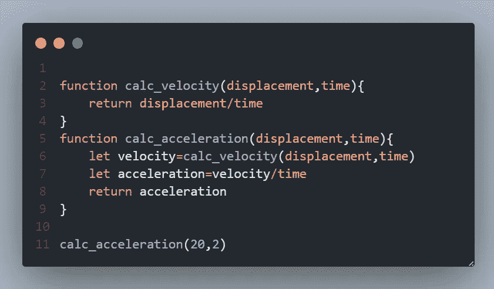

# 在 Javascript 中的函数之间传递数据(变量)

> 原文：<https://blog.devgenius.io/passing-data-variable-between-functions-in-javascript-8a3a10abc169?source=collection_archive---------0----------------------->

主题很简单:在 javascript 中的两个或多个函数之间传递变量(数据)。看起来很简单。但是，当您在处理一些项目时，需要使一个变量为两个或多个函数所共用，或者将一个函数处理的值传递给另一个函数，或者在变量发生变化时调用一个函数，而其他函数可能会使用该变量。这似乎有点令人困惑，但在看到例子后，你会明白我想表达的意思。

1.  使用全局变量
2.  按返回值
3.  使用本地存储/会话存储
4.  使用回调

## 1.使用全局变量

在某些情况下，你需要使用一个变量，并且它必须被一个或多个函数访问，这时你可以在全局范围内声明这个变量，这样所有的函数都可以访问它。

问题出现了

如果变量在声明时是未知的，并且只有在函数被调用时才得到一个值，而你不应该对这个未定义的值做任何事情，那该怎么办？

使用条件语句检查值是否未定义。这不是合适的方法。在声明任何变量的时候，试着使用一个默认值，即使它有一个默认值，也不要一直检查这个值是否变成了其他值。

为此，只有当值发生变化时，才可以使用回调来调用函数。通过这种方式，您可以减少条件检查的数量，有时检查的数量可能是无限的，如果条件语句涉及任何其他复杂的检查，那么您会给 CPU 带来很大的负载。

## 2.按返回值

每个函数都可以返回值并被其他函数使用。

## 问题

如果这些函数被许多其他函数调用，但它们仍然具有相同的返回值(如上图所示)，该怎么办？

在这种情况下，该函数每次调用时都返回相同的值，如果您在函数内部(块范围)调用该函数，则返回值只能由当前函数使用，如果任何其他函数需要使用该值，则该函数必须再次调用该函数。它导致时间和空间复杂度的增加，在最坏的情况下，它可能导致整个应用程序变慢。

当函数的返回值对于每一次调用和传递的每一个参数都不同时，这种方法就变得非常强大。

## 3 .使用会话存储/本地存储

这是一种可以用来在运行于一个公共域上的函数甚至不同文件之间共享数据的方法。当您在函数之间共享单个变量时，这是无效的，但在函数之间共享一个对象或 JSON 时，这将有效得多。要了解有关会话存储和本地存储的更多信息，请查看

> [https://JavaScript . plain English . io/storing-different-data types-in-local storage-in-js-ee7f 4c 5318 ff](https://javascript.plainenglish.io/storing-different-datatypes-in-localstorage-in-js-ee7f4c5318ff)

## 4.使用回调

回调可以简单地解释为一个函数(Callie function ),它作为一个参数传递给另一个函数(caller function ),这样就可以从 caller function 调用这个函数。这类似于第二种方法。在一个简单的函数中可能有许多回调，这样数据就可以在函数之间共享。

尽管如此，数据流是单向的，调用者函数中的数据可以发送到 callie 函数。可以使用返回值向上发送该值。

