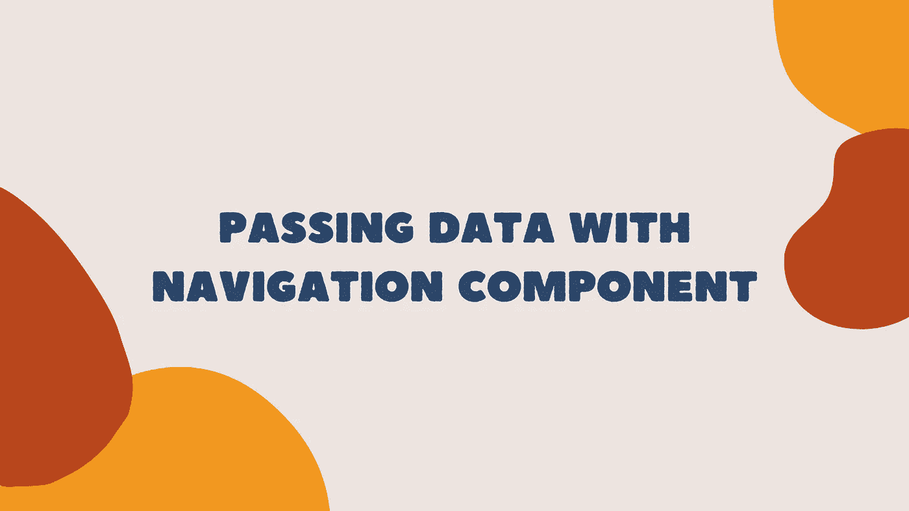
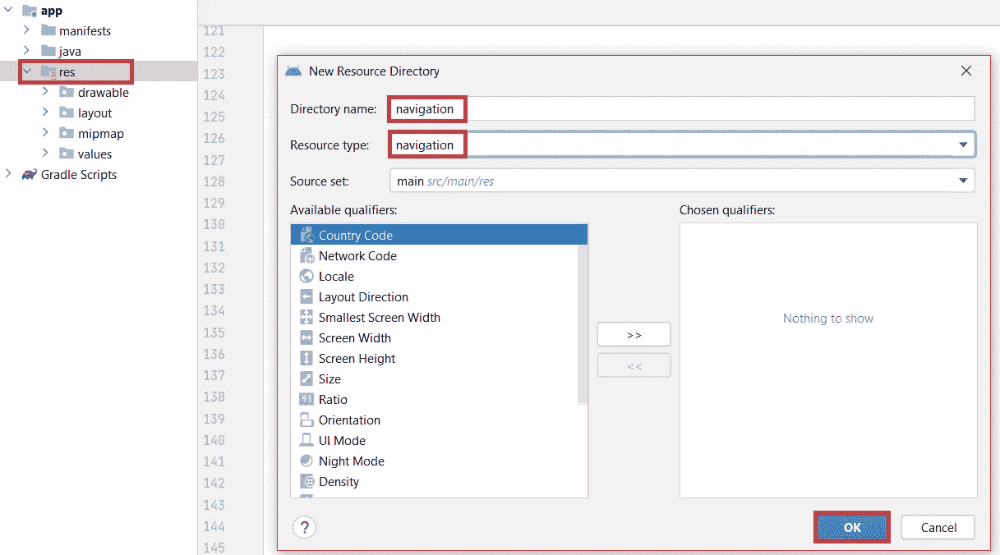
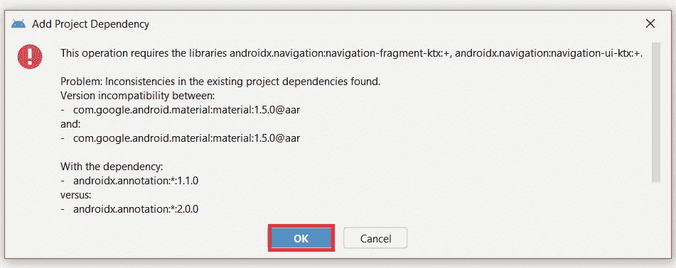
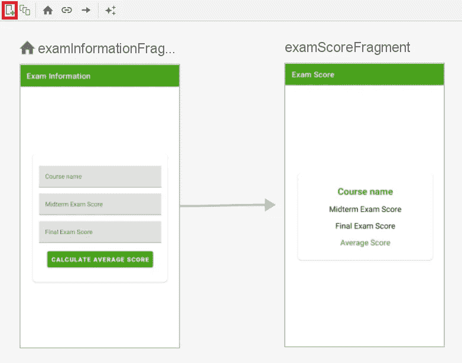
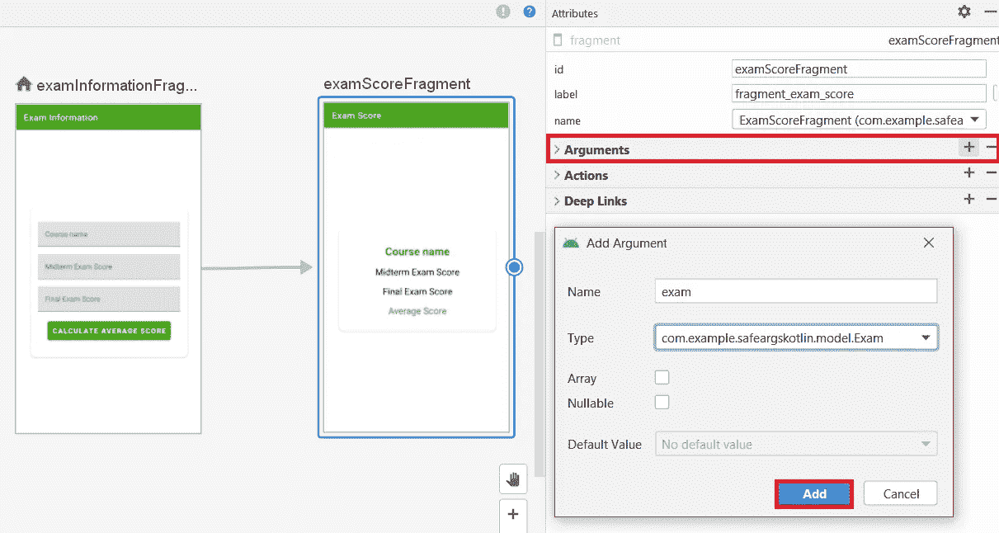
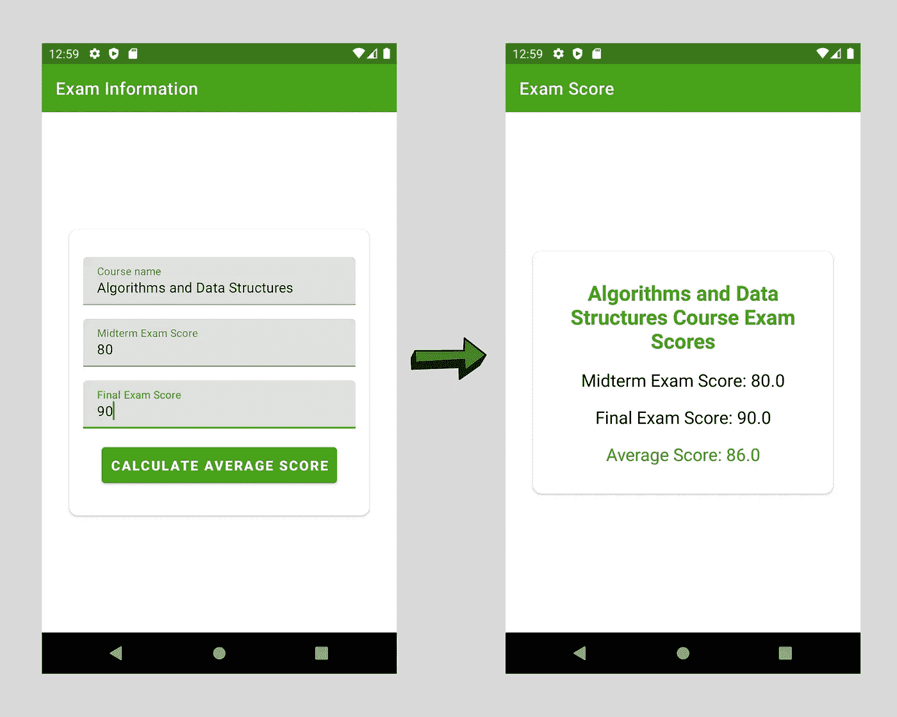

# 在 Android 中使用导航组件传递数据

> 原文：<https://blog.devgenius.io/passing-data-with-navigation-component-in-android-7fa0ef9119b4?source=collection_archive---------0----------------------->

在本文中，我们将学习如何使用 Android 导航组件在不同的屏幕之间传递数据。

当在 Android 应用程序中使用多个屏幕时，Android 导航组件用于管理这些屏幕之间的导航。 **SafeArgs** 结构用于在不同屏幕间导航时传递数据。

让我们通过一个计算用户考试平均分的简单应用程序来学习使用 SafeArgs。

# 第一步

在 Android Studio 中创建新项目。

# 第二步

打开模块级 **build.gradle** 文件，启用 **viewBinding** ，同步项目。视图绑定允许我们更容易地编写与视图交互的代码。

(模块级) **build.gradle**

# 第三步

创建两个片段:

*   **examinatformationfragment:**用户输入考试信息的片段。

examinatformationfragment . kt

打开**fragment _ exam _ information . XML**，添加用户输入考试信息的输入框和计算平均分的按钮。

fragment _ 考试 _ 信息. xml

*   **考试分数片段:**显示用户考试分数信息和考试平均分的片段。

ExamScoreFragment.kt

打开**fragment _ exam _ score . XML**文件，添加 TextView 供用户显示考试信息和考试成绩。

fragment_exam_score.xml

# 第四步

在这一步中，我们将创建一个导航图。**导航图**是一个资源文件，表示我们应用程序的所有导航路径，包含所有目的地和动作。

跟随 **res- > New- > Android 资源目录**打开一个导航目录。

导航目录

然后，按照**导航- >新建- >导航资源文件**，打开一个名为 **nav_graph** 的新图形。这将要求您自动添加必要的依赖项。单击确定按钮。

添加项目相关性

导航图现在可以使用了。

# 第四步

通过单击新建目的地按钮，将目的地添加到导航图中。目的地是包含在特定导航图中的片段。

目的地

nav_graph.xml

# 第五步

打开您的 **activity_main.xml** 文件，并在其中放置一个**navshostfragment**。NavHostFragment 在布局中提供了一个区域，用于进行自包含导航。

activity_main.xml

# 第六步

我们现在准备将安全参数添加到我们的项目中。要将安全参数添加到项目中，请在项目级 build.gradle 文件中添加以下类路径。

(项目级) **build.gradle**

然后，在模块级 build.gradle 文件中添加以下插件。

(模块级) **build.gradle**

# 第七步

创建一个名为 **Exam** 的新数据类。使用 SafeArgs，我们需要使类**可打包**以将一个考试对象传递给另一个片段。

在模块级 build.gradle 文件中添加以下插件。

(模块级) **build.gradle**

同步项目，打开 Exam.kt，用 **@Parcelize** 注释使类成为可打包的。

Exam.kt

# 第八步

打开 **nav_graph.xml** 文件，选择要发送数据的目的地。点击右侧的**参数**并输入名称，选择自定义 Parcelable 作为类型。然后添加考试类作为参数。

nav_graph.xml

nav_graph.xml

# 第九步

打开**examinationformationfragment**并调用 **setOnClickListener** 方法。获取用户在输入字段中输入的考试信息。然后创建一个考试对象并传递所需的参数。接下来，创建一个**动作**并将所需的考试对象传递给它。最后，使用 **findNavController** 方法将 ExamInformationFragment 导航到 ExamScoreFragment。

examinatformationfragment . kt

# 第十步

打开**exascorefragment**并声明一个变量 **args** ，该变量接受与 exascorefragment 相关联的参数。将变量值设置为 args 中包含的值。

为了计算考试平均分，创建一个函数 **calculateAverageScore** ，该函数将期中考试分数和期末考试分数作为参数。

最后，将 textViews 的值设置为变量。

# 步骤 11

运行您的应用程序。

输出

感谢阅读。

完整的代码:

 [## GitHub-eminenan/NavigationSafeArgs:在 Android 中使用导航组件传递数据

### 此时您不能执行该操作。您已使用另一个标签页或窗口登录。您已在另一个选项卡中注销，或者…

github.com](https://github.com/emineinan/NavigationSafeArgs)