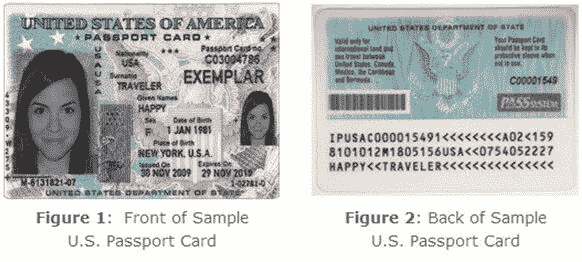
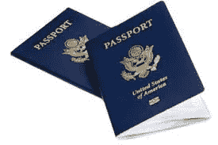

# 美国护照卡“下一代身份”

> 原文：<https://blog.devgenius.io/passport-card-a-next-gen-identification-b353b2a93a86?source=collection_archive---------5----------------------->

如果你办护照不需要书，而是办了一张卡，那该怎么办？

## 过程会怎样？

大使馆和机场的每个移民办公室都需要一个读卡器+网络应用程序，该应用程序将为他们打开，以上传签证并验证签证，还可以查看和提供出入境印章，这将是数字的。

至于大使馆，他们将提供一个数字签证，可以上传为 pdf 文件等。

## 那会有多神奇？相当惊人！！！

该护照卡将链接到一个特定的网络应用程序，移民局和大使馆可以看到以下详细信息:

*   个人信息，如姓名、出生日期、出生地、签发日期和到期日期
*   获得的签证
*   入口和出口列表

这些信息将是必不可少的，因为所有这些都将显示给大使馆和移民局。

不再需要护照本，不再需要签证贴纸，不再需要出入境印章，如果你能拥有一切，为什么还要用它呢？

想想看，唯一需要的是一个经过认证的 web 应用程序开发人员前端和后端来制作 web 应用程序的样本，并将框架出售给每个国家并提供维护。

第二，你需要为它创建一个完美的卡，你需要图像+条形码的个人信息(每个条形码都应该是唯一的，因为这意味着条形码创建者将为每个查询护照卡的人提供)+国籍的国旗

第三个已经随处可见的是连接到计算机的条形码阅读器，因此移民局或大使馆可以通过条形码打开 web 应用程序。

现在让我们更深入地讨论一下，这是不是一个十亿美元的想法。

但在此之前，让我们先列出缺点:

*   77.53 亿用户的唯一条形码(根据世界银行 2020 年的记录)
*   框架将以英语设置，但并非所有国家都将英语作为主要的交流媒介语言
*   开始的时候会混淆用法，所以会有多个“如何”类
*   这个系统应该至少测试 1000 到 100000 次，成功率至少为 98%,因为一个错误会严重影响用户

请注意，该框架在开始时可以是一个易于使用的框架，然后提供更新。

顺便说一句，我可能忘了让你知道网络应用程序，它也是供用户确认他们是否从机场的移民工作人员那里获得了入境或出境，以及他们是否收到了签证。

以下是让您对下一代护照充满希望的优势:

*   你再也不需要把一本书当作护照了，它将会像你的名片夹里的任何一张卡片一样
*   它简单易用
*   不难保持

我可以列出很多优势来说明为什么护照卡对我们所有人来说都是一个了不起的下一步。

下一步的更新可以是指纹附在卡上，并与每个国家的数据库连接。

我还可以告诉你，有很多方法来更新框架，使它变得不可思议，但最好的方法是开始缓慢推广框架，并提供一个样本。

> 这个想法是我自己的版权，产生于和几个朋友的一次简单的坐下来。

目前独自工作在这个项目上，如果你有兴趣与我在这个项目上合作，让我知道。我仍处于计划和战略阶段。

> “一个有新想法的人在其想法实现之前是个怪人。马克·吐温写的"

 [## 每当侯赛因·巴申发表文章时，就收到一封电子邮件。

### 每当侯赛因·巴申发表文章时，就收到一封电子邮件。通过注册，您将创建一个中型帐户，如果您还没有…

husseinbaashen.medium.com](https://husseinbaashen.medium.com/subscribe)