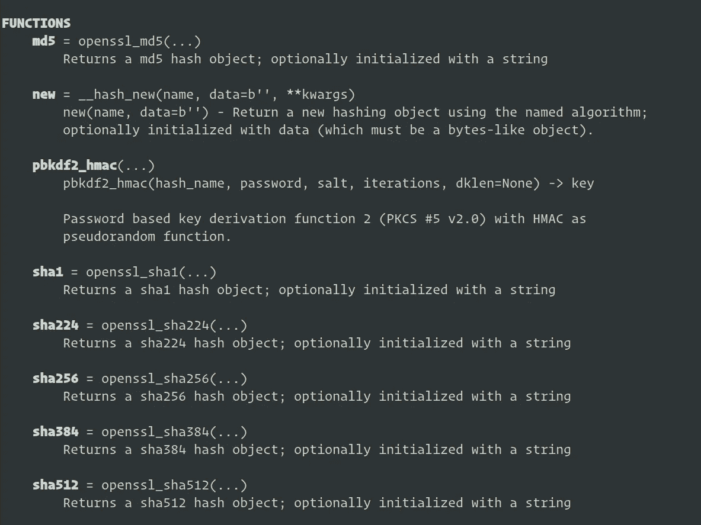
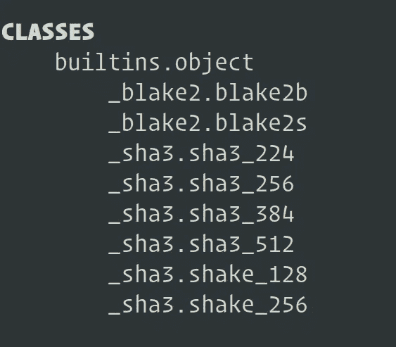

# 使用 Python 进行密码散列

> 原文：<https://blog.devgenius.io/password-hashing-with-python-f3148692e8b9?source=collection_archive---------0----------------------->

## 即使用户密码被破解，也要保证其安全。


照片由来自 [Pexels](https://www.pexels.com/photo/security-logo-60504/?utm_content=attributionCopyText&utm_medium=referral&utm_source=pexels) 的 [Pixabay](https://www.pexels.com/@pixabay?utm_content=attributionCopyText&utm_medium=referral&utm_source=pexels) 拍摄

身份验证是计算机应用程序和系统安全不可或缺的一部分。对于基于 web 的应用程序和其他支持 internet 的应用程序，健壮的身份验证更是一个大问题。想想看，只要在浏览器 URL 中输入一个域名，就可以轻松访问它们。

基于互联网的系统将互联网作为其直接访问的关键。这意味着必须有一个强大的身份认证系统来防止未经授权的访问。

许多在线应用程序采用基于密码的身份验证作为主要身份验证。然后，他们可以使用其他身份认证方法，如 2FA 和生物特征认证来增强这种能力。这使得拥有强大而安全的密码存储在防御网络攻击中变得必不可少。

通过安全漏洞，攻击者可以访问您系统的凭证存储，但是您用户的密码应该保持安全和不被泄露。散列密码对每个人来说都是无形的，甚至对提供明文来生成它们的原始用户来说也是如此。

不要以纯文本或任何可破译的格式存储用户密码。

# 密码哈希引领潮流

为了保护用户的密码，您必须将他们的明文密码转换为晦涩难懂的字符串，即哈希。

```
2cf24dba5fb0a30e26e83b2ac5b9e29e1b161e5c1fa7425e73043362938b9824
```

上面的字符串表示使用 SHA-256 哈希算法生成的明文`**hello**` 的哈希。

密码哈希是使用安全的哈希算法将明文密码转换为哈希字符串。这是一个单向的不可逆转变。

有几种散列算法可供选择。但是要注意避免不安全的，比如 SHA-1 的**和 MD5 的**。**谷歌合作的一项研究[报告了](https://security.googleblog.com/2017/02/announcing-first-sha1-collision.html)有史以来第一次 SHA-1 哈希算法的哈希冲突。这个报告意味着两个不同的输入实际上可以生成相同的散列。 **MD5** 很久以前就被认为是脆弱和不安全的，容易受到哈希冲突的攻击。**

仍然有几种散列算法是安全的，具有很强的抗冲突性。

Python 标准库`hashlib`提供了一些强大的哈希算法，可以用来生成安全的哈希。

# 用 Python 的 hashlib 模块散列密码

[hashlib](https://docs.python.org/3/library/hashlib.html) 是 Python 解释器附带的一个方便的哈希模块。除了 Python 解释器之外，不需要额外的安装。

`hashlib`模块提供了两种生成散列的方法。

**1。使用暴露在`hashlib`模块上的哈希算法函数**。
调用这些函数会返回一个散列对象，其中包含检索生成的散列的方法。它还具有用于确定生成的哈希的块大小和摘要大小的属性。



hashlib 模块上可用的散列算法函数

**2。使用哈希算法** **类**暴露在`hashlib`模块上。这些散列算法类在被实例化时返回散列对象，该散列对象具有用于检索所生成的散列和其他便利信息的便利方法。



hashlib 模块上直接提供的散列算法类

# 让我们生成一些散列

首先，像这样导入`hashlib`模块

```
import hashlib
```

我们将使用这两种方法生成两个散列，首先使用散列函数，然后使用散列算法类。

## **使用** `**hashlib.sha256(...)**` **函数**从明文 `**hello'**` **生成密码哈希**

**注意:**在`hashlib`模块上公开的所有散列函数只接受输入或明文的编码字节串。因此，必须使用 Python [str 对象](https://docs.python.org/3/library/stdtypes.html#str)上的`encode()`方法将 Unicode 字符串转换成字节。

```
import hashlib# encode string "hello" to bytes
plaintext = "hello".encode()# call the sha256(...) function returns a hash object
d = hashlib.sha256(plaintext)# generate binary hash of "hello" string
hash = d.digest()
print(hash)
```

通过调用 hash 对象`h`上的`digest()`方法，以字节为单位检索生成的 hash

```
\xf2M\xba_\xb0\xa3\x0e&\xe8;*\xc5\xb9\xe2\x9e\x1b\x16\x1e\\\x1f\xa7B^s\x043b\x93\x8b\x98$
```

此二进制哈希不友好。为了改变这一点，您将在 hash 对象上调用`hexdigest()`方法来获得一个精简的、人类可读的十六进制表示。

```
# generate human readable hash of "hello" string
hash = d.hexdigest()
print(hash)
```

输出:

```
2cf24dba5fb0a30e26e83b2ac5b9e29e1b161e5c1fa7425e73043362938b9824
```

使用 hashlib 函数算法 sha256 生成二进制哈希和友好十六进制哈希的完整代码

## **使用** `**hashlib.sha3_256**` **类**从明文 `**hello'**` **生成密码哈希**

在实例化时，`hashlib`模块上可用的散列类的构造函数接受一个明文参数，这是一个编码的字符串。这个编码字符串被转换成一个不可逆的散列，它也可以以两种格式检索:使用`digest()`的二进制和使用`hexdigest()`的十六进制。

实例化哈希对象

```
import hashlibplaintext = "hello".encode()# instantiate sha3_256 object
d = hashlib.sha3_256(plaintext)
```

通过对散列对象`d`调用`digest()`方法来检索二进制散列。

```
# retrieve binary hash 
hash = d.digest()
print(hash)
```

输出:

```
38\xbeiOP\xc5\xf38\x81I\x86\xcd\xf0hdS\xa8\x88\xb8OBMy*\xf4\xb9 #\x98\xf3\x92
```

为了检索人类友好的散列格式，我们将在散列对象上调用方法`hexdigest()`。这将返回可读的十六进制字符串

```
hash = d.hexdigest()
print(hash) 
```

输出:

```
3338be694f50c5f338814986cdf0686453a888b84f424d792af4b9202398f392
```

使用 hashlib 类算法 sha3_256 生成二进制哈希和友好哈希的完整代码

# 其他有用的注释

除了`digest()`和`hexdigest()`之外，哈希函数和类返回的哈希对象公开了其他方便的方法和属性

`update(...)`这个方法允许你用额外的字符串更新你的初始明文。传递给`update(...)`的更新字符串被连接到在函数调用或类实例化期间传递的初始明文。

**注意**:更新字符串就像传递给函数调用或类实例化一样，必须编码。

```
import hashlibplaintext = "hello".encode()d = hashlib.sha256(plaintext)# update the plaint text to "hellow0rld"
d.update("w0rld".encode())# retrieve a human-readable hash for "hellow0rld"
hash = d.hexdigest()
print(hash)
```

`copy(...)`这将返回散列对象的副本。
虽然使用 Python 比较操作符`==`比较时对象不同，但当对其调用`digest()`和`hexdigest()`时，返回与原始对象相同的散列。

```
import hashlibplaintext = "hello".encode()d = hashlib.sha256(plaintext)d2 = d.copy()# d not equal to d2, but both returns the same has
d_hash = d.hexdigest()
d2_hash = d.hexdigest()print(d === d2) # returns Falseprint(d_hash === d2_hash) # returns True
```

`block_size`以字节为单位返回哈希算法的内部块大小。

`digest_size`以字节为单位返回结果散列的大小。

`name`hash 对象的这个属性返回用于生成散列的散列算法。

## 结束语

哈希对于每个基于密码的认证系统的安全性是必不可少的，尤其是支持互联网的系统。哈希是一种单向函数，可以在网络入侵发生时减轻对用户信息的损害。它维护用户密码的机密性，使其在未经授权的第三方手中变得毫无用处。

如果您正在考虑简单直接地保护数据库中的用户密码，Python `hashlib`是一个不错的起点。

回顾一下这篇文章中的重要内容和“hashlib”模块。

1.  `hashlib`模块提供了两种生成哈希的方法，基于类库和基于函数的哈希算法。
2.  由函数散列算法和散列类这两种方法中的任何一种返回的散列对象公开了以下方法`digest()`、`hexdigest()`、`udpate()`、`copy`和以下属性`digest_size`、`block_size`、`name`
3.  `MD5`和`SHA1`被认为是不安全的，容易受到碰撞攻击

*嘿，感谢您花时间阅读这篇文章。在你走之前，我想让你知道一些事情。您可以通过* [***加盟媒介***](https://ofelix03.medium.com/membership) *以我的* [***推荐链接***](https://ofelix03.medium.com/membership) *作为付费会员支持我的写作。只需 5 美元* *您就可以拥有* ***对内容*** *的完全访问权限，就像您刚刚阅读的内容以及更多内容一样。如果你今天* [***加入***](https://ofelix03.medium.com/membership) *，我会从你的 5 美元会员费中收取一小笔佣金，不需要你支付任何额外费用。*

[](https://ofelix03.medium.com/membership) [## 通过我的推荐链接加入媒体-费利克斯·奥托

### 作为一个媒体会员，你的会员费的一部分会给你阅读的作家，你可以完全接触到每一个故事…

ofelix03.medium.com](https://ofelix03.medium.com/membership)