# Java 中的图案打印

> 原文：<https://blog.devgenius.io/pattern-printing-logic-with-example-in-java-2da5094ef231?source=collection_archive---------11----------------------->

# 嘿读者，

如果你正在开发和准备面试，并希望获得良好的实践循环，这里有解决方案。我们将学习写任何模式问题及其类型的逻辑。

# 博客的内容包括:

1.  模式介绍
2.  模式的类型

**一、**每种模式的逻辑解释

**二世。**解决不同类型的模式

# 1.模式介绍

图案印刷问题是面试中要讨论的重要话题之一。此外，它有助于发挥循环之间。让我们学习一些常见的图案印刷问题及其逻辑。

在继续讨论模式的类型之前，让我们理解什么是行和列。

*   水平数据或值或符号被称为**行**。
*   垂直数据或值或符号被称为**列**。

# 模式的类型

1.  增长模式
2.  递减模式
3.  数字模式
4.  帕斯卡三角形图案
5.  金字塔图案
6.  空心金字塔图案

# 1.增长模式

首先让我们理解递增模式背后的逻辑，这样就更容易编写条件循环来打印递增模式。

*   对于外部行，循环可以写成

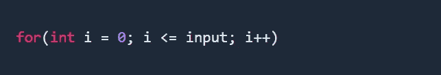

*   对于内环，在递增模式中，随着行的增加，列也增加。例子

*   在这里，我们可以断定 row = = column，所以对于内循环 columns 循环可以写成

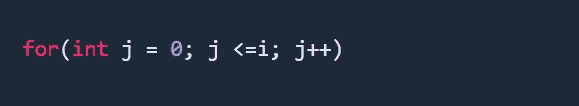

*   **输入尺寸打印示例— 5**

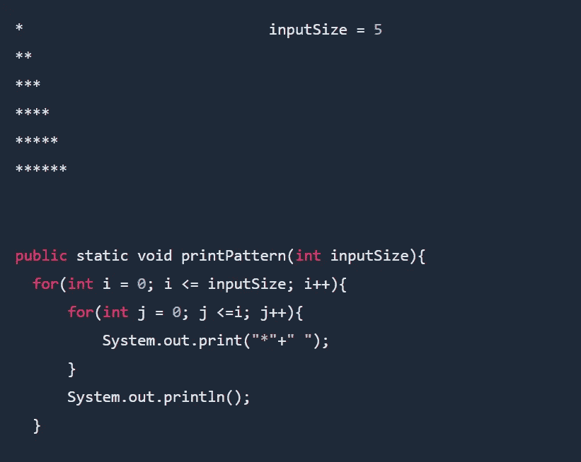

# 2.递减模式

在递减模式中，行越大，列越小

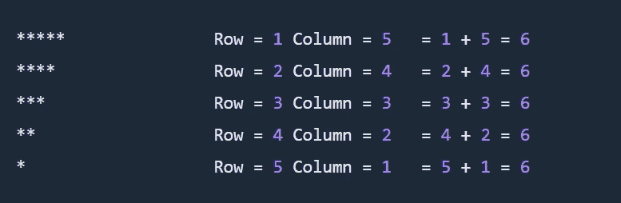

这里，我们可以得出结论，row + column = inputSize + 1，因此对于内部循环列，loop 可以写成

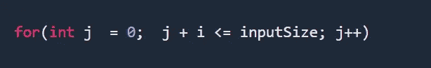

**输入尺寸打印示例— 5**

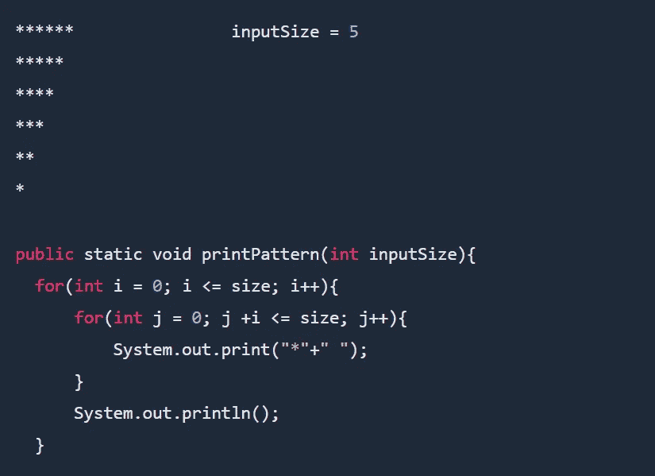

# 3.数字模式

*   递增顺序的数字模式与递增符号模式类似，但我们将打印数字而不是符号。

**数字模式示例— 1**

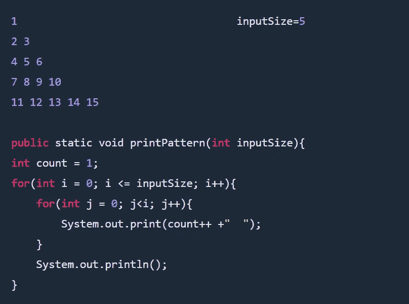

**数字模式示例— 2**

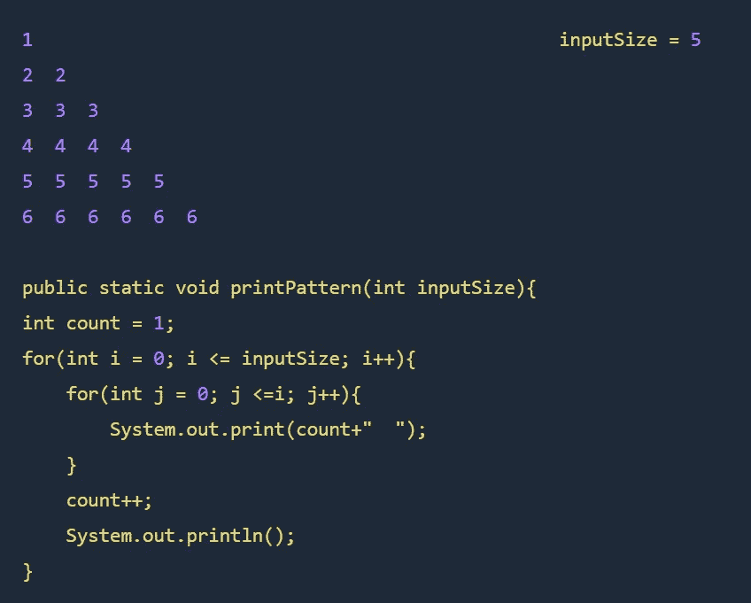

**数字模式示例— 3**

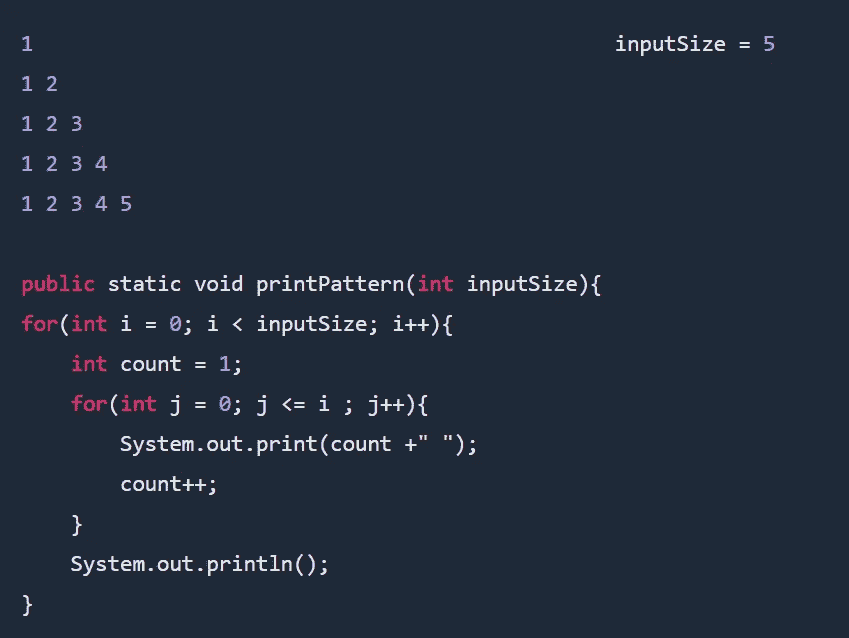

**数字模式示例— 4 —【数字递减模式】**

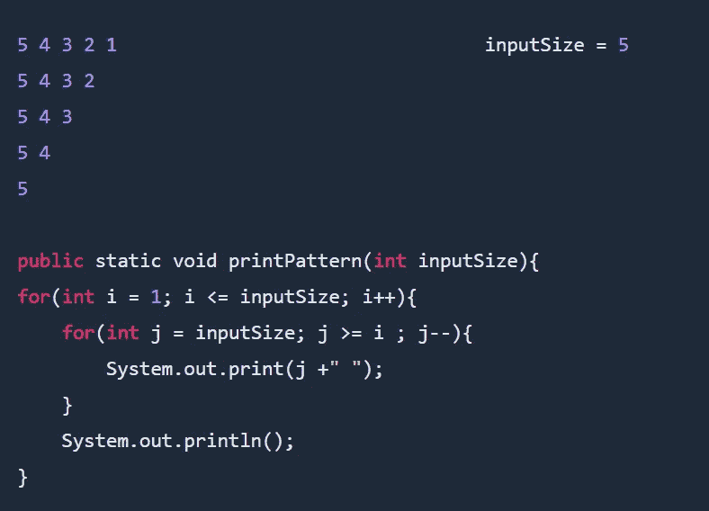

**数字模式示例— 5**

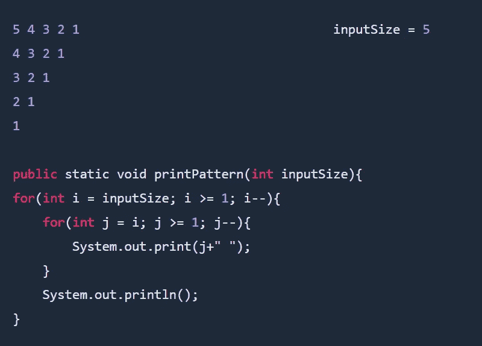

**数字模式示例— 6**

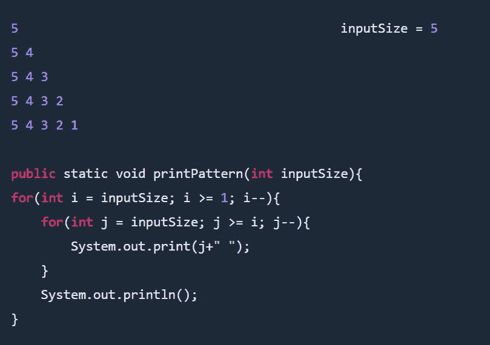

**数字模式示例— 7**

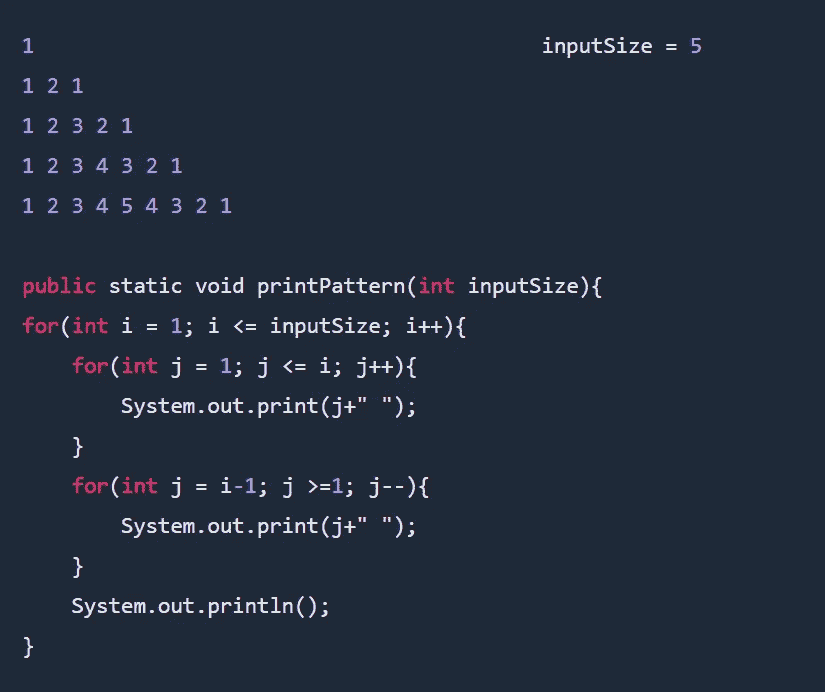

**数字模式示例— 8**

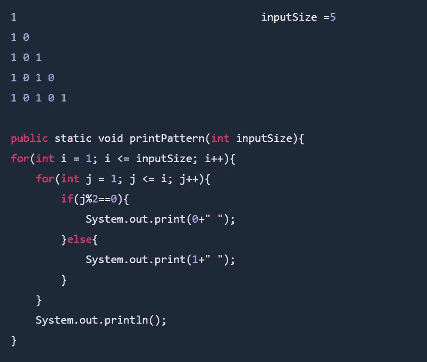

**字符模式示例— 9**

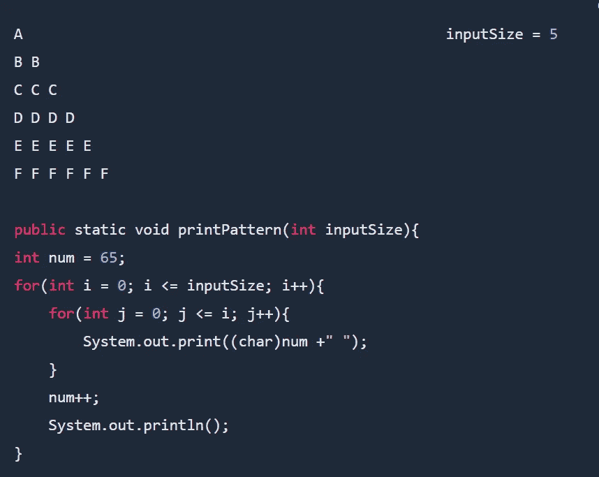

**字符模式示例— 10**

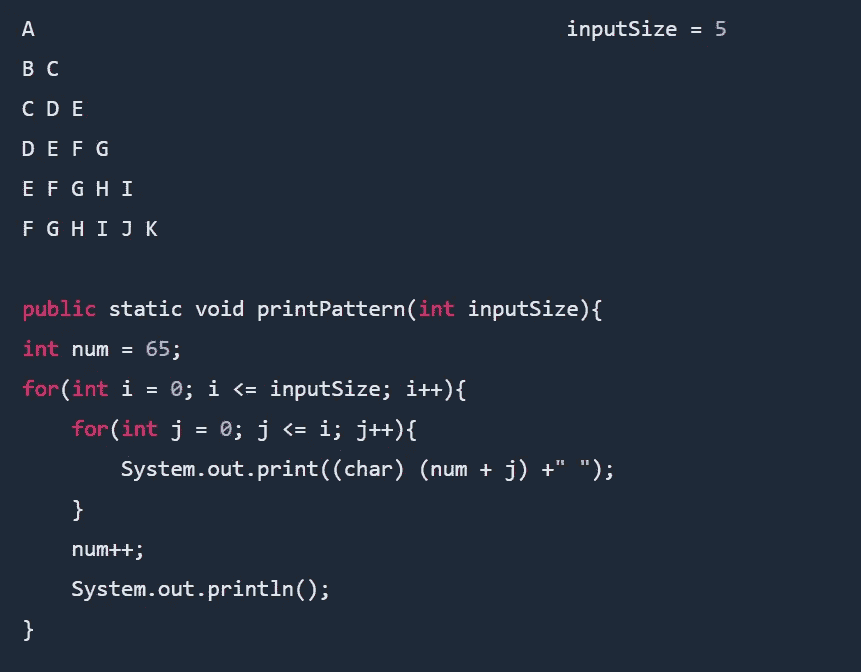

# 4.帕斯卡三角形图案

*   帕斯卡三角形是一个永无止境的等边三角形，其中数字阵列以三角形方式排列。
*   三角形从 1 开始，继续将数字放在它下面的三角形图案中。—记住帕斯卡的三角形没有尽头。
*   帕斯卡三角形是基于 nCr 组合的三角形的一种模式。在哪里

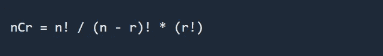

帕斯卡三角形图案

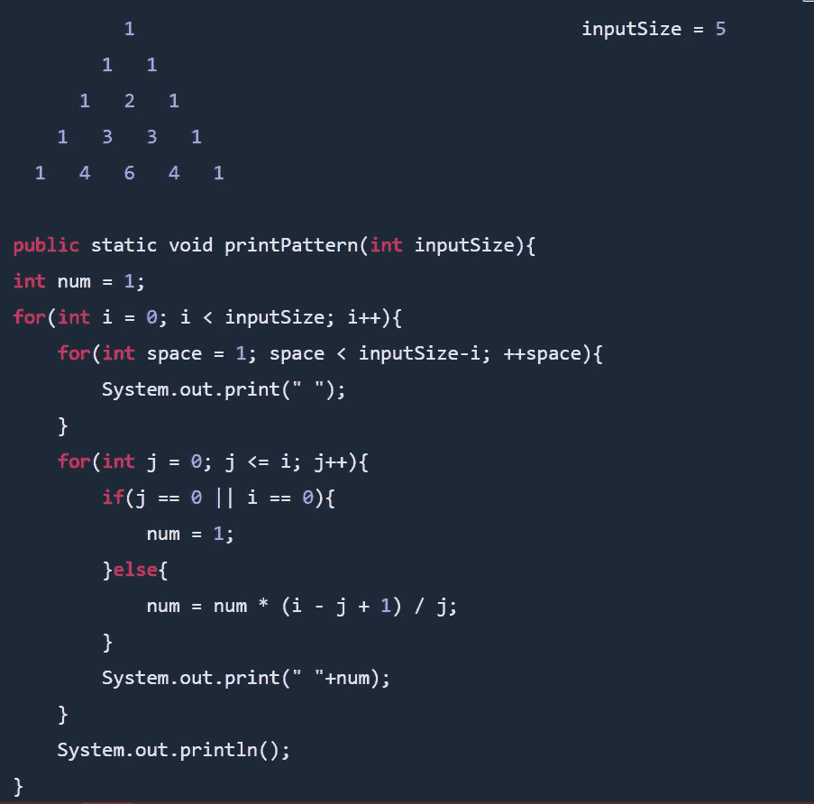

# 5.金字塔图案

**金字塔模式示例— 1**

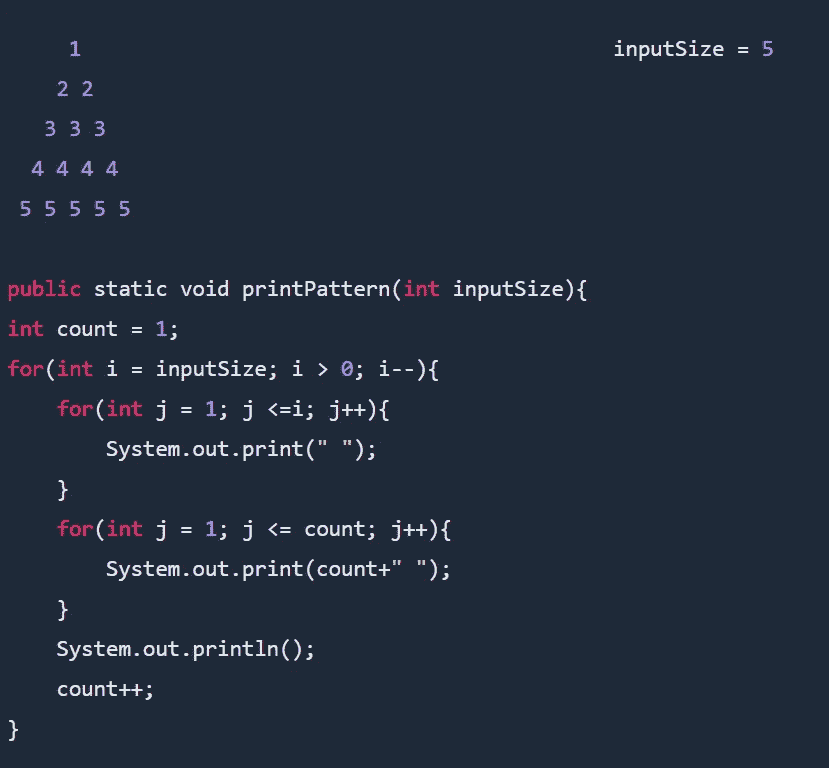

**金字塔图案示例— 2**

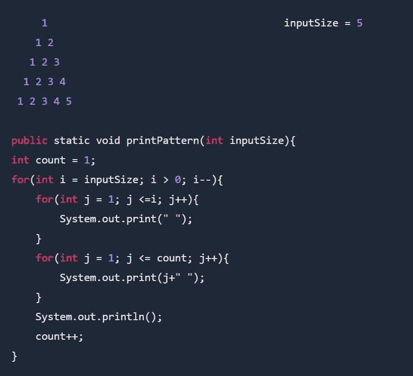

## 6.空间递减模式

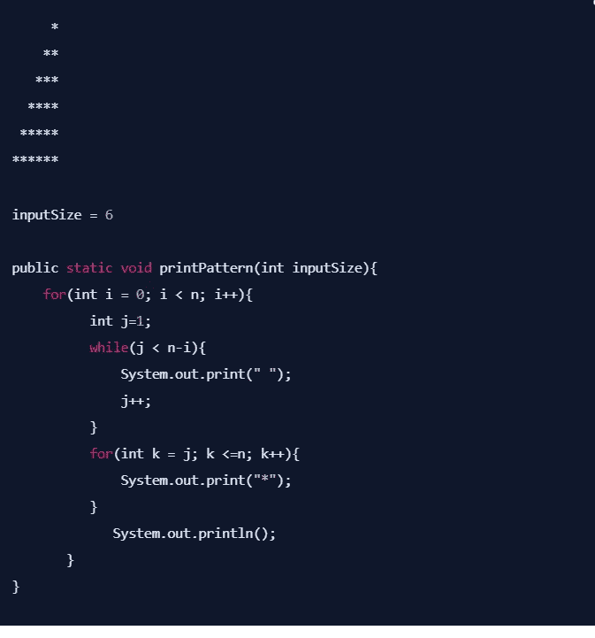

*感谢您的阅读和在这里度过的时光。请喜欢这篇文章，它会鼓励我写更多这样的文章。请分享您的宝贵建议，感谢您的真诚反馈！！*