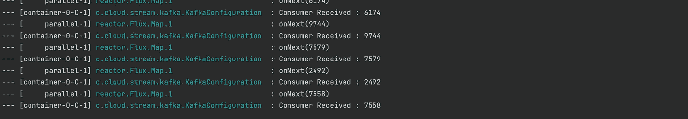
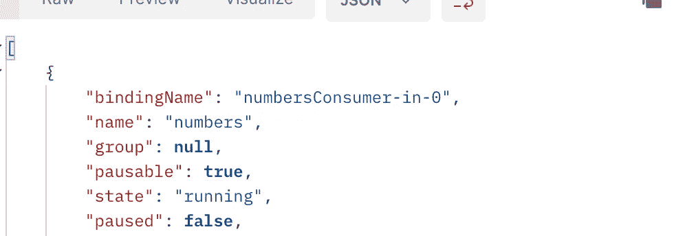
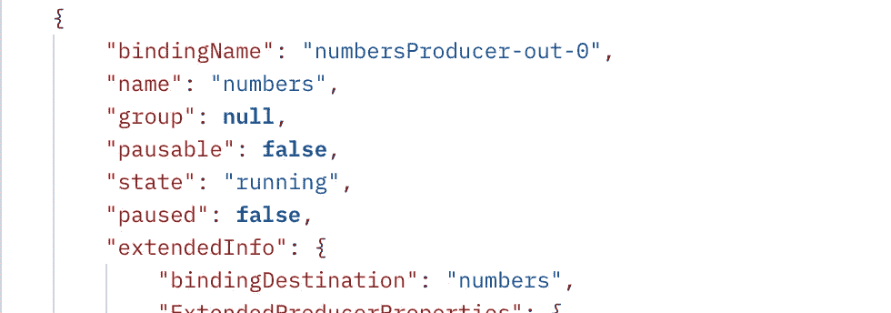
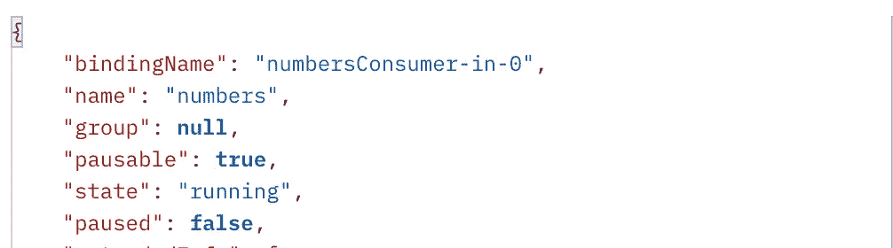
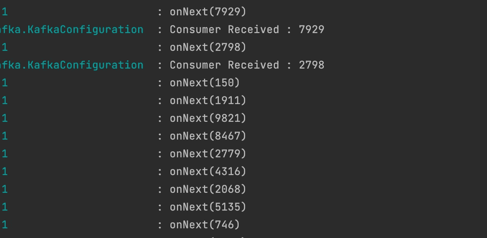
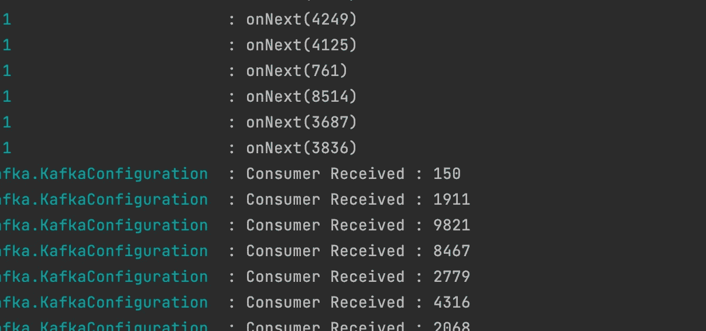

# 《春云流》中使用致动器的卡夫卡消费者暂停/恢复

> 原文：<https://blog.devgenius.io/pause-resume-kafka-consumer-using-actuator-in-spring-cloud-stream-147250055e0d?source=collection_archive---------3----------------------->

> 简单的例子

1.  让我们从添加所需的依赖项开始

```
implementation 'org.springframework.boot:spring-boot-starter-actuator'
```

2.现在让我们在 application.yml 中公开我的绑定配置的 Spring Boot 执行器端点

```
management:
  endpoints:
    web:
      exposure:
        include: health,bindings
```

3.现在写一个简单的卡夫卡生产者和卡夫卡消费者

```
 @Configuration
@Slf4j
public class KafkaConfiguration {
 Random random = new Random();

 @Bean
 public Supplier<Flux<Integer>> numbersProducer(){
  return () -> Flux.interval(Duration.ofSeconds(5)).map(value -> random.nextInt(10000 - 1) + 1).log();
 }

 @Bean
 public  Consumer<String> numbersConsumer(){
  return (value) -> log.info("Consumer Received : " + value);
 }

}
```

4.添加与我们的生产者和消费者相关的配置

```
 spring:
  cloud:
    stream:
      function:
        definition: numbersProducer;numbersConsumer
      bindings:
        numbersProducer-out-0:
          destination: numbers
        numbersConsumer-in-0:
          destination: numbers
      kafka:
        binder:
          brokers: localhost:9092
          auto-create-topics: true
```

主题名称:numbers
我的 kafka broker 正在 9092 端口上运行

5 .现在开始你的动物园管理员和卡夫卡

6.启动您的应用程序

7.你会开始看到消费者的日志



消费者日志

8.现在让我们使用下面的 curl 来尝试在我们的应用程序中配置所有的绑定。

```
curl --location --request GET 'http://localhost:9001/actuator/bindings' \
--data-raw ''
```

响应:我的应用程序中只有 2 个绑定，所以结果将包含如下所示的 2 个绑定



消费者绑定



生产者绑定

**注意:**在上面的响应中，观察 **State** 属性，它指定了绑定的状态。
**pausable**属性指定我们是否可以暂停绑定。您可以看到，对于生产者绑定，pausable 属性被设置为 false，而对于消费者，该属性被设置为 true。
这表明我们只能暂停消费者。

9.现在我们可以尝试使用下面的 curl 来获得特定绑定的结果

```
curl --location --request GET 'http://localhost:9001/actuator/bindings/numbersConsumer-in-0' \
--data-raw ''
```

响应:现在响应将拥有我们请求的绑定数据。



对请求的绑定的响应

9.暂停我们消费者的时间，使用下面的 curl 来暂停消费者

```
curl --location --request POST 'http://localhost:9001/actuator/bindings/numbersConsumer-in-0' \
--header 'Content-Type: application/json' \
--data-raw '{
    "state":"paused"
}'
```

点击上面的卷发给它一秒钟，观察日志，你会停止看到来自消费者的日志



10.现在让我们试着让我们的消费者重新行动起来，使用下面的 curl 来恢复我们的消费者并检查日志

```
curl --location --request POST 'http://localhost:9001/actuator/bindings/numbersConsumer-in-0' \
--header 'Content-Type: application/json' \
--data-raw '{
    "state":"resumed"
}'
```



显示