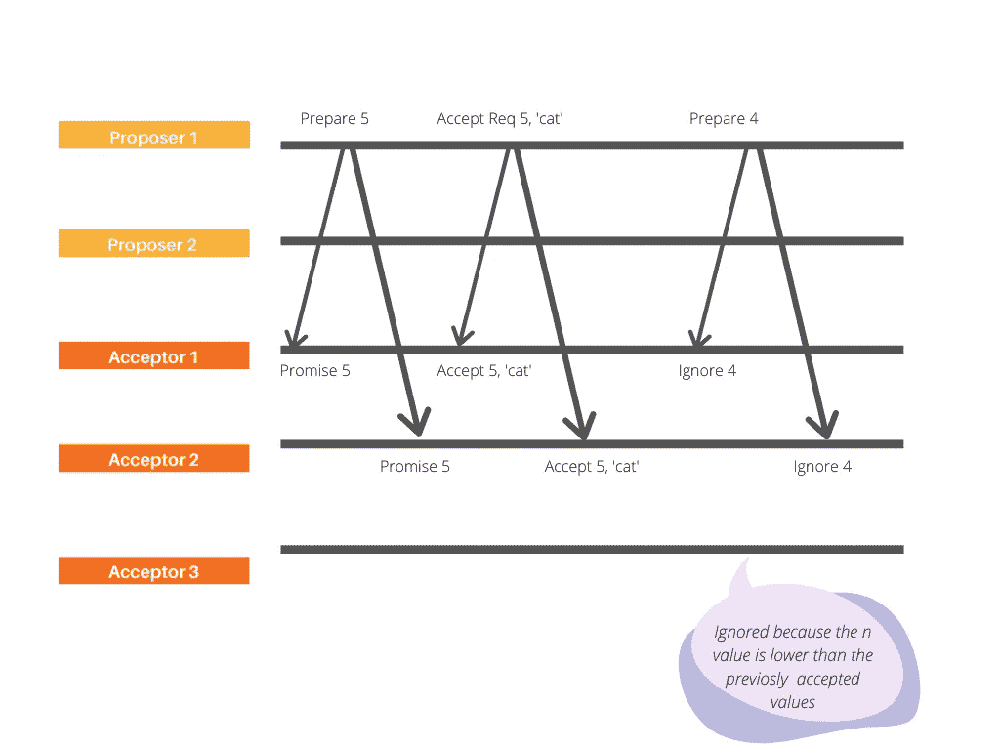

# Paxos 算法解释

> 原文：<https://blog.devgenius.io/paxos-algorithm-explained-a3cc147af20?source=collection_archive---------0----------------------->

自从写了上一篇关于 CAP 定理的文章后，我开始意识到我可能误解了 CAP 定理，一致性和可用性是有可能实现的(？).

虽然 CAP 定理断言在分布式系统中一致性和可用性不能同时实现，但是 CAP 定理用严格的二进制术语定义了可用性和一致性。术语“可用性”被定义为一个连续体，一致性可以分为不同的级别，例如弱一致性、强一致性、读写一致性和最终一致性。通俗地说，CAP 定理认为*强一致性*和*终极可用性*不能同时实现。

为了解决这些限制，图灵奖获奖的 **Paxos 协议**被引入，以最大化此类系统中的可用性和一致性的效率。Paxos 算法帮助系统在存在网络错误和节点故障(可用性)的情况下工作，同时确保一致性。

> Paxos 是一系列分布式算法，用于在不可靠或易出错的处理器网络中解决一致性问题。

Paxos 算法基于*简单多数规则*，该规则能够确保只能获得一致的结果值。该协议提出，如果系统中的大多数节点可用，那么系统作为一个整体是可用的，并且可以保证强数据一致性，这对于可用性是一个很大的改进。

## >>工作原理

本质上，Paxos 协议将每个写请求与一个提议进行比较。就实体而言，Paxos 协议有以下实体:

1.  提议者:接受客户的要求(价值观/提议),并试图说服接受者接受他们提议的价值观
2.  **接受者:**接受提议者提出的某些值，并让提议者知道是否接受了其他值。响应代表对特定提议的投票
3.  **学员:**宣布结果

每个提案可以分为两个阶段:*第一阶段(准备&承诺)*和*第二阶段(接受&接受)。*提议者与接受者两次互动。

1.  **阶段 1:** 提议者选择一个提议号 *n* ，并要求所有接受者接受该*准备请求。*如果接受者接收到编号为 n 的准备请求，并且 n 的值大于其已经响应的所有*准备请求*的数量，则它将保证不接受编号小于 n 的提议。
2.  **阶段 2:** 如果提议者收到大多数接受者对其准备请求的响应(也称为 n ),则它向接受者发送对编号为 n、值为 v 的提议的*接受请求*,其中 v 是收到的响应中编号最高的提议的值。如果接受者接收到一个编号为 n 的*接受请求*，只要它没有响应编号大于 n 的*准备请求*，它就可以接受建议

虽然 Paxos 协议因为协议的完备性而显得复杂，但是协议的主要思想是:提议者首先从大多数接受者那里学习提议的最新内容，然后基于学习到的数量最多的提议形成新的提议(接受请求)。如果提议被大多数接受者接受/投票，它就通过了。因此，它也被称为*多数协议*。

Paxos 协议有其自身的缺点，可以使用 ZooKeeper 的核心算法或 ZAB 协议来解决，但值得自己写一整篇文章。

**TL；DR—**CAP 定理声称网络分区在分布式系统中是不可避免的，并导致一致性和可用性之间的折衷。Paxos 并不一定否定 CAP 定理，而是提出了一个简单的算法来最大化可用性，同时保证一致性。

—

参考资料:

*   [https://lamport.azurewebsites.net/pubs/paxos-simple.pdf](https://lamport.azurewebsites.net/pubs/paxos-simple.pdf)
*   [https://hacker noon . com/exploring-distributed-system-theory-avail ability-and-consistency-e8c 59 e 0875 CD](https://hackernoon.com/exploring-distributed-system-theory-availability-and-consistency-e8c59e0875cd)
*   [https://youtu.be/d7nAGI_NZPk](https://youtu.be/d7nAGI_NZPk)