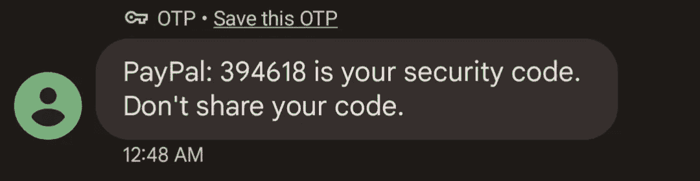
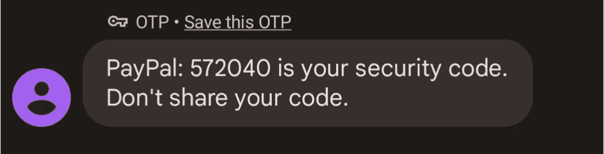
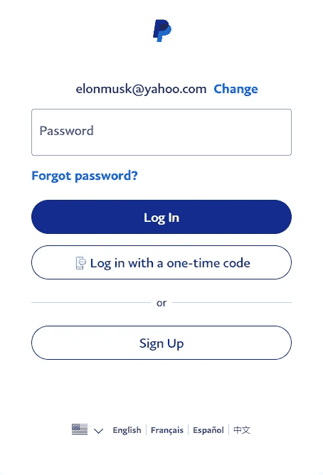
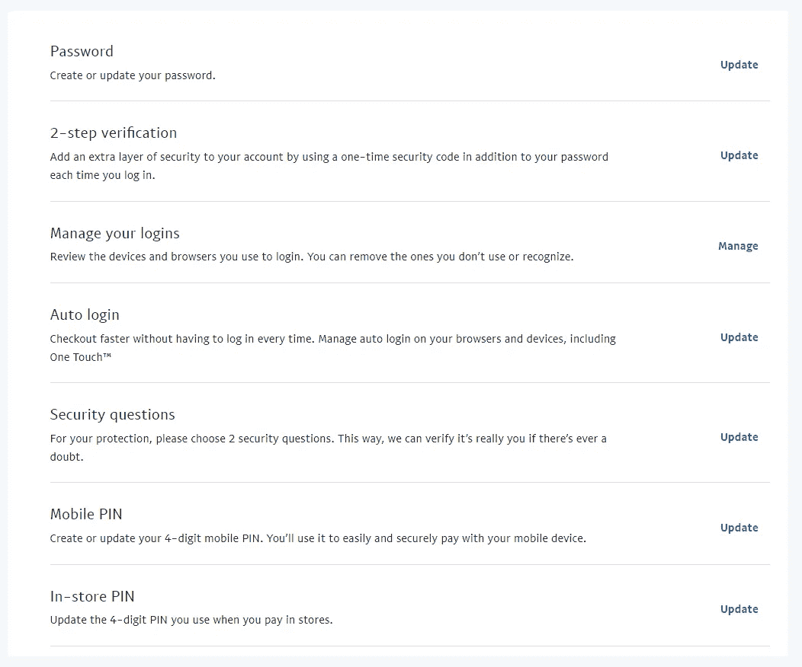

# PayPal 允许通过点击一个按钮绕过双重认证——声称“这是为了保护你”

> 原文：<https://blog.devgenius.io/paypal-allows-bypassing-two-factor-auth-with-a-button-click-claims-its-for-your-protection-ce1d0dc9a28a?source=collection_archive---------0----------------------->

更新 11/28:似乎贝宝可能已经解决了这个问题。对于我和其他一些用户来说,“使用一次性代码登录”按钮已经不存在了。显然，它已经在非美国版本中被删除，现在它也在美国被删除了👏。

# 今天早上醒来时，我收到了一些意想不到的短信:

看来我已经分享了我的代码。

太奇怪了。我不记得我睡觉的时候用过 PayPal。

尽管它发生了。有时，有人会在网站上输入你的电子邮件地址，然后点击“忘记密码”按钮。一次性代码会被发送到您的电子邮件或手机，它会在那里消失，因为黑客(或困惑的人)无法访问我拥有的其他东西。他们不太可能知道我的密码，因为它是由 12 个或更多字符随机生成的序列。

“我只要用我的认证器应用程序启用双因素认证，然后我就不用担心我的 PayPal 会被黑了。”

至少我是这么认为的。

事实证明，即使在 PayPal 上启用了 2FA，也不能防止有人仅凭你的电子邮件地址和短信代码登录你的账户。不需要密码。

没错。在他们无限的智慧中，PayPal(纳斯达克股票代码:PYPL)实现了一种超级方便的登录方法，不需要记住讨厌的密码。

这叫“用一次性代码登录”，很可怕。

只要你输入一个与 PayPal 帐户关联的电子邮件地址，就会出现“使用一次性代码登录”按钮。

我们都讨厌密码，对吗？密码很容易猜，很难记，在不久的将来，世界会很好地摆脱它们。因此，PayPal，一个银行应用程序，提供了一种便捷的方式，通过短信获得一次性代码，无需输入密码就可以进入你的账户。

好吧，如果你真的不想挖掘你的密码，这看起来会很方便。许多网站，如 Slack，Cash App，甚至 Medium，都允许只需向您的电子邮件发送一个一次性代码即可登录。不过，我不喜欢我的银行应用程序有这个功能，尤其是如果它使用的是短信，而短信是[高度黑客化的](https://en.wikipedia.org/wiki/SIM_swap_scam)。让我先禁用该功能，这样我就必须始终使用我的密码和验证器应用程序代码登录。

你不能。

没错，那个小小的“用一次性密码登录”按钮就是*一直*在那里。对所有人来说。任何人。一直坐在常规的“登录”按钮下面(只要你用的是 PayPal.com 而不是 PayPal 应用程序)。即使您启用了 2FA，任何人都可以在没有密码的情况下登录您的帐户。

最后一部分很重要，需要重申清楚:**“使用一次性密码登录”按钮完全绕过了您帐户上的所有其他安全措施，包括双重认证。**

因此，如果你在 PayPal 账户上设置了 2FA，比如说，谷歌认证应用程序或 USB 安全密钥，你可能根本就没有设置它。“用一次性密码登录”按钮(应该叫做*让我进来*按钮)采取了一种完全不同的认证途径，绕过了正常的**密码**或**密码和令牌**认证途径。这是一条完全独立的路线，只需要一个一次性的 SMS 代码，这已经被一次又一次地证明是一种不安全并且容易被黑客攻击的认证方法。

管他呢，对吧？像 PayPal 这样的银行巨头不可能有这种完全不安全和短视的功能，而没有计划去摆脱它或为它的存在找到一些借口，对吗？

不对。PayPal 对这一功能几乎没有什么可说的，除了“这一功能是为我们客户的 ***保护*** 而永久启用的。”

在 paypal-community.com 论坛上，一个名为 Only1KW 的用户在 2021 年 11 月 1 日发起了一个主题为“[我如何禁用一次性代码](https://www.paypal-community.com/t5/Managing-Account/How-do-I-disable-one-time-codes/td-p/2835147)”的帖子。

在这个论坛上，只有 1KW 对一次性密码功能表示失望，询问如何禁用它，以便登录时必须使用密码。在接下来的回复中，不同的 PayPal 论坛版主试图提供一个解决方案，要么[提供一个不同问题的解决方案](https://www.paypal-community.com/t5/Managing-Account/How-do-I-disable-one-time-codes/m-p/2836255/highlight/true#M15760)，要么根本不提供解决方案。

PayPal_Natasha 声明一次性短信密码是永久启用的，用于“保护”客户。

论坛的帖子持续了几个页面，用户对这个功能的想法犹豫不决，这个功能应该是为了保护客户，而实际上它达到了完全相反的效果。上面显示的 [PayPal_Natasha](https://www.paypal-community.com/t5/user/viewprofilepage/user-id/9239383) 的回复是 PayPal 版主在这个帖子上的最后一个回复。

虽然一次性密码在网站和应用程序中很常见，但如果需要，它们**总是**伴随着另一个身份验证因素。虽然你只需要一个电子邮件或短信代码就可以登录你的 Slack 或 Cash 应用程序，但在任一应用程序上启用双因素身份验证意味着现在需要第二个身份验证因素**。**使用 PayPal，这只是一个建议。

当看到 PayPal 设置中的“安全”标签时，难怪用户和客服代表会对不同的安全设置感到困惑。

PayPal 在线帐户设置中的“安全”标签。

除了更改密码、启用两步验证和管理您登录的设备等典型的安全设置之外，PayPal 还有四项额外的安全设置，其中没有一项包括启用/禁用一次性密码登录。事实上，可以说这些额外的设置只是给 T4 提供了更多未经授权访问你的贝宝账户的途径。众所周知，安全问题是无效的，并且容易猜测，谁知道为什么两种不同类型的 pin 真的是必要的。

> 在 PayPal 上启用 2FA 并不能防止有人仅用你的电子邮件地址和短信代码登录你的账户。

"我的朋友的 sim 卡被黑了，他们进入了她的贝宝."用户 Mmcgo1 说。"出于这个原因，我已经从贝宝上删除了我的银行账户."

“如果有人偷了我的手机，他们可以立即用 Paypal 进行购买，而不需要知道我的密码，或者能够通过我手机的登录屏幕，因为这些一次性的文本通知会直接在锁定屏幕上弹出。除了潜在的罪犯之外，谁会从中受益呢？”用户 adampcompton 抱怨道。这是真的——默认情况下，大多数新的 iPhones 和 Android 手机都会在锁屏上显示你信息的实际内容。我强烈建议您在手机设置中禁用此功能。

PayPal 需要对用户设置的账户进行双重认证。使用一次性代码登录的选项至少可以与第二个身份验证因素配对，例如安全问题或 PIN 代码。当用户已经在他们的账户上设置了 2FA 时，允许使用单一的、不安全的认证因素登录是不负责任的和危险的，并且是在浪费人们的钱。

与此同时，唯一的办法就是关闭你的贝宝账户。