# PayPal 与 Spring Boot 的整合

> 原文：<https://blog.devgenius.io/paypal-integration-with-spring-boot-f1e297d76336?source=collection_archive---------0----------------------->

如今，许多人都在使用其中一种支付网关进行支付。无论我们是通过网络购物还是支付账单，总会涉及到这样或那样的支付网关。作为全栈开发人员或后端开发人员，我们总是想知道如何将支付网关与我们的应用程序集成在一起。这篇文章将帮助你开始学习。

待办事项列表:

创建一个 PayPal 开发者帐户

创建测试应用程序

创建一些测试用户的电子邮件/密码，信用卡详细信息等，以测试支付。

解释 PayPal API 的工作原理。

创建 Spring MVC 应用程序

遵循 XP 技术来实现和测试集成。

所以，不浪费任何时间，让我们开始吧。

# 创建 PayPal 开发者帐户:

用 PayPal 创建一个开发者账户非常简单。我们只需要提供一个电子邮件和密码就可以开始了。访问 [PayPal 开发者](https://developer.paypal.com/)网站，点击登录仪表板。你可以点击“注册”按钮。创建一个没有麻烦的开发者帐户的关键是不要把国家从“美国”改为“美国”,只需提供电子邮件和密码。

使用新创建的凭据登录后，您将被重定向到开发人员控制面板。这是我们作为开发者可以尝试不同事物的领域。

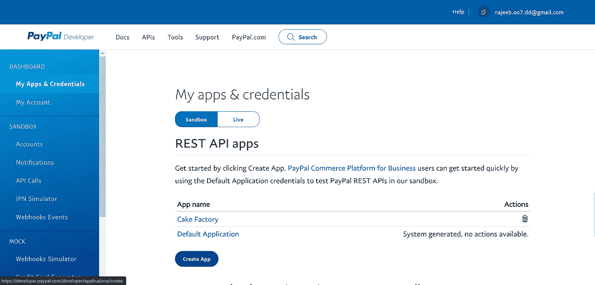

开发者仪表板

这是开发人员仪表板的一般外观。在主内容区，我们可以看到我们可以选择创建一个应用程序，可以与贝宝 API 互动。在左侧，我们可以看到我们有许多其他选项。重要的选项是“沙箱”->“帐户”部分，它让我们用自动生成的模拟数据创建测试用户。

点击“创建应用程序”按钮创建应用程序。给出一个名称，并选择允许应用程序接受付款的商家选项。

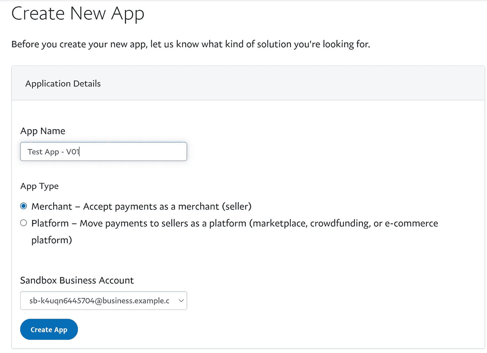

一旦应用程序被创建，你将会看到一个包含客户端 id 和客户端密码的页面。记下来。我们将使用这些凭证从我们的应用程序连接到 PayPal。记住秘密是默认隐藏的。您必须点击显示链接，使客户端密码出现在页面上。一旦应用程序被创建，让我们创建一些测试用户开始付款。

# 创建沙盒测试帐户

让我们导航到[“沙盒”——>“账户”选项卡](https://developer.paypal.com/developer/accounts/)。

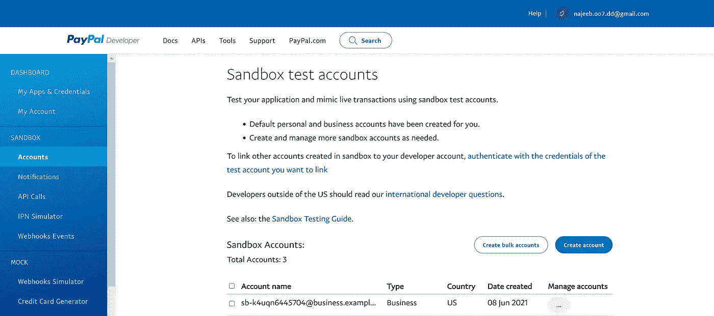

沙盒>帐户

这是我们可以用自动生成的模拟数据创建测试帐户的地方。这些帐户将像真正的用户一样通过你的应用程序进行支付。让我们单击“创建帐户”按钮，并选择帐户类型为“企业”。保留国家/地区不变，然后单击创建。

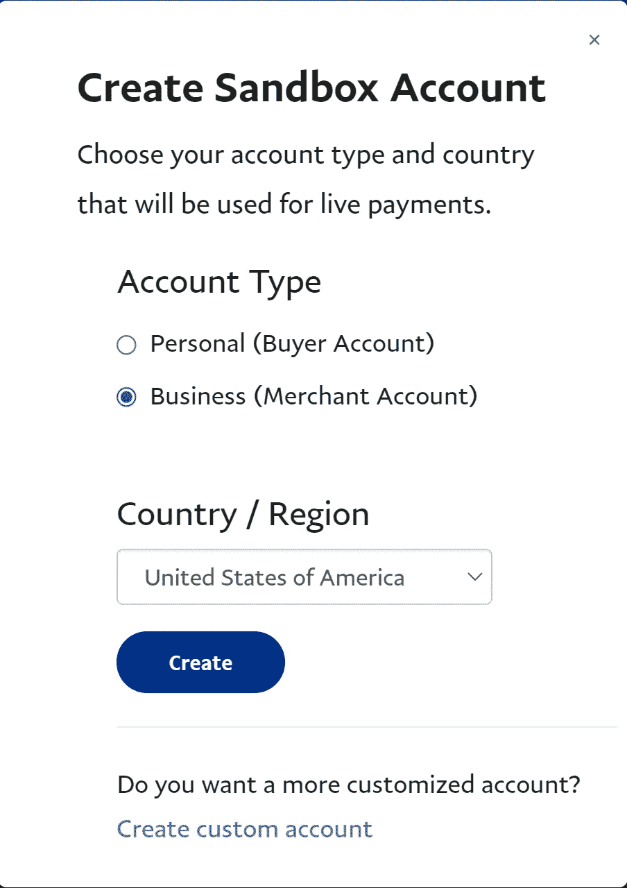

帐户创建后，您可以管理您的帐户。

从“管理帐户”部分单击“查看/编辑帐户”选项。

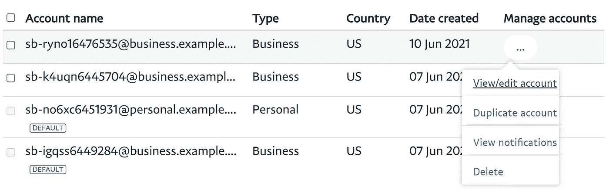

您将获得创建的测试用户的详细信息，如名字和姓氏、电子邮件地址、系统生成的密码以及“个人资料”选项卡中的其他详细信息。您可以将选项卡切换到“Funding”来查找模拟信用卡的详细信息，该信息是与测试帐户余额一起为您生成的。记下我们将在测试中使用的用户凭据(通常是电子邮件和密码，但您也可以使用信用卡信息)。

这些都是我们将需要在我们的应用程序，以促进支付选项。是时候开始使用我们简单的 Spring MVC 应用程序了。

在我们开始实际的应用程序之前，我想提醒一下，我们使用 Rest APIs 与 PayPal 服务器进行交互。因此，我们总是可以从头开始创建自己的实现并开始付款。但是这个过程太麻烦了，正因为如此，PayPal 为我们提供了 SDK 来轻松快速地开始集成。PayPal SDK 的使用让我们的生活变得更加轻松，所以我们会使用它。

# PayPal 结账

PayPal 提供了一个基于 PayPal APIs 的产品“PayPal Checkout ”,用于将他们的支付服务与您的应用程序集成。在我们开始实际编码之前，让我们看看 PayPal 结账工作流程在一个非常普通的情况下是怎样的:

**顾客下单:**顾客点击*用 PayPal 结账*按钮。

**客户被重定向至 PayPal 网站:**客户被重定向至 PayPal 网站以完成交易。

**客户登录 PayPal 账户:**客户必须登录 PayPal 账户才能完成交易。支付系统使用他们的 PayPal 账户中的账单和运输信息。

**顾客返回结账页面:**顾客被重定向回商店的结账页面，以查看订单。

**客户下单:**客户下单，订单信息提交给 PayPal。

**PayPal 结算交易:** PayPal 接收订单并结算交易。

我们需要执行两个主要步骤来完成支付。“创建订单”，然后“捕获订单”。“创建订单”步骤从客户下订单开始，到客户在 PayPal 上发起交易后被重定向回结账页面结束。创建订单后，最后一步是批准订单，这就是“捕获订单”的工作。“捕获命令”通常包括上述步骤中的最后两个步骤。以下是供你进一步阅读的参考资料。

[贝宝结账 API](https://developer.paypal.com/docs/business/checkout/)

[用 JavaScript 设置结账流程](https://developer.paypal.com/docs/business/checkout/set-up-standard-payments/)

[从服务器端创建订单 API 调用](https://developer.paypal.com/docs/business/checkout/server-side-api-calls/create-order/)

[从服务器端捕获订单 API 调用](https://developer.paypal.com/docs/business/checkout/server-side-api-calls/capture-order/)

# PayPal SDK

PayPal SDK 几乎出现在所有主要的编程语言中。对于本文，我将使用 Java SDK。对于 JavaScript SDK，PayPal 更进一步，为我们提供了“[智能按钮](https://developer.paypal.com/docs/checkout/)”。这个按钮从我们这里提取了很多东西，如果你看一下 PayPal 文档中提供的图片，你会看到点击一个按钮就会发生很多事情。

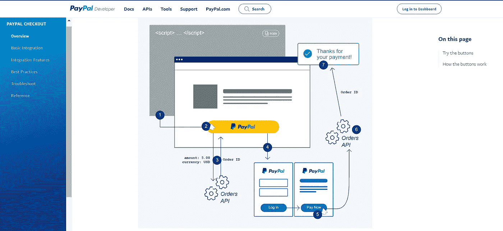

现在让我们创建一个自定义的普通按钮，并使用 PayPal Java SDK 来执行完全相同的任务。

# 创建 Spring Boot 应用程序

为了使用 PayPal Java SDK，我们将使用 maven 依赖项，我们可以从这里找到。

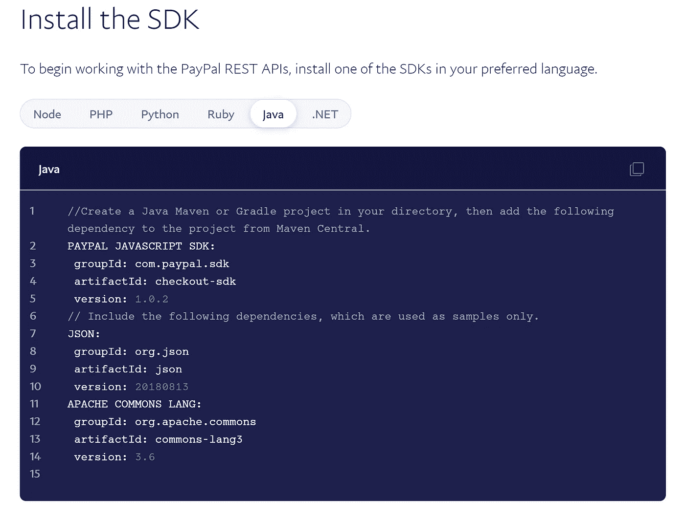

让我们创建一个 spring boot 项目。因为简单，我将使用 Mustache 作为 UI。

[应用程序的 Git 存储库](https://github.com/NajeebArif/PayPal-Checkout-Spring-Boot)

首先让我们配置您的 pom.xml 或 build.gradle 文件

我们的应用程序将非常简单。我们将有一个索引页面，用户可以输入一个金额，并用贝宝支付，以启动贝宝结帐过程。**您可以在两个不同的步骤中打破“创建订单”&“捕获订单”，但我将在一个请求中执行这两个请求。**

让我们创建一个*IndexControllerTest.java*并编写一个测试用例来检查当我们在“/”上执行 GET 时是否返回了视图命名索引。为了让它工作，我们将创建一个 IndexController.java，用控制器和请求映射对其进行注释。让我们添加第一个测试用例:

这个单元测试将会失败，因为我们还没有创建视图。(我会假设你熟悉像 TDD 这样的 XP 实践，所以我就不赘述了)。让我们在模板文件夹中创建一个“index.mustache ”,并在控制器中创建一个对应于 GetMapping 的方法。

构建原始索引页面的时间到了。我将为它使用引导。

让我们创建一个表单来提交一个金额来模拟订单总值，我们将通过 SDK 将这个金额值发送到 PayPal APIs 来创建一个订单。

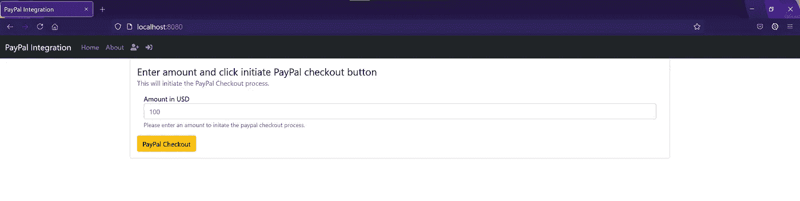

一旦我们准备好了表单，我们就可以在服务层上工作了。让我们创建一个支付服务接口(它碰巧也被命名为 PaymentService.java ),并添加一个实现为 PayPalPaymentService.java。

我们的界面应该能够接受需要发送到 Paypal 的总金额，以创建一个订单请求，它还应该发送一个 url 到 Paypal，以便它可以重定向用户到我们的应用程序一旦订单被创建。一旦我们使用 PayPal SDK 执行创建订单请求，我们将从 PayPal 获得一个订单 Id 以及一组 URL，这些 URL 可用于进一步对新创建的订单执行不同的操作。有关实际订单 API 的更多详细信息，请参考此链接。[订购 API 码头 V2](https://developer.paypal.com/docs/api/orders/v2/) 。

一旦我们有了 PayPal 生成的订单 id，我们就可以用它来捕捉订单并完成支付。

在继续之前，了解订单的 3 个主要“状态”很重要。

CREATED:订单创建时的第一个状态——“创建订单”操作的结果。

已批准:订单一旦创建，需要在执行的最后阶段，即“抓取订单”之前进行批准

已完成:一旦在“获取订单”阶段后处理了付款。

因此，当我们第一次创建订单时，它进入已创建状态，然后我们需要批准订单，然后才能使用“捕获订单”操作完成订单。不要担心，当我们第一次创建订单时，我们也会从 PayPal 获得一个批准订单的链接。我们可以使用该链接来批准订单。

订单还有其他状态，但是为了本文的目的，我们将坚持上面提到的三种状态。

# 创建订单

让我们从如何使用 PayPal SDK 创建订单开始。 [PayPal Java Checkout SDK](https://github.com/paypal/Checkout-Java-SDK) 也提供了一些代码片段，告诉我们如何使用简单的 Java 代码来实现这一点。但是我们将利用 Spring 提供的特性。

首先，我们将编写一个简单的控制器方法，它将从我们的用户界面接受表单参数，并使用它来创建订单。我们还将把 HttpServletRequest 注入到我们的方法中，这样我们就可以构建一个返回 url，一旦订单在订单创建后被批准，PayPal 就可以将我们重定向到这个 URL。

因此，让我们创建一个有序控制器，并向它添加一些方法(现在我将跳过测试用例，但在实际项目中，请永远不要偏离 XP 实践)

是时候注入支付服务，并用两个参数——amount 和 return URL——将订单创建过程委托给它了。

CreatedOrder 只是一个 POJO:

Aaarrrggghhh..我应该在这篇文章中使用 Kotlin。好吧，我们继续。

我们的支付界面现在看起来像这样:

现在是着手实施的时候了。

在使用 PayPal SDK 类进行实际的 API 调用之前，我们需要实例化 PayPalHttpClient 的一个实例。要做到这一点，我们将不得不使用在贝宝上创建的应用程序的客户端 Id 和秘密。让我们将它们添加到 application.yml 文件中。当然，我将只添加这些占位符，并在运行我的应用程序时提供实际的客户端 id 和密码。在现实世界中，您不应该在应用程序配置文件中硬编码任何敏感信息，而是应该从某种保险库中提取这些信息，并作为命令行参数提供给应用程序。注意:*如果你正在处理高度敏感的信息，那么将这些信息长时间保存在应用程序的内存中也被认为是一个安全漏洞，因此你应该避免将敏感信息长时间保存在内存中。*在 application.yml 中定义这些属性的时间

请记住，现在你将必须提供应用程序的环境变量，以提供“paypal.clientId”和“paypal.secret”值。

是时候让我们的支付实现意识到这些属性了:

这里，我们将 application.yml 文件中的值注入到这个类中，并使用它们来实例化 PayPalHttpClient 的一个实例。这个类稍后将为我们执行 API 调用。

现在事情从这里开始变得相当简单了。我们首先必须创建一个 OrderRequest(如果您引用 [Order API V2](https://developer.paypal.com/docs/api/orders/v2/) 这一有效负载来创建订单)，用必需的参数填充它，例如 **intent** *(这个请求的意图是什么)*、**购买单位** *(用于指定必须扣除多少钱以及使用哪种货币)*和**应用程序上下文** *(用于指定返回 url)。*

一旦有效负载被公式化(*记住 SDK 为我们提供 POJOs 来公式化实际的有效负载*)，我们用创建的有效负载创建一个 OrderCreateRequest，并使用我们的 PayPal 客户端执行“创建订单”流。从响应中，我们可以提取订单实体，并提取订单 ID 和批准链接，以便进一步处理。还记得订单状态吗？

一旦创建订单方法完成，我们就有了订单 ID 和批准订单的链接，这样我们就可以从“捕获订单”流程开始。回到我们的控制器，让我们将用户重定向到批准链接，以便订单获得批准。

一旦请求被重定向到批准 URI，PayPal 会识别该请求并批准与之相关的订单，然后将请求从 PayPal 服务器重定向到我们在创建订单请求时在应用程序上下文中设置的“返回 URL”。在我的例子中，它将[*http://localhost:8080/orders/capture*](http://localhost:8080/orders/capture)*，spring 将自动调用映射的控制器方法进行 url 映射。这里需要记住的一件重要事情是，当 PayPal 在订单被批准后将请求重定向到“返回 URL”时，它会将订单 id 作为请求参数发送，其键名为**“token”**，因此我们将在控制器方法中捕获该参数，并使用该订单 id 通过执行“捕获订单”流程来完成订单。*

*我在这里使用订单 id 将它放在模型中，以便它可以显示在订单页面中。*

*转到 captureOrder 实现。没有比这更简单的了。*

*是的，该方法是在付款接口中定义的。*

*我们通过将 orderId 传递给其构造函数来创建一个 **OrdersCaptureRequest** ，并使用我们的 paypal 客户端来执行请求。*

*现在我们已经设置好了一切，让我们测试我们的应用程序。我们走吧。*

# *测试支付*

*我们用 500 美元吧*

*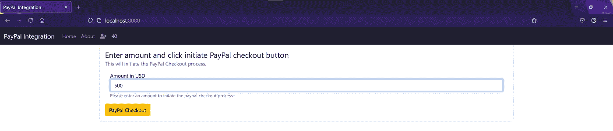*

*点击结账的时间:*

*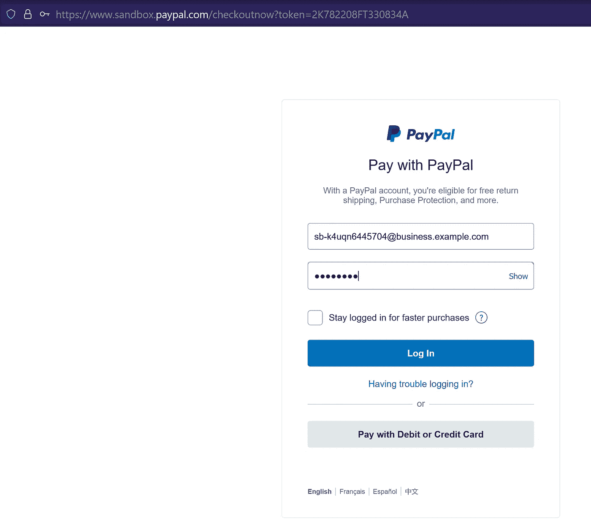*

*让我们提供我们创建的测试用户的凭证(还记得 John Doe 吗，PayPal 为我们创建的使用自动生成的一堆值。是啊，那家伙。)*

*点击登录后，我们将被重定向到贝宝网页*

*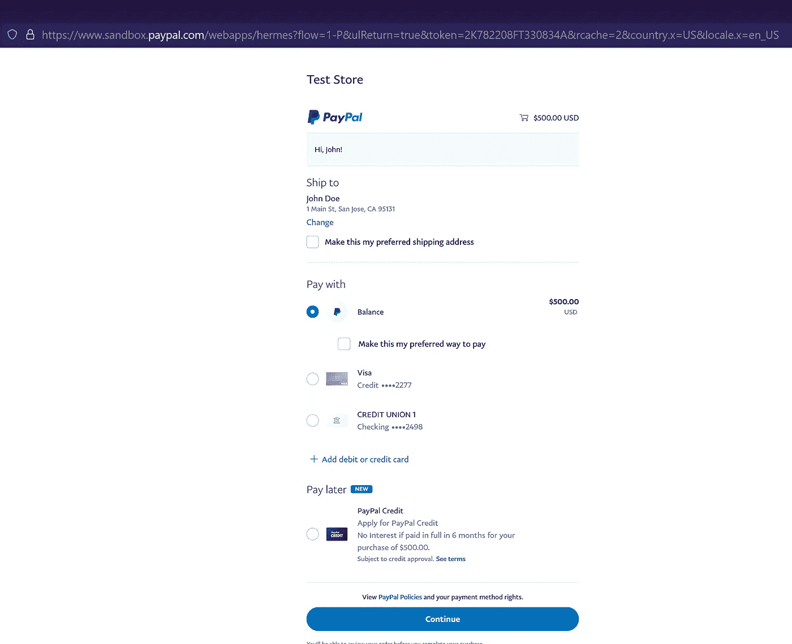*

*在此页面上，用户可以选择送货地址，也可以选择使用不同的支付方式，但我们会坚持使用贝宝余额，并将点击继续。*

*完成所有工作后，我们被重定向到订单页面以查看订单 id*

*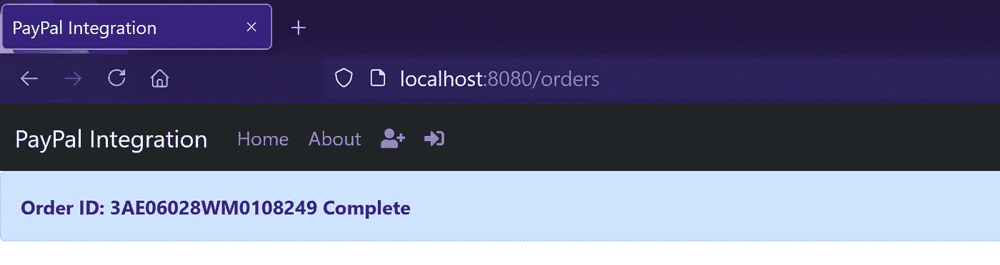*

*是的，你可以设计一个精彩的网页，但我只是想展示整个流程。
出于审计目的，还建议将一些方面的日志订单细节写入某种后端存储中。*

*伙计们，就这样了。如果你需要学习如何将 Paypal 与单页应用程序集成，请告诉我。非常感谢您的反馈。如果你认为某件事可以改进。*