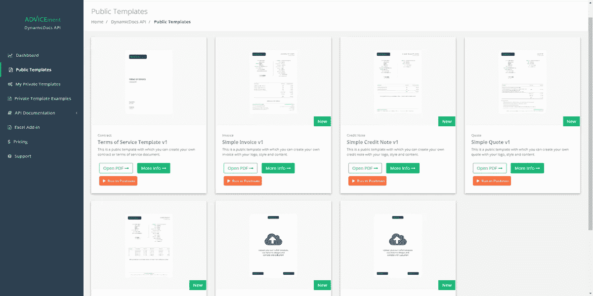
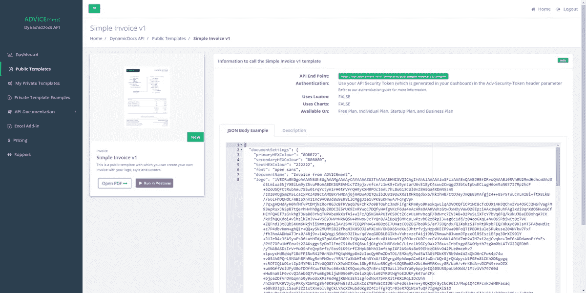
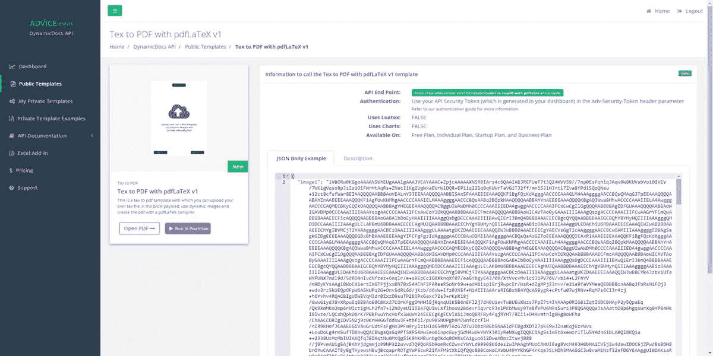
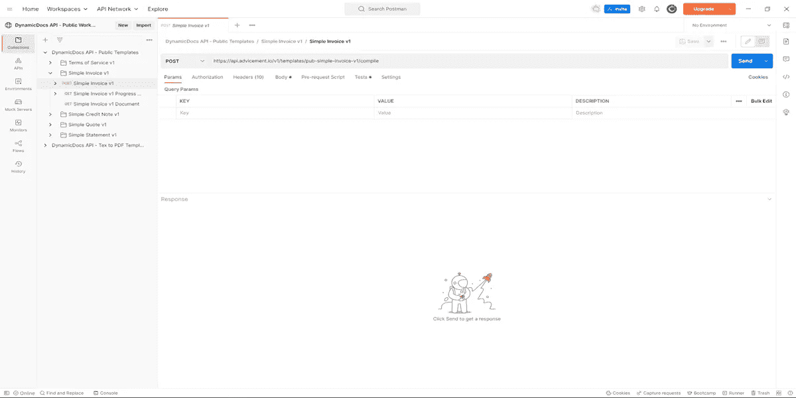

# 使用现成的模板和 JSON to PDF API 简化 PDF 生成

> 原文：<https://blog.devgenius.io/pdf-generation-made-easy-using-ready-made-templates-and-json-to-pdf-api-aed4e9efb5f6?source=collection_archive---------11----------------------->

本·格里菲斯在 [Unsplash](https://unsplash.com?utm_source=medium&utm_medium=referral) 上拍摄的照片

[DynamicDocs API](https://advicement.io/dynamic-documents-api) 是基于 LaTeX 的 JSON to PDF API，它提供了一种快速批量生成 PDF 文档的方法，能够在模板中包含图形和逻辑。在本文中，我们将解释 API 的新特性— [JSON to PDF Templates](https://advicement.io/dynamic-documents-api/json-to-pdf-templates) ，它允许用户使用现成的模板生成 PDF。

JSON 到 PDF 模板是现成的模板，可用于所有计划(包括免费计划)。使用 JSON to PDF 模板是开始使用 DynamicDocs API 最简单的方法，因为不需要 LaTeX 知识。相反，这些模板的内容由 API 请求中的 JSON 有效负载控制。用户只需编辑与他们希望创建的模板类型相对应的预定义 JSON 有效负载。此后，用户使用他们的 JSON 数据有效负载调用 API，并能够下载新创建的 PDF 文档。

[DynamicDocs API — JSON 到 PDF 模板](https://advicement.io/dynamic-documents-api/json-to-pdf-templates)

此外，这些 PDF 文档是完全动态和可定制的。用户可以在 JSON 有效负载中包含他们的文本、数据、颜色、LaTeX 代码片段(如果需要)和以 Base64 编码的图像。这允许创建真正动态的文档，这些文档在几秒钟内生成。JSON to PDF 模板的缺点是用户只能使用当前可用的模板。在接下来的几个月里，我们将致力于扩展当前的模板库。

# 目前有哪些 JSON 转 PDF 的模板？

在撰写本文时，目前有七个模板可供 DynamicDocs API 使用，将来还会添加更多。其中包括五个简单模板和两个 Tex 到 PDF 模板。

## 简单模板

简单模板系列包括日常业务和个人使用的基本模板。其中包括[简单发票模板](https://advicement.io/dynamic-documents-api/json-to-pdf-templates/pub-simple-invoice-v1)、[简单对账单模板](https://advicement.io/dynamic-documents-api/json-to-pdf-templates/pub-simple-statement-v1)、[简单报价模板](https://advicement.io/dynamic-documents-api/json-to-pdf-templates/pub-simple-quote-v1)、[简单贷方通知单模板](https://advicement.io/dynamic-documents-api/json-to-pdf-templates/pub-simple-credit-note-v1)、[简单服务条款模板](https://advicement.io/dynamic-documents-api/json-to-pdf-templates/pub-terms-of-service-v1)。每个模板页面都提供了一个 API 端点和一个 JSON 负载示例。有关可用模板的完整列表，请访问我们的 [JSON 到 PDF 模板](https://advicement.io/dynamic-documents-api/json-to-pdf-templates)页面。

[简单发票模板](https://advicement.io/dynamic-documents-api/json-to-pdf-templates?type=invoice)

## Tex 到 PDF 模板

[Tex to PDF](https://advicement.io/dynamic-documents-api/json-to-pdf-templates?type=tex+to+pdf) 模板范围由两个通用模板组成，允许用户上传自己的 Tex 文件，JSON 有效负载中包含 Base64 编码的图像。之后，使用通过 [PDFLaTeX 模板](https://advicement.io/dynamic-documents-api/json-to-pdf-templates/pub-tex-to-pdf-with-pdflatex-v1)或 [LuaLaTex 模板](https://advicement.io/dynamic-documents-api/json-to-pdf-templates/pub-tex-to-pdf-with-lualatex-v1)可用的两个编译器之一生成 PDF。

[Tex 转 PDF 模板](https://advicement.io/dynamic-documents-api/json-to-pdf-templates?type=tex+to+pdf)

# 免费试用 JSON 到 PDF 模板

DynamicDocs JSON 到 PDF 模板目前可以通过 ADVICEment.io 直接获得。用户可以[注册一个账户](https://advicement.io/sign-up)，并自动获得一个免费计划。免费计划允许用户创建有限数量的每月 API 调用。有关不同计划的更多信息，请访问 [DynamicDocs 定价页面](https://advicement.io/dynamic-documents-api/pricing)。

# Postman 公共工作区提供 JSON 到 PDF 模板集合

[DynamicDocs API Postman-Public Workspace](https://www.postman.com/advicement/workspace/dynamicdocs-api-public-workspace/collection/8428379-a75fccff-226d-4a68-9ea4-4af37c26f126)是一个专用的 Postman workspace，面向希望与 dynamic docs API 集成的用户。公共工作区消除了与 DynamicDocs API 集成的任何困难，因为它提供了对 API 的请求示例。各种文件夹包含对相应模板的 API 请求。只需选择与您想要生成的模板相对应的文件夹。

在点击 POST 请求上的“发送”之前，用户必须获得 API 键，并将其设置为环境选项卡中的参数 *dynamicDocsAPIKey* 。或者，您可以在请求的 header 选项卡中使用 API 密钥作为 *Adv-Security-Token* 来验证您的 API 请求。有关更多信息，请访问[动态文档认证指南](https://advicement.io/dynamic-documents-api/documentation/authentication-guide)。

用户可以通过在请求的 Body 选项卡中更改 JSON 有效负载来编辑模板。一旦他们对文档的设计感到满意，他们就点击 POST 请求上的“发送”。POST 将响应初始请求的状态 JSON 的 URL 位置。一旦 API 生成 PDF，状态 JSON 将被更新，用户可以使用状态 JSON 中的链接下载文档。

[DynamicDocs API Postman —公共工作区](https://www.postman.com/advicement/workspace/dynamicdocs-api-public-workspace/collection/8428379-a75fccff-226d-4a68-9ea4-4af37c26f126)

# 使用 Postman 通过 DynamicDocs API 生成 pdf

现在，让我们以简单的发票 v1 模板为例，再次回顾这些步骤。以下是步骤:

1.  将[dynamic docs API Postman-Postman 公共工作区](https://www.postman.com/advicement/workspace/dynamicdocs-api-public-workspace/collection/8428379-a75fccff-226d-4a68-9ea4-4af37c26f126)分支到您的私有 Postman 工作区。
2.  通过添加*Adv-Security-Token*header 参数，使用您的 API 密钥来认证 [POST Simple Invoice v1 请求](https://www.postman.com/advicement/workspace/dynamicdocs-api-public-workspace/request/8428379-0f9595d9-ad51-4d7b-8269-3e0180386de0)(或者，您可以在您当前的环境中使用 API 密钥作为 *dynamicDocsAPIKey* 参数)。要获取您的 API 密钥，请在 advicement.io 上注册，并在您的帐户仪表板中生成密钥。
3.  点击[POST Simple Invoice v1 request](https://www.postman.com/advicement/workspace/dynamicdocs-api-public-workspace/request/8428379-0f9595d9-ad51-4d7b-8269-3e0180386de0)上的 Send(您可以在 Body 选项卡中更改 JSON 有效负载)。API 请求将发回状态 JSON 的位置，它描述了 PDF 的状态。
4.  通过点击[GET Simple Invoice v1 Progress JSON](https://www.postman.com/advicement/workspace/dynamicdocs-api-public-workspace/request/8428379-4c2c029b-b342-447b-af2c-fc816c69e5b2)上的 Send，您将使用步骤 3 中状态 JSON 的位置并获取其内容。这是通过使用我们在请求中编程的 Postman 变量来完成的。
5.  最后，如果您看到状态 JSON 的状态代码为 200，您可以点击[简单发票 v1 文档请求](https://www.postman.com/advicement/workspace/dynamicdocs-api-public-workspace/request/8428379-58f4245a-cfe0-4247-965b-eafbcca819cf)上的发送。此操作将使用状态 JSON 中的下载链接并下载 PDF。

以上步骤适用于所有 JSON 到 PDF 模板，遵循相同的逻辑。

# 摘要

JSON 至 PDF 模板是现成的模板，可用于 ADVICEment.io 上的所有价格计划。它们易于使用，不需要 LaTeX 知识，因为 JSON 有效负载控制其内容。最快的开始方式是派生并使用[dynamic docs API——通过 Postman](https://www.postman.com/advicement/workspace/dynamicdocs-api-public-workspace/collection/8428379-a75fccff-226d-4a68-9ea4-4af37c26f126) 的公共工作空间。

## 这篇文章最初出现在 advicement.io 博客上。点击这个[链接](https://advicement.io/blog/pdf-generation-made-easy-using-ready-made-templates-and-json-to-pdf-api)可以找到原文。