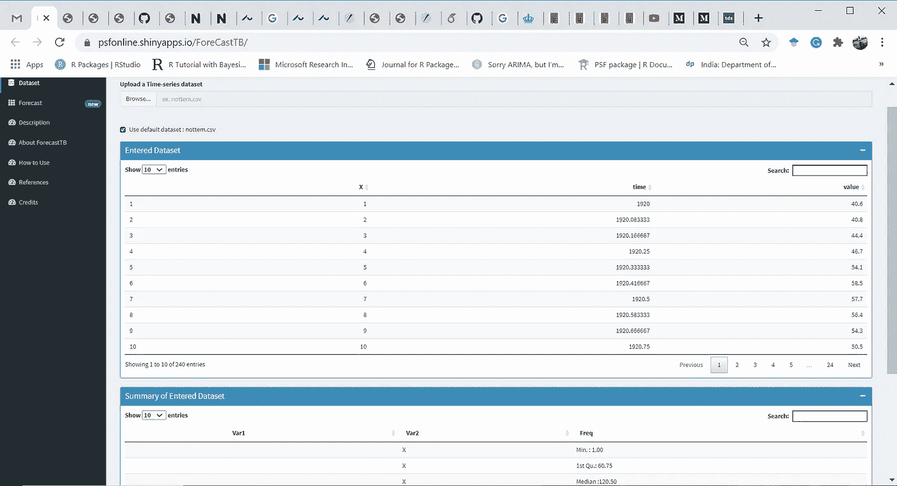
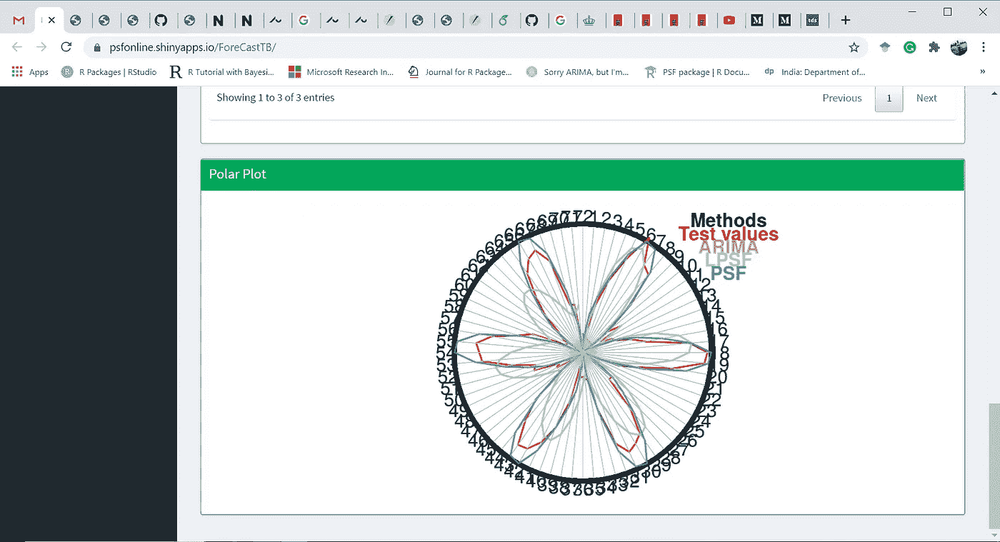

# 当您不知道如何编码时，执行预测分析

> 原文：<https://blog.devgenius.io/perform-a-forecast-analysis-when-you-dont-know-how-to-coding-d6e3ac2a6f76?source=collection_archive---------6----------------------->

## 预测分析网站介绍。

在 [Unsplash](https://unsplash.com?utm_source=medium&utm_medium=referral) 上由 [Franck V.](https://unsplash.com/@franckinjapan?utm_source=medium&utm_medium=referral) 拍摄的照片

# 背景

时间序列分析是数据科学技术的重要组成部分之一。它在能源、银行、金融、医疗、教育、环境、资源管理等领域的许多应用中扮演着重要的角色。有几种工具可用于时间序列预测、预测和性能评估。时间序列分析的主要特征是监督方法，其中时间序列分为两部分，即训练和测试。训练部分应该是较长的部分，比如时间序列方法建模所基于的时间序列中的 70%到 90%的初始值(在这里找到一些例子)。剩余的最后一部分时间序列用于评估目的，在此基础上比较预测值，并在此基础上评估方法的准确性。

R 和 Python 是这种分析的主要语言。像 [ForecastTB](https://towardsdatascience.com/a-tool-to-ease-and-reproduce-the-univariate-time-series-forecast-prediction-analysis-bd9ffc14a3a) 这样的测试平台使得这样的分析更加用户友好和可重复。到目前为止，对于不习惯编码技能的用户来说，执行这样的分析是一项具有挑战性的任务。这篇文章为不熟悉编码的用户介绍了一个使用 [ForecastTB](https://towardsdatascience.com/a-tool-to-ease-and-reproduce-the-univariate-time-series-forecast-prediction-analysis-bd9ffc14a3a) 包特性的网站(shiny app)。让我们一步一步地走这个程序。

# 动手操作:

第一步:浏览网站:[https://psfonline.shinyapps.io/ForeCastTB/](https://psfonline.shinyapps.io/ForeCastTB/)

它将启动并提供一个选项来上传您的时间序列，如下所示:

步骤 2:上传时间序列数据集

用户可以上传他想要用于预测分析的时间序列。时间序列应该是。csv 或。xls 或者。txt 文件。

默认情况下，应用程序可以通过勾选名为“使用默认数据集”的框来使用“非时间”时间序列(标准时间序列)。上传时间序列数据集后，它会显示时间序列的一些初始值(上图)及其统计特征(下图)，如下图所示:

第三步:预测分析:

上传时间序列后，单击左侧面板中显示的“预测”选项卡。它会将您带到新选项卡，在这里您需要更新一些详细信息，如下图所示:

默认情况下，它使用 ARIMA 方法，但用户可以使用以下两个选项在研究中添加几种方法:

1.  通过选择系统中可用的方法。目前版本的网站有三种默认方法。(在不久的将来，用户可以期待网站中嵌入更多的预测方法。)

2.通过在系统中添加额外的预测方法。对于此操作，单击“添加新方法”选项卡，它会打开一个新窗口，如下所示:

为了便于用户参考，每个输入框下面都提供了一个示例。系统中有三个用于添加新方法的输入框。在第一个框中，用户需要提供一个将时间序列数据和“nval”作为输入参数的函数。“nval”是要预测的值的数量。此函数必须能够返回长度为“nval”的预测值字符串。第二个和第三个框是新引入的方法的名称。最后，单击“添加”按钮，它会在系统中添加一个新方法，如下图所示:

第四步:

让我们进入下一个参数，即“预测参数”。如果系统中上传的时间序列有多列，那么用户可以通过该参数选择目标列。默认情况下，系统将选择数据集的第一列。

第五步:

选择适当的列后，通过窗口中提供的两个滑块选择要用于分析的数据集的预测范围和长度。

第六步:

选择用于分析的预测策略。默认情况下，使用“递归”策略，但任何时候，用户都可以使用“RirRec”策略。

第七步:

设置输入参数后，检查预测结果图并比较每种方法的性能。

第八步:

用户可以通过点击“数字结果”选项卡以表格形式查看结果:

第九步:

此外，显示预测值的极坐标图显示在系统中。该图可以帮助用户理解在什么水平之后，方法的性能开始下降。

步骤 10:报告生成

只需单击“生成报告”按钮，即可将整个分析保存为摘要。

# 结束语:

这篇文章中讨论的网站对于对编码了解有限或没有了解的用户来说可能是有用的。此外，它可以帮助普通程序员进行快速直观的时间序列分析。我希望读者喜欢这个帖子，如果有任何疑问，请随时联系我。

> **作者:**
> 
> *尼拉杰·丹拉杰·博克迪博士*
> 
> *博士后研究员，*
> 
> *丹麦奥尔胡斯大学*
> 
> [*https://www.researchgate.net/profile/Neeraj_Bokde*](https://www.researchgate.net/profile/Neeraj_Bokde)