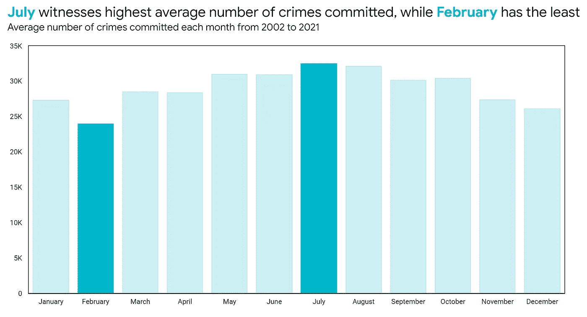
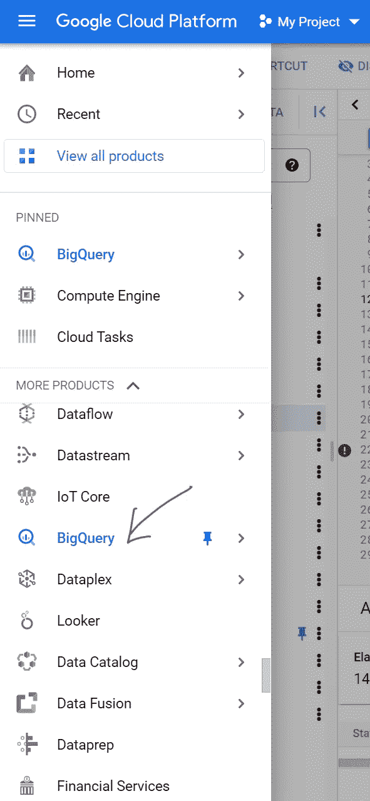
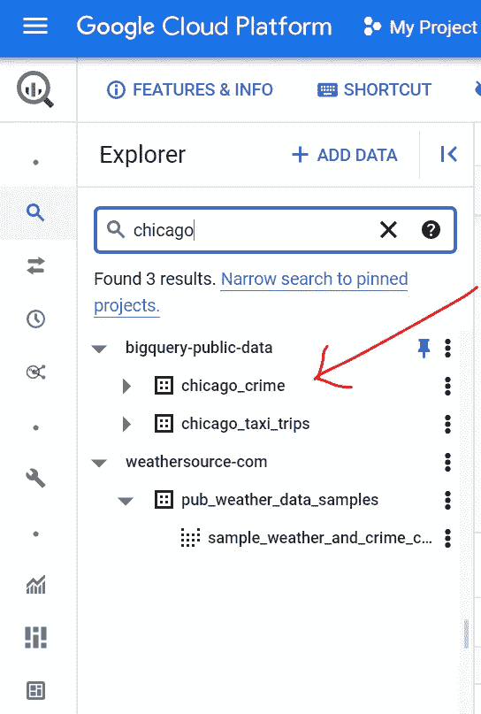
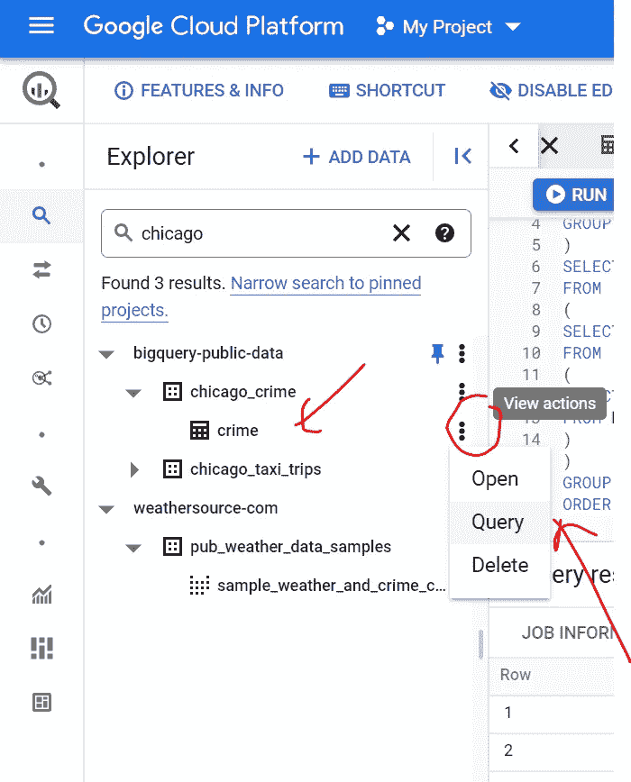
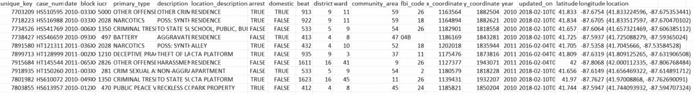
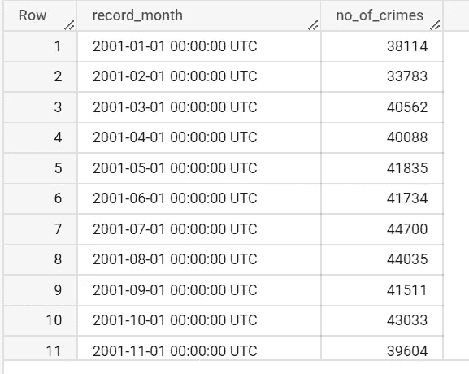
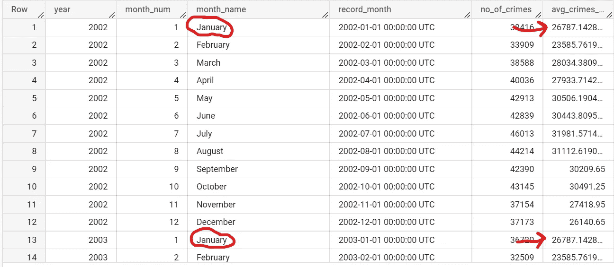
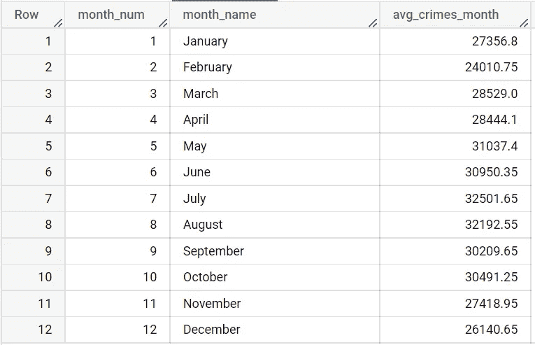
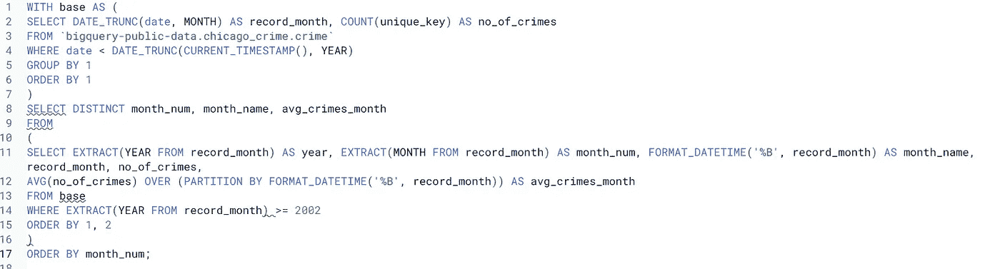

# 在 SQL:季节性分析中执行时间序列分析

> 原文：<https://blog.devgenius.io/perform-time-series-analysis-in-sql-seasonality-plots-c8d3cb726490?source=collection_archive---------7----------------------->

从谷歌大查询分析芝加哥的犯罪数量

**动机**

从我们之前的文章(这里是第[篇](https://medium.com/@akbarazad93/perform-time-series-analysis-in-sql-moving-averages-b1a8bf6a8ef0))来看，我们希望有一个更安全的芝加哥。

一种方法是首先通过时间序列分析了解城市中的犯罪。

那么，除了通过移动平均线确定趋势之外，我们还能进行什么样的时间序列分析呢？

我在想，找出一年中的哪些时段犯罪率会上升，这可能是一种控制犯罪率的独特方法。

我将指导您如何准备在 Data Studio 中完成的以下可视化分析:

对吗？

*仅供参考，如果您已经熟悉在 BigQuery 上访问公共数据集，您可以跳过下面的前几节，直接进入* ***重要问题*** *。*

**入门**

让我们转到 BigQuery 来获取数据集。

要访问 BigQuery，请前往[https://cloud.google.com](https://cloud.google.com)，这是谷歌云平台(简称 GCP)的网络接口。

登录 GCP 后，导航至 BigQuery，如下所示。

GCP 菜单

**检索数据集**

浏览并展开 bigquery-public-data 数据。更好的方法是，使用下面演示的搜索功能。

在搜索中键入“chicago ”,然后按 Enter 键查看名称中包含“chicago”的表

继续并展开`chicago_crime`，您将看到`crime`表，就像我们在这里看到的一样。

最后是我们一直在说的数据集！

接下来，点击如上所示的 Query，此时将出现一个新的编辑器，其中包含以下 SQL:

`SELECT FROM bigquery-public-data.chicago_crime.crime LIMIT 1000`

在我们进入问题或分析之前，让我们看看这个数据集的前几行，这样我们就可以确定这个数据集可以回答什么样的问题。

限制为 5 的“选择*”

**重要问题**

我们将使用 SQL 来回答下面的问题:

*   犯罪数量在一年中的某些时候会有规律地激增吗？从技术上讲，季节性存在吗？

**理解问题**

在上面的问题中，我们必须定义“一年中的某些时候”是什么意思。

从技术上讲，一年由 12 个月、48 周、365 天以及大量的小时、分钟和秒组成。

通常，我们从按月对年度时间序列数据进行分组开始。如果发现了一个有希望的洞察力，我们不需要更深入地挖掘几周、几天等(除非强烈要求)。是的，分组的时间段就是我们所说的季节。因此，这是**季节性分析的一部分。**

**用 SQL 回答**

这个 SQL 对某些人来说可能有点吓人，所以我先把它分解一下。

**1。找出 2022 年前每年每月的犯罪数量**

我们从运行下面的查询开始:

`SELECT DATE_TRUNC(date, MONTH) AS record_month,`

`COUNT(DISTINCT unique_key) AS no_of_crimes`

`FROM bigquery-public-data.chicago_crime.crime`

`WHERE date < DATE_TRUNC(CURRENT_TIMESTAMP(), YEAR)`

`GROUP BY 1`

`ORDER BY 1 ASC`

上面的查询做了三件事:

*   看看 2022 年前犯下的罪行，这是通过`WHERE`条款实现的
*   通过`DATE_TRUNC`功能将每天的日期转换成相应的月份和年份
*   按月份和年份对犯罪数量进行分组，并对输出进行排序，最早的月份-年份在最上面

以下是运行上述查询的输出:

运行上面的查询会看到什么

**2。填写每月平均犯罪数量，如一月、二月**

接下来，我们使用`WITH`子句后跟一个别名(在本例中为`base`)将上述查询包装为一个通用表表达式(CTE)，如下所示:

`WITH base AS (<PASTE QUERY ABOVE HERE>)`

`SELECT * FROM base`

现在，让我们将上面查询的第二行(即`SELECT * FROM base`)调整为下面的这一行，得到#2:

`SELECT EXTRACT(YEAR FROM record_month) AS year,`

`EXTRACT(MONTH FROM record_month) AS month_num,`

`FORMAT_DATETIME('%B', record_month) AS month_name,`

`record_month, no_of_crimes,`

`AVG(no_of_crimes) OVER (PARTITION BY FORMAT_DATETIME('%B', record_month)) AS avg_crimes_month`

`FROM base`

`WHERE EXTRACT(YEAR FROM record_month) >= 2002`

`ORDER BY 1, 2`

上面的这个问题对我们中的一些人来说可能很复杂。所以我会帮你更好地消化。

上面的查询完成了四件事:

*   我们从 2002 年开始，从月-年字段`record_month`中检索`YEAR`部分
*   我们还从月-年字段`record_month`中检索`MONTH`部分，例如 1、2、3，其中每个数字对应于时间顺序中的一个唯一的月份，1 表示一月，2 表示二月，等等
*   我们使用函数`FORMAT_DATETIME`和缩写`%B`得到月份的名称。我们将在输出中看到月份的名称，例如一月、二月
*   最后，我们使用窗口分析函数，通过函数`AVG(<INSERT NUMERIC FIELD HERE>) OVER (PARTITION BY <INSERT FIELD HERE>)`找到每个月份名称的平均犯罪数量(这就是为什么我们把它放在`PARTITION BY`之后)

上述查询的输出将为我们提供具有重复月份名称的记录，如下所示:

请注意，具有相同 month_name(例如一月)的记录共享相同的 avg_crimes_month 值

**3。确保一月、二月等月份出现一次，而不是重复出现**

对于这个 SQL，我们需要做的最后一件事是确保我们只有唯一的月份。这将使我们的生活更加轻松，当我们看到的数据在本文的顶部。

我们是这样做的:

`SELECT DISTINCT month_num, month_name, avg_crimes_month`

`FROM (<INSERT QUERY ABOVE AND THE QUERY BEFORE THAT HERE SOMEWHAT>)`

这给了我们下面的结果:

这是我们观想的最终输出

从上表中，我们可以确定 7 月平均每年的犯罪数量最高，2 月平均每年的犯罪数量最低。

为了缩短洞察时间，我们可以通过 Data Studio 可视化上表，如下所示:

和我们之前看到的一样，哈哈

总而言之，是的，季节性存在于一个月的水平上，是的，犯罪确实在一年中的某些时候达到高峰。

以上是我们问题的答案。

顺便说一下，确保您最终得到的查询类似于下面的查询:

最终的查询，乡亲们

**可操作性**

更进一步，我们可以建议市政官员让这座城市做好准备，在临近 7 月时对犯罪更加谨慎(而不是成为受害者)。

此外，我们可以进一步调查是否可以像 2 月份一样将每月犯罪数量降至最低(这是我们试图复制降低犯罪的成功之处)。

**接下来是什么？**

我们可以通过 SQL 进行另一种季节性分析。

我们可以用百分比代替绝对数字。

这就是所谓的规模季节性分析。我们可以在下一篇文章中做到这一点。

敬请期待！

**保持联系**

我在 https://www.linkedin.com/in/akbarazad[的 LinkedIn 上](https://www.linkedin.com/in/akbarazad)