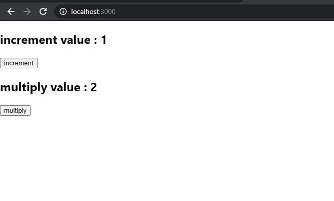
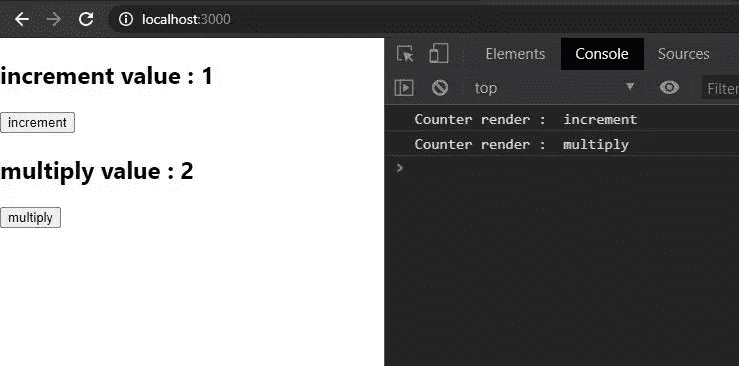
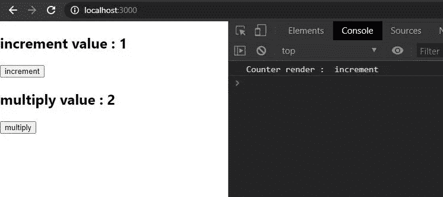

# React 挂钩的性能优化—使用回调和使用备忘录

> 原文：<https://blog.devgenius.io/performance-optimization-with-react-hooks-usecallback-usememo-f2e527651b79?source=collection_archive---------8----------------------->

## 使用 useCallback & useMemo 钩子优化 web 应用程序性能的介绍。


Artem Sapegin 在 [Unsplash](https://unsplash.com?utm_source=medium&utm_medium=referral) 上拍摄的照片

本文是“React Hooks 简介”系列的第 3 部分。到目前为止，我讨论了基本钩子和附加钩子中的*钩子。*

第一部分:[React 钩子介绍—基础钩子](https://medium.com/@dkwathsala/introduction-to-react-hooks-e49738432f54)
第二部分:[React 钩子介绍— useReducer](https://medium.com/dev-genius/introduction-to-react-hooks-usereducer-7b87a6cb4289)

在这篇文章中，我将讨论*use callback*&*use memo*钩子，以及如何使用它们来优化 web 应用程序的性能，并给出例子

**1。*使用回调***

**什么是 *useCallback？***

> 返回一个[内存化的](https://en.wikipedia.org/wiki/Memoization)回调。

*useCallback* 是 React 中内置的钩子，用于返回回调函数的内存化版本。记忆就是记住或缓存函数的结果。只有当其中一个依赖关系发生变化时，回调的内存化版本才会发生变化。当再次调用相同的输入时，返回转换后的结果。**函数**和**依赖列表**是*使用回调*的输入参数。当其中一个依赖关系改变时，返回 memoized。

```
**React**.**useCallback**(*function*, *dependencies*)
```

举个例子，

```
**const** memoizedCallback = ***useCallback***(
 () => {
  setValue(value);
 },
 [value],
);
```

**为什么使用 *useCallback？***

*useCallback* 用于在向子组件传递回调时，防止父组件中不必要的重新渲染。

**2。*使用备忘录***

**什么是*用途备忘录？***

> 返回一个记忆值。

*useMemo* 是一个内置在 Hook 中的 React 传递一个创建函数和数组的依赖关系。这有助于避免复杂的计算。

***使用回调*和*使用备忘录*** 的区别

*   ***useCallback*** 是在渲染之间记忆一个回调本身(引用相等)
*   *用途记忆*是记忆函数调用之间和渲染之间的计算结果

当 useCallback 存储函数时，useMemo 存储任何值。

```
**const** memoizedValue = ***useMemo***(() => computeExpensiveValue(a), [a]);
```

*useCallback* ( *fn* 、 *deps* )相当于*use memo*(()=>*fn*、 *deps* )。

现在，我将实现一个简单的 web 应用程序，带有增量计数器和乘法计数器。这里，我使用**计数器**功能和 **App** 功能组件。在 App 函数组件中，包含增量计数器、乘法计数器组件及其值。



图 1 (web 应用程序视图)

**Counter.js**

图 2(计数器. js)

这里*计数器*功能组件被扭曲 *React.memo* 并且当状态改变时它将被重新渲染。 *React.memo* 是一个高阶组件，如果 props 或 state 没有改变，它会阻止函数组件被重新渲染。

**App.js 不使用 *useCallback()***

图 3 (Counter.js —没有 useCallback())

当点击**增量**按钮时，仅改变 ***增量值、*** 的值，因此**计数器增量**被重新渲染。但是，在这里，**计数器乘**也被重新渲染，虽然***mulValue****没有改变(mul value 的初始值为 2)。如果应用程序容器中有 10 个组件，所有组件都将重新呈现。因此 *useCallback* 有助于优化应用程序的性能。*

**

*图 4(当点击增量时，增量计数器和乘法计数器都被重新呈现)*

***App.js 使用 *useCallback()****

*图 5 (App.js —使用 useCallback())*

**

*图 4(当单击增量时，仅重新呈现增量计数器)*

*这里， *useCallback* 阻止乘法计数器的重新渲染。*

***参考***

*[](https://reactjs.org/docs/hooks-reference.html) [## 钩子 API 参考-反应

### 钩子是 React 16.8 中的新增功能。它们允许您使用状态和其他 React 特性，而无需编写类。这个…

reactjs.org](https://reactjs.org/docs/hooks-reference.html)*