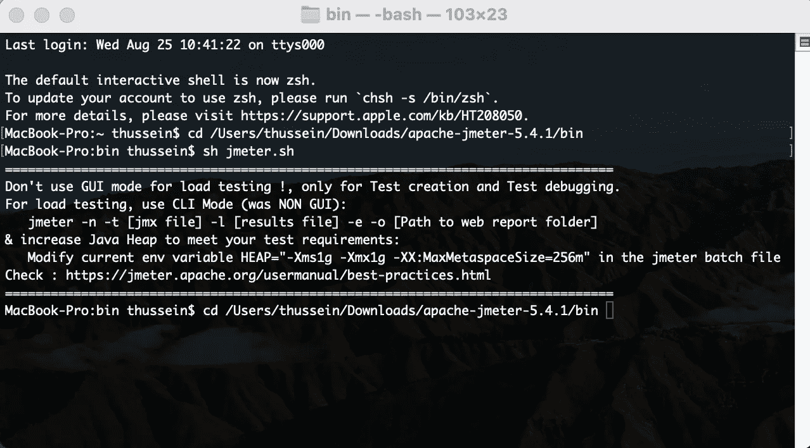
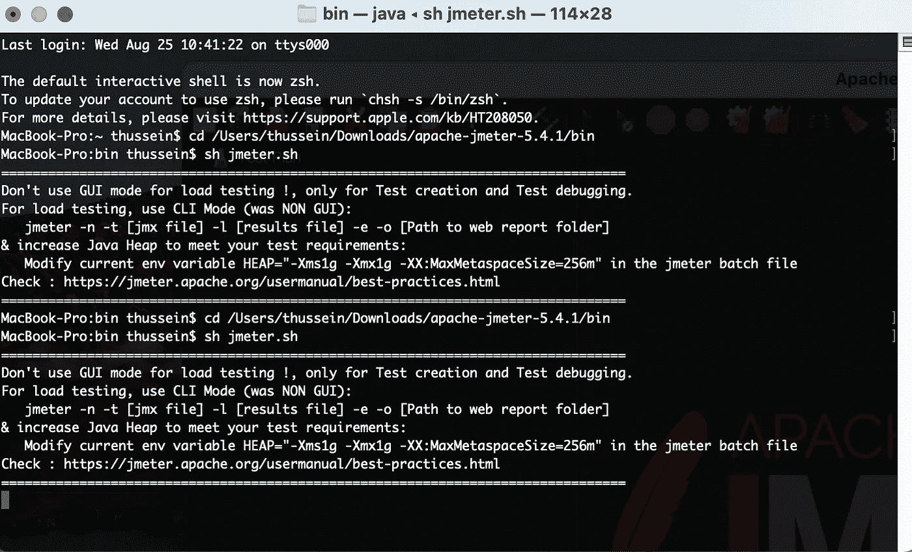
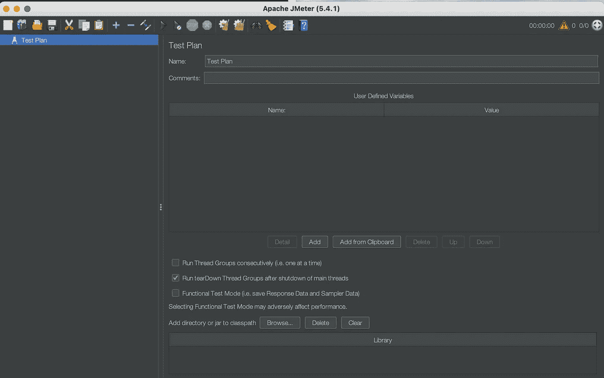
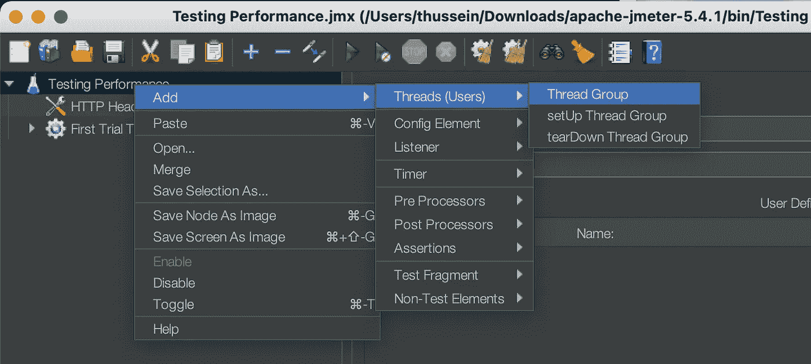
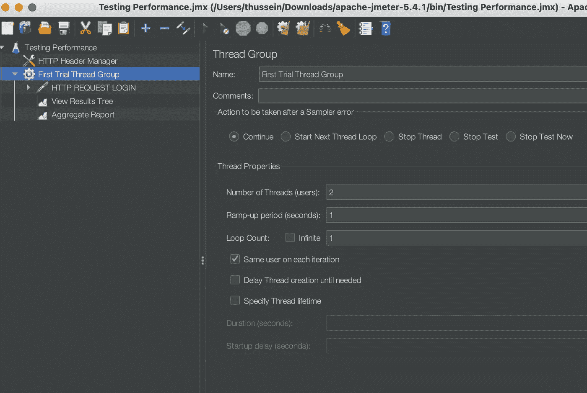
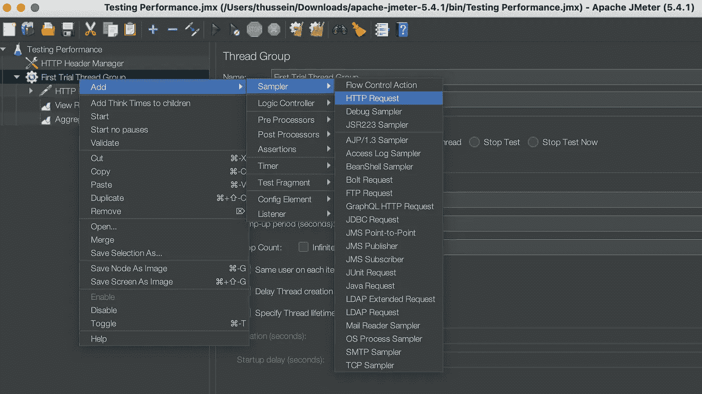
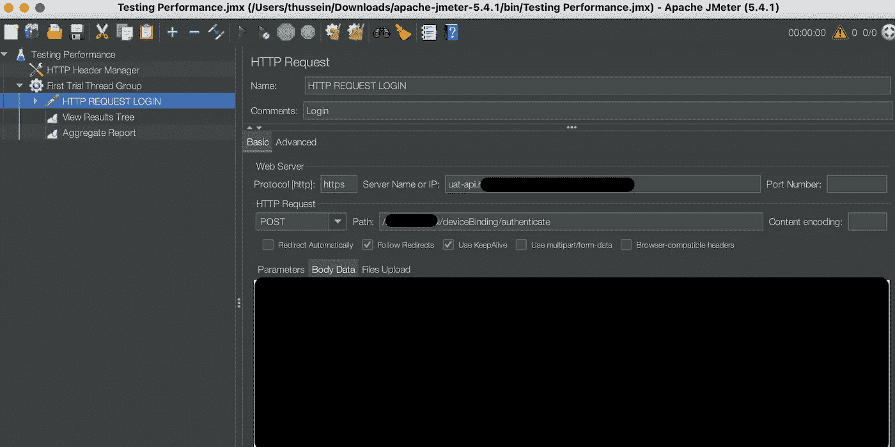
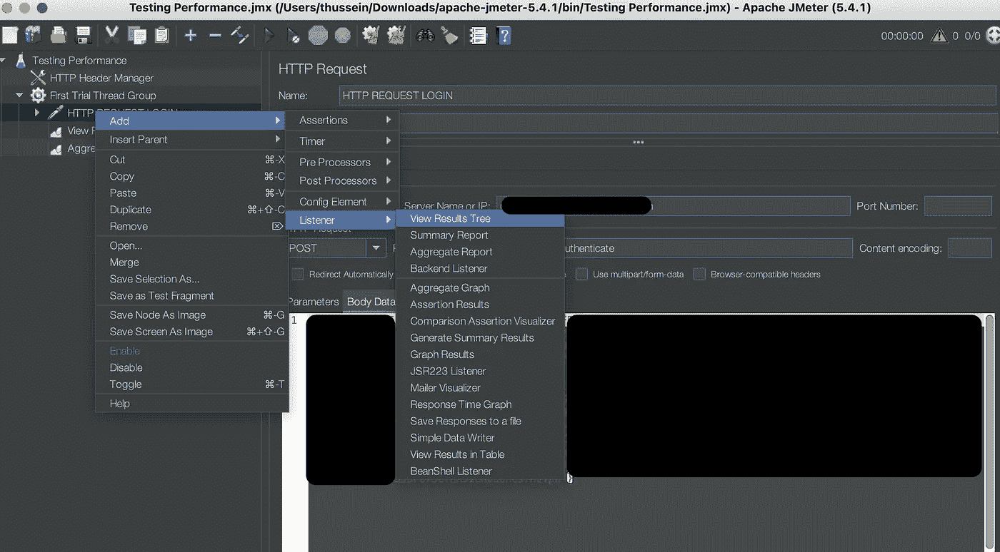
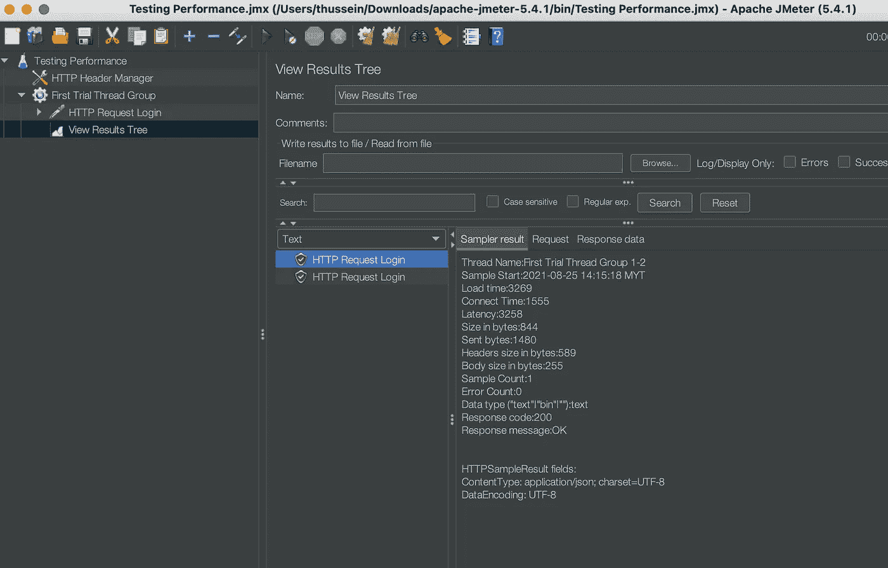

# 使用 Jmeter 进行性能测试

> 原文：<https://blog.devgenius.io/performance-testing-using-jmeter-f58fdd2851de?source=collection_archive---------5----------------------->

Apache Jmeter 徽标图像

> **Apache JMeter** 是一个 [Apache](https://en.wikipedia.org/wiki/Apache_Software_Foundation) [项目](https://en.wikipedia.org/wiki/Project)，可以作为[负载测试](https://en.wikipedia.org/wiki/Load_testing)工具，用于分析和测量各种服务的性能，重点是 [web 应用](https://en.wikipedia.org/wiki/Web_application)。

JMeter 可以用作单元测试工具，用于 [JDBC](https://en.wikipedia.org/wiki/JDBC) 数据库连接、 [FTP](https://en.wikipedia.org/wiki/FTP) 、 [LDAP](https://en.wikipedia.org/wiki/LDAP) 、 [web 服务](https://en.wikipedia.org/wiki/Web_service)、 [JMS](https://en.wikipedia.org/wiki/Java_Message_Service) 、 [HTTP](https://en.wikipedia.org/wiki/HTTP) 、通用 [TCP](https://en.wikipedia.org/wiki/Transmission_Control_Protocol) 连接和 OS-native 进程。您也可以将 JMeter 配置为一个监视器，尽管这通常被用作一个基本的监视解决方案，而不是高级监视。它也可以用于一些功能测试。此外，Jmeter 支持与 [Selenium](https://en.wikipedia.org/wiki/Selenium_(software)) 的集成，这允许它与性能或负载测试一起运行自动化脚本。

JMeter 支持变量参数化、断言(响应验证)、每线程 cookies、配置变量和各种报告。

JMeter 架构基于[插件](https://en.wikipedia.org/wiki/Plugins)。

> 它的大多数“开箱即用”特性都是用插件实现的。

JMeter 插件是 Apache JMeter 的一个独立项目。每个插件服务于不同的目的，同时加速创建和执行 JMeter 测试计划的过程。用户可以通过插件管理器安装插件。

要下载，请点击下面的链接，但在此之前，请阅读文章以了解如何正确地做。

 [## 下载 Apache JMeter

### 我们建议您使用镜像来下载我们的发布版本，但是您必须验证下载文件的完整性…

jmeter.apache.org](https://jmeter.apache.org/download_jmeter.cgi) 

下载 Apache JMeter 并在文件浏览器中找到它之后。打开终端，然后键入 cd，其中包含 Apache JMeter 的下载和安装文件夹中 Bin 文件夹的文件浏览器的位置。

cd +文件夹的位置

然后键入 sh jmeter.sh 打开 jmeter 应用程序

然后打开 JMeter 应用程序，如下图所示…

JMeter 中的测试计划

为了更好的理解，重命名测试计划，然后添加一个线程组，如下图所示…

添加线程组

添加线程组后，您应该添加线程用户数量、上升周期(秒)和循环计数。

命名线程组并设置用户数量

在线程组中，您可以添加 HTTP 请求来放置 API 链接和 https 链接。

添加 HTTP 请求

在基本选项卡下，您可以设置协议，可以是 http 或 https、服务器名称或 IP(这是网站的大图片)、HTTP 请求(POST、GET 等)。)，最后是该 API 请求的特定目的地路径。

设置和插入 HTTP 请求要求

添加结果树，在 JMeter 中查看实际结果，以收集知识和资源来增强其 API 的性能。

添加结果树以查看每个测试运行的结果

如下所示，这是在监听器“结果树”下显示结果的方式，但对于其他监听器，如聚合报告和其他选择，它看起来会有点不同。

HTTP 请求 API(通过)

我们使用 JMeter 来测试应用程序构建中特定 API 的性能，从而增强其性能和应用程序构建的其他规范。

执行性能测试**是为了向利益相关者提供关于他们的应用程序在速度、稳定性和可伸缩性方面的信息**。更重要的是，性能测试揭示了产品上市前需要改进的地方。

> 性能测试的主要目的是进行非功能性软件测试技术，**确定在给定的工作负载下应用程序的响应能力如何**。

对于刚刚推出新网站或新应用程序的公司，我们为您提供了优惠。如果你不确定你的网站/手机应用程序是否安全无故障，我们为你准备了**免费基础设施测试审计**。

所以你可以知道你的应用程序是否让你的潜在客户感到沮丧。要申请免费审计，请发送电子邮件至 stackedqa@gmail.com，并将您的主题填写为“**免费测试审计**”。

在社交媒体上关注我们:

[推特](https://twitter.com/stackedqa)， [Instagram](https://instagram.com/stackedqa) ，& [Linkedin](https://www.linkedin.com/company/stackedqa)

 [## 通过我的推荐链接加入媒体-侯赛因巴申

### 作为一个媒体会员，你的会员费的一部分会给你阅读的作家，你可以完全接触到每一个故事…

husseinbaashen.medium.com](https://husseinbaashen.medium.com/membership)