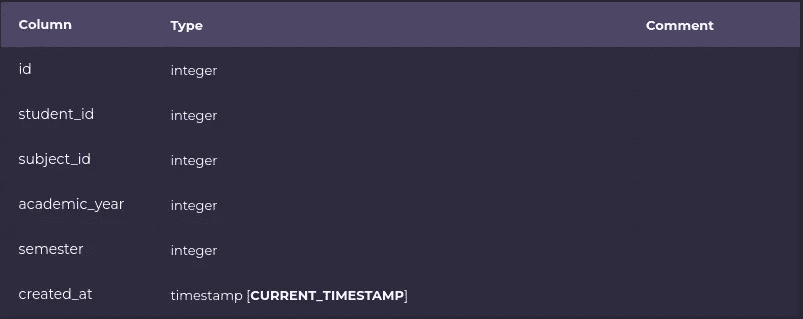

# 使用 pgx 和 CopyFrom 执行大容量插入

> 原文：<https://blog.devgenius.io/performing-bulk-insert-using-pgx-and-copyfrom-ce34c8b12bac?source=collection_archive---------1----------------------->

照片由[卡斯帕·卡米尔·鲁宾](https://unsplash.com/@casparrubin?utm_source=medium&utm_medium=referral)在 [Unsplash](https://unsplash.com?utm_source=medium&utm_medium=referral) 上拍摄

PostgreSQL 和 Go，多好的组合啊。让这两者协同工作的方法之一是使用 pgx 库。pgx 是一个纯 Go 数据库驱动程序和 PostgreSQL 工具包。

> pgx 驱动程序是一个低级、高性能的接口，它公开了 PostgreSQL 特有的特性，如`LISTEN` / `NOTIFY`和`COPY`。它还包括一个标准`database/sql`接口的适配器。

## 介绍

在开发应用程序的过程中，无论是在启动过程中，还是在实体之间存在多对多关系的情况下，您最终肯定会需要在数据库中执行批量输入。

在本教程中，考虑的例子将是学生在特定的学期中学习特定的学习领域/科目。

## 场景分解

出于演示的目的，有三个表，一个包含学生数据，第二个包含可用的科目，第三个用于存储学生选择的学习领域。学生和科目表中的种子数据如下所示。

主题选择表的结构同样是简化的，如下所示。它包含来自两个主要实体的主键以及选择主题的学年和学期。

数据透视表结构

数据处理完毕后，让我们开始编码吧。

## 复制自功能

`CopyFrom`函数可用于 pgx 连接，它利用 PostgreSQL 的本机`copy`功能。

> CopyFrom 使用 PostgreSQL 复制协议来执行批量数据插入。它返回复制的行数和一个错误。

PostgreSQL 的本机`copy`功能允许将数据从一个表复制到一个外部文件或一个命令，反之亦然，允许将数据从一个命令或外部文件复制到数据库中的一个现有表中。

CopyFrom 函数签名如下

`func (c *Conn) CopyFrom (ctx context.Context, tableName Identifier, columnNames []string, rowSrc CopyFromSource) (int, error)`

如上所示，它接受四个参数，第一个是上下文。接下来是执行大容量插入的表的名称。名称必须是`Identifier`类型，因此必须进行一些转换或转换。第三个参数是按照输入数据的组织顺序排列的表列名。第四个也是最后一个参数是输入数据本身，它将被转换成`CopyFromSource`类型。

## 使用 CopyFromSource

端点从客户机接收数据(JSON 有效载荷),并将其解包到`studentSubjects`结构中。值得注意的一个特殊变量是`linkedSubejcts`变量，它是切片的切片`[][]interface{}`。

内部切片的类型是`interface{}`，这意味着它可以接受任何类型的值。`[][]interface{}`是`CopyFromRows()`函数期望的类型，它返回一个可由`CopyFrom()`函数使用的接口。`CopyFromRows()`签名如下:

`func CopyFromRows(rows [][]interface{}) CopyFromSource`

> CopyFromRows 在提供的行切片上返回一个 CopyFromSource 接口，使其可由*Conn.CopyFrom 使用。

从第 24 行到第 27 行，代码遍历特定学生选择的主题 id，并将主题 id 的实例与学生 id、学年和学期组合成类型为`interface{}`的单个片段。然后切片被附加到`linkedSubjects`变量。

从第 29 行到第 34 行可以看到 CopyFrom 的用法，使用的参数在上面的小节中有描述。`context.Background()`用作函数的上下文。表格名称被转换为`identifier`类型。表的列名只是字符串类型的一个普通的老片段。

CopyFrom 相对容易使用，它返回两个参数，复制的行数和一个错误。

提交给服务器的 JSON 有效负载如下所示。

使用 postman，我们可以模拟这个过程，一旦端点被调用，student_subject 表就会有 4 个新行:

## 更进一步

虽然将数据转换成`[][]interface{}`并使用`CopyFromRows()`将其包装在`CopyFromSource`接口中工作良好，但我们可以更进一步，利用`CopyFromSlice()`来替换循环中的逻辑。

> CopyFromSlice 通过动态函数返回一个 CopyFromSource 接口，使其可由*Conn.CopyFrom 使用。

`func CopyFromSlice(length int, next func (int) ([]interface{}, error)) CopyFromSource`

如上所示的`length`参数是我们正在执行批量插入的项目/行数。该函数的第二个参数是一个迭代器函数，它返回一个接口，如上面显示的要点的第 30 行所示。

这将产生与第一段代码相同的结果。

## 结论

就这样，您开始在 PostgreSQL 中运行批量插入操作，并使用 pgx。因为 CopyFrom 依赖于本机复制协议，所以它非常强大。

> CopyFrom 比只有 5 行的 insert 要快。

要了解更多关于 pgx 的`CopyFrom`功能和它能提供的所有东西，请在这里通读 pgx 的文档[。](https://pkg.go.dev/github.com/jackc/pgx/v4)

您同样可以直接访问与 [CopyFrom](https://pkg.go.dev/github.com/jackc/pgx/v4#Conn.CopyFrom) 、 [CopyFromRows](https://pkg.go.dev/github.com/jackc/pgx/v4#CopyFromRows) 和 [CopyFromSlice](https://pkg.go.dev/github.com/jackc/pgx/v4#CopyFromSlice) 相关的文档。