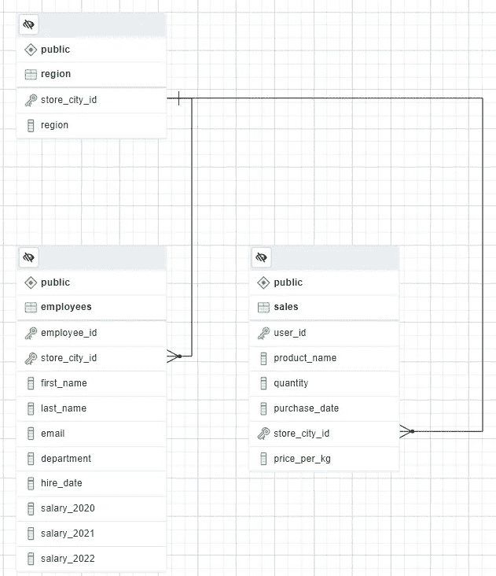
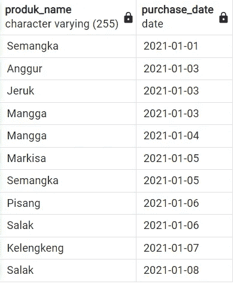
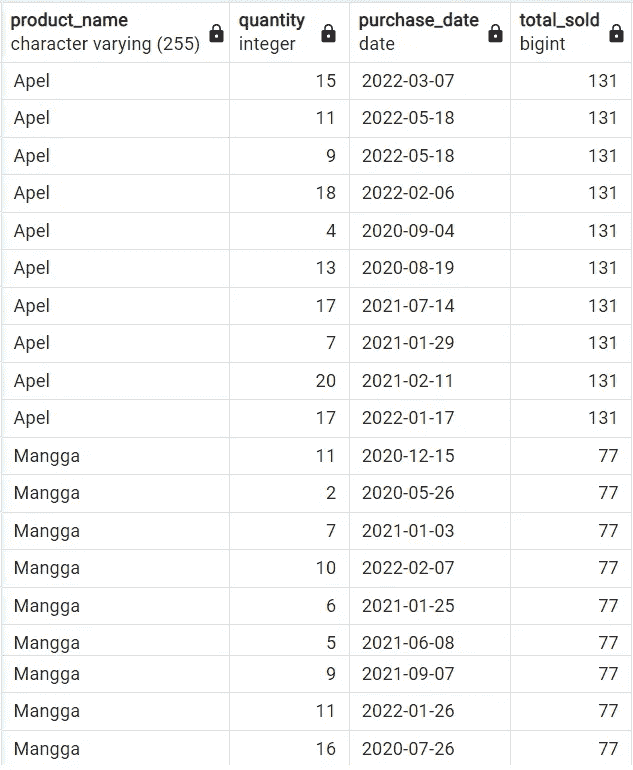
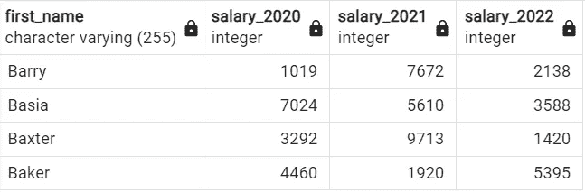
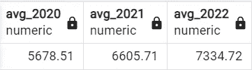
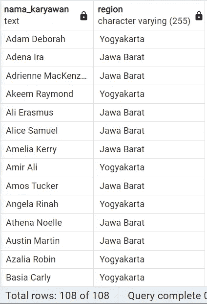
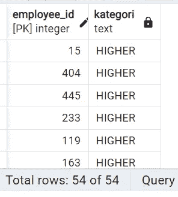
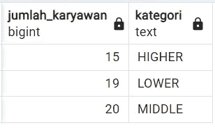
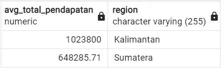
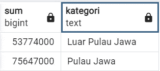

# 执行 SQL 查询以获得洞察力

> 原文：<https://blog.devgenius.io/performing-sql-queries-to-get-insight-999d3411c362?source=collection_archive---------12----------------------->

# **SQL 作为数据分析的基础**

**SQL** ( **结构化查询语言**)是一种**领域特定语言**，用于编程，设计用于管理关系数据库管理系统(RDBMS)中保存的数据，或用于关系数据流管理系统(RDSMS)中的流处理。

在数据科学中，SQL 是数据工程师、数据分析师或数据科学家必须掌握的技能之一。对于数据工程师，SQL 将用于确保组织中的每个人都可以访问他们需要的数据，如管道流程、ETL 流程等。因此，他们必须知道数据库中所有类型的命令，如**数据定义语言(DDL)** ，**数据操作语言(DML)** ，**数据控制语言**，**事务控制语言。**

对于数据分析师或数据科学家来说，SQL 将用于检索、修改和访问数据库中的数据以获得洞察力。所以，它们只会经常在命令类型中播放**数据定义语言**和**数据操作语言(DML)。**

如果我们谈论编码，那么我们就是在谈论逻辑。所以，要解决一个问题，会有很多方法。我们可以用任何方法来解决问题。但当我们进入云计算领域时，情况就不同了，我们必须能够找到有效且高效的最佳解决方案。为什么要这样？因为，每个查询都会收费。

# **问题背景**

在公司中，业务部门想要了解过去 3 年的员工和销售信息。要求数据部门能够根据业务部门的需求呈现信息。

将要使用的数据来自表 Sales、表 Region 和表 Employee



诱发反应测定器

# **问题陈述**

为了解决业务部门提出的问题，我使用的工具是 Postgre SQL

## 仅在 2021 年 1 月 1 日至 2021 年 1 月 10 日销售的记录产品

```
SELECT 
    DISTINCT(product_name) AS produk_name,
    purchase_date
FROM 
    sales 
WHERE  
    purchase_date BETWEEN '2021-01-01' AND '2021-01-10'
ORDER BY purchase_date
```



从 1 月 1 日到 1 月 10 日，共有 11 种产品售出。10 天内至少售出一件产品，尽管从 1 月 2 日、1 月 9 日和 1 月 10 日的表格中可以看出，没有售出任何产品。

## 在商店城市 id 9 中记录 Mangga 和 Apel 的销售产品

```
SELECT 
    product_name,
    quantity,
    purchase_date,
    SUM(quantity) OVER (PARTITION BY product_name) AS total_sold
FROM 
    sales 
WHERE 
    product_name IN ('Mangga', 'Apel') AND store_city_id = 9
ORDER BY product_name
```



上表显示了过去 3 年 id 为 9 的 store city 中 Mangga 和 Apel 产品的销售情况。Apel 产品的销量超过 Mangga 产品。其中曼加产品的销量高达 77 件，Apel 产品的销量高达 131 件。

## 名字中包含字母“Ba”的雇员的所有工资记录

```
SELECT 
    first_name,
    salary_2020,
    salary_2021,
    salary_2022
FROM employees 
WHERE first_name LIKE '%Ba%'
```



看来巴里和巴克斯特在 2021 年犯了一个大错:(

我忘了说，使用的数据不是来自公司的真实案例数据，而是与真实案例相似，只是用于实践

## 员工平均年薪记录

```
SELECT 
   ROUND(AVG(salary_2020), 2) avg_2020, 
   ROUND(AVG(salary_2021), 2) avg_2021, 
   ROUND(AVG(salary_2022), 2) avg_2022
FROM employees
```



员工的平均工资每年都会增加

## 日惹和西爪哇商场的员工姓名记录

```
SELECT 
    CONCAT(t1.first_name,' ',t1.last_name) AS nama_karyawan,
    t2.region
FROM 
    employees t1 JOIN region t2 ON t1.store_city_id = t2.store_city_id
WHERE
    region IN ('Yogyakarta','Jawa Barat')
ORDER BY 1
```



有在西爪哇和日惹分店工作的员工的名字

## 根据 2020 年 9 号店的工资类别记录员工人数

```
with cte as (
SELECT 
    employee_id,
    CASE 
        WHEN salary_2020 < 4000 THEN 'LOWER'
        WHEN salary_2020 BETWEEN 4000 AND 7000 THEN 'MIDDLE'
        ELSE 'HIGHER'
    END AS kategori
FROM employees
WHERE store_city_id = 9
GROUP BY employee_id
ORDER BY kategori)
SELECT 
    COUNT(kategori) AS jumlah_karyawan,
    kategori
FROM cte 
GROUP BY kategori
```

我们必须设立一个薪金类别，规定工资低于 4000 美元的人属于较低类别，工资在 4000 美元至 7000 美元之间的人属于中等类别，而工资超过 7000 美元的人属于较高类别。



当已经有一个类别列时，使用函数 **CTE(常用表表达式)**对类别列进行分组统计。然后我们有了结果。



## Sumetera 和加里曼丹店的平均总收入是多少？

```
WITH avg_pendapatan AS(
SELECT 
    SUM(t1.quantity*t1.price_per_kg) AS total_pendapatan,
    t1.product_name,
    t2.region
FROM 
    sales t1 JOIN region t2 ON t1.store_city_id = t2.store_city_id
WHERE region IN ('Sumatera', 'Kalimantan') GROUP BY product_name, region)SELECT 
    ROUND(AVG(total_pendapatan), 2) AS avg_total_pendapatan, 
    region 
FROM avg_pendapatan 
GROUP BY region
```



## 在爪哇和爪哇岛以外销售产品的总收入是多少？

```
WITH cte AS(
    SELECT
        (t1.quantity*t1.price_per_kg) AS total_pendapatan,
        t2.region,
        CASE
            WHEN t2.region IN ('Sumatera', 'Sulawesi', 'Kalimantan','Bali') THEN 'Luar Pulau Jawa'
            ELSE 'Pulau Jawa'
        END AS kategori 
    FROM sales t1 JOIN region t2 ON t1.store_city_id = t2.store_city_id)
SELECT SUM(total_pendapatan), kategori FROM cte GROUP BY kategori
```

首先，我们必须创建一个基于岛屿的类别，然后将数量乘以每公斤的价格来获得收入。那我们就有答案了。



# 确认

好吧，也许这就是使用 SQL 查询从数据中获得洞察力的例子，我上面做的活动可以描述数据分析师或数据科学家如何使用 SQL。感谢我的技能，特别是感谢我的导师和导师在训练营期间对我的指导。

en.wikipedia.org/wiki/SQL

[SQL Server 指南—SQL Server 教程](https://sqlserverguides.com/)

【https://www.postgresql.org/docs/current/queries.html 

[https://www . PostgreSQL tutorial . com/PostgreSQL-tutorial/PostgreSQL-foreign-key](https://www.postgresqltutorial.com/postgresql-tutorial/postgresql-foreign-key)