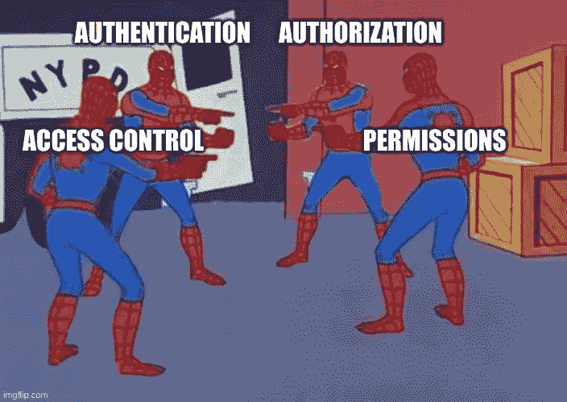
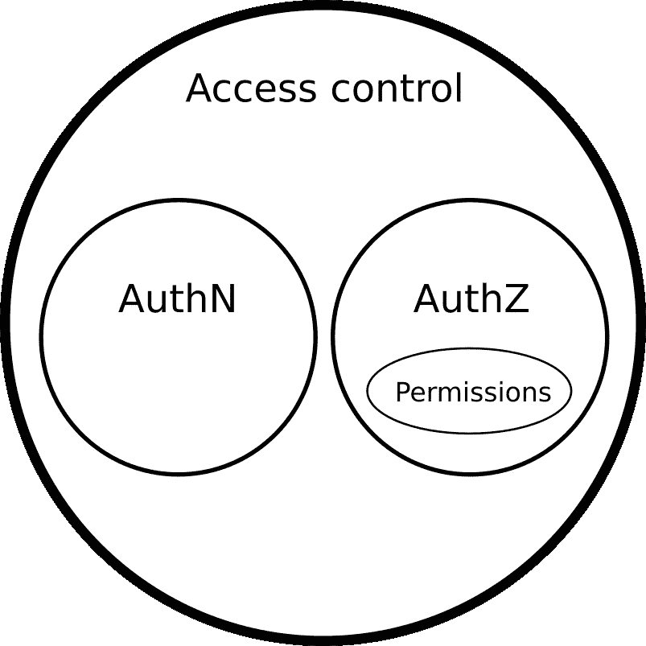
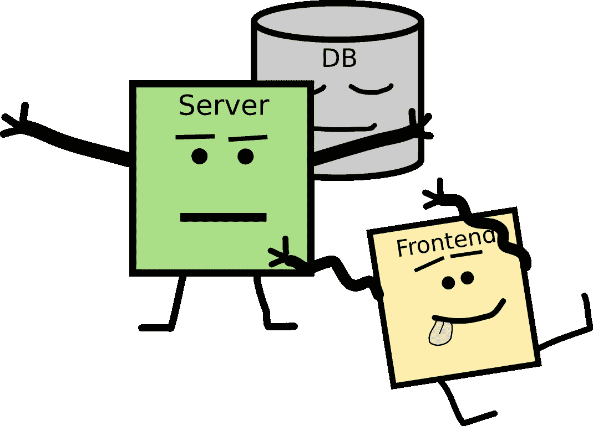
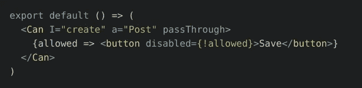
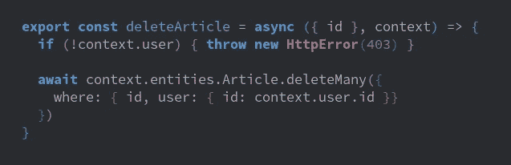
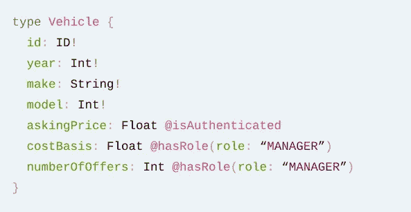
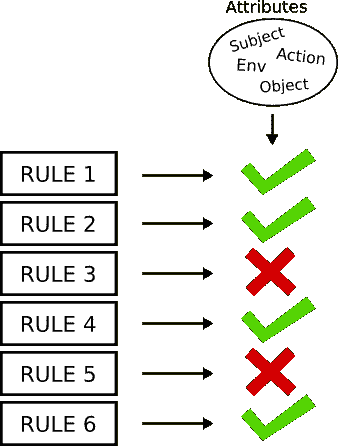
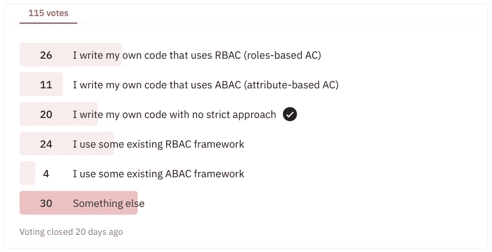

# web 应用程序中的权限(访问控制)

> 原文：<https://blog.devgenius.io/permissions-access-control-in-web-apps-86bff4921038?source=collection_archive---------1----------------------->

在 Wasp，我们正在开发一种配置语言/ DSL，用于构建与 React & Node.js 集成的 web 应用程序。这需要我们深入理解 web 应用程序的不同组成部分，以便能够在我们的 DSL 中对它们进行建模。

最近我们的焦点是访问控制，我决定在这篇博文中总结经验，帮助其他人快速了解如何在 web 应用中进行访问控制。因此，如果你是 web 应用程序访问控制的新手，或者已经做了一段时间，但想更好地了解标准实践，请继续阅读！

## 快速浏览一下这篇博文的内容:

1.  许可，耶！等等，它们是什么？(基本术语快速概述)
2.  我们在 web 应用程序的什么地方检查权限:前端 vs 后端 vs 数据库
3.  共同方针(RBAC、ABAC……)
4.  OWASP 建议
5.  在实践中实施访问控制
6.  摘要(TLDR)

# 1.许可，耶！等等，它们是什么？

除非你的 web 应用主要是静态内容或者是一种艺术形式，否则它很可能有用户和用户账户的概念。

这只海豚不需要使用者

在这种情况下，您需要知道哪个用户有权限做什么->谁可以访问哪些资源，谁可以执行哪些操作。

一些常见的权限使用示例:

1.  用户只能访问他们自己的用户帐户。
2.  如果用户是管理员，他们可以禁止其他用户的帐户。
3.  用户可以阅读其他用户的文章，但不能修改它们。
4.  付费墙后面文章的标题和描述是公开的，但内容却不是。
5.  用户每天最多可以向 10 个未来用户发送电子邮件邀请。

# 啊哈，你是说门禁！不好意思，授权！嗯，认证？

有许多不同的术语(身份验证、授权、访问控制、权限)经常相互混淆，所以让我们快速澄清一下它们各自的含义。

他们看起来都一样！

## 1)认证(或者像酷小孩会说的:authN)

验证用户身份的行为。
回答问题**“他们是谁？”**

> A:叩叩
> B:谁呀？
> 答:用户！
> B:用户谁？
> 答:授权:基本我的用户名:我的密码
> 
> *- >没错，你注意到了没错，这是一个普通认证方式但是 HTTP 头叫“授权”的例子！奇怪！但如果你足够仔细地观察，这一切都是有道理的:(*[*https://stack overflow . com/questions/30062024/why-the-http-header-for-authentic ation-called-authorization*](https://stackoverflow.com/questions/30062024/why-is-the-http-header-for-authentication-called-authorization)*)。*

## 2)授权(或者酷孩子会说:authZ)

确定用户拥有的访问权限的过程。
回答问题**“允许他们这么做吗？”**

通常情况下，您会希望用户在这一点上已经被认证，所以您有关于他们的信息，根据这些信息您将决定是否允许他们做一些事情。

## 3)访问控制

一个更高级的术语(与 authN 和 authZ 相比)，包含了确保只有被允许的一方才能访问特定资源的整个过程(控制对资源的访问->访问控制)。

通常包括认证和/或授权作为其步骤。

在野外也经常与“授权”互换使用。参考(OWASP):[https://www.cgisecurity.com/owasp/html/ch08.html](https://www.cgisecurity.com/owasp/html/ch08.html)

## 4)权限

一个更通用/非正式的术语，在计算机科学的上下文中使用时，其含义与“授权”最接近。

访问资源的权限称为授权。

## 一起

让我们通过观察以下想象的拉请求(PR)来看看这些术语在句子中的用法:

> *标题:app 新增* ***访问控制*** *。*
> 
> *描述:
> 我实现了一种方法，让用户通过电子邮件和密码或者通过 Google 对* ***进行认证*** *。
> 在服务器端，我为我们的大多数 REST API 处理程序添加了* ***权限检查*** *，以确保一个经过* ***认证的*** *用户被* ***授权*** *执行它们。
> 如果用户不是* ***授权的*** *，我们抛出 HTTP 错误 403。
> REST API 也有一些公共部分，用户不必* ***认证*** *。*

# 2.我们在哪里检查一个 web 应用程序的权限:前端 vs 后端 vs 数据库

我们解释了一堆术语，现在让我们看看实际上是如何进行访问权限检查的！

在一个典型的 web 应用程序中，你会有一个前端、后端(服务器)和数据库。

前端将向服务器发出命令，然后服务器执行操作并可能修改数据库(代表他们)。由于**用户不能直接访问数据库**，并且由于**前端本来就不安全**，这使得**服务器成为所有关键访问控制需要发生的中心位置**。

执行访问控制的前端、服务器和数据库的真实照片。

## [前端(浏览器)](https://wasp-lang.dev/blog/2022/11/29/permissions-in-web-apps#frontend-browser)

我们所说的前端是指在浏览器中执行的 web 客户端->代码(例如 JS)。

前端在这里帮助用户向服务器发出命令，用户可以通过它访问和/或修改我们的 web 应用程序的资源(通常存储在数据库中)。

由于用户可以随心所欲地操纵前端代码，我们实际上不能在前端代码中做任何权限检查，我们不能信任它！

我们在前端做的任何权限检查，无论如何都需要在服务器上重复。如果是这样，我们是否应该在前端检查权限，这样做的目的是什么？

**在前端进行任何权限检查的主要原因是人体工程学/用户体验** - >通过让用户界面只关注他们可以更改的资源，我们让用户更容易理解他们可以在我们的 web 应用中做什么，并确保他们不会浪费时间试图描述服务器无法执行的复杂操作。

例如，如果用户不能访问某些字段，我们的前端代码可以隐藏/忽略它们，它可以阻止打开某些页面，或者隐藏/忽略某些按钮，如果它们触发了用户不允许执行的操作。

仅当用户有权限时在 React 中使用 casl.js 来显示按钮的示例。

要点:前端的权限检查不是为了安全，而只是为了人体工程学/改善用户体验。

# [后端(服务器)](https://wasp-lang.dev/blog/2022/11/29/permissions-in-web-apps#backend-server)

服务器是**实施访问控制**的关键地方。它公开了前端(浏览器)和/或其他服务使用的 API。在这样做的时候，它们向服务器认证，以便服务器知道它们是谁，然后它们请求(即通过 REST API 或 GraphQL API)服务器执行某些操作(即创建、更新或获取某些内容)。服务器的工作是确定它们是否被允许(授权)执行那些操作(在指定的资源上/使用提供的参数),如果不被允许，就拒绝它们。

在它的核心，服务器上的权限检查是为了**检查每个 API 端点**是否允许调用者执行。它们通常在 API 端点逻辑的最开始执行，但也经常与端点处理程序逻辑的其余部分交织在一起。

在 API 端点开始时进行权限检查的示例(是用户认证的)，然后作为数据库查询的一部分进行另一项检查(是他们试图删除的文章的用户所有者)。

除了在 API/操作级别定义检查之外，它们通常也在**数据/模型级别**定义。这意味着它们作为数据访问逻辑(ORM)的一部分，与特定的数据模型(通常来自数据库)联系在一起，并定义谁可以访问特定的字段，甚至整个数据模型。

在 GraphQL 模式中直接将权限检查附加到数据模型的示例(来自这篇博文的[):](https://www.prisma.io/blog/graphql-directive-permissions-authorization-made-easy-54c076b5368e)

对于更复杂的 RBAC 方法，有一个额外的间接层(权限)，请继续阅读。

## 数据库

通常，用户根本不能直接访问数据库，而是通过服务器来影响它。在这种情况下，除了在数据库中确保数据模型完整性的正常约束之外，没有必要进行特定的数据库访问控制，例如惟一性、验证等。也就是说，在某些情况下，您可能想要这样做，但是我们不会在本文中深入讨论。

# 3.常用方法(RBAC、ABAC……)

最常见的访问控制方法是 **RBAC** (基于角色的访问控制)和 **ABAC** (基于属性的访问控制)，其中 RBAC 遥遥领先(但 ABAC 正在迎头赶上)。

尽管不太受欢迎，我们也将很快提到 ReBAC 作为一个“中间”选项。

## RBAC —基于角色的访问控制

角色统治:D！在《RBAC》中，角色是中心概念。一些示例角色可能是`admin`、`guest`、`writer`、`moderator`、…。在确定某个用户是否有访问权限时，**我们检查他们的角色，并基于此确定他们的访问权限**。比如`admin`可以删除其他用户、文章、项目，但是`guest`不能修改任何资源，只能阅读文章。

亲建议(谢谢卡兰！):虽然我们可以在权限检查中直接检查用户的角色，但添加一个间接→权限层会更好(OWASP 也推荐这样做)。**所以角色是附属于用户的，权限是附属于角色的，权限检查检查权限**(谁会料到:)！？).

例如，用户可能拥有角色`admin`，而角色`admin`拥有权限`updateArticle`和`deleteArticle`。然后，在确定用户是否可以删除文章时，我们首先获取他的角色，然后获取附加到该角色的权限，最后检查这些权限中是否存在`deleteArticle`→如果存在，他们可以继续删除！

这样，如果我们决定某个角色应该拥有更多或更少的权限，我们只需添加或删除该角色的权限，就这样！我们不必检查每一个权限并更新它的逻辑(如果我们直接检查角色，就必须这样做)。

**RBAC 很受欢迎，因为它相对简单，并且很好地反映了基本的商业领域**——我们通常根据现实世界中的角色来思考，所以很容易掌握和理解。有很多实现 RBAC 的解决方案和框架。

虽然对于许多常见的用例来说是一个很好的匹配，但 RBAC 有一个缺点——当访问控制变得复杂时(这通常是随着 web 应用程序的发展和变大而发生的)，RBAC 有时无法以优雅的方式提供所需的粒度，从而导致笨拙和过于复杂的访问控制逻辑。

## ABAC —基于属性的访问控制[T3](https://wasp-lang.dev/blog/2022/11/29/permissions-in-web-apps#abac---attribute-based-access-control)

在 [ABAC](https://en.wikipedia.org/wiki/Attribute-based_access_control) 中，关键的想法是你定义**一堆访问控制规则**，其中每个规则接受不同的“属性”作为输入。当你需要检查一个用户是否被授权做 smth 时，你运行规则并且**如果所有的规则都通过，那就是通过**，但是如果一个规则失败，那就是不通过。

规则属性可以是任何东西，但通常分为 4 类:

1.  **主题**:用户信息(即用户的 id 或姓名)
2.  **动作**:想要执行的操作(即阅读文章)
3.  **对象**:他们想要操作的资源(即一篇文章)，
4.  **环境/情境**:即一天中的当前时间或者用户在过去一个小时中所做的先前请求的数量。

让我们观察前面的例子，我们想知道是否允许用户删除一篇文章。在 ABAC，我们可以定义一个“删除文章”的操作，然后定义一个包含用户(主题)、操作、对象和附加上下文的规则。该规则将检查操作是否为“delete article”→如果是，它将评估是否允许用户删除指定为对象的文章，方法是检查用户的某些属性，甚至可能是角色，或者检查用户是否是该文章的所有者。
然后，当用户实际发出删除文章的命令时，我们会要求我们的访问控制系统根据它拥有的所有规则运行它，同时给它(user，" deleteArticle "，article，context)元组→大多数规则会说全部都可以，因为它们与“deleteArticle”操作无关，但是那些(像我们上面定义的那样)必须全部通过，以便实际允许访问。

**ABAC 是一种非常灵活和通用的方法**，你可以很容易地在 ABAC 实现 RBAC(和许多其他方法)(通过检查用户的角色作为属性之一)→因此它比 RBAC 更通用/更有表现力。

然而，ABAC 实现起来更复杂，并且在性能方面也更昂贵，因为每次执行访问控制检查时都需要检查多个规则。

## ReBAC —基于关系的访问控制[T5](https://wasp-lang.dev/blog/2022/11/29/permissions-in-web-apps#rebac---relationship-based-access-control)

当您需要根据与关系相关的问题(如“此用户是本文的所有者吗”或“此用户是否属于此工作区”)授予访问权限时，可能缺少角色(RBAC)。

虽然 ABAC 可以很容易地处理这个问题，但是如果你需要描述的只是关系的话，你也可以认为它有点太强大了----这就是 ReBAC 的用武之地。

虽然实现 ReBAC 有不同的方法，但最简单的方法是在 RBAC 的基础上构建，在访问控制逻辑中引入“关系”规则的概念，然后检查这些规则和角色。所以 RBAC 带有一点 ABAC 的味道(侧重于人际关系)。

# 4.OWASP 推荐

在网上寻找关于如何在 web 应用程序中进行访问控制的“官方”/标准化建议时，您很可能会找到 OWASP 提供的资源。

OWASP 的定义:开放 Web 应用程序安全项目(OWASP)是一个致力于提高软件安全性的非营利性基金会。

我发现他们有很多关于如何在 web 应用程序中进行访问控制的资源，最有趣的是下面这些:

*   [OWasp 关于如何在 Web 应用中进行 ACL 的演示](https://owasp.org/www-pdf-archive/ASDC12-Access_Control_Designs_and_Pitfalls.pdf)。
*   [OWasp 关于如何在 Web 应用程序中使用 ACL 的备忘单。](https://github.com/OWASP/CheatSheetSeries/blob/master/cheatsheets/Authorization_Cheat_Sheet.md)

从他们的材料中，我提取了对我来说最有意义的几个要点:

*   **集中访问控制逻辑，以便于审查。**
*   **默认拒绝访问。**
*   比起 RBAC，我更喜欢 ABAC。

# 5.在实践中实施访问控制

这是我在 r/webdev 上做的 Reddit [民意调查。
一个有趣的发现是，尽管样本很小，但很明显开发者更喜欢 RBAC 而不是 OWASP 推荐的 ABAC。我认为这有两个主要原因:RBAC 更简单+那里支持 RBAC 的库/框架比 ABAC 多(同样，因为它更简单)。
不过，ABAC 最近似乎确实在崛起，所以在未来重复这项调查，看看会有什么变化会很有趣。](https://www.reddit.com/r/webdev/comments/vhaglx/what_do_you_use_for_access_control_permission/)

## 有机发展

通常，我们会根据需要在 web 应用程序中逐个添加权限检查。例如，如果我们将 NodeJS 与 ExpressJS 一起用于我们的服务器，并编写处理 HTTP API 请求的中间件，我们将在该中间件中添加一些逻辑，进行一些检查以确保用户可以实际执行该操作。或者，我们可能会将“检查”嵌入到数据库查询中，以便我们只查询允许用户访问的内容。通常是组合。

这种有机方法的危险之处在于随着代码库的增长而增加的复杂性——如果我们不花足够的精力来集中和构建我们的访问控制逻辑，就很难对其进行推理并对其进行一致的更新，从而导致错误和漏洞。

想象一下，必须修改 web 应用程序，使用户现在只能阅读他们自己的文章和他们朋友的文章，而在此之前，他们被允许阅读任何文章。如果只有一个地方可以进行更新，我们会玩得很开心，但如果有一堆地方，我们需要先找到它们，然后确保它们都以相同的方式更新，我们会有很多麻烦和很多空间来犯错误。

## 使用现有解决方案

与其自己想出如何构建访问控制代码，通常使用现有的访问控制解决方案是更好的选择！除了不需要自己设计和实现所有东西，另一个很大的优势是这些解决方案是经过实战检验的，这对于处理 web 应用程序安全性的代码来说非常重要。

我们可以将这些解决方案大致分为框架和(外部)提供者，其中框架嵌入到你的 web app 中，并随其一起发货，而提供者是外部托管的，通常是付费服务。

几个流行的解决方案:

1.  【https://casbin.org/】T2(多种方法，多语言，提供者)——开源 authZ 库，支持多种访问控制模型(ACL，RBAC，ABAC，…)和多种语言(Go，Java，Node.js，js，Rust，…)。虽然有点复杂，但它也很强大和灵活。他们也有自己的 Casdoor 平台，就是 authN 和 authZ 提供商。
2.  https://casl.js.org/v5/en/[(ABAC，Javascript)——ABAC 开源 JS/TS 库。CASL 为您提供了一种在 web / NodeJS 代码中定义 ABAC 规则的好方法，然后还可以检查和调用它们。它与 React、Angular、Prisma、Mongoose 等流行解决方案进行了大量集成。](https://casl.js.org/v5/en/)
3.  https://github.com/CanCanCommunity/cancancan(Ruby on Rails ABAC)——和 casl.js 一样，但是是针对 Ruby on Rails 的！Casl.js 实际上是受到了 cancancan 的启发和借鉴。
4.  [https://github.com/varvet/pundit](https://github.com/varvet/pundit)—流行的开源 Ruby 库围绕着策略的概念，让你可以自由地实现基于策略的方法。
5.  [https://spring.io/projects/spring-security](https://spring.io/projects/spring-security)—Spring(Java)开源 authN 和 authZ 框架。
6.  [https://github.com/dfunckt/django-rules](https://github.com/dfunckt/django-rules)—一个通用的、易于使用的开源框架，用于在 Django (Python)中构建基于规则的系统。
7.  Auth0 已经存在了一段时间，可能是最受欢迎的 authN 提供者。虽然 authN 是他们的主要产品(他们为您提供用于身份验证的 SDKs 他们存储用户配置文件并让您通过他们的 SaaS 管理它们)，但他们也允许您通过 RBAC 和策略在某种程度上定义 authZ。
8.  [https://www.osohq.com/](https://www.osohq.com/)(提供商，DSL) — OSO 是一家 authZ 提供商，其独特之处在于他们有一种专门的授权语言(DSL，称为 Polar)，您可以在其中定义您的授权规则。它们支持通用方法(如 RBAC、ABAC、ReBAC)，但也支持自定义方法。然后，您可以使用他们嵌入在您的应用程序中的开源库，或者使用他们的托管云产品。
9.  https://warrant.dev/(提供商)——相对较新的 authZ 提供商，他们有一个仪表板，你可以在一个中心位置管理你的规则，然后通过他们的 SDK 从多种语言使用它们，甚至在客户端执行 UI 检查。还可以通过 SDK 以编程方式管理规则。
10.  [https://authzed.com/](https://authzed.com/)(Provider)——AuthZed 带来了一个专门的 SpiceDB 权限数据库，他们使用它作为存储和管理规则的集中位置。然后，您可以使用他们的 SDK 来查询、存储和验证应用程序权限。

# [概要(TLDR)](https://wasp-lang.dev/blog/2022/11/29/permissions-in-web-apps#summary-tldr)

*   **认证** (authN)回答“他们是谁”，**授权** (authZ)回答“他们是否被允许”，而**访问控制**是执行 authN 和 authZ 的整个过程的总称。
*   在前端做访问控制只是做做样子(为了提高 UX)，你不能依赖它。**所有真正的访问控制都需要在服务器上完成**(可能在数据库中有一点，但通常不需要)。
*   虽然一开始使用简单的访问控制方法是可以的，但是一旦复杂性增加，您应该准备好切换到更高级的方法。最流行的访问控制方法是 **RBAC** (基于角色)和 **ABAC** (基于属性)。RBAC 更容易相处，但 ABAC 更强大。
*   你应该确保你的访问控制有尽可能少的重复，并且是集中的，以减少引入错误的机会。
*   通常明智的做法是**使用现有的解决方案**，比如访问控制框架或外部提供商。

# Wasp [中的访问控制](https://wasp-lang.dev/blog/2022/11/29/permissions-in-web-apps#access-control-in-wasp)

在 [Wasp](https://wasp-lang.dev/) 中，我们还没有对访问控制的特殊支持，尽管我们计划在未来增加它。目前看来，我们可能会选择 ABAC，我们希望提供一种方法来定义操作级和实体(数据模型)级的访问规则。由于 Wasp 的使命是提供高度集成的全栈体验，我们很高兴它提供了通过整个栈与整个 web 应用紧密集成的访问控制解决方案的可能性！

你可以在我们的[“权限支持”RFC](https://github.com/wasp-lang/wasp/issues/584) 中查看我们对此的讨论。

# 感谢审稿人

[Karan Kajla](https://twitter.com/karankajla) (亲对 RBAC 的忠告！)、 [Graham Neray](https://twitter.com/grahamneray) (伟大的一般建议+指出的 ReBAC)、 [Dennis Walsh](https://twitter.com/lawjolla) (如何让文章读得更好的绝妙建议)、 [Shayne Czyzewski](https://github.com/shayneczyzewski) 、 [Matija Sosic](https://twitter.com/matijasosic) ，感谢您抽出时间来审阅这篇文章并使其变得更好！你的建议、更正和想法是无价的。