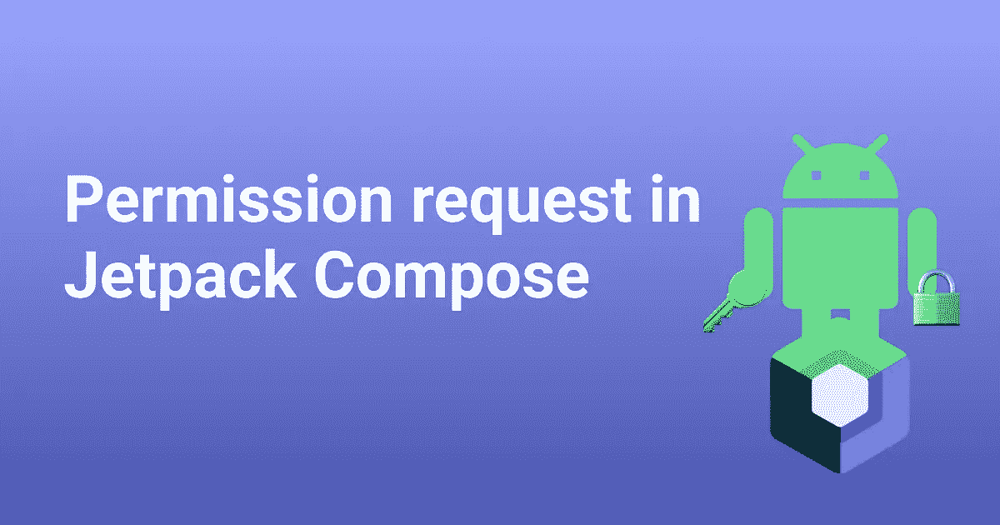

# Jetpack 中的权限与伴奏库一起构成

> 原文：<https://blog.devgenius.io/permissions-in-jetpack-compose-with-accompanist-library-15c90404fe48?source=collection_archive---------6----------------------->



在本文中，我们将了解如何在 Jetpack Compose 中请求权限，以及如何监听和更新 UI 中的权限更改。

## 作曲时代之前许可是怎么做的？🧐🤔

在 Compose 之前，我们使用[registerForActivityResult](https://developer.android.com/training/permissions/requesting#request-permission)在运行时请求权限，然后基于 lambda 回调更新 UI。然而，随着 compose 的引入，我们正在远离活动和片段，要求一种更精简的、声明性的请求许可格式。让我们看看这是怎么做到的。

## 伴奏库简介🎊🎊

[伴奏库](https://github.com/google/accompanist)包含一系列支持 compose 开发的扩展特性，虽然还没有完全稳定到可以与标准 compose 库集成，但是仍然非常有用，google 不介意开发者使用它。伴奏者提供的一个扩展是[权限](https://github.com/google/accompanist/tree/main/permissions)库，它为在 compose 中设置权限提供了一些方便的现成实现。

## 让我们开始建设🛠吧

将此添加到 build.gradle (app)中的依赖项:

```
implementation "com.google.accompanist:accompanist-permissions:0.25.0"
```

在您的清单中请求对*短信*的权限:

```
<uses-permission android:name="android.permission.READ_SMS"/>
```

现在修改 MainActivity.kt，如下所示:

```
class MainActivity : ComponentActivity() {
    @OptIn(ExperimentalPermissionsApi::class)
    override fun onCreate(savedInstanceState: Bundle?) {
        super.onCreate(savedInstanceState)
        *setContent* **{** val permissionState = *rememberPermissionState*(permission = android.Manifest.permission.*READ_SMS*)
            *PermissionScreen*(
                permissionStatus = permissionState.status,
                onRequestPermission = **{** permissionState.launchPermissionRequest()
                **}** )
        **}** }
}

@OptIn(ExperimentalPermissionsApi::class)
@Composable
fun PermissionScreen(
    permissionStatus: PermissionStatus,
    onRequestPermission: () -> Unit
) {
    *Scaffold* **{** *Column*(modifier = Modifier.*padding*(**it**).*padding*(16.*dp*)) **{** *Text*(text = "Your Permission Status: ", style = MaterialTheme.typography.h6)
            when(permissionStatus) {
                is PermissionStatus.Denied -> {
                    if (permissionStatus.shouldShowRationale) {
                        *Text*(text = "We need permission to continue this demo")
                    } else {
                        *Text*(text = "Looks like you permanently denied permission. Please provide in Settings")
                    }
                }
                is PermissionStatus.Granted -> {
                    *Text*(text = "Nice!! permission set")
                }
            }
            if (permissionStatus.*shouldShowRationale*) {
                *Button*(onClick = onRequestPermission) **{** *Text*(text = "Click to request permission")
                **}** }
        **}
    }** }
```

## 现在让我们分解一下我们所写的内容

*   **permissionState** 是 **PermissionState** 的一个实例，它主动跟踪特定权限的当前权限状态。这在使用***rememberPermissionState****实例化的合成中被记住。*
*   ***PermissionScreen()** 是一个可组合的函数，用于在 MainActivity 中显示我们的 UI。它接受两个参数:***permission status***和***onRequestPermission***。*
*   *在我们的**permission screen**composable 中，我们跟踪 **permissionStatus** 以在状态改变时更新我们的 UI。*
*   ***PermissionStatus** 是一个接口，包含一个表示权限已被授予的 **Granted** 对象和一个表示权限已被拒绝的 **Denied** 数据类。*
*   *否认类有一个成员叫做*。这是一个布尔值，如果为 true，则表明用户仍然要接受权限，并且权限请求可以从应用程序本身调用。如果为 false，则表明用户已经拒绝了两次权限，现在只能由用户直接从设置屏幕提供。**
*   **每当我们的用户点击请求权限按钮时，它就调用***onRequestPermission***回调，该回调调用***launchPermissionRequest()***向用户显示权限对话框。**

## **基本上就是这样🙂**

**希望你能从上面的代码中学到一些东西。如果您有任何疑问或意见，请留下您的评论🙌🏼。一如既往，如果你觉得内容有用，可以留下掌声或关注，那就太好了。*一路平安！🦄***