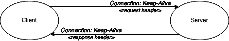
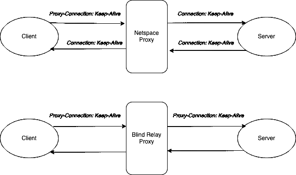
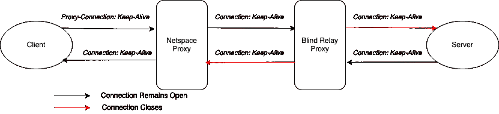
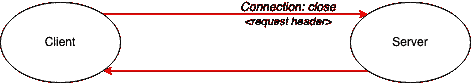

# HTTP/1.1 中的持久连接

> 原文：<https://blog.devgenius.io/persistent-connections-in-http-1-1-45c3bc1c7c87?source=collection_archive---------1----------------------->

连接头

HTTP(超文本传输协议)是建立在传输层协议 TCP(传输控制协议)之上的应用层协议。简而言之，HTTP 是在 TCP 之上完成的通信。

在 HTTP 的第一个版本 HTTP 1.0 中，客户端打开一个 TCP 连接向服务器发出 HTTP 请求。一旦请求通过用于关闭 TCP 连接的服务器。但是有一个问题…对于每个 HTTP 连接，服务器必须启动一个新的 TCP 连接。HTTP 1.0 服务器可以避免这种情况的一种方法是使用**保持活动连接**。

# 保持活动连接

***站点位置*** 的***属性声明*向服务器发起 HTTP 请求的应用程序很可能在将来发出更多请求*。因此，如果服务器收到请求，很可能会向它发出进一步的请求。所以理想情况下，它应该准备好接受更多的请求。但是，在 HTTP 1.0 中，必须非常频繁地为每个请求重新建立连接，这是低效的。***

事实证明，打开和关闭 TCP 连接的过程开销很大。为了克服这个问题，HTTP/1.0 试图通过在 HTTP 请求中引入*连接*头来重用连接。如果请求中的*连接*头的值被设置为 *Keep-Alive* ，则服务器不会在 HTTP 请求完成后立即关闭连接，而是会在同一 TCP 连接上等待客户端的下一个请求一段时间。它还将通过在 ***响应*** ***报头*** 中用*连接*值作为*保持活动*来通知客户端它对进一步的请求开放。因此，客户机和服务器可以节省为连续的 http 请求创建新的 TCP 连接的时间。

连接头

另一方面，如果服务器碰巧不支持保活连接，它会关闭 TCP 连接，并且不会在响应中的*连接*报头中返回。响应头中没有*连接*表示客户端关闭连接，并且不期望服务器对之前的连接做出任何响应。

这对于服务器到客户端的直接通信来说很好。但是当通信通过代理服务器路由时，情况就不同了。

# 盲中继代理

*连接*头似乎已经解决了连续请求的问题，直到请求通过盲中继代理服务器被中继。顾名思义，盲中继代理服务器将整个请求从客户端中继到服务器，包括*连接*头。服务器在接收到将*连接*报头设置为*保持活动的请求时，*在响应中以*连接:保持活动*报头进行响应，并保持其自身与代理之间的 TCP 连接打开，以期待来自代理的更多请求。

代理再次盲目地将来自服务器的响应转发到客户端，客户端在接收到具有*连接:保持活动*报头的响应时，保持与代理的连接打开，并在同一时间向代理发送更多请求。由于代理不支持*保持活动状态*，因此在检测到 HTTP 请求结束时，它会终止与客户端和服务器的连接。结果，来自客户端的进一步请求被丢弃，而服务器保持其资源等待来自代理的请求。

# HTTP/1.1 中盲中继代理的解决方案

与盲中继代理不同，现代代理被编程为在转发请求之前逐跳丢弃*报头，例如*连接*报头。这导致消除了由盲中继代理引起的连接挂起问题。另一方面，这阻止了连接的重用，因此我们又回到了起点，我们必须为每个请求创建 TCP 连接。*

作为一个变通办法，Netspace 的开发人员引入了一个新的头部，*代理连接。*代理如果能够保持连接活动，它将从客户端丢弃*代理连接*，并在将其转发到服务器之前添加新的*连接*报头。如果代理恰好是一个盲中继，它会将*代理连接*报头转发给服务器，服务器会很高兴地忽略这个报头，从而避免了连接挂起的问题。

代理连接标头变通办法控制盲中继代理中的挂起问题

然而，如果在网络空间代理和服务器之间碰巧有一个盲中继代理，这个模型就会失败。

如果盲目中继代理恰好在网络空间代理之后，代理连接标头会失败

# 持续连接— HTTP/1.1

持续连接是指在事务完成后不会立即终止的连接。默认情况下，HTTP/1.0 连接不是持久。*连接:Keep-Alive* 一直在尝试使用 HTTP/1.0 中的持久连接。代理服务器的引入被证明是这种方法的一个障碍。

为了解决这个问题，较新的 HTTP/1.1 协议被设计为持久的，除非指定。与 HTTP/1.0 类似，HTTP/1.1 也采用了*连接*头。但是，在这里，如果客户机不需要服务器在事务完成后保持连接打开，那么连接被设置为关闭。

HTTP/1.1 请求中的连接头

参考:

 [## HTTP:权威指南

### Web 客户端经常打开到同一站点的连接。例如，网页中的大多数嵌入图像通常来自…

www.oreilly.com](https://www.oreilly.com/library/view/http-the-definitive/1565925092/ch04s05.html)  [## RFC 7230 -超文本传输协议(HTTP/1.1):消息语法和路由

### 互联网工程任务组。征求意见:7230 Adobe 过时产品:2145，2616 J…

tools.ietf.org](https://tools.ietf.org/html/rfc7230#appendix-A.1.2)  [## RFC 2068 -超文本传输协议- HTTP/1.1

### 网络工作组 R. Fielding 征求意见:2068 UC Irvine 类别:标准跟踪 J. Gettys J. Mogul DEC…

tools.ietf.org](https://tools.ietf.org/html/rfc2068#section-19.7.1)  [## jdebp.eu

### 此域名可能出售！

jdebp.eu](https://jdebp.eu/FGA/web-proxy-connection-header.html)