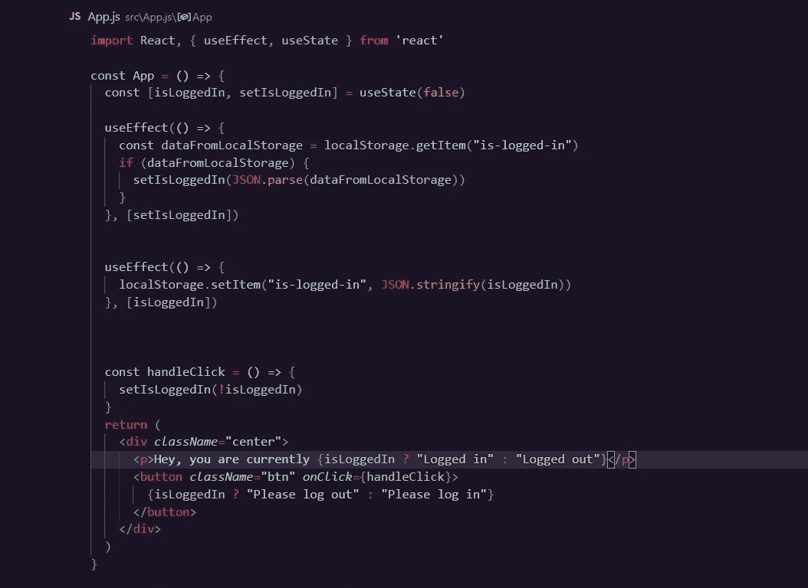

# React.js 中使用 useEffect 钩子的持久状态

> 原文：<https://blog.devgenius.io/persistent-state-in-react-js-using-useeffect-hook-d6e3e7ae65f2?source=collection_archive---------1----------------------->

*照片由* [*肖恩·林*](https://unsplash.com/@seanlimm?utm_source=medium&utm_medium=referral) *上* [*下*](https://unsplash.com?utm_source=medium&utm_medium=referral)

在我们开始之前，我知道有些人不知道持续状态的含义，这没关系，因为我会给你一个例子。你有没有开发过 react 应用，使用过 redux、context API 之类的状态管理工具，在成功管理用户状态之后，你点击了刷新？如果你以前尝试过这个，那么你知道接下来会发生什么(这里有一个小博览会；您会丢失您所在州的所有数据)。太可怕了。如果你想知道如何克服这一点，那么我劝你继续读下去。

## *先决条件*

1.  ***React*** *:我假设你已经知道 React 的基本知识。*
2.  ***use effect hook****:这是 react hooks 的一个特性，相当简单。如果你熟悉 React 类的生命周期方法，你可以把* `*useEffect*` *钩子想象成*`*componentDidMount*`*`*componentDidUpdate*`*和* `*componentWillUnmount*` *的组合。**

*在我们开始编码之前，让我带你看一下整个过程，因为这样的话，你会很快掌握发生了什么。*

**首先，我们将从 localStorage 中检索存储的数据，并更新我们的 state 值。**

**最后，我们将在组件更新时获取我们状态中的内容，并将其保存在我们的 localStorage 中。**

**很简单吧？现在让我们把手弄脏。你可以在我的 github*[*repo*](https://github.com/HarcourtHamsa/react-persisting-state)*上找到源代码。**

**

*在上面的代码中，我们首先使用 useState 钩子创建了一个名为 isLoggedIn 的状态。*

> **如果你熟悉 React 类的生命周期方法，你可以把* `*useEffect*` *钩子看作是* `*componentDidMount*` *、* `*componentDidUpdate*` *和* `*componentWillUnmount*` *的组合。**

**然后，我们检查 localStorage 中任何名为“is-log-in”的条目。该名称可以有所不同，并且基于我们在创建它时提供的内容。如果它存在，那么我们设置状态。**

****注意:localStorage 只接受字符串并返回相同的值。因此我们使用 JSON.stringify()和 JSON.parse()****

**最后，我们在组件更新时设置“is-log-in”的值。传递给 localStorage.setItem()的第一个值是变量名，第二个值是变量值。**

*我希望你对这篇文章感兴趣，如果你觉得值得，就分享这篇文章。*

**快乐编码:)**