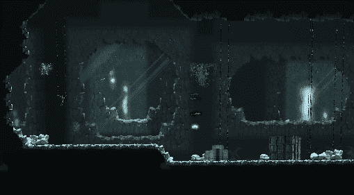
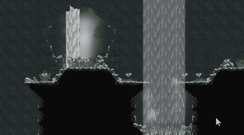
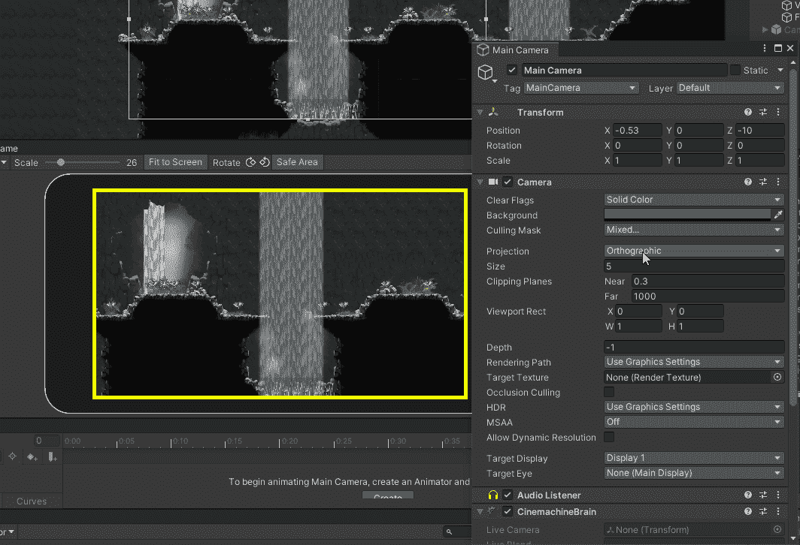
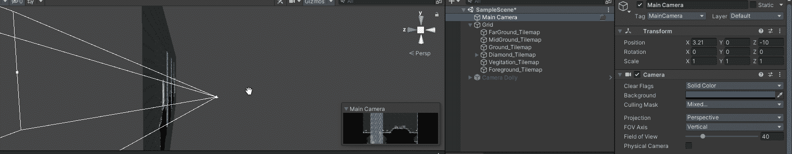
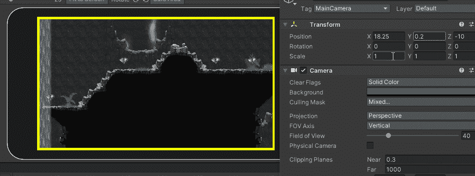

# 透视视差效应

> 原文：<https://blog.devgenius.io/perspective-parallax-effect-871baef0fa14?source=collection_archive---------2----------------------->

## 增加游戏的深度，不需要代码

 [## 视差滚动-维基百科

### 视差滚动是计算机图形学中的一种技术，背景图像通过相机的速度比…

en.wikipedia.org](https://en.wikipedia.org/wiki/Parallax_scrolling) 

维基百科能比我更好地解释这是什么。这是一种在视频游戏中使用的技术，通过滚动背景图像比前景图像慢来增加深度的错觉。我已经学会了一个简单易用的方法来将它添加到 Unity 中，我想我是从 Unity 的一个 Unite 会议上学到的，在那里他们演示了 Unity 中的一些 2D 工具。

现在我的游戏使用的是一个正交相机，所有的层离相机的距离都是一样的。

为了给我的游戏添加视差滚动，我必须把相机从正交转换成透视。

这对我来说没多大作用，现在我的比赛看起来还是有点平淡。为了解决这个问题，我需要把我的背景从相机上移开。这给我的场景增加了深度。

这两者的区别是白天和黑夜。为此，相机必须是透视的，而不是正交的。

我不是艺术家，但这个简单的技巧让游戏变得生动起来。

让你的团队中的一位艺术家绘制游戏的背景元素，你就会得到一个设计精美的关卡。

