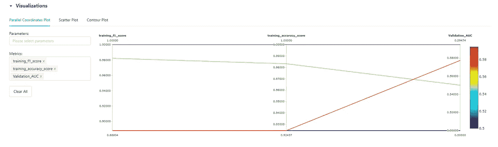

# 经典 NLP 项目和 MLflow 集成的阶段

> 原文：<https://blog.devgenius.io/phases-of-a-nlp-classic-projects-and-mlflow-integration-20768eb00121?source=collection_archive---------13----------------------->

# 框定问题和工具

这个项目有两个目标:

*   经历经典 NLP 项目的各个阶段，特别强调特定的 NLP 技术，如计数向量化
*   实施 MLflow 筛选有前途的模型。这里将简要介绍 MLflow 及其组件。通过关注“物流跟踪”,我们将了解为什么以及什么时候将它用于个人项目是有意义的。

代码可以在这里找到[。](https://github.com/jralduaveuthey/NLP_twitter_mlflow)

使用[这个数据集](https://www.kaggle.com/arkhoshghalb/twitter-sentiment-analysis-hatred-speech)进行来自 Kaggle 的 twitter 情绪分析，我们将从导入数据并对其进行分析开始。

# 导入和 EDA

```
tweets_df.describe()
```


```
tweets_df.drop(columns=['id'],inplace=True)
```

首先看一下数据，我们可以看到没有任何实例是空的。这一点很清楚，因为 Twitter 不允许发布空推。我们有超过 30，000 条推文可以玩，我们也可以看到“id”栏不会带来任何东西，所以我们可以放弃它。

```
sns.set_theme()
ax = sns.countplot(x="label", data=tweets_df)
```


正面(0)对负面(1)推文

看到正面推文(零)相对于负面推文(一)的比例，我们可以得出两个结论:

*   数据集来自特别快乐的人。
*   我们有一个非常倾斜的数据集。因为与正面的推文相比，负面的推文非常少，所以我们已经可以说准确性不是衡量表现的好标准。当比较我们的二元分类器时，我们应该尝试比较其他指标，如 f1-score。

```
tweets_df['length'].plot(bins=30, kind='hist')
```


推文长度分布

作为平均值 85，长度的分布相当正常。

## Wordcloud

要安装 WordCloud，请使用[链接](https://pypi.org/project/wordcloud/#history)检查适用于 python 版本和您正在使用的操作系统的 wordcloud 版本，并使用以下命令行从终端安装它"*pip install word cloud-version-compatible-operating system*

```
from wordcloud import WordCloud
plt.figure(figsize=(15,15))
plt.imshow(WordCloud().generate(sentences_together))
plt.axis("off")
plt.show()
```


数据集中所有推文的 WordCloud

我们可以看到，大部分常用词确实是像“用户”这样的常用词。似乎也有奇怪的人物经常出现。

同样，我们可以对所有的负面推文进行分析，我们可以看到其中一些推文可能是种族主义者或性别歧视者。


数据集中所有负面推文的 WordCloud

# *数据清理和*标记化

在这里，我们将删除标点符号，停用词和执行标记化。简而言之，记号化是一种将一段文本分成称为记号的更小单元的方法，记号可以是单词、字符或子单词。

在下面几行代码中可以看到整个管道。更多细节请见本文开头链接中的代码。为了实现删除管道中的标点符号和停用词，我们使用 sklearn 的 CountVectorizer 中的参数“analyzer”。在这里，如果传递了一个 callable，它将用于从原始的、未处理的输入中提取特征序列。所以我们只要定义一个清洗函数，用这个参数调用它。

```
def message_cleaning(message):
    message_punc_removed = [char for char in message if char not in string.punctuation]
    message_punc_removed_join = ''.join(message_punc_removed)
    message_punc_removed_join_clean = [word for word in message_punc_removed_join.split() if word.lower() not in stopwords.words('english')]
    return message_punc_removed_join_clean

from sklearn.feature_extraction.text import CountVectorizer
*# Define the cleaning pipeline we defined earlier* vectorizer = CountVectorizer(analyzer = message_cleaning)

tweets_countvectorizer = CountVectorizer(analyzer = message_cleaning, dtype = 'uint8').fit_transform(tweets_df['tweet']).toarray()
```

进行更深入的清理，我们可以得到一个更好看的 WordCloud。

```
temp_sentences_together= clean_sentences_together
import re
temp_sentences_together = temp_sentences_together.lower()
temp_sentences_together=re.sub(r'@\w+', ' ', temp_sentences_together)
temp_sentences_together=re.sub(r'http\S+', ' ', temp_sentences_together)
temp_sentences_together = re.sub(r'[^a-z A-Z]', ' ',temp_sentences_together)
temp_sentences_together= re.sub(r'\b\w{1,2}\b', '', temp_sentences_together)
clean_sentences_together= re.sub(r' +', ' ', temp_sentences_together)
stop_words = ["user"] + list(default_stopwords)
wordcloud = WordCloud(stopwords = stop_words).generate(clean_sentences_together)
plt.figure(figsize=(15,15))
plt.imshow(wordcloud)
plt.axis("off")
plt.show()
```


快乐的 WordCloud！

# *MLflow*

## 为什么是 MLflow？

就像使用任何工具一样，你首先要问自己是否需要它。
MLflow 有许多用途和可能的实现，但这里我们将只关注以下用例:

*   我正处于原型阶段，想入围有前途的模型。为此，我想使用标准参数训练不同类别的许多快速模型，并希望能够轻松比较它们的性能。

分析每个算法中的重要变量以及分析模型产生的误差也是可行的。这里很可能需要一些迭代。为此,“物流跟踪”是最佳选择。

## *MLflow 组件*

MLflow 允许您管理整个 ML 生命周期，从试验初始模型到部署，同时提高可重复性并为您提供一个中央模型注册中心。您可以在他们的网站(“https://mlflow.org/”)上看到他们出色的 docu，因此在这里，我将简要介绍他们的四个主要组件，重点介绍我们案例的跟踪模块:

*   MLflow 项目:这里我们有一个类似于 Docker 的概念。我们封装了依赖关系，因此它可以在任何机器上运行。MLflow 中的项目由两部分组成:定义环境路径的 MLproject 以及定义所有依赖项的 conda.yaml 文件。Docker 的目标是在任何平台上复制项目。
*   MLflow 模型:MLflow 中模型的概念类似于它们的项目。你可以用任何你想要的 ML 框架(sklearn，Tensorflow，XGBoost，…)来做模型。您可以使用不同的“风格”加载这些模型，比如使用 python 函数或 tensorflow。这里的目标是部署与可能的不同环境一起工作的任何机器学习模型。
*   模型注册:在这里您可以将您的模型部署到产品中。这里还有不同的 CI/CD 工具，您可以从一个中央存储库中管理一切
*   MLflow 跟踪:使用跟踪组件，MLflow 基本上可以让你保持你的实验日记。如果你在一个团队中工作，并且你必须用不同的参数比较不同的模型，这是很有用的。但是，如果您独自工作，在本地计算机上部署，并且您正处于原型制作阶段，并且想要轻松地比较不同的模型以便稍后对其中的几个模型进行微调，这也是非常有用的

注意:值得一提的是，MLflow 并不关注数据集的注册。如果您熟悉用于数据集版本控制的“DVC ”,您可以将其集成到 MLflow 工作流中。如果你是数据版本控制的新手，你可能想使用“Delta Lake ”,因为 MLflow 直接将它集成到其工作流中。

## 启动 MLflow UI

如果要从笔记本上运行 MLflow 的追踪 UI，就得写*！mlflow ui* 而不是 *mlflow ui* 。
请注意，运行 *mlflow ui* 时会出现语法错误，因为它不是有效的 Python 语法。如果你跑*！mlflow ui* 在笔记本中，您仍然可以在 http://localhost:5000(http://127 . 0 . 0 . 1:5000)上查看跟踪 ui。但是，在这种情况下，您将无法运行任何其他单元，因为当前单元一直在运行。为此，您必须在运行该单元几秒钟后手动中断，然后继续下一个单元。

```
!mlflow ui
*# Interrupt the execution of this cell manually and go to http://127.0.0.1:5000*
```

## 初始化 MLflow

当在浏览器中打开 UI 时，您可以看到“实验”选项卡，您可以在其中将运行组织到实验中，这些实验将针对特定任务的运行组合在一起。

MLflow 运行可以记录到本地文件、数据库或远程跟踪服务器。
如果没有指定，MLflow logs 会在本地运行到 mlruns 目录中的文件，无论您在哪里运行程序。如果您设置了不同的跟踪 Uri，那么您也可以将它部署在云服务器上。

MLflow 跟踪服务器有两个存储组件:

*   后端存储:存储实验以及运行元数据、参数、指标和运行标签的地方。后端存储可以是文件存储或数据库支持的存储。
*   工件存储:工件的一个例子可以是您的模型或者其他大型数据文件，比如图像。如果你想在线部署，可以托管的地方有亚马逊 S3 或 Azure Blob 存储或谷歌云存储。

```
experiment_name = "NLP_mlflow_experiments"
artifact_repository = './mlflow-run'
mlflow.set_tracking_uri('http://127.0.0.1:5000/')
client = MlflowClient() *# Initialize client
# Get the experiment id if it already exists and if not create it* try:
    experiment_id = client.create_experiment(experiment_name, artifact_location=artifact_repository)
except:
    experiment_id = client.get_experiment_by_name(experiment_name).experiment_id
```

因此，模型可以更快地训练，因为本节的目标是快速训练一些模型，并查看它们与 MLflow 相比如何，所以我显著减小了数据集的大小。

下面几行代码需要注意:

*   设置标签时，您可以为实验添加注释，这在使用 MLflow Tracking 作为个人实验日记时非常实用。
*   注意这些命令和 sklearn 是多么的相似，这已经完成了，所以很容易移植你以前做过的任何实验。
*   当您调用“fit”、“fit_predict”或“fit_transform”时，将执行“自动记录”,它将自动记录参数和关键训练指标，如 precision score、f1-score 等，而无需您明确跟踪它们。

```
from sklearn.metrics import auc, roc_curve
from sklearn.metrics import ConfusionMatrixDisplay

def model_experimentation(classifier, model_name, run_name):
    with mlflow.start_run(experiment_id=experiment_id, run_name=run_name) as run:
        run_id = run.info.run_uuid
        MlflowClient().set_tag(run_id,
                               "mlflow.note.content",
                               "Project to test different machine learning models for Twitter Sentiment Analysis with MLflow")
        mlflow.sklearn.autolog() *# Logged information like Parameters and Training metrics (like precission score, f1 score, ...)* tags = {"Application": "Twitter Sentiment Analysis",
                "release.version": "1.0.0"}
        mlflow.set_tags(tags)

        clf = classifier
        clf.fit(X_train, y_train)

        valid_prediction = clf.predict_proba(X_valid)[:, 1]
        fpr, tpr, thresholds = roc_curve(y_valid, valid_prediction)
        roc_auc = auc(fpr, tpr)
        mlflow.log_metrics({"Validation_AUC": roc_auc})
        ConfusionMatrixDisplay.from_estimator(clf, X_valid, y_valid,
                              display_labels=['Placed', 'Not Placed'],
                              cmap='magma')
        plt.title('Confusion Matrix')
        plt.axis("off")
        filename = f'./images/{model_name}_validation_confusion_matrix.png'
        plt.savefig(filename)
        mlflow.log_artifact(filename)
```

为了测试多流跟踪的能力，我们将比较朴素贝叶斯、SVM、KNN 和逻辑回归模型。

## *朴素贝叶斯训练和评估+模型跟踪 ml flow*

```
from sklearn.naive_bayes import MultinomialNB
classifier = MultinomialNB()
model_name = 'NB'
run_name = 'NaiveBayes_model'
model_experimentation(classifier, model_name, run_name)
```

## *SVM 培训评估+模型跟踪 ml flow*

和 SVM 在一起，你必须小心。因为我们将计算 ROC 曲线，所以我们需要使用从调用“predict_proba”获得的概率估计来调用函数。所以我们需要确保所有的分类器都能估计类别概率。不幸的是，默认情况下，SVC 类不是这样，所以您需要将其概率超参数设置为 True(这将使 SVC 类使用交叉验证来估计类概率，从而减慢训练速度，并且它将添加一个 predict_proba()方法)。

```
from sklearn.svm import SVC
classifier = SVC(probability=True)
model_name = 'SVC'
run_name = 'SVC_model'
model_experimentation(classifier, model_name, run_name)
```

## *KNN 培训评估+模型跟踪 ml flow*

```
from sklearn.neighbors import KNeighborsClassifier
classifier = KNeighborsClassifier()
model_name = 'KNN'
run_name = 'KNN_model'
model_experimentation(classifier, model_name, run_name)
```

## *逻辑回归分类器训练和评估+模型跟踪 ml flow*

```
from sklearn.linear_model import LogisticRegression
classifier = LogisticRegression()
model_name = 'LogReg'
run_name = 'LR_model'
model_experimentation(classifier, model_name, run_name)
```

## 比较 MLflow 中的模型

转到 [http://127.0.0.1:5000/](http://127.0.0.1:5000/) 我们看到一个类似下图的 UI。


MLflow UI

如前所述，我们将重点关注数据科学家日记中的跟踪部分。在下图中，我们可以看到一个可视化效果，我们可以从一个指标列表中进行选择，来比较这些模型。我们可以看到，线性回归模型的 F1 分、准确率分和 ROC AUC 分都是最好的。ROC AUC 得分不是很低，但这没关系，因为我们使用了一个小数据集来快速比较一些模型。



比较了一些指标

既然我们已经选择了一两个模型，我们可以继续微调。这超出了本文的范围，但是请注意，我们希望使用尽可能多的数据，因此肯定是来自数据集的原始数据，如果可能的话甚至更多。