# 在 Laravel 9 中使用 Firebase 9 进行电话号码认证

> 原文：<https://blog.devgenius.io/phone-number-authentication-using-firebase-9-in-laravel-9-with-tailwindcss-bd8160fc14cc?source=collection_archive---------6----------------------->

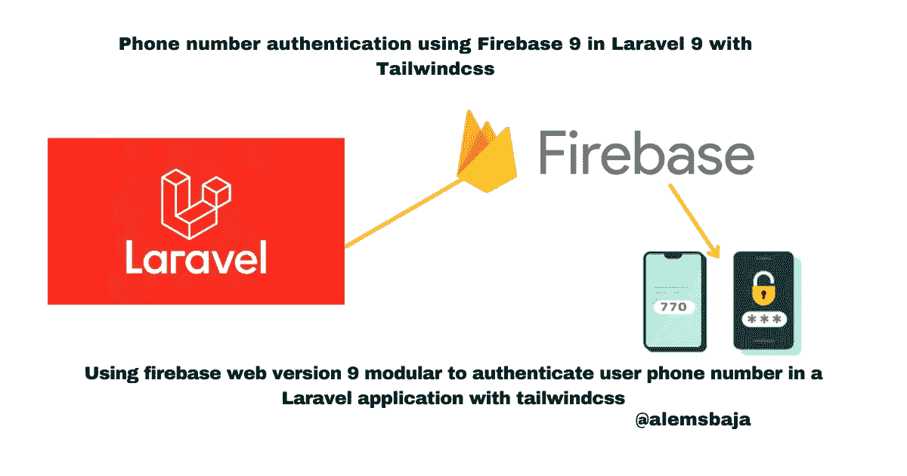

Laravel 9 中的 firebase 身份验证

在本文中，我们将了解如何在一个 Laravel 应用程序中使用 firebase web version 9 modular 来认证用户的电话号码。

可以使用 [firebase](https://firebase.google.com/) 电话认证服务在 Laravel 上验证电话号码。

Firebase: Firebase 是一个应用程序开发平台，可以帮助您构建和开发用户喜爱的应用程序和游戏。由谷歌提供支持，并得到全球数百万企业的信任。

Laravel: Laravel 是一个 web 应用程序框架，具有丰富、优雅的语法。我们已经奠定了基础——让您自由创作，无需为小事费心。

[Firebase 网络电话认证文档](https://firebase.google.com/docs/auth/web/phone-auth)

**验证电话号码的优势**

*   这有助于确保用户输入的电话号码是正确的
*   强制验证用户使用的电话号码
*   平台确信可以通过通知电话号码或双因素认证码联系到用户
*   身份证明对用户来说很重要，以避免被假冒
*   与其他身份验证策略结合使用时，可加强用户和应用程序的安全性

> *为了更好地了解使用 firebase 手机认证的特性，让我们从一个全新的 laravel 9 应用安装开始*

```
laravel new laravel_firebase_phone_authentication 
```

运筹学

```
composer create-projectvlaravel/laravel_firebase_phone_authentication
```

成功安装后，将目录更改为 laravel _ firebase _ phone _ authentic ation

```
cd laravel_firebase_phone_authentication 
```

—运行

接下来让我们在这里设置 firebase 手机认证[](https://console.firebase.google.com/u/0/)

****

> ***接下来，让我们创建一个 firebase 项目***

**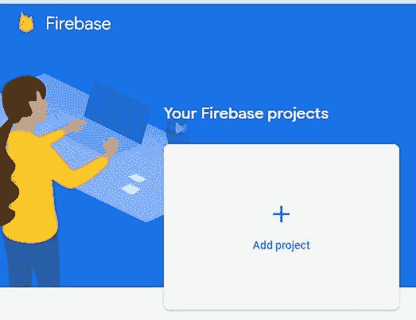**

> ***项目命名为****laravel-phone-no-verification*****

**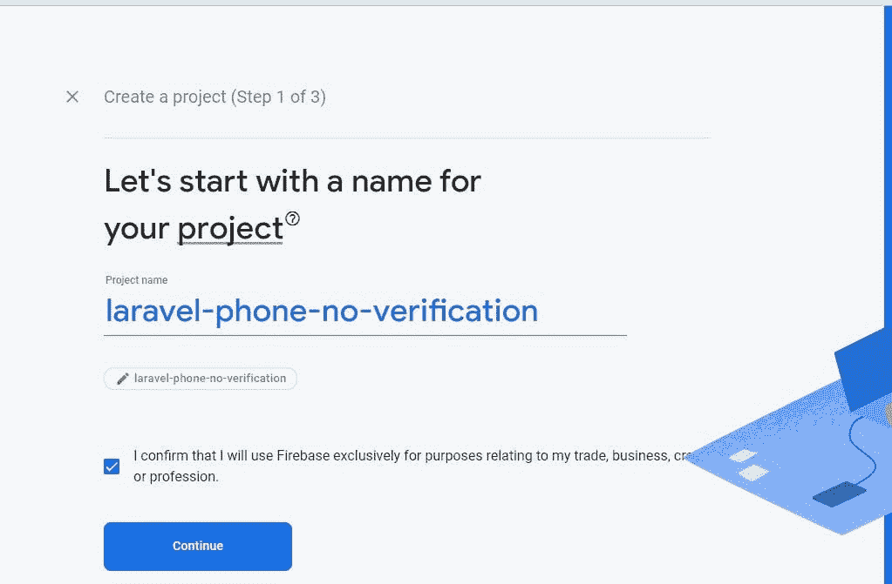**

> ***接下来，点击继续***

**如果你在一个真实的项目中使用它，为项目启用分析**

****

****但是对于本教程，我们将忽略启用分析****

**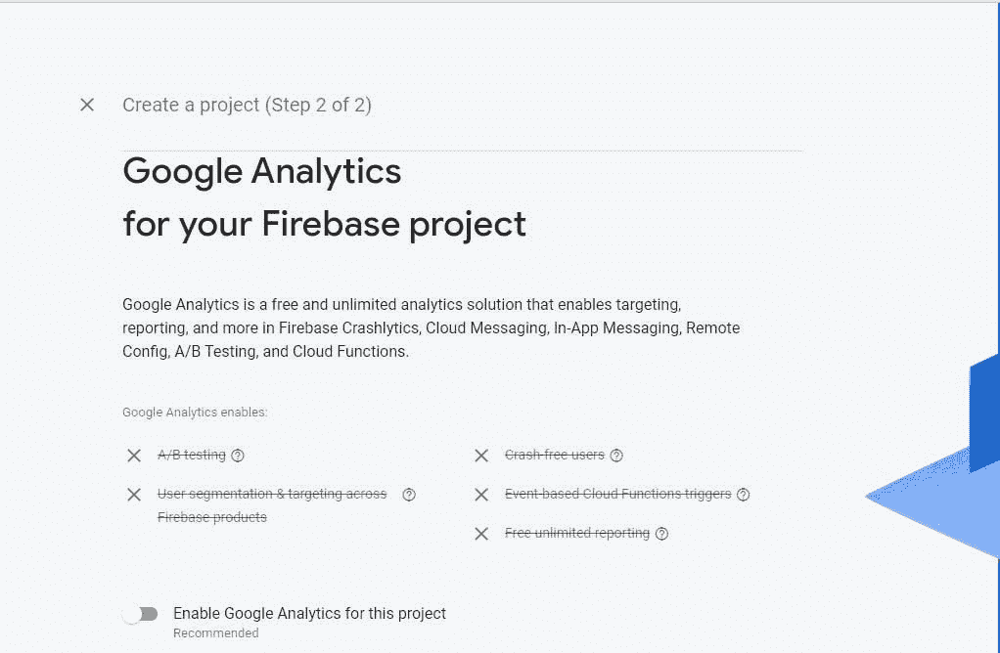**

> ***接下来，点击创建* ***项目*****

**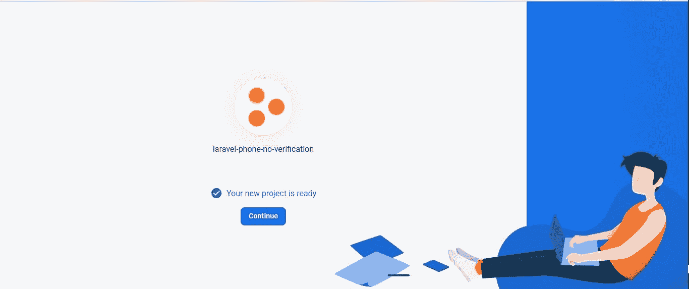**

> ***接下来，点击* ***继续*** *进入项目仪表盘***

**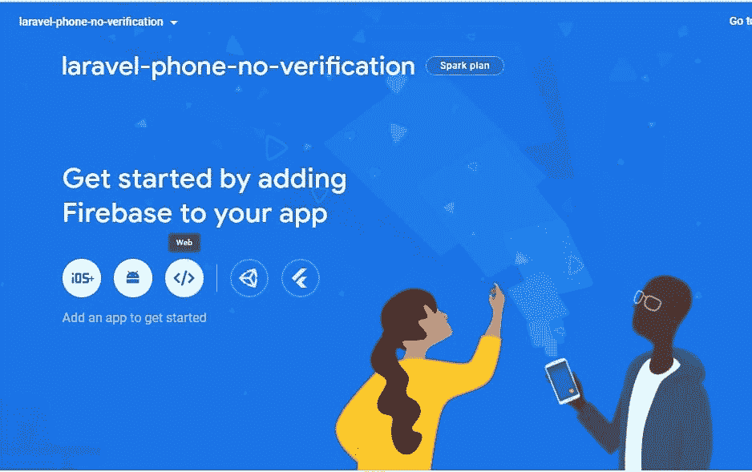**

> ***点击网络图标，如上图*所示**
> 
> ***接下来，设置 app 名称，点击* ***注册 app*** *按钮***

**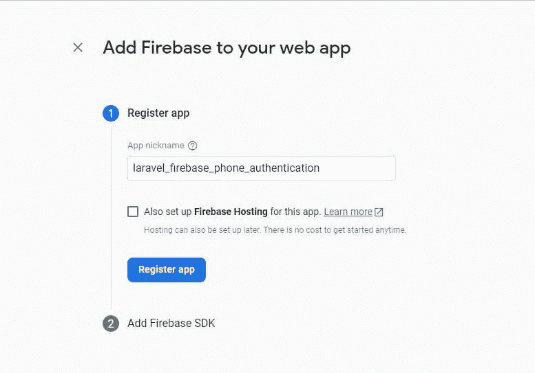**

> ***接下来，点击选择脚本标签以访问集成到 web 应用程序的脚本***

**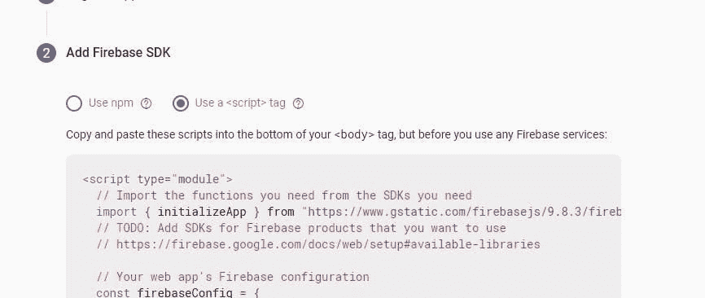**

**然后点击**继续控制台。****

> ***接下来，点击认证卡***

**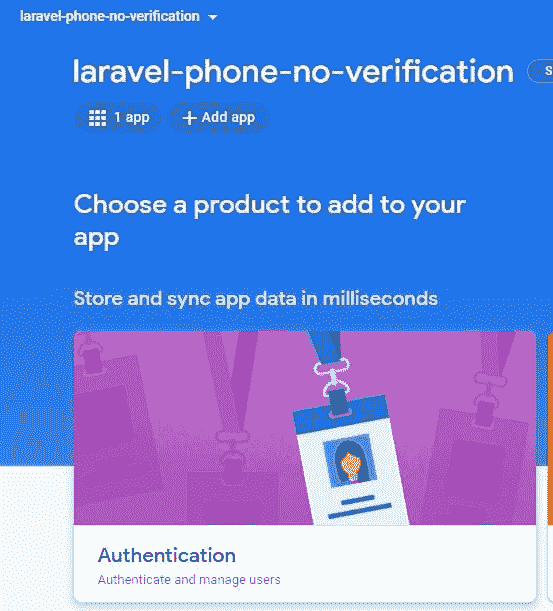**

****点击开始****

****

> ***接下来，点击电话图标，因为对于这个应用程序，我们将认证电话号码***

**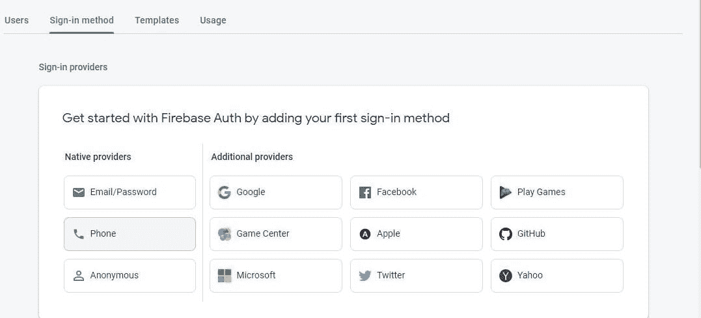**

> ***接下来切换 enable 按钮，允许用户使用移动电话号码登录，使用 Firebase SDK 电话验证和用户认证工具。***

**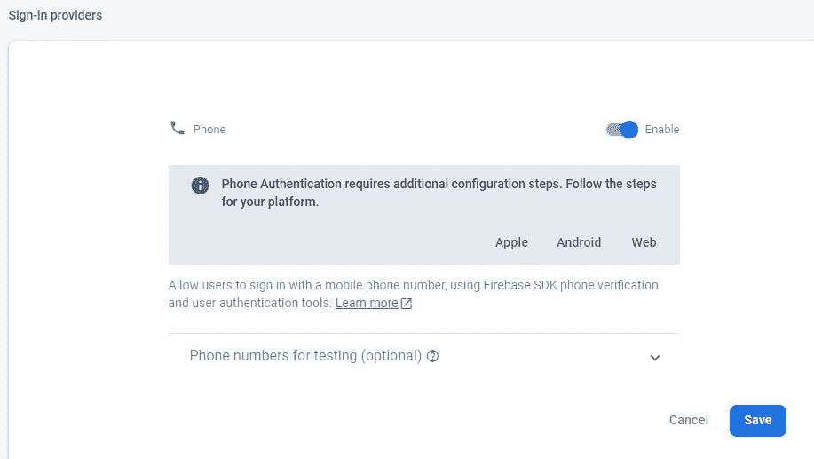**

**点击**保存**按钮。**

**有关 [firebase 电话认证](https://firebase.google.com/docs/auth/web/phone-auth?authuser=0&hl=en)的更多信息**

****注****

**目前，有两个推荐的 web 版本用于验证用户:**

****

> ***建议使用 npm，但是对于网络项目，有一个 npm 的替代设置*[](https://firebase.google.com/docs/web/alt-setup)**

***[Firebase web CDN 库](https://firebase.google.com/docs/web/learn-more#libraries-cdn)***

***对于本教程，我们将使用 CDN 库***

> ****接下来，添加并初始化认证 SDK****

```
*const firebaseConfig = { }; const app = initializeApp(firebaseConfig); const auth = getAuth(app);* 
```

*****注意:我们将在本教程演示中使用带有 tailwindcss cdn 的 welcome.blade.php 文件*****

***让我们更新***

> ******接下来，设置 reCAPTCHA 验证器******

***在您使用用户的电话号码登录之前，您必须设置 Firebase 的 reCAPTCHA 验证器。Firebase 使用 reCAPTCHA 来防止滥用，例如通过确保电话号码验证请求来自应用程序允许的域之一。***

***您不需要手动设置 reCAPTCHA 客户端；当您使用 Firebase SDK 的 RecaptchaVerifier 对象时，Firebase 会自动创建和处理任何必要的客户端密钥和机密。***

***RecaptchaVerifier 对象支持不可见的 reCAPTCHA，它通常可以在不需要任何用户操作的情况下验证用户，还支持 reCAPTCHA 小部件，它总是需要用户交互才能成功完成。***

***通过在呈现 reCAPTCHA 之前更新 Auth 实例上的语言代码，底层呈现的 reCAPTCHA 可以根据用户的偏好进行本地化。上述本地化也适用于发送给用户的包含验证码的 SMS 消息。***

*****注意**您可以使用该代码设置 Recaptcha 上的语言***

> ******电话号码验证有多种形式的 Recaptcha 验证******

```
*import { getAuth, RecaptchaVerifier } "firebase/auth"; const auth = getAuth(); window.recaptchaVerifier = new RecaptchaVerifier('recaptcha-container', {}, auth); recaptchaVerifier.render().then((widgetId) = > { window.recaptchaWidgetId = widgetId; });*
```

***在 render 解析之后，您将获得 reCAPTCHA 的小部件 ID，您可以使用它来调用 reCAPTCHA API:***

```
*const recaptchaResponse = grecaptcha.getResponse(recaptchaWidgetId);* 
```

> ****在本教程中，我们将使用* ***使用 Recaptcha 小部件******

***移除脚本标签下 Recaptcha 部分处的**//代码更新，并在其下方添加以下代码。*****

***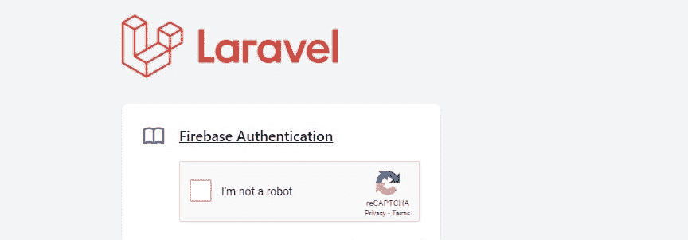***

> ******接下来，向用户手机发送验证码******

***要启动电话号码登录，我们将为用户提供一个界面，提示他们提供电话号码，然后调用 signInWithPhoneNumber 请求 Firebase 通过 SMS 向用户的电话发送一个身份验证代码:***

***法律要求各不相同，但作为一种最佳做法，并为您的用户设定期望值，您应该告知他们，如果他们使用电话登录，他们可能会收到一条短信进行验证，并适用标准费率。***

*****实现*****

> ******Tailwindcss 手机输入代码段更新******

***当用户点击 sendOTP 按钮时，send OTP 功能被触发***

***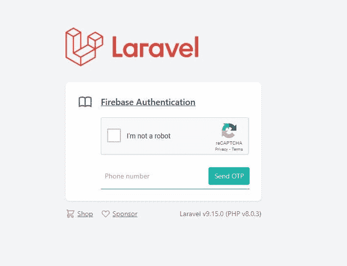***

***signInWithPhoneNumber 方法向用户发出 reCAPTCHA 质询。如果用户通过了质询，请求 Firebase Authentication 向用户的手机发送一条包含验证码的 SMS 消息。***

***[Firebase snippet web base](https://github.com/firebase/snippets-web/tree/5879ad7dedb29c6703bf94f760f6c55073c7c4ac/snippets/auth-next/phone-auth)***

> ****用验证码登录用户****

***调用 signInWithPhoneNumber 成功后，提示用户键入他们通过短信收到的验证码。然后，通过将代码传递给 ConfirmationResult 对象的 confirm 方法来登录用户，该对象已传递给 signInWithPhoneNumber 的实现处理程序***

*****实施*****

> ****尾灯 css 验证代码输入部分更新****

*****验证 OTP 按钮将触发验证 OTP 功能** **重试按钮将触发重试功能以显示电话输入部分*****

***如果您在测试时看到下图中的错误***

***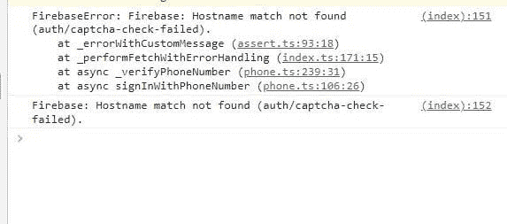***

***这意味着您的域名在 Firebase 授权域上未被识别。***

***前往 Firebase 控制台->身份验证->登录方式->授权域并添加您的域。***

***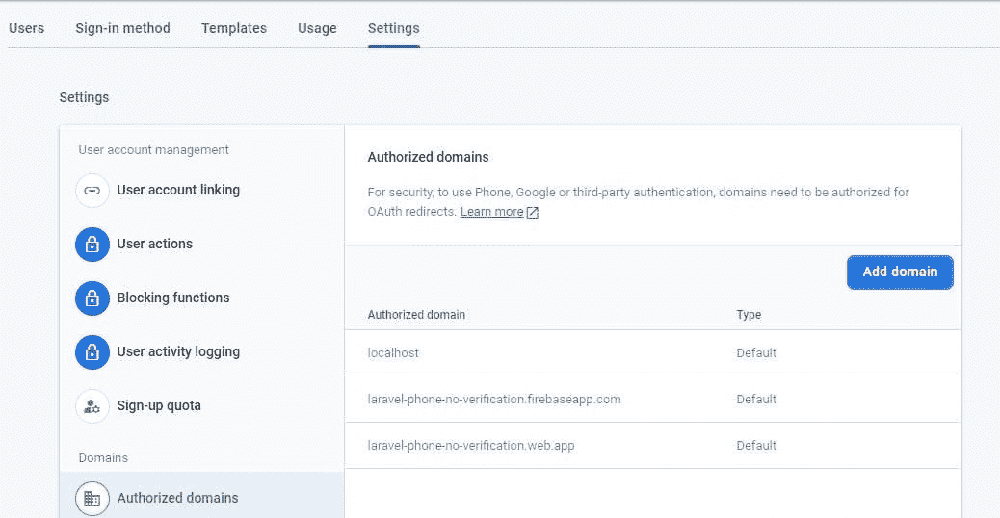***

***用户第一次登录后，会创建一个新的用户帐户，并链接到用户登录时使用的凭据，即用户名和密码、电话号码或身份验证提供者信息。这个新帐户存储为 Firebase 项目的一部分，可用于跨项目中的每个应用程序识别用户，而不管用户是如何登录的。***

***在您的应用程序中，了解用户身份验证状态的推荐方法是在身份验证对象上设置一个观察者。然后，您可以从用户对象中获取用户的基本配置文件信息。请参见管理用户。***

***在 Firebase 实时数据库和云存储安全规则中，您可以从 auth 变量中获取登录用户的唯一用户 ID，并使用它来控制用户可以访问哪些数据。***

***通过将身份验证提供者凭据链接到现有用户帐户，您可以允许用户使用多个身份验证提供者登录到您的应用程序。***

***要注销用户，请调用 sign out:***

*****表格显示*****

***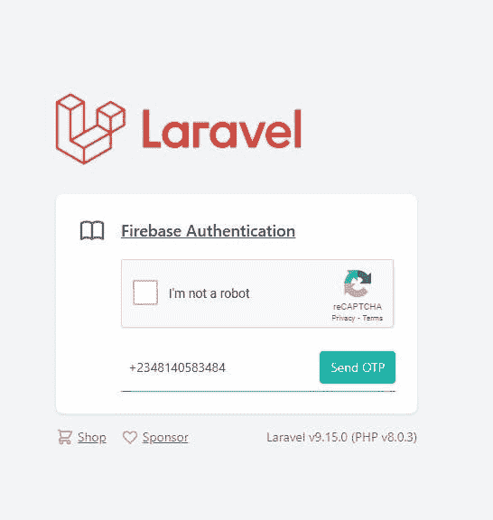***

*****夺回成功*****

***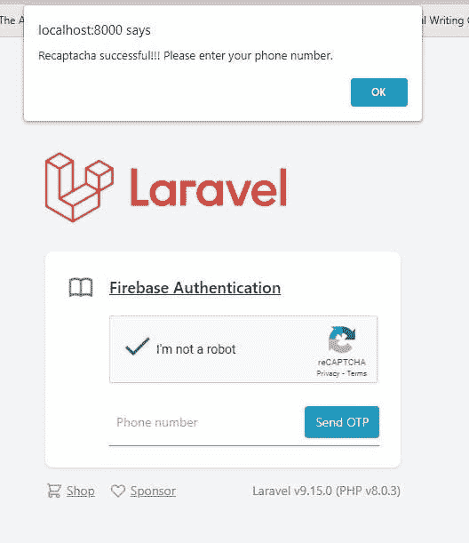***

*****验证码发送*****

***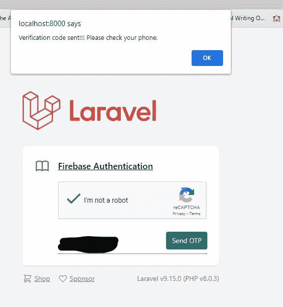***

*****OTP 已收到*****

***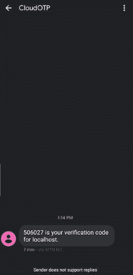***

*****动态口令验证成功*****

***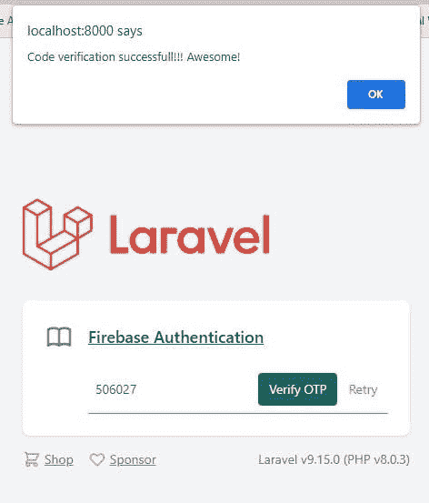*********

***感谢您阅读本文！！！。***

***如果你觉得这篇文章有用，请分享给你的网络，并随时使用评论区的问题，答案和贡献。***

****原发布于*[*https://alemsbaja . hashnode . dev*](https://alemsbaja.hashnode.dev/phone-number-authentication-using-firebase-9-in-laravel-9-with-tailwindcss)*。****