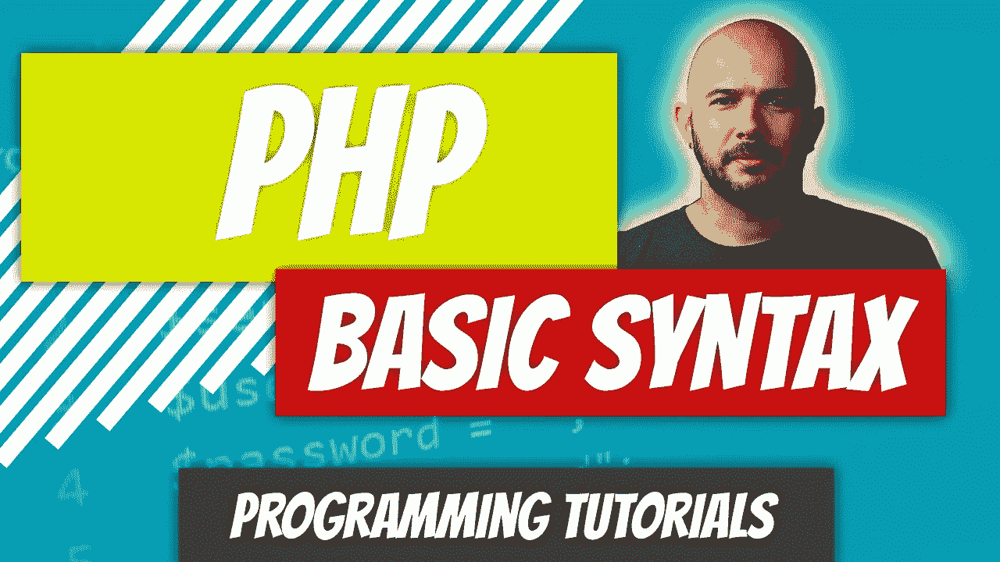

# PHP — P1:基本语法

> 原文：<https://blog.devgenius.io/php-7-x-p1-basic-syntax-2e8ca5265e9c?source=collection_archive---------16----------------------->



惠普已经超越了它的起点。这是一种具有面向对象能力的现代编程语言。它是像 [Laravel](https://laravel.com/) 这样的流行框架的支柱。这对网络来说很棒，它让编写基于网络的应用程序变得很有趣。它可用于生成全栈和后端应用程序。对于后端应用程序，您可以选择前端库或框架。有了 Laravel 后端框架，像 [React](https://reactjs.org/) 或 [Vue](https://vuejs.org/) 这样的前端库配合得很好。

我仍然看到无数反对 PHP 的论点，所以我终于受够了。我将向你们展示这种语言实际上可以有多优雅。如果你是一个编程初学者，跟随它，你不仅会学到 PHP，还会学到计算机科学的概念。

如果您打算跟随，在您的计算机上设置一个本地开发可能对您有好处。PHP 运行在服务器上，所以你需要让你的计算机认为它是服务器。您可以通过下载下列虚拟服务器之一并将其安装到您的计算机上来轻松实现这一点。

*   Windows: WAMP 服务器
*   Mac: MAMP 服务器
*   Linux: LAMP 服务器

我相信你已经猜到了 W、M 和 L 代表什么:Windows、Mac 和 Linux。AMP 代表 Apache、MySQL、PHP，其中 Apache 是服务器软件，MySQL 是数据库管理系统，PHP 是我们正在讨论的编程语言。只需谷歌你最喜欢的堆栈并下载/安装到你的机器上。*你可以查看本文底部的视频，获取操作指南。*

你还需要某种 IDE，比如 JetBrains [PHP Storm](https://www.jetbrains.com/phpstorm/) (付费)或 [Visual Studio Code](https://code.visualstudio.com/) (免费)。我两者都用。在接下来的 100 多篇文章中，没有什么是您无法用 Visual Studio 代码完成的。

在你的 IDE 中创建一个新文件，命名为 index.php。为了让您的脚本运行，它们需要以。php 扩展。为什么索引？这是当您访问您的站点时，Apache 服务器将查找的默认名称。

您的 PHP 代码需要用 PHP 标签括起来:

```
<?php 
Your Code Here;
?>
```

我们要写的第一段代码是一个简单的 echo 语句。Echo 的意思就是，把这个字符串输出到屏幕上。为了被认为是有效的 PHP 语法，每个语句都需要以分号结束。

```
<?php
echo "Hi my name is Dino Cajic";
?>
```

将文件保存在安装本地服务器的文件夹中。比如 C:/wamp/www/。如果您在本地机器上开发，请访问 http://127.0.0.1 或 http://localhost。您不需要在本地主机后面指定 index.php，因为 Apache 已经在寻找它了。如果您将文件命名为 about.php，您需要指定它:http://localhost/about.php

下面的例子给了 PHP 一个坏名声，所以我们会尽可能地避免它。我们可以把 PHP 嵌入 HTML。让我们创建一个标准的 HTML 脚本，并在脚本体中创建一个 PHP [变量](https://www.php.net/manual/en/language.variables.basics.php)，我们称之为$name。我们将很快讨论变量，但现在只知道它们是存储容器，能够存储许多不同的数据类型。它们还必须以美元符号开头，后跟字母或下划线，再后跟字母、数字和下划线的任意组合。

我们将把我们的名字存储为一个[字符串](https://www.php.net/manual/en/language.types.string.php)。如果你熟悉其他编程语言，比如 Java，你可能知道在这些语言中你必须显式地声明你存储的数据类型。因此，如果你指定你正在存储一个[字符串](https://www.php.net/manual/en/language.types.string.php)并且你试图存储一个[整数](https://www.php.net/manual/en/language.types.integer.php)，将会抛出一个错误。在 PHP 中，我们不必这样做。PHP 会搞清楚的，有时好有时坏。在我们深入讨论之前，让我们创建一个[变量](https://www.php.net/manual/en/language.variables.basics.php)。

```
$name = "Dino Cajic";
```

我们可以随心所欲地进出 PHP。在标签内，我们将从输入一些标准文本开始，然后它们跳转到 PHP。

```
<body>
  Hello there <?php echo $name; ?>
</body>
```

参见下面的完整示例。如果我们保存文件并在浏览器中打开它，我们会得到: *Hello there Dino Cajic* 。

如果您检查代码，您会看到 HTML 是唯一显示的代码。*要检查代码，右键单击并单击查看页面源代码。*

PHP 在哪里？它由 Apache 服务器解释，一旦服务器完成处理，它就向浏览器发送 HTML 代码。你所有的 PHP 代码都将在服务器上处理。

介绍到此为止。我们将从这里开始。我们将在我预计的一百篇左右的文章中涵盖大多数 PHP 概念。我会在每周二/周四/周六/周日发布这些内容。我正在努力跟上每周一/周三/周五写算法文章。如果你还没看过这些，而你对算法感兴趣，请点击我的个人资料，浏览其中几个。

我还将为每篇文章做一个视频演示。如果有些事情没有意义，查看视频，获得更直观的解释。所有的代码都将发布在我的 GitHub 账户上，所以如果你需要访问它，可以从那里获取。

**下一个** : [PHP — P2:评论](/php-7-x-p2-comments-8e69c0b567e4)

[](https://github.com/dinocajic/php-7-youtube-tutorials) [## dinocajic/PHP-YouTube-教程

### PHP YouTube 教程的代码。

github.com](https://github.com/dinocajic/php-7-youtube-tutorials) 

Dino Cajic 目前是 [LSBio(寿命生物科学公司)](https://www.lsbio.com/)、[绝对抗体](https://absoluteantibody.com/)、 [Kerafast](https://www.kerafast.com/) 、[珠穆朗玛生物科技](https://everestbiotech.com/)、[北欧 MUbio](https://www.nordicmubio.com/) 和 [Exalpha](https://www.exalpha.com/) 的 IT 负责人。他还担任我的自动系统的首席执行官。他有十多年的软件工程经验。他拥有计算机科学学士学位，辅修生物学。他的背景包括创建企业级电子商务应用程序、执行基于研究的软件开发，以及通过写作促进知识的传播。

你可以在 [LinkedIn](https://www.linkedin.com/in/dinocajic/) 上联系他，在 [Instagram](https://instagram.com/think.dino) 上关注他，或者[订阅他的媒体出版物](https://dinocajic.medium.com/subscribe)。

阅读 Dino Cajic(以及 Medium 上成千上万的其他作家)的每一个故事。你的会员费直接支持迪诺·卡吉克和你阅读的其他作家。你也可以在媒体上看到所有的故事。