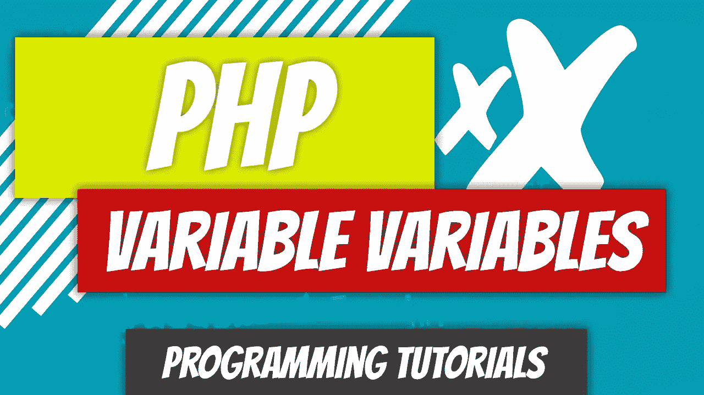

# PHP — P13:可变变量

> 原文：<https://blog.devgenius.io/php-7-x-p13-variable-variables-472cff7875e8?source=collection_archive---------18----------------------->



变量变量:不，这不是一个错别字。这就是这个题目的内容。可变变量是一个动态变量，这意味着您可以在 PHP 中动态生成变量名。这是怎么做到的？如果你在一个字符串前面加上一个美元符号，那么这个字符串就会变成一个变量。

让我们创建一个常规变量$a。变量$a 将包含字符串“bear”然后我们将创建另一个变量，这次我们将在它前面添加一个额外的美元符号。我们将新变量称为变量$$a。

```
<?php
$a = "bear";
$$a = "cow";echo $a;
echo $$a;
?>
```

如果我们回显这两个变量，PHP 将看到第一个常规变量$a，并将检索它存储的数据。它包含字符串“bear”它评估字符串并将其输出到屏幕上。它转到下一条语句，看到变量变量$a。它从初始变量$a 开始，检索字符串“bear”然后在它前面加上另一个美元符号，使变量$bear。从技术上讲,$a 是$bear。因此，它检索$bear 指向的内容，即“cow”，并将其输出到屏幕上。

我想从一个更具挑战性的例子开始，只是为了解决这个问题，让轮子转动起来。让我们来看一个更实际的例子。让我们再次创建两个变量，$mouse 和$animal。变量$mouse 将包含字符串“Small ”,变量$animal 将包含字符串“mouse”

```
<?php
$mouse = "Small";
$animal = "mouse";echo $animal;
echo $$animal;
?>
```

如果我们回显$animal，PHP 将看到它存储了字符串“mouse ”,并将它输出到屏幕上。回显$$animal 的语句将被解释为与第一个语句略有不同。PHP 将采取以下步骤:

1.  它检索$animal 指向的字符串“mouse”。
2.  它在字符串前面加上一个美元符号:$“mouse”
3.  它计算新变量$mouse 并输出字符串“Small”

你不局限于一个额外的美元符号。

我们创建了一堆变量，比如$breed，$German_Shepherd，$Canis_Lupus_Familiaris 等。仅使用变量$breed，我们就可以获得使用变量 variable 创建的所有其他变量。第一个很简单，品种。我们只需重复$breed，就可以得到动物的品种:德国牧羊犬。下划线是有意的；我们在创建可变变量，变量中不能有空格。命名约定遵循相同的规则。

为了得到亚种，我们可以在$breed 前面加上一个美元符号，然后我们将得到变量$German_Shepherd。变量$German_Shepherd 保存亚种字符串，即“Canis_Lupus_Familiaris”我们可以用同样的方法得到亚种，以及列表上的所有其他变量。让我们跳到**家庭**。要访问 family 变量，我们需要在$breed 变量前添加 4 个额外的美元符号:$$$$$breed。

让我们看看 PHP 将为$$$$$breed 创建的所有变量。

1.  $breed 包含字符串 German_Shepherd。
2.  PHP 创建$German_Shepherd ($$breed)。
3.  $German_Shepherd 包含字符串 Canis_Lupus_Familiaris。
4.  PHP 创建$ Canis _ Lupus _ Familiaris($ $ $ breed)。
5.  $Canis_Lupus_Familiaris 包含字符串 Canis_Lupus。
6.  PHP 创建$Canis_Lupus ($$$$breed)。
7.  $Canis_Lupus 包含字符串 Canis。
8.  PHP 创建$Canis ($$$$$breed)。
9.  $Canis 包含字符串 Canidae。
10.  犬科动物的声音回响在屏幕上。

你可以不断追加美元符号，以达到王国。对于本例，您需要在$breed 变量前附加 8 个美元符号:$$$$$$$$breed。

这些对你来说是可变变量。当您从数据库中检索项目时，有时这是有益的。我们不会在这里探究细节，但是我们知道使用它是有原因的。

[](https://github.com/dinocajic/php-7-youtube-tutorials) [## dinocajic/PHP-7-YouTube-教程

### PHP 7.x YouTube 教程的代码。

github.com](https://github.com/dinocajic/php-7-youtube-tutorials) 

迪诺·卡伊奇目前是 [LSBio(生命周期生物科学公司)](https://www.lsbio.com/)、[绝对抗体](https://absoluteantibody.com/)、 [Kerafast](https://www.kerafast.com/) 、[珠穆朗玛生物](https://everestbiotech.com/)、[北欧 MUbio](https://www.nordicmubio.com/) 和 [Exalpha](https://www.exalpha.com/) 的 IT 主管。他还担任我的自动系统的首席执行官。他有十多年的软件工程经验。他拥有计算机科学学士学位，辅修生物学。他的背景包括创建企业级电子商务应用程序、执行基于研究的软件开发，以及通过写作促进知识的传播。

你可以在 [LinkedIn](https://www.linkedin.com/in/dinocajic/) 上联系他，在 [Instagram](https://instagram.com/think.dino) 上关注他，或者[订阅他的媒体出版物](https://dinocajic.medium.com/subscribe)。

[*阅读迪诺·卡吉克(以及媒体上成千上万其他作家)的每一个故事。你的会员费直接支持迪诺·卡吉克和你阅读的其他作家。你也可以在媒体上看到所有的故事。*](https://dinocajic.medium.com/membership)