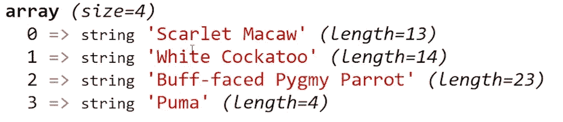
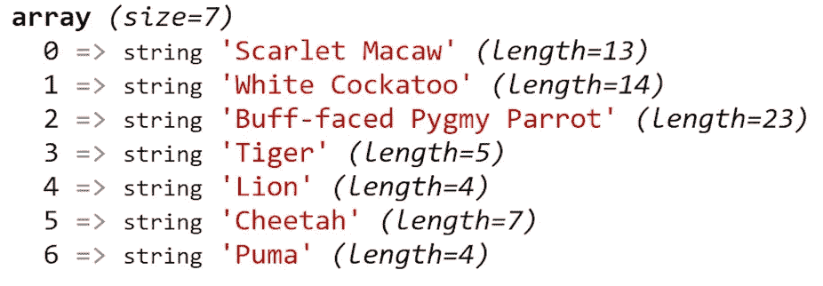

# PHP — P21:数组操作符

> 原文：<https://blog.devgenius.io/php-7-x-p21-array-operators-fb47f81858a0?source=collection_archive---------24----------------------->


数组运算符是用于数组的运算符。谁会想到呢？我们要看的第一个运算符是+运算符。您可能会认为这个操作符将用于合并两个数组，从两个数组中提取元素并将其合并到一个新的数组中，但事实并非如此。

如果您要输出上面代码的结果，您会很快看到结果是:



+运算符创建一个组合键/值对的新数组。具有数字键 0、1 和 2 的元素存在于第一个数组中，所以它们被添加到$animals 数组中；它们不会被第二个数组覆盖。第二个数组在索引 3 处有一个额外的元素，包含值 Puma，因此键/值对被添加到新数组$animals 中。

如果您想真正地将两个数组合并在一起，包含来自第一个和第二个数组的元素，您将不得不使用 array_merge()内置 PHP 函数。

```
<?php$fav_animals = array_merge($birds, $big_cats);?>
```

这将产生您最有可能期待的结果。稍后我将更详细地介绍 array_merge()。



我们可以使用相等运算符测试两个数组之间的相等性:等于(==)、等于(===)、不等于(！=)，不等同于(！==).

我们首先创建两个数组:$car_1 和$car_2。每个数组都包含键/值对，字符串用作键。这两个值之间唯一的区别是，在$car_1 中，年份将是一个整数值，而在$car_2 中，年份将是一个字符串值。其他一切都将保持不变。

测试这些值产生的结果类似于我们比较字符串时产生的结果。相等运算符测试以确保每个键/值对都是相同的。它不测试数据类型。如果我们使用==操作符来比较这两个数组，那么在 PHP 看来这两个数组是相等的。使用 identity 运算符(===)，也可以测试数据类型。尽管两个数组都存储值 2003，但第一个数组中的值是整数，第二个数组中的值是字符串。PHP 将它们视为两个不同的数组。

[](https://github.com/dinocajic/php-7-youtube-tutorials) [## dinocajic/PHP-7-YouTube-教程

### PHP 7.x YouTube 教程的代码。

github.com](https://github.com/dinocajic/php-7-youtube-tutorials) 

迪诺·卡伊奇目前是 [LSBio(生命周期生物科学公司)](https://www.lsbio.com/)、[绝对抗体](https://absoluteantibody.com/)、 [Kerafast](https://www.kerafast.com/) 、[珠穆朗玛生物](https://everestbiotech.com/)、[北欧 MUbio](https://www.nordicmubio.com/) 和 [Exalpha](https://www.exalpha.com/) 的 IT 主管。他还担任我的自动系统的首席执行官。他有十多年的软件工程经验。他拥有计算机科学学士学位，辅修生物学。他的背景包括创建企业级电子商务应用程序、执行基于研究的软件开发，以及通过写作促进知识的传播。

你可以在 [LinkedIn](https://www.linkedin.com/in/dinocajic/) 上联系他，在 [Instagram](https://instagram.com/think.dino) 上关注他，或者[订阅他的媒体出版物](https://dinocajic.medium.com/subscribe)。

[*阅读迪诺·卡吉克(以及媒体上成千上万其他作家)的每一个故事。你的会员费直接支持迪诺·卡吉克和你阅读的其他作家。你也可以在媒体上看到所有的故事。*](https://dinocajic.medium.com/membership)