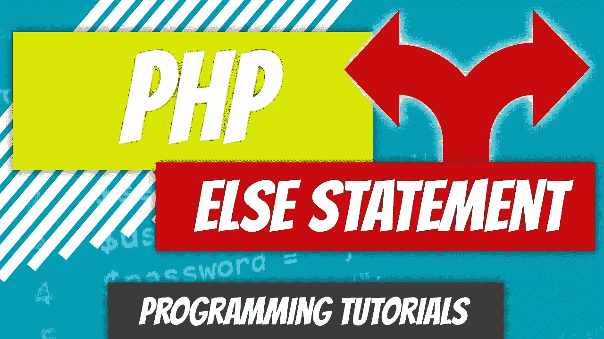

# PHP — P25: else 语句

> 原文：<https://blog.devgenius.io/php-7-x-p25-else-statement-71882c6f0687?source=collection_archive---------19----------------------->



当 if 语句的条件评估为 false 时，将执行 Else 语句。请记住，if 语句中的表达式只能在条件表达式的计算结果为 true 时执行。

else 关键字追加在 if 语句的右大括号后面。

```
<?php$exercised = false;if ( $exercised ) {
  echo "You're being healthy.";
} else {
  echo "Crickets";
}?>
```

当程序员因为一个单行表达式而选择省略 if 语句中的花括号时，else 关键字就被附加在 if 语句体中表达式的正下方。

```
<?php$best_tv_show_in_2020 = "Upload";if ( $best_tv_show_in_2020 == "Upload" )
  echo "It's Upload alright";
else
  echo "The best show is actually The Good Place";?>
```

如果您不喜欢花括号，并且需要在 else 主体中列出多个表达式，可以使用 if:/else:/endif 语法。

```
<?php$use_colons = false;if ( $use_colons ):
  echo "You are using colons";
  echo "Not good.";
else:
  echo "Still kinda using colons";
  echo "Still not good";
endif;?>
```

[](https://github.com/dinocajic/php-7-youtube-tutorials) [## dinocajic/PHP-7-YouTube-教程

### PHP 7.x YouTube 教程的代码。

github.com](https://github.com/dinocajic/php-7-youtube-tutorials) 

迪诺·卡伊奇目前是 [LSBio(生命周期生物科学公司)](https://www.lsbio.com/)、[绝对抗体](https://absoluteantibody.com/)、 [Kerafast](https://www.kerafast.com/) 、[珠穆朗玛生物](https://everestbiotech.com/)、[北欧 MUbio](https://www.nordicmubio.com/) 和 [Exalpha](https://www.exalpha.com/) 的 IT 主管。他还担任我的自动系统的首席执行官。他有十多年的软件工程经验。他拥有计算机科学学士学位，辅修生物学。他的背景包括创建企业级电子商务应用程序、执行基于研究的软件开发，以及通过写作促进知识的传播。

你可以在 [LinkedIn](https://www.linkedin.com/in/dinocajic/) 上联系他，在 [Instagram](https://instagram.com/think.dino) 上关注他，或者[订阅他的媒体出版物](https://dinocajic.medium.com/subscribe)。

[*阅读迪诺·卡吉克(以及媒体上成千上万其他作家)的每一个故事。你的会员费直接支持迪诺·卡吉克和你阅读的其他作家。你也可以在媒体上看到所有的故事。*](https://dinocajic.medium.com/membership)