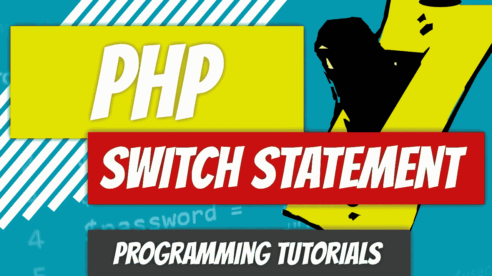

# PHP — P28: Switch 语句

> 原文：<https://blog.devgenius.io/php-7-x-p28-switch-statement-29cfa65ce901?source=collection_archive---------16----------------------->



你是否厌倦了写 if/elseif/elseif/…/else 语句？你并不孤单。有一种更优雅的方式来编写这样的大型语句:switch 语句。

让我们来看看*开关*语句的剖析。

```
switch ( $arg ) {
  case "value_1":
      expression if matched value_1
      break; // terminate
  case "value_2":
      expression if matched value_2
      break; // terminate
  ...
  default:
      execute if no cases matched
}
```

*开关*语句接受一个参数。它有一系列的"*事例*，可能与参数值匹配。如果匹配，则执行特定*案例*中的语句。如果包含一个 *break* 语句，则终止结束，否则语句继续执行，直到 PHP 到达 *switch* 语句的末尾或者遇到一个 *break* 语句。

Switch 语句可以转换成 if/elseif/else 语句，反之亦然(大部分情况下)。让我们看一个以 if/elseif/else 语句开始的例子。我们将把这个语句转换成一个 switch 语句。

上面的 if/elseif/else 语句查看了 *$name* 变量。根据匹配的条件，会显示特定的问候语。如果 *$name* 变量包含值“Harrison”，PHP 将输出“怎么样了？”如果没有找到匹配，PHP 将输出“Hi”我们把这个转换成 switch 语句。

正如您所看到的，这段代码比 if/elseif/else 语句要简洁得多。在上面的例子中，PHP 将输出“嘿，伙计”，因为“迪诺”将被匹配。由于 break 语句，它将不会继续执行。如果有几十个选项，您可以看到 switch 语句是如何有益的。我们甚至可以让它更紧凑；我们不必将每个语句放在一个新行上。

代码易于阅读:清晰是关键。

我们可以有任何想要的表达方式。让我们使用 switch 语句根据特定条件为变量赋值。

在本例中，PHP:

1.  接受 *$money_in_the_bank* 论点。
2.  它查看第一个案例，发现 *40000* 与 *1000000* 不匹配。它跳过了那个条件。
3.  它查看第二个案例，发现 *40000* 与 *500000* 不匹配。它跳过了那个条件。
4.  它查看第三个案例，发现 *40000* 与 *100000* 不匹配。它跳过了那个条件。
5.  它查看第四个案例，发现 *40000* 与 *75000* 不匹配。它跳过了那个条件。
6.  它查看第五个案例，看到 *40000* 确实与 *40000* 匹配。
7.  PHP 执行案例体内部的语句。值“斯巴鲁 STi”被分配给*$汽车*变量。
8.  遇到了 break 语句。PHP 退出*开关*语句。
9.  PHP 遇到了 *var_dump* 函数并将 *$car* 变量的内容转储到屏幕上，在本例中包含值“斯巴鲁 STi”

如果没有 *break* 语句会怎么样？PHP 将继续执行代码，直到它到达 switch 语句的末尾或者遇到另一个 break 语句。

在这个例子中，PHP 匹配第一种情况下的值。但是因为没有 *break* 语句，PHP 一直走下去。接下来，它将值“Murcielago”赋给变量 *$car* 。仍然没有*中断*语句。它会一直继续下去，直到到达右花括号。到那个时候，它把迈凯轮 F1、Murcielago、保时捷 911、Hellcat、斯巴鲁 STi，最后还有思域都赋给了 *$car* 变量。当我们调用 *var_dump* 函数时，它输出“Civic”你可以从这个简单的例子中看出这可能是一个代价高昂的错误。你刚刚花了一百万买了辆思域。

有时候我们想选择性地使用 *break* 语句。

在这段代码中，我们不想一遍又一遍地写“这是一家科技公司”或“这是一家汽车公司”。不管是雪佛兰还是斯巴鲁，都是车企。这个例子中 PHP 会做什么？

1.  PHP 输入 *switch* 语句，并尝试将存储在 *$brand* 变量中的值与其中一种情况相匹配。
2.  它一直向下，直到到达雪佛兰*的箱子。*
3.  PHP 执行 Chevy *案例中的语句。那里什么也没有。也没有*破*的说法。所以，PHP 一直走下去。*
4.  下一句话是“这是一家汽车公司。”该语句被执行。
5.  PHP 遇到 *break* 语句，退出 *switch* 语句。

我们可以在 case 语句中使用其他类型的比较运算符。假设我们想告诉学生他或她在考试中得了多少分。我们要么必须为 0 到 100 之间的每个值创建一个事例，要么可以使用比较运算符。

顺序很重要。我们从最高分开始，一步步往下。PHP 将输出“b”。如果代码反过来，PHP 将输出“D”，因为 *$grade ≥ 60* 是正确的陈述。

[](https://github.com/dinocajic/php-7-youtube-tutorials) [## dinocajic/PHP-7-YouTube-教程

### PHP 7.x YouTube 教程的代码。

github.com](https://github.com/dinocajic/php-7-youtube-tutorials) 

迪诺·卡伊奇目前是 [LSBio(生命周期生物科学公司)](https://www.lsbio.com/)、[绝对抗体](https://absoluteantibody.com/)、 [Kerafast](https://www.kerafast.com/) 、[珠穆朗玛生物](https://everestbiotech.com/)、[北欧 MUbio](https://www.nordicmubio.com/) 和 [Exalpha](https://www.exalpha.com/) 的 IT 主管。他还担任我的自动系统的首席执行官。他有十多年的软件工程经验。他拥有计算机科学学士学位，辅修生物学。他的背景包括创建企业级电子商务应用程序、执行基于研究的软件开发，以及通过写作促进知识的传播。

你可以在 [LinkedIn](https://www.linkedin.com/in/dinocajic/) 上联系他，在 [Instagram](https://instagram.com/think.dino) 上关注他，或者[订阅他的媒体出版物](https://dinocajic.medium.com/subscribe)。

[*阅读迪诺·卡吉克(以及媒体上成千上万其他作家)的每一个故事。你的会员费直接支持迪诺·卡吉克和你阅读的其他作家。你也可以在媒体上看到所有的故事。*](https://dinocajic.medium.com/membership)