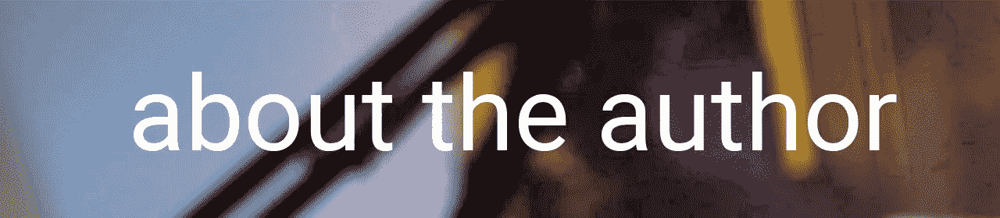

# PHP — P31: For 循环

> 原文：<https://blog.devgenius.io/php-7-x-p31-for-loop-68724b49b861?source=collection_archive---------8----------------------->


我使用*来表示*循环的次数比使用 [*和*循环](https://medium.com/@dinocajic/php-7-x-p29-while-loops-2f178ae3d747)的次数多。似乎大部分时间我都在从数据库中读取项目: *for* 循环非常适合这种情况。我倾向于在 Java 程序中使用 *while* 循环，我需要执行一些代码直到程序终止；这在 PHP 中是不现实的。在 web 编程中，我几乎只对和 *foreach* 循环使用*。*

在大多数编程语言中，循环的*遵循以下语法:*

```
for (exp_before; exp_before_loop_body; exp_after) { loop_body }
```

一旦 PHP 遇到循环的*，它就会查看表达式 *exp_before* 来初始化循环所需的必要变量。当我们在*循环时查看*时，我们在 *while* 循环之外初始化了 *$i* 计数器。这是在 *exp_before* 表达式中完成的。*

```
**$i = 0**; while(...) { }for (**$i = 0**; ...) { }
```

接下来，PHP 查看表达式 *exp_before_loop_body* ，它出现在循环体的*之前，但在初始化步骤之后。这是进行条件测试的地方。这类似于 *while* 循环中的条件语句。*

```
while (**$i < 10**) { }
for (...; **$i < 10**; ...) { }
```

如果表达式的计算结果为 true，它可以进入循环体并计算循环体内的内容。

```
while (**$i < 10**) {
  **echo "Hello";**
}for (...; **$i < 10**; ...) {
  **echo "Hello";**
}
```

一旦所有的语句都在循环体内执行，PHP 就会查看 for 循环内的最后一个表达式( *exp_after* )。大多数情况下，这是您增加或减少在 *exp_before* 中初始化的计数器变量的地方。同样，让我们将其与 *while* 循环进行比较。

```
while (...) {
  ...
  $i++;
}for (...; ...; $i++) {
  ...
}
```

按执行顺序:

1.  exp _ 之前
2.  exp _ before _ 循环 _ 正文
3.  循环体
4.  出口 _ 之后

形象化的最简单方法是将一个 *while* 循环转换为循环的*。*

两个循环将做同样的事情:显示整数 0 到 9。让我们通过*进行*循环。

1.  PHP 遇到了关键字的*。它知道这是*循环的*。*
2.  它检查初始化阶段。它设置 *$i = 0* 。
3.  它检查条件。是 *$i < 10* 吗？0 <是 10 吗？是的。所以，进入循环体。
4.  执行*回显*语句。打印 0。
5.  在第一次迭代期间，将 *$i* 从 0 增加到 1。
6.  重复 3 到 5，直到 *$i* 等于 9。我们没有重复 2，因为那会重新初始化 *$i* ，并且会产生一个无限循环。
7.  一旦 *$i* 从 9 增加到 10，PHP 就会检查 10 是否小于 10。因为 10 不小于 10，所以循环终止。PHP 在循环的右花括号的*之后继续执行代码。*

我们可以用循环中的*来遍历一组条目。这就是*循环的*发光的地方。*

在上面的例子中，我们有一个字符串数组。为了获得数组中元素的数量，我们使用了 *count()* 函数，并将数组变量传递给它。因为 PHP 中的数组从 0 开始，一直到元素数减 1，所以元素数是一个很好的上限。我们可以使用 *for* 循环来遍历数组。让我们更合乎逻辑地看待它。

1.  PHP 创建了一个 *$things_i_hate* 变量，并存储了一个包含 4 个字符串的数组。
2.  它遇到了关键字的*。*
3.  PHP 将 *$i* 初始化为 0。为什么是 0？因为数组中的第一个元素位于索引 0 处。
4.  PHP 在 *count($things_i_hate)* 函数的帮助下获得数组中元素的个数。count() 函数返回 4。
5.  PHP 测试看 *$i* 是否小于 4。第一次迭代时， *$i* = 0，所以 *$i* 小于 4。
6.  PHP 进入循环体，回显出 *$things_i_hate[ $i ]。*在第一次迭代期间， *$i = 0* ，所以显示数组中的第一个元素。
7.  PHP 在第一次迭代中递增 *$i.* ，它将 *$i* 从 0 递增到 1。
8.  PHP 从 4 到 7 重复这个过程。
9.  当 *$i* 从 3 递增到 4 时，PHP 会检查 *$i* 是否小于 4。由于 4 不小于 4，PHP 终止。显示索引为 0、1、2 和 3 的元素。

您可能想知道如果您将条件 *$i < 4* 设置为 *$i ≤ 4 会发生什么。*然后 PHP 会尝试回显出 *$things_i_hate[4]* ，这是不存在的。将引发数组索引 OutOfBoundsException 错误。

如果我们想反向显示元素呢？循环的*也可以这样做。我们只需要稍微改变一下逻辑。*

这一次，我们将把索引初始化为数组中的最后一个元素。由于 *count()* 函数返回数组中元素的数量，如果我们试图调用具有该值的最后一个数组元素，这会使索引越界。我们需要减去 1 才能得到最后一个元素。[记住，数组从 0 开始](https://medium.com/dev-genius/php-7-x-p9-simple-arrays-4ef56bed0d8a)。一旦到达初始化步骤，PHP 将测试是否到达了第一个元素。它想显示第一个元素，但它不能越过它。所以我们才把条件设为 *$i ≥ 0* 。一旦 PHP 执行了循环体内的语句，它就会递减 *$i* 以移动到之前的元素。

虽然 *for* 循环很棒，但是 PHP 有一个更好的循环遍历数组的循环，叫做 *foreach* 循环，我们将在下一次讨论它。

[](https://github.com/dinocajic/php-7-youtube-tutorials) [## dinocajic/PHP-7-YouTube-教程

### PHP 7.x YouTube 教程的代码。

github.com](https://github.com/dinocajic/php-7-youtube-tutorials) 

迪诺·卡希奇目前是 [LSBio(寿命生物科学公司)](https://www.lsbio.com/)、[绝对抗体](https://absoluteantibody.com/)、 [Kerafast](https://www.kerafast.com/) 、[珠穆朗玛生物科技](https://everestbiotech.com/)、[北欧 MUbio](https://www.nordicmubio.com/) 和 [Exalpha](https://www.exalpha.com/) 的 IT 主管。他还担任我的自动系统的首席执行官。他有十多年的软件工程经验。他拥有计算机科学学士学位，辅修生物学。他的背景包括创建企业级电子商务应用程序、执行基于研究的软件开发，以及通过写作促进知识的传播。

你可以在 [LinkedIn](https://www.linkedin.com/in/dinocajic/) 上联系他，在 [Instagram](https://instagram.com/think.dino) 上关注他，或者[订阅他的媒体刊物](https://dinocajic.medium.com/subscribe)。

阅读 Dino Cajic(以及 Medium 上成千上万的其他作家)的每一个故事。你的会员费直接支持迪诺·卡吉克和你阅读的其他作家。你也可以在媒体上看到所有的故事。