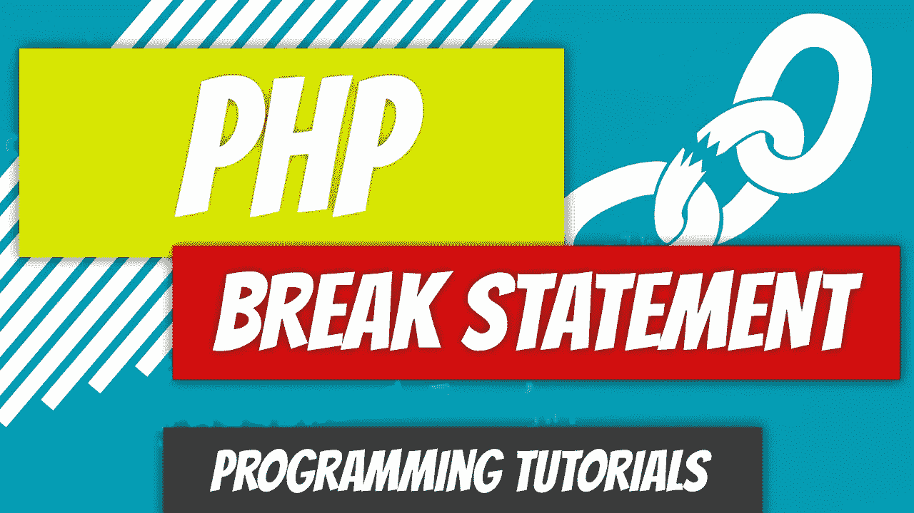

# PHP — P33: Break 语句

> 原文：<https://blog.devgenius.io/php-7-x-p33-break-statement-13ad4eeca654?source=collection_archive---------13----------------------->

当我们讨论 [*开关*语句](https://medium.com/@dinocajic/php-7-x-p28-switch-statement-29cfa65ce901)时，我们查看了*中断*语句。在这种情况下， *break* 语句用于结束 *switch* 语句的执行。 *break* 语句并不专属于 *switch* 语句:它也可以在循环中使用。

让我们看看 *break* 语句是如何在每个循环中结束执行的: [*while*](https://medium.com/@dinocajic/php-7-x-p29-while-loops-2f178ae3d747) ， [*do-while*](https://medium.com/@dinocajic/php-7-x-p30-do-while-loop-e70777a17ee3) ， [*for*](https://medium.com/@dinocajic/php-7-x-p31-for-loop-68724b49b861) ，以及 [*foreach*](https://medium.com/@dinocajic/php-7-x-p32-foreach-loop-f38b88249e76) 。我们将从创建一个循环将遍历的数组开始。

每个循环的目标将是遍历*$ favorite _ programming _ language*数组并匹配“php”。一旦到达包含“php”的元素，我们要结束代码的执行；继续迭代没有意义。这将有助于加快执行时间，因为 PHP 不必遍历数组中的每个元素(除非值被存储为最后一个元素)。

以[开始*同时*循环](https://medium.com/@dinocajic/php-7-x-p29-while-loops-2f178ae3d747)。PHP 检查语句中的条件是否评估为真。如果是，它将执行循环体内的代码。显示索引值 *$i* 。如果元素的值与“php”匹配，就会显示字符串“PHP 是我们的最爱”，代码终止。让我们在逻辑循环的同时，遍历*。我们将仅对 *while* 循环执行此操作，因为其他循环的逻辑几乎相同。*

1.  PHP 初始化 *$i = 0* 。
2.  它*回显*出“While Loop”
3.  PHP 遇到了*而*关键字。
4.  它在 *count()* 函数的帮助下获得*$ favorite _ programming _ language*数组中的元素个数。
5.  它测试的条件: *$i < 6。*在第一次迭代期间， *$i = 0，*因此表达式 0 < 6 的计算结果为 *true* 。
6.  PHP 进入循环体并回显出 *$i.* 的当前值
7.  它遇到了 if 语句的*。在第一次迭代期间， *if* 语句评估为 *false* ，因为 *java* 不等于 *php。* PHP 跳过 *if* 语句体。*
8.  PHP 越过 if 语句的右花括号，并递增 *$i* 。在第一次迭代中， *$i* 从 0 递增到 1。
9.  PHP 在第二次迭代中重复步骤 4 到 9。
10.  在第三次迭代过程中，PHP 会看到 *if* 语句条件评估为 *true。*
11.  如果语句和*回应*出“PHP 是我们的最爱”，PHP 就会进入*的主体。*
12.  PHP 遇到 *break* 语句并终止循环。在 *while* 循环的右花括号之后，它继续执行代码。

一旦在循环内部遇到 *break* 语句，它将跳过循环内部的所有其他代码，并继续循环体外部的代码执行。即使 *break* 语句位于循环体内部，它仍然会终止循环。如果在嵌套循环(循环中的循环)中遇到 *break* 语句，它将在循环所在的位置终止循环。外部循环仍将继续执行。

让我们继续进入 [*循环*](https://medium.com/@dinocajic/php-7-x-p30-do-while-loop-e70777a17ee3)。

*while* 和 *do-while* 循环的区别在于，PHP 将在检查 *do-while* 循环的条件之前检查 *if* 语句的条件(与 *while* 循环相反)。一旦“php”被匹配，将执行 *break* 语句，循环将终止。

接下来我们来看看循环的[和*。同样，一旦遇到 *break* 语句，*循环的*将终止。*](https://medium.com/@dinocajic/php-7-x-p31-for-loop-68724b49b861)

最后是 [*foreach* 循环](https://medium.com/@dinocajic/php-7-x-p32-foreach-loop-f38b88249e76)。

因为这是一篇关于 *break* 语句的文章，所以让我们简单介绍一下它是如何在 *switch* 语句中使用的。如果你需要复习一下*开关*语句是如何工作的，你可以[在这里](https://medium.com/@dinocajic/php-7-x-p28-switch-statement-29cfa65ce901)阅读。

在上面的例子中:

1.  PHP 将值 *1000521* 分配给 *$num_of_subscribers。*
2.  PHP 遇到了 *switch* 语句。
3.  它将变量 *$num_of_subscribers* 传递给 *switch* 语句，并开始测试过程。
4.  它查看第一个*案例*，并对表达式*$ num _ of _ subscribers>1000000 求值。*由于 1000521 大于 1000000，所以进入 *case* 语句。
5.  PHP *附和*出“我过着富人和名人的生活。”
6.  PHP 转到下一条语句，这条语句恰好是 *break* 语句。PHP 退出了 *switch* 语句，这意味着其余的*案例*甚至没有被查看。PHP 在 *switch* 语句的右花括号后继续执行代码。

最后要注意的是，在循环内部，有时我们只想跳过循环体内部的代码，继续下一个元素，而不终止循环。这可以通过 *continue* 语句实现，这是下一篇文章的主题。

 [## dinocajic/PHP-7-YouTube-教程

### PHP 7.x YouTube 教程的代码。

github.com](https://github.com/dinocajic/php-7-youtube-tutorials) 

迪诺·卡希奇目前是 [LSBio(寿命生物科学公司)](https://www.lsbio.com/)、[绝对抗体](https://absoluteantibody.com/)、 [Kerafast](https://www.kerafast.com/) 、[珠穆朗玛生物科技](https://everestbiotech.com/)、[北欧 MUbio](https://www.nordicmubio.com/) 和 [Exalpha](https://www.exalpha.com/) 的 IT 负责人。他还担任我的自动系统的首席执行官。他有十多年的软件工程经验。他拥有计算机科学学士学位，辅修生物学。他的背景包括创建企业级电子商务应用程序、执行基于研究的软件开发，以及通过写作促进知识的传播。

你可以在 [LinkedIn](https://www.linkedin.com/in/dinocajic/) 上联系他，在 [Instagram](https://instagram.com/think.dino) 上关注他，或者[订阅他的媒体出版物](https://dinocajic.medium.com/subscribe)。

阅读 Dino Cajic(以及 Medium 上成千上万的其他作家)的每一个故事。你的会员费直接支持迪诺·卡吉克和你阅读的其他作家。你也可以在媒体上看到所有的故事。