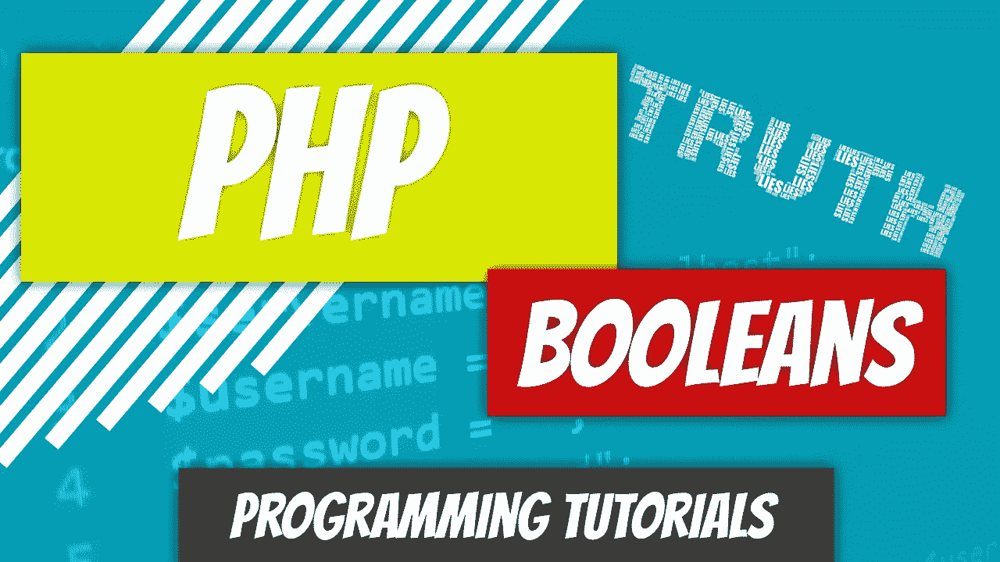

# PHP — P4:基本布尔函数

> 原文：<https://blog.devgenius.io/php-7-x-p4-basic-booleans-40cf0c0140e8?source=collection_archive---------14----------------------->



布尔值是一种标量数据类型，表示值 true 和 false。真的是这样。文章结束。这将是一篇短文，所以在我们突然结束之前，让我们先看几个例子。

创建一个新文件，命名为 booleans_intro.php。我们将用 booleans_intro.php 文件测试下面的代码。

我最喜欢的一辆车是 MKIV 2JZGTE Toyota Supra，这对正确理解布尔很重要。我们将创建一个变量来检查 Supra 当前是否存在于我的车库中。

```
$in_garage_mkiv_supra = false;
var_dump( $in_garage_mkiv_supra );
```

不幸的是，我不得不将该变量设置为 false。如果您使用 var_dump()值，它将显示变量存储的是布尔类型，值为 false。让我们继续举几个例子。我们要检查的下一辆车是看斯巴鲁 WRX STi 是否在车库里。

```
$in_garage_sti = true; // hooray...one down
var_dump( $in_garage_sti );
```

我将简单地向您介绍一下 *if 语句*,尽管我们将在本系列文章的第 24 部分中广泛讨论它。就用英语说:

> 如果某事然后某事

所以，如果事情是真的，那就做点什么。你整天都在做 if 语句。比如，只有外面阳光明媚，我才会洗车。可以翻译成

> 如果(sunny == true)那么:洗车。

现在我们对 if 语句的作用有了一个非常基本的了解，让我们对前面的代码做一些测试。

```
$in_garage_sti = true;if ( $in_garage_sti == true ) {
  echo "Hooray, I have AWD";
}
```

因为存储在变量中的值已经不是真就是假，我们不需要比较它是真还是假。我们可以去掉比较运算符和 true 关键字，只保留 if 语句中的变量。

```
$in_garage_mkiv_supra = false;if ( $in_garage_mkiv_supra ) {
  echo "I'll be sleeping in the garage tonight.";
}
```

if 语句的计算结果为 false，因为$in_garage_mkiv_supra 变量是一个布尔值，该值为 false，并且 if 语句中的代码永远不会执行。不幸的是，今晚对我来说这是张舒服的床。

我们也可以让布尔变量为真，如果它们为假，反之亦然。).如果你的变量被设置为 false，并且你在它前面使用了否定操作符，它将把它转换为 false。它只是翻转布尔值。

```
$in_garage_r32_skyline = false;if ( !$in_garage_r32_skyline ) {
  echo "WoooHooo I got a Skyline"; // I really don't :(
}
```

上面的语句看起来不会计算 if 语句的主体，但实际上它会。为什么？如果我们大声说出来，我们会说:

1.  如果不是$in_garage_r32_skyline
2.  如果不是假的
3.  如果属实

因为 if 语句评估表达式为真，它评估 if 语句的主体，现在眼泪流下我的脸，因为我刚刚意识到我没有天际线，即使语句说我有。

让我们看一些可能不那么明显的东西。我们很快就会看到比较运算符，但是我假设你学过数学，并且见过大于和小于运算符: >，

我可以问你这个问题“5 大于 2 是真的吗？”你会回答，“是的，这是一个真实的陈述。”因为它的值要么为真，要么为假，所以我们可以基于变量对表达式的求值，将变量设置为真或假。

我想看看我是否富有。我目前在银行账户上有 10 美元，但需要 10 万美元才能被视为富有。我有钱吗？我们该如何建模？

```
$current_money = 10;
$rich = $current_money > 100000;
var_dump( $rich );
```

如果您将上面的代码保存到文件中，并在浏览器中打开它，您会看到 var_dump 将输出 false。为什么？PHP 首先查看赋值操作符右边的表达式(我们还没有详细查看)。它用 10 代替$current_money，然后计算表达式 10 > 100000。这不是一个真的语句，所以它返回 false。然后将值 false 赋给变量$rich。

现在我想我可以说文章结束了。

[](https://github.com/dinocajic/php-7-youtube-tutorials) [## dinocajic/PHP-7-YouTube-教程

### PHP 7.x YouTube 教程的代码。

github.com](https://github.com/dinocajic/php-7-youtube-tutorials) 

迪诺·卡伊奇目前是 [LSBio(生命周期生物科学公司)](https://www.lsbio.com/)、[绝对抗体](https://absoluteantibody.com/)、 [Kerafast](https://www.kerafast.com/) 、[珠穆朗玛生物](https://everestbiotech.com/)、[北欧 MUbio](https://www.nordicmubio.com/) 和 [Exalpha](https://www.exalpha.com/) 的 IT 主管。他还担任我的自动系统的首席执行官。他有十多年的软件工程经验。他拥有计算机科学学士学位，辅修生物学。他的背景包括创建企业级电子商务应用程序、执行基于研究的软件开发，以及通过写作促进知识的传播。

你可以在 [LinkedIn](https://www.linkedin.com/in/dinocajic/) 上联系他，在 [Instagram](https://instagram.com/think.dino) 上关注他，或者[订阅他的媒体出版物](https://dinocajic.medium.com/subscribe)。

[*阅读迪诺·卡吉克(以及媒体上成千上万其他作家)的每一个故事。你的会员费直接支持迪诺·卡吉克和你阅读的其他作家。你也可以在媒体上看到所有的故事。*](https://dinocajic.medium.com/membership)