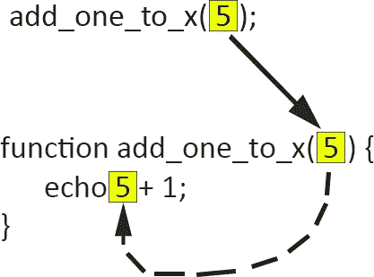

# PHP — P42:回调函数

> 原文：<https://blog.devgenius.io/php-7-x-p42-callback-functions-6552477f2a87?source=collection_archive---------0----------------------->


是时候使用回调函数了。什么是回调函数？它只是一个函数，作为参数传递给另一个函数，然后在另一个函数内部执行。我认为现在是时候详细讨论这个概念了，把它一劳永逸地抛在脑后。我们将介绍将匿名函数(闭包)和箭头函数作为参数传递给其他函数，然后也调用它们。

回调函数在异步语言中很有意义，因为我们可能不希望两个函数竞争完成时间。一个函数可能依赖于另一个函数的结果，所以我们需要两个函数同步执行(一个接一个)。

我们习惯于将整数、字符串甚至数组作为参数传递给函数，但是我们可能不熟悉将函数本身作为参数传递给其他函数。

如果您不熟悉函数如何工作的概念，我建议您阅读我关于这些概念的其他文章。在继续之前，您可能需要熟悉以下几个方面。

[PHP 7.x — P35:自定义函数](https://medium.com/dev-genius/php-7-x-p35-user-defined-functions-c6e23a7309c5)
[PHP 7.x — P36:函数参数](https://medium.com/dev-genius/php-7-x-p36-function-arguments-f0b4c131ad1b)
[PHP 7.x — P37:函数返回值](https://medium.com/dev-genius/php-7-x-p37-functions-returning-values-ed1928c4ee73)
[PHP 7.x — P38:变量函数](https://medium.com/dev-genius/php-7-x-p38-variable-functions-bd8f0ab72dfb)
[PHP 7.x — P39:匿名函数](https://medium.com/dev-genius/php-7-x-p39-anonymous-functions-75f6f99fa571)
[PHP 7.x — P40:使用关键字](https://medium.com/dev-genius/php-7-x-p40-use-keyword-37d8e7df9138)
[PHP](https://medium.com/@dinocajic/php-7-x-p41-arrow-functions-68a68b2debc6)

我将简要回顾几个概念，以便整体情况更有意义。我们将创建一个接受一个参数的函数 *add_one_to_x()* 。然后，该函数会将 *1* 添加到参数中，并*回显*结果。

到目前为止相当标准。我们传递了一个整数作为参数。你可以这样想，值 *5* 被赋给了变量(参数) *$x* 。假设我们将 *$x* 移入了函数体。结果会是一样的。

当然，这并没有给我们传递参数的灵活性，因为它是硬编码在函数体内的，但是这种可视化是很重要的。我们也可以通过给参数分配一个缺省值来可视化这一点。

这些基本示例的全部目的是为了直观地了解参数从函数调用到函数定义的变化。让我们看看当我们将参数传递给 *add_one_to_x()* 函数时会发生什么。



我相信你已经知道了。我认为我们在这个概念上已经花了足够的时间，所以让我们进入下一个概念。

你知道在 PHP 中还有另外一种调用函数的方法吗？

你可能像我在上面第 7 行那样调用过函数。但是，PHP 有一个内置函数， *call_user_func()* ，它接受一个字符串作为参数。该字符串是您想要调用的函数的名称。第 8 行的*call _ user _ func(" say _ hello ")*语句做的事情与第 7 行的 *say_hello()* 完全相同。这里没有诡计:它实际上只是调用函数的另一种方式。

让我们创建一个名为 *animal_says()* 的函数。最初，该函数将接受两个参数。一旦函数被调用，这些参数就会被回显。

在上面的例子中，两个参数被传递给 *animal_says()* 函数。该功能将*回应*出*猫说狗吸*。我创建了两个 *echo* 语句，因为接下来我们将修改这个函数。

让我们改变第二个*呼应*的说法。我们不会直接*重复*的参数 *$animal_saying* ，而是调用另一个函数来完成这项工作。

我们首先创建一个新函数， *cat_says()* 。这个函数接受一个参数，当它被调用时，它会回显这个值。从 *animal_says()* 函数中调用 *cat_says()* 函数。这些就是变化。让我们浏览一下这个例子，看看发生了什么。我们还没有得到回调函数的概念，但是我们已经很接近了。

1.  PHP 到达第 12 行。调用函数 *animal_says()* 并传递两个参数:字符串 *Cat* 和 *Dogs suck* 。
2.  PHP 在第 3 行输入函数 *animal_says()* 。第一个参数连接到字符串“says ”,并由*回显*输出。
3.  第二个参数 *Dogs suck* ，作为参数传递给 *cat_says()* 函数。
4.  PHP 进入 *cat_says()* 函数。*狗吸*的说法是*附和*出来的。
5.  PHP 退出 *cat_says()* 函数，返回到 *animal_says()* 函数。
6.  PHP 在第 12 行后退出 *animal_says()* 函数并结束程序的执行。
7.  总输出为:*猫说狗吸*。

如果我了解猫，我确实了解，他们会**总是**说*狗烂。*那么，首先将参数传递给 *cat_says()* 函数有什么意义呢？我们可以就在那里呼应它。

这些狗被激怒了。他们也想拥有自己的功能。让我们创建一个 *dog_says()* 函数。他们想一直说*猫烂。*

让我们想象一下，我们不能直接访问 *cat_says()* 和 *dog_says()* 函数，并且我们**只有**可以访问 *animal_says()* 函数(你会在面向对象编程中看到这个概念，我们将在后面的文章中讨论)。

如果我们调用 *animal_says()* 函数，并传递给它 *Cat* 实参，会得到如下输出: *Cat says Dogs suck* 。如果我们调用 *animal_says()* 函数，并传递给它 *Dog* 实参，我们会得到如下输出: *Dog says Dogs suck。然而，这不是我们想要的；我们想让它说*狗说猫吸*。目前， *cat_says()* 函数被硬编码在第 5 行。我们可以执行 if/else 语句，如果传递了 *Cat* 参数，则调用 *cat_says()* 函数，如果传递了 *Dog* 参数，则调用 *dog_says()* 函数。*

这确实可行，但是如果我们想为每种动物增加一个功能呢？每种动物都想说一些独特的、不一致的话，所以我们必须为每种动物创建函数。这意味着我们将有一个**庞大的** if/else 语句。

让我们现在消除头痛。不需要 if/else 语句，只传递我们想要的函数并让它自动调用不是很好吗？还记得 *call_user_func()* 函数吗？如果我们将函数名传递给它，我们就可以调用特定的函数。

我们的 *animal_says()* 函数需要接受第二个参数。第二个参数是我们要调用的函数的名字。然后，我们将把这个字符串参数传递给 *call_user_func()* 函数，并让 PHP 调用这个函数。

让我们浏览一下这个例子，确保得到我们想要的结果。

1.  第 16 行调用了 *animal_says()* 函数，并向其传递了两个参数:字符串 *Cat* 和字符串 *cat_says* 。
2.  PHP 在第 3 行输入函数 *animal_says* 。它进入函数体，执行第 4 行的 *echo* 语句:*Cat say*。
3.  然后它移动到下一行(5)并将 *$animal_function* 参数传递给 *call_user_func()* 函数。字符串*“猫说”*被传递给 *call_user_func()* 。 *call_user_func()* 函数本身调用 *cat_says()* 函数，反过来*又呼应* out *狗吸*。
4.  PHP 退出 *cat_says()* 函数，返回 *animal_says()* 函数。
5.  PHP 退出 *animal_says()* 函数，返回到第 16 行。第 16 行的语句结束，PHP 移到第 17 行。
6.  PHP 调用 *animal_says()* 函数并向其传递两个参数:字符串 *Dog* 和字符串 *dog_says* 。
7.  PHP 在第 3 行输入函数 *animal_says* 。它进入函数体，执行第 4 行的 *echo* 语句:*Dog say*。
8.  然后它移动到下一行(5)并将字符串 *dog_says* 传递给 *call_user_func()* 。 *call_user_func()* 函数本身调用 *dog_says()* 函数，进而*呼应* out *猫吸*。
9.  PHP 退出 *dog_says()* 函数，返回 *animal_says()* 函数。
10.  PHP 退出 *animal_says()* 函数，返回到第 17 行。第 17 行的语句结束了，PHP 结束了程序。

这几乎就是回调函数。函数名是一个字符串，作为参数传递，在 *animal_says()* 函数内部执行。老实说，你可以在这里停下来，这样执行函数。您唯一需要知道的是如何将参数传递给用 *call_user_func()* 函数调用的函数。让我们确保我们已经涵盖了所有的基础，并讨论了这个概念。

我们的猫和狗坐下来，解决了一些分歧。事实证明，他们希望能够说不同的事情，而不仅仅是*狗吸*或*猫吸*。必须修改 *cat_says()* 和 *dog_says()* 函数，以便它们可以接受参数并*回显*该参数。 *call_user_func()* 有第二个可选参数，允许用户向函数传递一个参数。

```
*call_user_func( $function_name, $function_arg = "" )*
```

写出 *call_user_func("dog_says "，" Hello")* 将与调用 *dog_says()* 函数相同，如下所示: *dog_says("Hello")* 。让我们把这些原则付诸实践。

*animal_says()* 函数现在接受三个参数:

1.  将被*的字符串 *$animal_type* 在第 4 行回显*。
2.  字符串 *$animal_function* 将被传递给 *call_user_func()* 函数，以便它可以执行函数调用。
3.  字符串 *$saying* 也将被传递给 *call_user_func()* 函数。这一次，它将作为一个参数传递给 *call_user_func()* 函数被告知要执行的函数。

所以，看第 16 行， *animal_says()* 函数被调用，并被传递了三个参数:字符串 *Cat，cat_says，*和 *I love dogs。Cat* 在第 4 行被回显，另外两个参数被传递给第 5 行的 *call_user_func()* 函数。 *call_user_func()* 执行函数调用*cat _ say($ say)*并将 *I love dogs* 参数传递给它。PHP 在第 9 行执行 *echo* 语句，*喵:我爱狗。*这个过程在第 17 行重复，新的参数触发 *dog_says()* 函数被调用。

对于我们的函数调用，我们不必使用 *call_user_func()* 函数。还记得[可变函数](https://medium.com/dev-genius/php-7-x-p38-variable-functions-bd8f0ab72dfb)吗？当您希望根据存储在变量内部的值动态调用函数时，变量函数会非常有用。简单回顾一下，您可以将函数名作为字符串存储在变量中，并通过在变量后附加一对括号来调用函数。

我们可以使用这个概念来替换我们的 *call_user_func()* ，因为函数的名称存储在我们的 *$animal_function* 参数中。我们就把*call _ user _ func($ animal _ func，$saying)* 换成*$ animal _ func($ saying)*；我们只是在修改第 5 行。

我知道我正在逐步做出改变，而且我在小心翼翼地这样做。我想确保你理解每一步。

接下来，我们要做的唯一更改是将参数名称从 *$animal_function* 更改为 *$callback* 。习惯上调用这个参数 *$callback* 来清楚地表明这个函数将在这个函数内部被调用。

我们到了吗？我们最终会处理回调函数吗？是的。到目前为止，我们一直在传递我们想要在 *animal_says()* 函数内部调用的函数的名称(字符串)。但是记住，回调函数是作为参数传递的**函数**，而不是作为参数传递的**字符串**。

让我们将函数 *cat_says()* 和 *dog_says()* 改为匿名函数。我们将它们分配给变量 *$cat_says* 和 *$dog_says* 。当我们更改这些时，我们可以传递变量 *$cat_says* 和变量 *$dog_says* 作为参数，而不是字符串 *cat_says* 和 *dog_says* 。在此之前，让我们简要回顾一下匿名函数以及如何调用它们。

在上面的例子中，我们创建了一个变量 *$cat_says* ，并为其分配了匿名函数(闭包)。那个闭包有一个参数， *$cat_saying* ，*echo*out*喵:*后跟参数值( *$cat_saying* 的值)。在第 7 行调用闭包，方法是将括号附加到 *$cat_says()* 函数，并传递参数 *I love dogs* 。一旦函数被执行，输出将是*喵:我爱狗*。

我们处理了一个功能；现在，我们只需修改第二个函数 *dog_says()* ，并将两个变量传递给 *animal_says()* 函数。我们不需要在内部修改任何东西，因为可变函数和匿名函数在技术上有相同的语法。

查看代码，我们在第 8 行将 *cat_says()* 函数改为闭包。我们还在第 12 行将 *dog_says()* 函数改为闭包。然后，我们在第 16 行和第 17 行传递 *$cat_says* 闭包和 *$dog_says* 闭包作为参数。这是开发者们似乎绕不开的，我就把它画出来。让我们看看第 16 行，只关注第二个论点。如果您需要复习如何将字符串作为参数传递，可以查看本文开头的第一幅插图。


既然 *$cat_says* 等于闭包，我们可以只把自变量替换为闭包。假设我们把整个函数都推到了论点中。


如您所见，闭包作为参数传递给了 *animal_says()* 函数。闭包被分配给*$回调*参数。我们现在知道了 *$callback* 变量包含什么；它只是保持关闭。我们如何称之为终结？通过在变量名后附加括号并向其传递任何参数。现在让我们扩展一下，看看第三个论证是如何进行的。


1.  当调用函数 *animal_says()* 时，参数被传递。
2.  它被指定为第三个参数值。
3.  它被传递给 *$callback()* 函数调用。
4.  已经传到结案陈词了。
5.  这是*从封闭体内发出的*回声。

什么会阻止我们将整个闭包作为参数传递，而不是传递赋给闭包的变量？嗯，没什么。我们将字符串作为参数传递，为什么不能将函数作为参数传递呢？我们本可以将字符串“I love dogs”赋给一个变量，然后传递这个变量，但我们没有这样做。我们刚刚传递了字符串。

让我们看看如何将匿名函数作为参数传递。这一次，我们不会创建 *$dog_says* 和 *$cat_says* 闭包。我们将直接传递这些闭包作为参数。

我们只是去掉了两个闭包，直接把它们作为参数传递。

1.  在第 8 行，调用了 *animal_says()* 函数。
2.  第一个参数是字符串 *Cat* 。该字符串被分配给 *$animal_type* 参数。
3.  第二个参数是函数:*函数($ cat _ saying){…}；*。该函数被分配给参数 *$callback* 。
4.  第三个论点是字符串*我爱狗*。该字符串被分配给参数 *$saying* 。
5.  进入 *animal_says()* 函数内部，第一个参数是第 4 行的*回显*。
6.  在第 5 行，我们只是调用分配给 *$callback* 参数的闭包，方法是给它附加一对括号，并向它传递 *$saying* 参数值。

只要您能够直观地理解它，并看到闭包是如何围绕代码移动的，回调函数应该是轻而易举的事情。我将匿名函数和其他两个参数放在同一行，但是为了可读性，闭包参数通常被分隔在多行中。这只是偏好。

为了更加简单，我们还可以传递箭头函数而不是匿名函数。请记住，箭头函数只能返回一个参数。我们将最后一次修改代码。

查看第 8 行，arrow 函数作为第二个参数被传递。一旦在第 5 行调用 arrow 函数，它将接受一个参数。那个论点是*我爱狗*。它会回来*喵:我喜欢狗。*整个字符串将在第 5 行被*回显。*

仅此而已。我想我们已经介绍了回调函数的所有知识。我真的希望现在这是有意义的，并且你可以把对回调函数的恐惧一劳永逸地抛在脑后。

[](https://github.com/dinocajic/php-7-youtube-tutorials) [## dinocajic/PHP-7-YouTube-教程

### PHP 7.x YouTube 教程的代码。

github.com](https://github.com/dinocajic/php-7-youtube-tutorials) 

Dino Cajic 目前是 [LSBio(寿命生物科学公司)](https://www.lsbio.com/)、[绝对抗体](https://absoluteantibody.com/)、 [Kerafast](https://www.kerafast.com/) 、[珠穆朗玛生物科技](https://everestbiotech.com/)、[北欧 MUbio](https://www.nordicmubio.com/) 和 [Exalpha](https://www.exalpha.com/) 的 IT 负责人。他还担任我的自动系统的首席执行官。他有十多年的软件工程经验。他拥有计算机科学学士学位，辅修生物学。他的背景包括创建企业级电子商务应用程序、执行基于研究的软件开发，以及通过写作促进知识的传播。

你可以在 [LinkedIn](https://www.linkedin.com/in/dinocajic/) 上联系他，在 [Instagram](https://instagram.com/think.dino) 上关注他，或者[订阅他的媒体出版物](https://dinocajic.medium.com/subscribe)。

阅读 Dino Cajic(以及 Medium 上成千上万的其他作家)的每一个故事。你的会员费直接支持迪诺·卡吉克和你阅读的其他作家。你也可以在媒体上看到所有的故事。