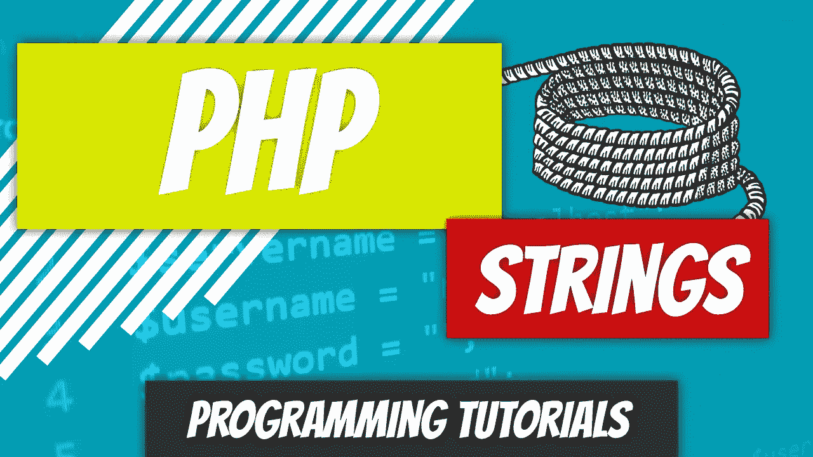

# PHP — P8:字符串

> 原文：<https://blog.devgenius.io/php-7-x-p8-strings-6903ca92727b?source=collection_archive---------5----------------------->



我知道在过去的几篇文章中，我们讨论了字符串，但是我们从来没有真正讨论过它们。字符串只是用引号括起来的字符序列；PHP 中的字符串放在单引号或双引号中。在其他编程语言中，如 Java，字符串用双引号括起来，单个字符用单引号括起来。

```
<?php$string_1 = 'This is an acceptable string';
$string_2 = "String with double quotes";echo $string_1 . "<br>";
echo $string_2 . "<br>";?>
```

您不必为了将字符串输出到屏幕上而将它们存储在变量中。你可以把它们重复出来。

```
<?phpecho "I'm a string that's directly echoed out.";?>
```

从上面的例子中我们可以看到，PHP 只计算外面的双引号。echo 语句中有单引号。这些单引号被双引号括起来，所以不会引发错误。如果我们用单引号将整个字符串括起来，就会有问题。

```
<?php// Causes an error
echo 'I'm a string that's directly echoed out';?>
```

这段代码的问题是 PHP 解释器开始查看代码并说:

1.  我看到了 echo 声明。
2.  寻找左引号、变量、常量...*(或其他任何可接受的东西)*。
3.  找到了开始的引用，这是一个单引号。我需要找一个单引号来结束这个陈述。
4.  在第一个字符后找到单引号。我需要寻找分号。
5.  发现了分号以外的东西。抛出错误。

如果您坚持用单引号将整个字符串括起来，并在字符串内部使用它们，那么您将不得不“转义”单引号字符。有问题的字符可以用反斜杠\进行转义。

```
<?php// Won't cause errors
echo 'I\'m a string that\'s directly echoed out';?>
```

大多数时候，如果你只是混合搭配，事情会简单得多。

1.  如果你打算在字符串中只使用单引号，那就用双引号把它括起来。
2.  如果你打算只在字符串中使用双引号，那就用单引号把它括起来。
3.  如果在字符串中同时使用了单引号和双引号，请用您认为最合适的方式将其括起来。您需要对字符串中的单引号或双引号进行转义。

```
<?phpecho "I'm a single quote inside the double quotes.";
echo 'Jeff said "how is it going?"';
echo "Jeff's wife said, \"I'm good.\"";?>
```

单引号和双引号之间的巨大区别始于对变量求值。

```
<?php$name = "Dino Cajic";echo "Hi, my name is $name";?>
```

如果运行该代码，您将在屏幕上看到以下输出:

嗨，我叫迪诺·卡吉克

用单引号，结果有点不同。

```
<?php$name = "Dino Cajic";echo 'Hi, my name is $name';?>
```

输出将是:

嗨，我叫$name

如果你真的想使用单引号，你可以用连接(点)操作符连接变量。或者可以使用单独的 echo 语句。稍后我们将更详细地研究连接操作符。

```
<?php$name = "Dino Cajic";echo 'Hi, my name is ' . $name;// or even use a separate echo statement
echo 'Hi, my name is ';
echo $name;?>
```

我们不需要在变量中存储字符串。我们可以存储其他数据类型，比如整数。一旦添加到字符串中，PHP 将把 echo 语句视为输出一个大字符串。

```
<?php$price = 100000;echo "The price of that car is $price";?>
```

输出将显示:那辆车的价格是 100000

如果你想在它前面加一个美元符号呢？这其实很简单。继续添加吧。

```
<?php$price = 100000;echo "The price of that car is $$price";?>
```

输出将是:那辆车的价格是 100000 美元

有一件奇怪的事情，我们稍后会更详细地讨论，但我确实想介绍一下。你可以在一个字符串上加一个美元符号，它会把它当作一个变量来计算。此外，如果你在一个包含字符串的变量中添加一个美元符号，并用一对花括号将它括起来，它将计算花括号内的变量，然后将附加到美元符号的字符串也视为一个变量。我知道有很多话要说，但是让我们直接看一个例子。

```
<?php$price = 100000;
$x = "price";echo "That car is selling for ${$x}";?>
```

如果您运行该代码，它将显示:

那辆汽车售价 10 万英镑

刚刚发生了什么？

1.  PHP 查看了 echo 语句。
2.  它在双引号中发现了一个美元符号。
3.  它看到美元符号后面是一个左花括号。
4.  它看到花括号里面是变量$x。
5.  它评估变量。它变成了一串“价格”
6.  它将“price”字符串附加到外部的美元符号上，并创建了一个新的变量$price。
7.  它评估了$price，结果是整数 100000。
8.  它将整个字符串输出到屏幕上。

你不会想到这篇文章会这么长吧？嗯，还有更多。

我们研究了逃逸的有问题的字符。但是，有一些字符，当它们在前面加上反斜杠时，会有一些新的功能。想想字符 n，它本身并没有特殊的力量。但是，如果你在它前面加上反斜杠，n，突然它就像一个新的行字符。

```
<?phpecho "First Line\nSecondLine";?>
```

输出将是:

第一线
第二线

PHP 也会解释 HTML 字符。

```
<?phpecho "<div>First Div</div><div>Second Div</div>";?>
```

当您查看输出时，您会注意到 div 标记隐藏在幕后，您只看到两个字符串，一个在另一个下面。

第一格

第二部分

我想我终于对谈论 PHP 中的字符串感到满意了。下次见。

[](https://github.com/dinocajic/php-7-youtube-tutorials) [## dinocajic/PHP-7-YouTube-教程

### PHP 7.x YouTube 教程的代码。

github.com](https://github.com/dinocajic/php-7-youtube-tutorials)