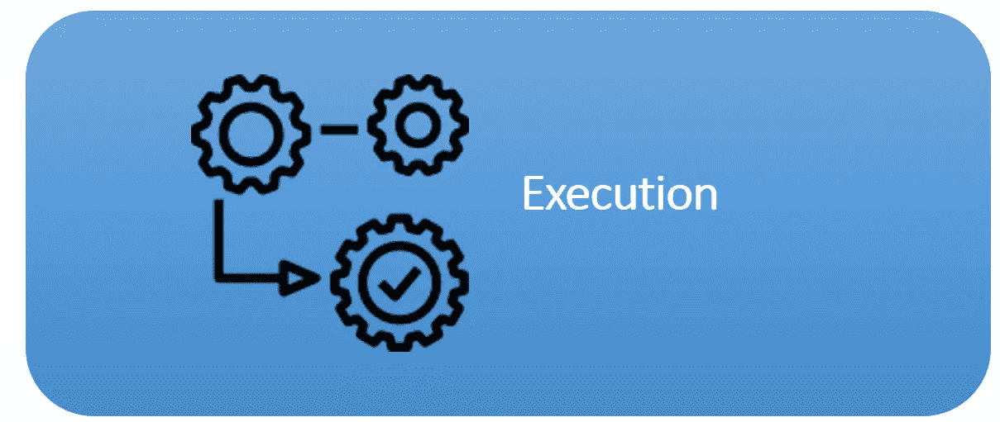

# PHP 基础编程第 1 卷:识别源代码运行或执行机制

> 原文：<https://blog.devgenius.io/php-basic-programming-vol-1-identifying-source-code-running-or-execution-mechanisms-fca4939de2d5?source=collection_archive---------10----------------------->

动机

朋友们好。也许我们很多人已经熟悉了什么是编程语言，特别是什么是 PHP 编程语言。这次我们将开始讨论 PHP 编程的基础知识。让我们直接进入第一个讨论

# PHP 编程语言

PHP 属于一组叫做脚本语言的编程语言。脚本编程语言不需要特殊的工作环境来运行。一般来说，它可以嵌入到另一种编程语言的代码中。一个 php 文件可以包含 PHP 代码本身，或者它甚至可以添加 HTML、CSS 或 JavaScript 代码。

PHP:超文本预处理器是一种脚本语言，可以嵌入或嵌入到 HTML 中。PHP 是一种服务器端脚本语言，一种用于开发静态网站或动态网站或 Web 应用程序的编程语言。因为 php 是服务器端脚本，这种类型的编程语言以后将由服务器运行/处理。与在客户端处理的 HTML 相反。服务器端编程是一种编程语言，其中脚本/程序将由服务器执行/处理。

# 源代码执行机制

执行/运行 PHP 源代码是一个运行程序的过程，使它显示一个网页。要运行的 PHP 文件必须位于 C:\xampp\htdocs 文件夹中。PHP 文件名必须不带空格，应该是小写的，或者可以用下划线(_)代替空格。

## 执行 PHP 源代码的工具

*   文本编辑器:文本编辑器用于编写 PHP 脚本
*   Web 服务器(Xampp / Wampp): Web 服务器用于运行 Apache 模块，该模块的功能是读取 PHP 文件，建议使用 Xampp
*   网页浏览器(Chrome / Mozilla):网页浏览器是用来作为运行和显示 PHP 程序的媒介，建议使用 Chrome 浏览器

## PHP 源代码执行机制

1.  web 服务器看到被访问的文件扩展名。如果文件有. php 扩展名，web 服务器将运行 PHP 模块并执行文件中包含的 PHP 代码。
2.  web 服务器处理。php 文件从第一行到最后一行。如果网络服务器没有找到标签。

扩展的功能是让服务器能够识别 PHP 文件和脚本。PHP 文件必须用“.php”扩展名。

# 结论

我们已经得出结论。我们讨论的结论是，PHP 是一种脚本编程语言，PHP 也是在服务器端执行的，那么执行 PHP 的工具就是文本编辑器、web 服务器、web 浏览器。我们将在下一篇文章中继续讨论基本 PHP。希望这篇文章能有用。

谢谢你。